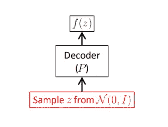

# 理解条件变分自动编码器

> 原文：<https://towardsdatascience.com/understanding-conditional-variational-autoencoders-cd62b4f57bf8?source=collection_archive---------2----------------------->

由 [*](https://www.researchgate.net/profile/Abu_Kamruzzaman/publication/332540618_Developing_Deep_Learning_Models_to_Simulate_Human_Declarative_Episodic_Memory_Storage/links/5d2f8b33458515c11c392f78/Developing-Deep-Learning-Models-to-Simulate-Human-Declarative-Episodic-Memory-Storage.pdf) 修改而来

(本博客的修改版可以在 [**这里找到**](https://theaiacademy.blogspot.com/2020/05/understanding-conditional-variational.html) )

变分自动编码器或 VAE 是一个有向的图形生成模型，它已经获得了很好的结果，并且是生成建模的最先进的方法之一。假设数据是由某个随机过程产生的，涉及一个不可观测的连续随机变量 ***z.*** 假设 ***z*** 是由某个先验分布 ***P_θ(z)*** 产生的，数据是由某个条件分布 ***P_θ(X|Z)*** 产生的，其中 ***X*** ***z*** 有时被称为数据的隐藏表示 ***X*** 。

像任何其他自动编码器架构一样，它有一个编码器和一个解码器。编码器部分尝试学习 ***q_φ(z|x)*** ，相当于学习数据的隐藏表示 ***X*** 或者将 ***X*** 编码到隐藏表示中(概率编码器)。解码器部分尝试学习 ***P_θ(X|z)*** 对输入空间的隐藏表示进行解码。图形模型可以表示为下图。

([来源](https://arxiv.org/pdf/1312.6114.pdf))

该模型被训练以最小化目标函数

该损失的第一项是重建误差或数据点的预期负对数似然。通过取几个样本，相对于编码器在表示上的分布来取期望值。当使用来自潜在分布的样本时，该术语鼓励解码器学习重构数据。较大的错误表示解码器无法重建数据。

第二项是编码器分布 ***q_φ(z|x)*** 和 ***p(z)*** 之间的 Kullback-Leibler 散度。该散度测量当使用 ***q*** 来表示优于 ***z*** 的先验时丢失了多少信息，并促使其值为高斯值。

在生成期间，来自***【N(0，1)】***的样本被简单地馈入解码器。训练和生成过程可以表示如下

作为前馈神经网络实现的训练时变分自动编码器，其中 P(X|z)是高斯型的。红色表示不可微分的采样操作。蓝色显示损失计算。([来源](https://arxiv.org/pdf/1606.05908.pdf))

测试时变化的“自动编码器”，它允许我们生成新的样本。“编码器”路径被简单地丢弃了。([来源](https://arxiv.org/pdf/1606.05908.pdf))

之所以如此简短地描述 VAE，是因为它不是主要的焦点，但与主题非常相关。

使用 VAE 生成数据的一个问题是，我们无法控制它会生成什么样的数据。例如，如果我们用 MNIST 数据集训练一个 VAE，并尝试通过将 ***Z ~ N(0，1)*** 馈入解码器来生成图像，也会产生不同的随机数。如果我们训练得好，图像会很好，但我们无法控制它会产生什么数字。例如，您不能告诉 VAE 产生数字“2”的图像。

为此，我们需要对我们的 VAE 架构做一点小小的改变。假设给定一个输入 ***Y*** (图像的标签)我们希望我们的生成模型产生输出 ***X*** (图像)。因此，VAE 的过程将修改如下:给定观测值 ***y，z*** 从先验分布 ***P_θ(z|y*** )中得出，输出 **x** 从分布 ***P_θ(x|y，z)*** 中产生。请注意，对于简单的 VAE，先验是*P _θ(z)***P _θ(x | z)***产生输出。*

**

*条件 VAE 中的视觉表征任务([来源](https://ijdykeman.github.io/ml/2016/12/21/cvae.html))*

*所以，这里编码器部分尝试学习 ***q_φ(z|x，y)*** ，这相当于学习数据的隐藏表示 ***X*** 或者将 ***X*** 编码成隐藏表示条件 ***y*** 。解码器部分尝试学习 ***P_θ(X|z，y)*** 对由 ***y*** 限定的输入空间的隐藏表示进行解码。图形模型可以表示为下图。*

**

*([来源](https://arxiv.org/pdf/1606.05908.pdf))*

*条件 VAE (CVAE)的神经网络架构可以表示为下图。*

**

*x 是图像。y 是图像的标签，可以是 1 热矢量表示。*

*CVAE 在 Keras 的实现可在[这里](https://github.com/nnormandin/Conditional_VAE/blob/master/Conditional_VAE.ipynb)获得。*

# *参考资料:*

1.  *[使用深度条件生成模型学习结构化输出表示](https://papers.nips.cc/paper/5775-learning-structured-output-representation-using-deep-conditional-generative-models.pdf)*
2.  *[变型自动编码器教程](https://arxiv.org/pdf/1606.05908.pdf)*
3.  *[自动编码变分贝叶斯](https://arxiv.org/pdf/1312.6114.pdf)*