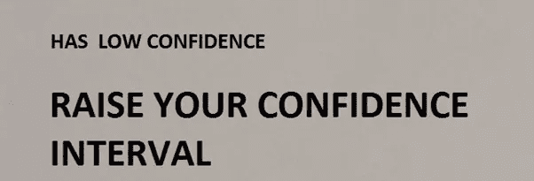

# 置信区间有什么用？

> 原文：<https://towardsdatascience.com/understanding-confidence-interval-12c99f677f01?source=collection_archive---------23----------------------->

## 数据科学，统计学

## **置信区间**是一种显示某些统计数据中的不确定性的方法

来源:作者图片

在本文中，我们将探讨置信区间，并演示如何解释置信区间。

# **如何表达一个置信区间？**

置信区间不是总体均值存在于区间内的概率，但是，它意味着样本存在于阴影区域的概率为 95%。

例如，**平均值**的**点估计**不是单一估计，而是置信区间创建平均值的**下限**和**上限**。

**区间**估计值通常很有吸引力，因为总体参数、状态、均值的估计值会随着样本的不同而波动。

区间估计给出了我们对真实均值的估计有多脆弱的迹象。间隔越小，我们的估计就越精确。

例如，如果我们从喜欢产品 A 和产品 B 的顾客中选择第一个 500 人的样本，我们需要推测出喜欢产品 A 的顾客的数量。

我们将以什么方式做这件事？我们将试图通过观察总人口中的样本来发现它。

我们目前从第一个样本中选择的可能性极小，其平均值为 87%。万一我们现在从第二个样本中选择谁更喜欢产品 A，它将不会与平均值完全相同。

现在重复这个动作，再重复一次。毫无疑问，相对于过去的平均值，样本平均值可能是唯一的。那么你如何认识到人口意味着什么？

对此的回应是置信区间。它向你揭示了模糊的人口平均数的最可能的范围。

万一我们为每个样本计算出 95%的置信区间，那么样本的 95%的区间将具有总体均值。

随着样本量的增加，区间范围缩小，样本均值更接近总体均值，因为您正在缩小**标准误差**等于**标准偏差**除以样本量的平方根，从而扩大样本量。

因此，它本质上暗示了由于**随机抽样误差**的存在，我们对给定样本量的样本均值变化的预期程度。

我们以正或负的形式使用置信区间。当利用样本统计评估总体参数时，样本统计肯定是不准确的。始终会有一些误差，其特征是**点估计值**加上或减去**误差幅度。**

# **什么是点估计和区间估计？**

照片由 [Karina lago](https://unsplash.com/@karinalago?utm_source=medium&utm_medium=referral) 在 [Unsplash](https://unsplash.com?utm_source=medium&utm_medium=referral) 上拍摄

置信界限用一个**置信系数**的文字来表达。尽管置信系数的决定在某种程度上是任意的，但我们通常使用 90%、95%和 99%的区间。

95%的置信区间并不意味着该区间有 95%的可能性包含真实均值。

根据给定样本计算的区间要么包含真实均值，要么不包含真实均值。相反，置信水平与估计区间的技术有关。

置信系数就是给定大小的样本的比例，它可以用来包含真实的平均值。

也就是说，对于 95%的置信区间，如果收集了几个样本并计算了置信区间，则这些区间的大约 95%将具有扩展运行中的真实平均值。

这是点估计和区间估计的根本区别。

# **如何估计一个总体均值？**

照片由 [Gursimrat Ganda](https://unsplash.com/@gurysimrat?utm_source=medium&utm_medium=referral) 在 [Unsplash](https://unsplash.com?utm_source=medium&utm_medium=referral) 上拍摄

万一我们热衷于用样本评估总体均值，而总体方差是模糊的，我们假设总体分布是正态的。

用样本方差和(n-1)自由度 t 分布代替总体方差。

在这样的情况下， **t 分布**看起来，特别像标准的正态分布。主要的对比是它在某种程度上更加分散，并且这种分散的扩展对于小自由度来说更大。

当样本相当大时，自由度是显著的，t 分布和标准正态分布是相同的。

依赖于 t 分布的置信区间很难违反正态性，并且由于**中心极限定理**，正态总体假设对于较大的样本量不太重要。

例如，我有 95%的信心，新产品的平均客户满意度在 1 到 10 的范围内，从 5 到 7。

# 什么是比例的置信区间？

调查经常被用来估算比例，因此必须认识到如何为任何**人口比例**构建一个置信区间。样本需要是自主的。总体应至少是样本的 10 倍。

因此，比例的抽样分布是正态的，这意味着万一你一次又一次地做了类似的调查，并把每个样本的比例画在一条数字线上，图表就会形成一条钟形曲线。

例如，我有 95%的信心，对我们的新产品感到满意的客户的真实比例在 47%到 78%之间。

**比例的单侧置信区间**从无限大到某个上限，或者从某个下限到无限大。除非样本非常大，否则它们都很宽。

只是利用一个关于双边极限的类似方法，然而对于 95%的置信度，将 5%而不是 2.5%放在尾部。如果假设参数不在区间内，则拒绝应该等同于单侧检验。

在任何情况下，置信区间都是定期估计的，并且这种估计并不是在每种情况下都非常相称。

例如，在二项式中，置信区间通常是利用预期的标准误差来评估的，该误差取决于观察到的比例，尽管假设检验将它与假设的比例放在一起。

例如，对于制造工厂的抽样，找出低于质量的成品比例的单侧 95%置信区间的上限。

在 190 件抽样的成品中，发现 6 件质量不合格。

# **标准差的置信区间是多少？**

在本例中，**标准偏差**被用作**点估计值**。在任何情况下，抽样分布都不是对称的，它不是正态分布或 t 分布。抽样分布是一个右偏分布，称为**卡方分布**。

与 t 分布类似，卡方分布也有一个自由度参数。在此**中，单样本置信区间**用于测量平均值和标准偏差的 95%置信区间。

# **均值差异的置信区间是多少？**

*   为了达到置信区间，应满足以下假设。这两个群体有一个相似的方差。人口呈**正态分布**。每个值都是与其他值分开采样的。例如，**双样本置信区间**方法，发现两个公司客户的平均终身价值之间的差异的置信区间，并查看该置信区间如何帮助锁定最佳客户。
*   在**不等方差**、中，可以使用稍微不同的方法来计算均值之间差异的置信区间。在这种差异估计中，检验样本量较大的样本多于检验样本量较小的样本。例如，**双样本置信区间**方法，用于发现机场候机室高峰时段与非高峰时段滞留时间对比的置信区间。

# **配对样本之间的均值差异是什么？**

当要比较的样本以某种规则方式配对时，为了确定**配对样本**之间的差异，应满足后续假设。它没有合理地剖析两个独立的变量。样本之间应该有关联。

对于样本中的每一对，计算该对的两个分数之间的差值。此时，对这些差异执行**单样本分析**。例如，双胞胎被要求从 1 到 10 对 iPhone 11 的功能进行评分，并找出他们评分的平均差异。

# **比例间差异的置信区间是多少？**

**双样本分析**均值间的差异。尽管如此，我们现在不是对比两种方法，而是看比例。例如，找出购买带有和不带有 1 年额外保修优惠券的笔记本电脑的客户比例之间差异的置信区间。

一半的客户包括 1 年额外保修的优惠券。购买带有和不带有 1 年额外保修优惠券的笔记本电脑的客户比例之间差异的置信区间。

# 如何计算样本量？

*   要计算近似总体均值的**的基本样本量，首先确定最大误差，并计算与所需置信区间相关的 z 统计量。例如，在极小的可能性下，你需要 95%确定平均值在你的近似值正负误差范围内。为获得新产品平均客户评级的足够薄的置信区间所需的客户样本量。**
*   您还需要**估计人口标准偏差**。此时的公式是将 z 值乘以标准偏差，然后除以误差，最后将结果平方。向上舍入到最接近的整数。这是在给定置信水平的正负误差范围内逼近总体均值的基本样本量。
*   在任何情况下，你都有可能试图用最小**样本量来逼近人口比例**。你需要 p，比例的最清晰可及的近似值，结合 z 和误差。计算 z 除以误差，并对结果求平方。乘以 p(1-p)。万一你现在还没有一个可靠的估计值 p，那么将 p 设为 0.5，这将在你解方程时带来最大可能的结果。了解尝试过新产品的顾客比例所需的样本量。
*   **用于估计均值间差异的样本量**有助于了解每个调查小组中有多少员工必须被抽样到一个充分限定的置信区间，以确定平均投诉数之间的差异。他们有两种类型的员工。管理客户经验较少的人和管理客户经验较多的人。组织需要评估这些员工在平均客户投诉数量方面的差异。组织打算利用相同的样本量，从每种类型的雇员中随机选择样本来获取数据。
*   **估计比例差异的样本量**了解每个城市必须抽样多少新产品，以实现新产品二次销售比例差异的充分严格的置信区间。销售经理需要知道新产品的二次销售比例在两个城市之间有多大差异。

# 结论

由 [Kelly Sikkema](https://unsplash.com/@kellysikkema?utm_source=medium&utm_medium=referral) 在 [Unsplash](https://unsplash.com?utm_source=medium&utm_medium=referral) 上拍摄的照片

置信区间的问题在于，对于任何一个区间，我们都不能确定它是否包含真实值；然而，我们意识到，它包含真实价值的几率比不包含它的几率要高得多。

它鼓励你适应在产品和服务的不同阶段可能存在的许多不确定性。

*现在，把你的想法放在****Twitter*******Linkedin****，以及****Github****！！**

****同意*** *还是* ***不同意*** *与绍拉夫·辛拉的观点和例子？想告诉我们你的故事吗？**

**他对建设性的反馈持开放态度——如果您对此分析有后续想法，请在下面的* ***评论*** *或伸出手来！！**

**推文*[***@ SauravSingla _ 08***](https://twitter.com/SAURAVSINGLA_08)*，评论*[***Saurav _ Singla***](http://www.linkedin.com/in/saurav-singla-5b412320)*，还有明星*[***SauravSingla***](https://github.com/sauravsingla)*马上！**