# 理解混淆矩阵、精确回忆和 F1 分数

> 原文：<https://towardsdatascience.com/understanding-confusion-matrix-precision-recall-and-f1-score-8061c9270011?source=collection_archive---------5----------------------->

## 为什么在评估机器学习模型时，准确性不应该是你唯一关心的性能指标

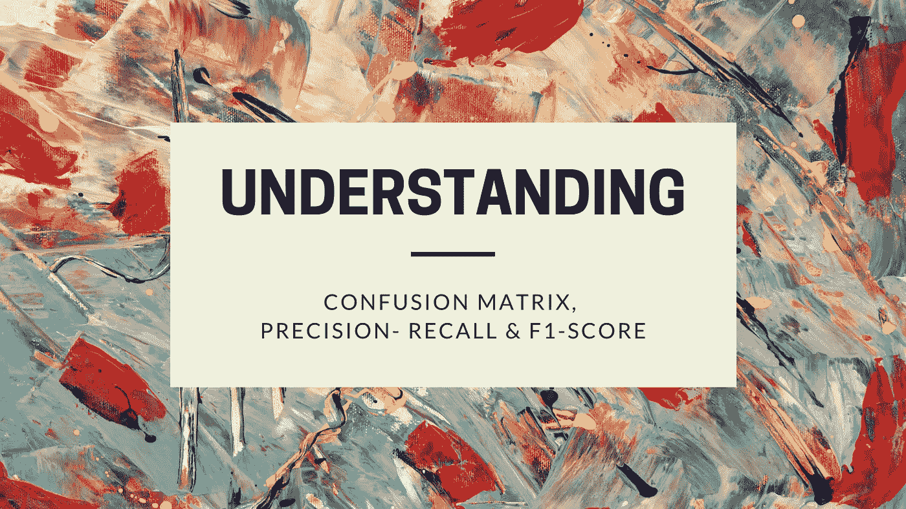

封面图片(图片由 [Canva](https://www.canva.com/) 提供，经作者许可编辑)

当我过去几天在 Kaggle 浏览几本笔记本时，我不禁注意到一些名为*“在 dataset_name 上实现 100%的准确性”、“使用 algorithm_name 实现完美的 100%准确性”、*的笔记本，以及其他各种关于如何在你遇到的每个数据集上实现 100%准确性的指南。虽然其中一些笔记本在构建数据集的概化模型方面做得很好，并提供了相当好的结果，但大多数笔记本只是对数据进行了过度拟合。

> **过度拟合**是指产生的分析过于紧密或精确地对应于一组特定的数据，因此可能无法拟合额外的数据或可靠地预测未来的观察结果— [维基百科](https://en.wikipedia.org/wiki/Overfitting)

这一切中最悲伤的部分是什么？他们甚至没有意识到，在试图达到那个黄金数字时，他们对数据集进行了过度拟合。大多数笔记本都是在初学者友好的数据集上找到的，比如“Iris 数据集”或“Titanic 数据集”,这是有意义的，对吗？我们大多数人在开始机器学习的时候只学到了一件事:*“准确性很重要”*。虽然这是真的，但这只是在一定程度上有关系。这就是为什么我将讨论其他一些性能指标，如混淆矩阵、精确召回和 F1 分数，在评估机器学习模型时，您应该考虑与准确性一起使用。让我们开始吧。

# 混淆矩阵

> 在机器学习领域，特别是统计分类问题中，**混淆矩阵**，也称为误差矩阵，是一种特定的表格布局，允许算法性能的可视化，通常是监督学习算法。— [维基百科](https://en.wikipedia.org/wiki/Confusion_matrix)

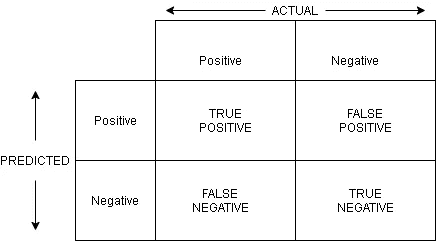

两类分类问题的混淆矩阵(图片来源:作者)

为了理解混淆矩阵，让我们考虑一个两类分类问题，其中两个结果是“肯定的”和“否定的”。给定一个要预测的数据点，模型的结果将是这两个中的任何一个。

如果我们将预测值与真实值(实际值)进行对比，我们会得到一个包含以下代表性元素的矩阵:

**真阳性(TP):** 这些数据点的实际结果是阳性的，并且算法正确地将其识别为阳性。

**真阴性(TN):** 这些是实际结果为阴性的数据点，算法正确地将其识别为阴性。

**假阳性(FP):** 这些数据点的实际结果是阴性的，但算法错误地将其识别为阳性。

**假阴性(FN):** 这些数据点的实际结果为阳性，但算法错误地将其识别为阴性。

正如您所猜测的，使用混淆矩阵评估模型的目标是最大化 TP 和 TN 的值，最小化 FP 和 FN 的值。

为了更好地理解这个概念，让我们举一个现实生活中的例子:心脏病的预测。在这种情况下，结果将是患者是否患有心脏病。混淆矩阵看起来像这样:

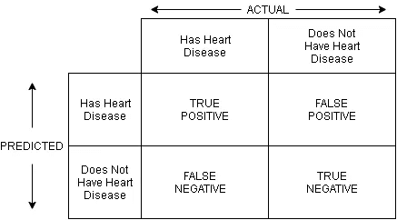

心脏病预测的混淆矩阵(图片来源:作者)

在这里，TP 意味着患者实际上患有心脏病，并且算法预测正确。TN 表示患者没有心脏病，算法预测正确。所以目标应该是尽可能地保持这些值。

## 混淆矩阵如何帮助检测过度拟合？

为了理解这一点，让我们考虑一下心脏病的例子。大多数时候，当我们处理医疗用例时，很有可能会有一个倾斜的数据集，即一个目标变量会比另一个有更多的数据点。在这种情况下，大多数接受测试的人不会被诊断出任何心脏病。因此，数据集中存在不平衡(偏斜)。

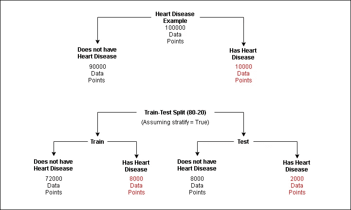

描述倾斜数据集的心脏病示例(图片来源:作者)

如果我们在上图所示的数据集上训练一个模型，由于没有心脏病的患者的数据点数量远远多于有心脏病的患者，该模型将偏向于具有更多数据点的目标(特别是如果我们仅基于其准确性来评估模型)。

现在，经过训练，如果我们在测试集(没有心脏病的患者有 8000 个数据点，而有心脏病的患者只有 2000 个数据点)上测试模型，即使模型预测所有 10000 个数据点都没有任何心脏病，准确率仍然高达 80%。这可能会产生误导，尤其是在假阴性的风险应该可以忽略不计的领域(一个预测患有心脏病的患者与没有心脏病的患者一样的模型将被证明是真正致命的)。

这就是混淆矩阵发挥作用的地方。对于上述场景，混淆矩阵如下所示:

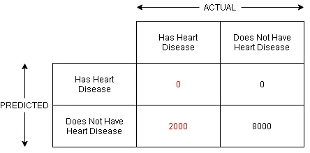

上述场景的混淆矩阵(图片来源:作者)

现在，如果您查看混淆矩阵以及模型获得的准确性，我们可以清楚地识别出模型在训练数据集上过度拟合，因为它将每个未知数据点预测为没有心脏病的患者。如果没有混淆矩阵，我们永远不会知道潜在的问题。

scikit 学习包包括混淆矩阵。你可以在这里查阅官方文档[。](https://scikit-learn.org/stable/modules/generated/sklearn.metrics.confusion_matrix.html)

# 精确召回

既然你已经理解了混淆矩阵的作用，那么理解精确召回就更容易了。

我们已经看到准确性在某些情况下是如何误导人的。精确度和召回率帮助我们进一步理解所显示的特定问题的精确度有多高。

> **精度**(也叫[正预测值](https://en.wikipedia.org/wiki/Positive_predictive_value))是相关实例在检索到的实例中所占的比例，而**召回**(也叫[灵敏度](https://en.wikipedia.org/wiki/Sensitivity_and_specificity))是实际检索到的相关实例总数的比例。因此，精确度和召回率都基于对[相关性](https://en.wikipedia.org/wiki/Relevance_(information_retrieval))的理解和度量。— [维基百科](https://en.wikipedia.org/wiki/Precision_and_recall)

简而言之，精确度意味着所做的正面预测有多少是正确的。

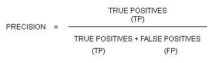

精度公式(图片来源:作者)

在我们的心脏病例子中，它看起来像这样:

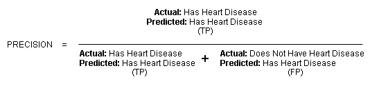

精确示例(图片来源:作者)

它可以被翻译成简单的语言，在所有被归类为患有心脏病的患者中，有多少人实际上患有心脏病？

简单来说，回忆意味着分类器正确分类的实际正面预测的百分比。

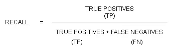

回忆公式(图片来源:作者)

在我们的示例中，它看起来像这样:

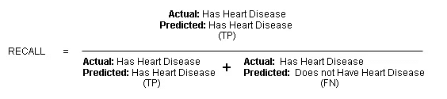

回忆例子(图片来源:作者)

它主要是问，在所有患有心脏病的病人中，有多少人被归类为患有心脏病？

这个公式乍一看似乎有点相同，但是一旦你明白了要点，就很难把两者混淆起来。

scikit 学习包中也提供了 Precision-Recall。你可以在这里查阅官方文档[。](https://scikit-learn.org/stable/auto_examples/model_selection/plot_precision_recall.html)

## 精确召回权衡

假设我们训练一个逻辑回归分类器来识别病人是否患有心脏病。如果概率(阈值)大于或等于 0.5，它将预测患者患有心脏病，如果概率小于 0.5，则患者没有心脏病。

现在，如果我们想建立一个模型，只有在对假设非常有信心的情况下，它才能预测患者是否患有心脏病，我们可能需要将阈值提高到 0.7 或 0.8。

在这种情况下，我们最终得到一个具有高精度和低召回率的分类器。精度更高，因为现在分类器更确信患者患有心脏病。召回率较低，因为现在分类器的阈值设置得如此之高，将会有更少的患者被分类为患有心脏病。

另一种选择是，我们建立一个模型，这样它就不会遗漏任何可能的心脏病患者病例(以避免假阴性)。如果一个患有心脏病的病人没有被模型注意到，这可能是致命的。在这种情况下，我们将阈值降低到 0.2 或 0.3，这样即使患者有轻微的可能患有心脏病，也会发出警报，并且可以进行进一步的诊断来证明该假设。

我们这里有一个**高召回**和**低精度**的例子。召回率更高，因为我们将对更多的心脏病患者进行分类。精确度较低，因为在大量预测患有心脏病的患者中，一些人在进一步诊断后实际上不会患有心脏病。

一般来说，精确召回值会随着阈值的增加或降低而不断变化。构建具有更高精度或召回率的模型取决于您正在处理的问题陈述及其要求。

# f1-分数

精确召回值对于理解特定算法的性能非常有用，也有助于根据需求产生结果。但是当涉及到比较在相同数据上训练的几个算法时，仅仅基于精确召回值就很难理解哪个算法更适合数据。

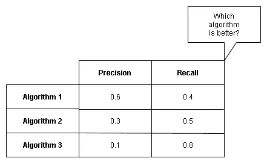

单纯基于查准率值，哪种算法更好？(图片来源:作者)

因此，需要一种采用精确召回值并提供这些值的标准化表示的度量。

> 在二进制分类的统计分析中， **F1 得分**(也称为 **F 得分**或 **F 度量**)是一个测试准确度的度量。通过测试的[精度](https://en.wikipedia.org/wiki/Precision_(information_retrieval))和[召回](https://en.wikipedia.org/wiki/Recall_(information_retrieval))计算得出，其中精度是正确识别的阳性结果数除以所有阳性结果数，包括未正确识别的阳性结果，召回是正确识别的阳性结果数除以所有应被识别为阳性的样本数。— [维基百科](https://en.wikipedia.org/wiki/F1_score)

F1 得分也可以描述为精确度和召回率的调和平均值或加权平均值。

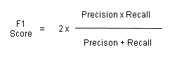

F1 得分公式(图片来源:作者)

精度或召回值为 0 是不可取的，因此它将使我们的 F1 得分为 0(最低)。另一方面，如果精度和召回值都是 1，那么我们得到的 F1 值为 1，表示完美的精度召回值。F1 分数的所有其他中间值的范围在 0 和 1 之间。

scikit 学习包中也提供了 F1 分数。你可以在这里查阅官方文档[。](https://scikit-learn.org/stable/modules/generated/sklearn.metrics.f1_score.html)

# 结论

我希望这篇文章能帮助你理解混淆矩阵、精确回忆和 F1 分数这些术语。使用这些指标肯定会帮助您更好地了解模型的性能。一旦您完全理解了这些概念，您还可以研究一些其他评估指标，如对数损失、ROC-AUC 曲线、分类交叉熵等等。

# 参考

*   [使用 Scikit-Learn、Keras 和 TensorFlow 进行机器实践学习:构建智能系统的概念、工具和技术](https://www.amazon.com/Hands-Machine-Learning-Scikit-Learn-TensorFlow/dp/1492032646)(非附属)
*   [精确度和召回率的权衡—【吴恩达】](https://www.youtube.com/watch?v=W5meQnGACGo&list=PLsas0wB8kXTF8tduPtwvM6MtB163ELjuP&index=11)
*   [混淆矩阵—维基百科](https://en.wikipedia.org/wiki/Confusion_matrix)
*   [精确召回——维基百科](https://en.wikipedia.org/wiki/Precision_and_recall)
*   [F1 得分—维基百科](https://en.wikipedia.org/wiki/F1_score)