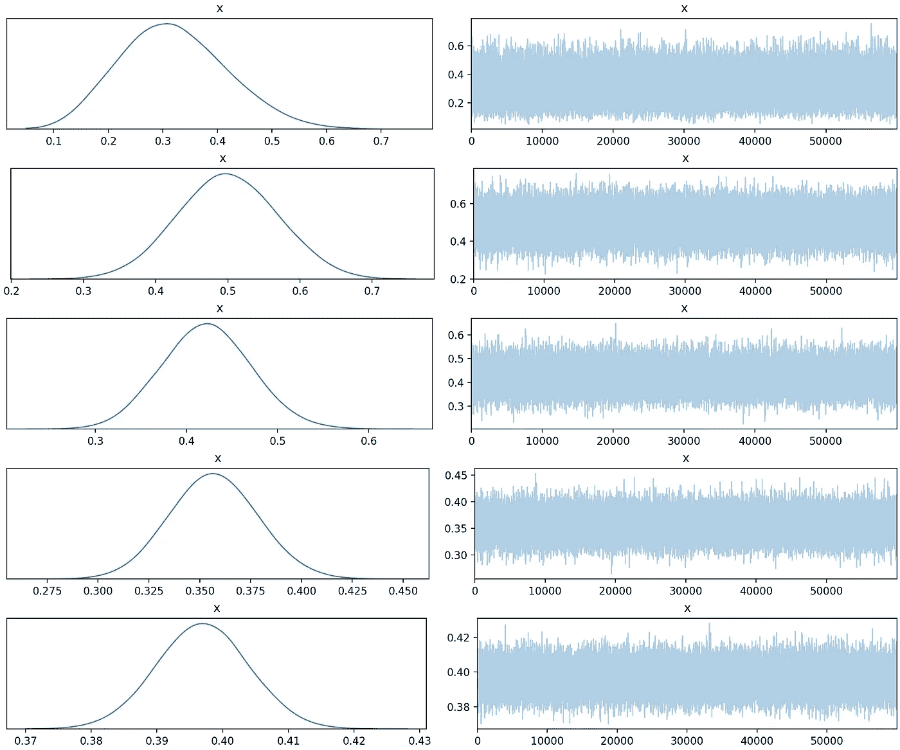

# 理解共轭先验

> 原文：<https://towardsdatascience.com/understanding-conjugate-priors-21b2824cddae?source=collection_archive---------17----------------------->

## 基于 PyMC3 的贝叶斯机器学习方法

贝叶斯机器学习:传统方式！(图片鸣谢:Saptashwa！)

在这篇文章中，我将全面介绍共轭先验的概念，包括一些例子。共轭先验的概念非常有用，因为共轭先验将贝叶斯更新简化为仅修改先验分布中的一些参数。他们也有必要从贝叶斯方法中学习和理解机器学习。这篇文章使用的 Jupyter 笔记本可以在我的 GitHub 中找到(下面的链接)。你可能期望从这篇文章中学到什么—

1.  共轭先验的定义
2.  为什么相关？
3.  简单的例子来理解这个概念。
4.  使用 PyMC3 作为解决一般贝叶斯推理的工具。

因此，让我们毫不迟疑地开始吧:

## 定义:

贝叶斯公式:图像信用:作者

在贝叶斯概率理论中，*如果后验分布与先验分布*同族，那么先验和后验称为共轭分布，先验称为似然函数的*共轭先验*。最初，你可能认为这很酷，但是这对我们有什么帮助呢？

## 为什么共轭先验？

在贝叶斯方法中，我们的目标是获得后验分布。在现实生活问题中，证据的计算可能会带来痛苦。比方说，我们正在处理图像，我们的目标是从一组给定的图像中生成一个新的图像。这将是非常困难的建模图像的分布，这是我们的 *P(D)* 。此外，我们可以将 *P(D)* 视为一个归一化常数，它可以写成— *∫ P(D|θ) P(θ) dθ* 。想象一下在神经网络环境中的这个积分，其中 *θ* s 是参数，即网络的权重，如果它是一个相对较深的网络，将有数百万个 *θ* s。因此积分将是难以处理的。共轭优先是来拯救我们从这种痛苦。如果我们的先验分布(在上面的例子中，它将是权重的分布)是似然函数的共轭先验，我们可以获得精确的后验分布。我们来看一个恶作剧的例子:

因为我的朋友 Kitty 有一只不太友好的猫 Nuo，拍拍她会导致要么以概率 p 变得暴躁要么以概率 *(1-p)开始咕噜咕噜叫。*由于我对这种行为不太了解，我假设一个关于 *p* 的先验分布，带有一个 [*Beta 分布*](https://en.wikipedia.org/wiki/Beta_distribution) ， *Beta(2，2)* 。如果诺在一个晚上发了 6 次脾气，只咕噜了 2 次，那么 *p* 的后验分布的参数是什么？每一次拍诺都可以被认为是两个固定结果之一的单个实验。这实际上被称为伯努利试验，类似于抛硬币。由于贝塔分布与伯努利似然共轭，我们已经可以知道后验分布将遵循贝塔分布(如下面的推导所示)。让我们试着找到参数…

正如我们所见，对于伯努利可能性，N1*次的结果为 1，而第*次的结果为 0。选择具有参数 *a，b* 的贝塔先验，给出具有参数 *(N1 + a，N0+b)* 作为后验的贝塔分布。因此，*选择共轭先验有助于我们仅通过更新先验分布*的参数来计算后验分布，并且我们根本不需要关心证据。鉴于我们的问题，我们将有一个后验分布，这将是一个参数(6+2，2+2)的贝塔分布。一旦我们知道了贝塔分布的参数，我们就可以计算出 x = 0.7 时的最大后验概率，如下图所示。此外，请注意，一旦我们使用了可能性，初始先验(参数为 2，2 的 Beta 分布)如何变为更新后的后验。**这是贝叶斯统计中的关键思想，即在看到数据后，我们对模型的最初信念是如何改变的！**有关共轭分布的详细列表，请点击查看[。](https://en.wikipedia.org/wiki/Conjugate_prior)**

不同参数下贝塔分布的概率分布函数。对于上面的例子，β先验被选择为具有参数(2，2)，在观察一些伯努利试验之后，该参数被更新，并且我们获得了具有参数(8，4)的后验分布。来源:作者

## 贝叶斯更新的简单例子:二项式和贝塔

二项式分布给出了从 N 次伯努利试验中准确获得 k 次成功的离散概率分布(其中每次伯努利试验的结果以概率 p 为真，以概率 q= 1-p 为假)。

让我们用一个更现实的例子来扩展前面的愚蠢例子，我们将利用二项分布与贝塔分布共轭的事实。对于单次试验(例如:掷硬币),二项分布等价于伯努利分布。随着我们收集更多的数据，我们将看到我们的后验知识是如何更新的。让我们假设我们使用一个有偏向的硬币，其中伯努利试验的成功概率(正面)是 0.4。我们认为新的观察结果是二项分布，其中 *k* 头来自 *N* 次试验。从简单的β先验— β(1，1)(相当于均匀先验)开始，在下图中，我们看到更多的数据如何帮助我们*更新和减少后验分布的不确定性。*

用增加的伯努利试验(掷硬币)更新贝塔后验概率，成功概率= 0.4。用 python 和赛璐珞创作。来源:作者

让我们看看我用来制作这个简单动画的部分代码——

首先，我们使用`scipy.stats.bernoulli.rvs`创建伯努利试验的 numpy 数组，然后计算成功(人头)和失败的数量。基于这个数字，我们从统一的先验开始更新贝塔分布。[赛璐珞](https://pypi.org/project/celluloid/)模块用于创建 matplotlib 动画。

## *PyMC3* 用于贝叶斯建模:

[PyMC3](https://docs.pymc.io/) 是构建在[the no](http://deeplearning.net/software/theano/)之上的用于贝叶斯统计建模的 Python 包。它允许用户使用包括马尔可夫链蒙特卡罗(MCMC)在内的各种数值方法来拟合贝叶斯模型。让我们从在 PyMC3 中构建硬币翻转模型开始。

这里，我们从使用伯努利似然开始，使用参数(1，1)的 Beta 先验。在伯努利函数的`observed`变量中，我们将输入数据。这是一种告诉 PyMC3 我们希望根据已知情况(观察结果)来处理未知情况的方式。

我们创建伯努利试验，这将是我们的输入数据。给定这个观察到的数据，然后我们告诉 PyMC3 生成 15，000 个样本，我们返回生成的样本和观察到的数据。这样，我们就可以调用函数并生成样本了—

我们创建一个观察值列表(伯努利试验),循环收集所有生成的样本和相应的观察值，并将它们存储在一个字典中。执行此代码块时，您将看到使用[不掉头采样器](https://arxiv.org/abs/1111.4246)(螺母)生成的样本数为 62，000。PyMC3 中的默认采样器是 NUTS，它并行使用 4 个内核(最大数量的 CPU)来创建 15000 个样本。最初的 2000 个样本(每个岩心中 500 个样本)用于调整坚果取样器，稍后将最终丢弃。查看 [*文档*](https://docs.pymc.io/api/inference.html) 了解更多。一旦样本生成过程完成，我们就可以想象随着试验(观察)次数的增加，后验曲线的演变

后验分布的演化。使用`[PyMC3 traceplot](https://docs.pymc.io/api/plots.html). Source: Author`绘制

我们可以清楚地看到，随着试验次数的增加，后验分布的不确定性越来越小。让我们绘制生成样本的直方图，并与真实的 beta 分布(使用 Scipy 计算)进行比较

使用 PyMC3 的采样后验分布(左)与使用 Scipy 获得的真实β分布(右)的比较。来源:作者

在这里，我们已经讨论了共轭先验，并通过一些简单的例子来巩固我们对它的重要性的理解。希望这至少能帮助你开始贝叶斯机器学习。

保持坚强，干杯！

页（page 的缩写）s:我在另一篇文章中介绍了贝叶斯机器学习中另一个可能是最重要的概念，即潜在变量和[期望最大化算法](/latent-variables-expectation-maximization-algorithm-fb15c4e0f32c)。

## 参考:

[1] [共轭先验的注释【M. Jordan 教授；加州大学伯克利分校。](https://people.eecs.berkeley.edu/~jordan/courses/260-spring10/other-readings/chapter9.pdf)

【2】[链接到我的笔记本！](https://github.com/suvoooo/Machine_Learning/blob/master/Conjugate_prior/Conjugate_Prior.ipynb)