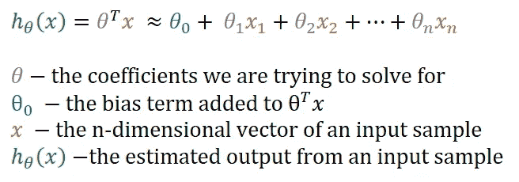
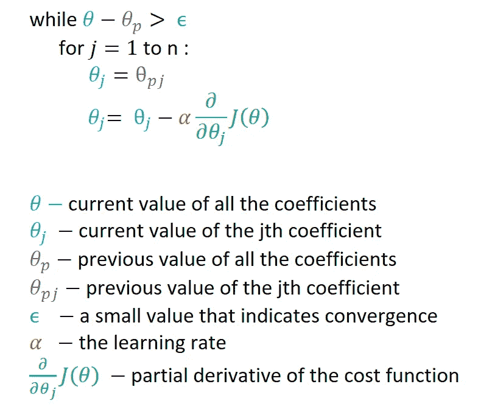
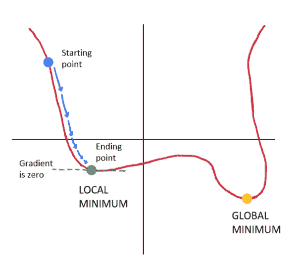

# 为什么梯度下降适用于线性回归

> 原文：<https://towardsdatascience.com/understanding-convexity-why-gradient-descent-works-for-linear-regression-aaf763308708?source=collection_archive---------24----------------------->

## 凸优化和机器学习之间的联系

阿萨·罗杰在 [Unsplash](https://unsplash.com/s/photos/falling-hill?utm_source=unsplash&utm_medium=referral&utm_content=creditCopyText) 上的照片

当我第一次开始自学机器学习时，我惊讶地发现我已经有了一些这方面的背景。我在大学里只上过一门计算机科学入门课，所以我期望有更高的学习曲线。我过去的线性代数课以及 [3Blue1Brown 线性代数系列](https://www.youtube.com/playlist?list=PLZHQObOWTQDPD3MizzM2xVFitgF8hE_ab)(强烈推荐)都派上了用场。我没想到会派上用场的是我的优化课。这可能是因为我在对机器学习一无所知之前就上了这门课，因此很快就忘记了课堂上提到的这两者之间的任何明显关系。但当我开始学习线性回归时，我仍然记得看到“梯度下降”这几个字时，我想，“等等，我已经知道这是什么了。”凸性理论使我们很容易理解为什么我们可以使用梯度下降来解决线性回归成本函数。在这篇文章中，我希望涵盖该理论的基础，并提供对线性回归的更深入的理解。

# 凸面

我们先通过凸集和凸函数来定义凸性。史蒂芬·博伊德的[凸优化教科书](https://web.stanford.edu/~boyd/cvxbook/)是这个主题的一个很好的资源。凸集定义如下:

直观地说，在二维空间中，我们可以把凸集想象成一个形状，在这个形状中，无论你画什么线来连接集合中的两点，该线的任何部分都不会在集合之外。

(左)凸集，(中)非凸集，(右)凸集

凸集的这种定义正好符合如下所示的凸函数的定义:

正如凸优化教科书中所述，你可以直观地将凸函数想象为这样一个函数，如果你从(x，f(x))到(y，f(y))画一条线，那么凸函数的图形将在这条线的下方。下面是三个例子，我们用这种直觉来判断函数是否是凸的。

(左)具有唯一优化器的凸函数，(中)非凸函数，(右)具有多个优化器的凸函数

我们可以看到中间的图不是凸的，因为当我们画一条连接图上两点的线段时，有一些点(x，f(x))f(x)大于线段上相应的点。

左边和右边的图形都是凸的。无论你在这些图上画什么样的线段，该线段总是在函数图的上方或等于函数图。右边的图有许多极小值，而左边的图有一个唯一的极小值。唯一的极小值意味着只有一个点上的函数最小。由于左边的图形是一个二次函数，通过对函数求导可以很容易地找到唯一的极小值。

现在我们对凸集和凸函数有了一些直觉和理解，让我们转向线性回归，看看凸性在哪里起作用。

# 线性回归概述

线性回归的目的是使最佳线性模型适合一组数据。假设有 m 个数据样本在 n 维空间中。每个样本都有 n 个映射到单个输出值的特征。我们可以访问输入和输出数据，但是我们想弄清楚输入数据和输出数据之间是否存在线性关系。这就是线性回归模型的用武之地。这个模型被写成这样的形式:

现在，我们确定*最佳*线性模型的方法是求解模型的系数，使我们的估计输出值和实际输出值之间的误差最小化。我们可以使用线性最小二乘法来实现这一点。因此，我们的成本函数如下:

我们称这个函数为“成本”函数，因为我们计算的是估计值和真实值之间的总误差或成本。由于线性最小二乘问题是一个二次函数，我们可以解析地最小化这个成本函数。但是，对于大型数据集，使用称为梯度下降的迭代方法来查找最佳系数通常计算速度更快。如何使用梯度下降来最小化成本函数的分解如下所示:

# 成本函数的凸性

现在让我们进入一些凸优化理论。如上所示，梯度下降被应用于寻找成本函数的全局最小值。但是我们怎么知道全局最小值的存在呢？**当最小化一个函数时，凸函数确保如果存在最小值，它将是全局最小值。**我们前面看到，二次函数是凸函数。既然我们知道线性最小二乘问题是一个二次函数，我们也知道它是一个凸函数。

此外，像线性最小二乘问题这样的二次函数是强凸的。这意味着该函数具有唯一最小值，且该最小值是全局最小值。因此，当我们应用梯度下降算法时，我们可以确信它将收敛于正确的极小值。如果我们试图最小化的函数是非凸的，如上图所示，梯度下降可能会收敛于局部最小值而不是全局最小值。这就是为什么非凸会更难处理的原因。这很重要，因为许多机器学习模型，最著名的是神经网络，是非凸的。下面你可以看到一个最简单的梯度下降法找不到全局极小点的例子。

非凸函数上收敛到局部最小值的梯度下降示例

# 结论

优化是机器学习的核心。虽然对二次函数应用梯度下降可能看起来很直观，但看看凸分析理论如何证明这种直观是很有趣的。这个理论可以扩展到分析任何机器学习模型，以了解它可能有多难解决。随着我继续我的机器学习之旅，我很兴奋地了解到优化可以帮助阐明不同机器学习概念的其他方式。