# 理解神经网络中的卷积和汇集:一个简单的解释

> 原文：<https://towardsdatascience.com/understanding-convolutions-and-pooling-in-neural-networks-a-simple-explanation-885a2d78f211?source=collection_archive---------7----------------------->

## 对使卷积神经网络工作的概念及其背后的直觉的直观解释

来源: [Unsplash](https://unsplash.com/photos/Vrv_nZHaFTc)

卷积网络的工作原理？它们背后的*魔力*是什么，让我们在图像分类、物体检测、人脸识别等广泛的应用中取得成功？

事实证明，所有这一切都是可能的，这要归功于两个惊人简单但强大的概念:**卷积**和**汇集**。

在这篇文章中，我将尝试用一种真正**直观**和**视觉**的方式来解释它们，把数学放在后面。我在网上找了很多有很强数学基础的文档，但是我觉得核心思想有时候被所有的公式和计算冲淡了。

我们将在本帖中涉及的所有示例都可以在本笔记本*中找到。*

# *卷积:这都是关于过滤器的*

*我们需要理解的第一个关键概念是**卷积**运算。这很简单:我们将把一个**滤镜**应用到一个图像上来得到一个结果图像。*

*例如，假设我们有一个输入图像和一个过滤器:*

*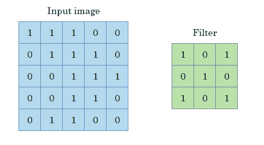*

*来源:自己的阐述*

*请记住，任何图像都可以表示为像素矩阵，每个像素代表一种颜色强度:*

*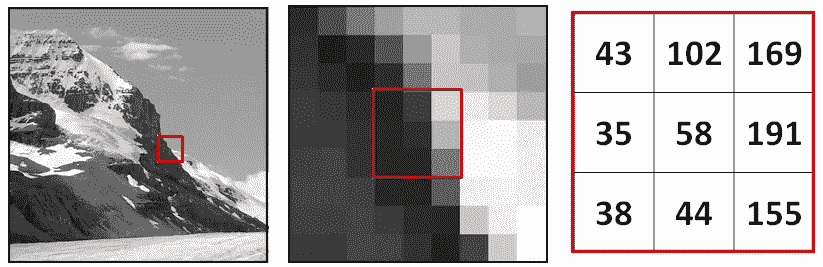*

*[来源](http://gsp.humboldt.edu/olm_2016/courses/GSP_216_Online/lesson3-1/raster-models.html)*

*卷积的作用如下:*

*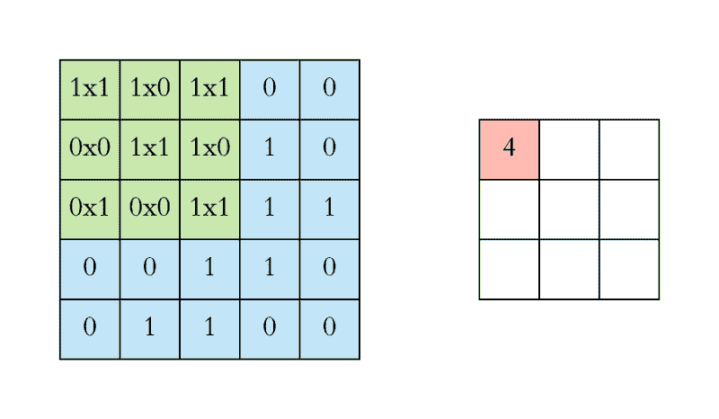*

*[来源](https://eg.bucknell.edu/~cld028/courses/379-FA19/NN/convTF-Walk-Thru.html)*

*这是，我们正在*建立* **另一个图像**通过应用过滤器到我们的输入图像。请注意，根据我们应用的过滤器(其形状和值)，我们将获得不同的图像。*

*但是，我们为什么要这样做呢？似乎没有太大意义！*

*事实是，这确实很有道理。为了理解为什么，让我们得到一个黑白网格的简单图像。*

*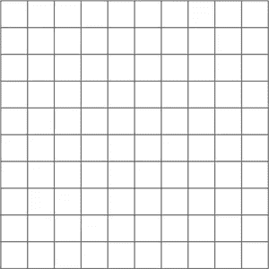*

*来源:自己的阐述*

**(请注意，这已经不是矩阵了。它实际上是一个图像)**

*并对其应用一些过滤器:*

*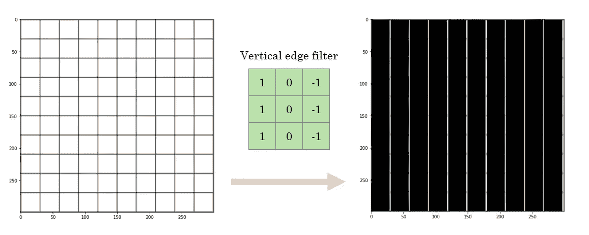*

*来源:自己的阐述*

*我们可以看到，使用特定的滤波器，输出图像只包含垂直边缘。让我们再试试:*

*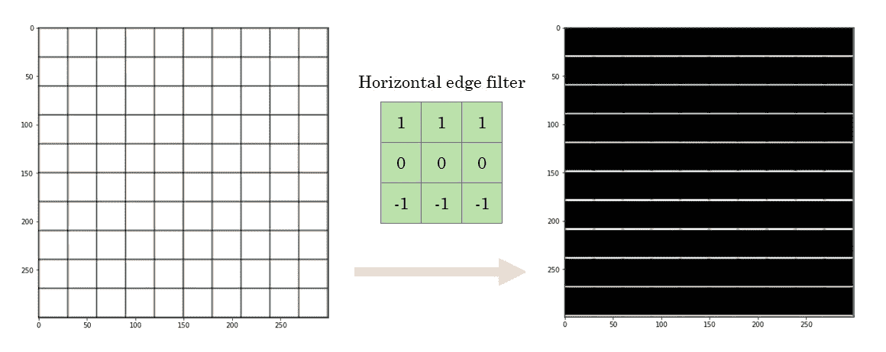*

*来源:自己的阐述*

*在这种情况下，我们只得到输出图像中的水平线。另一种不同的过滤器允许我们强调边缘，而不管方向如何:*

*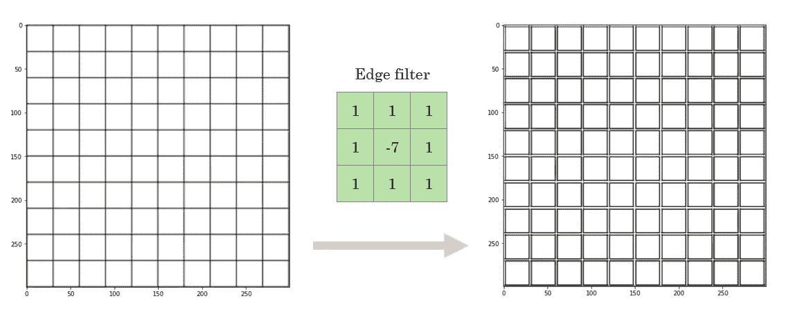*

*来源:自己的阐述*

*显然，我们可以应用一个滤波器，使输入图像保持不变:*

*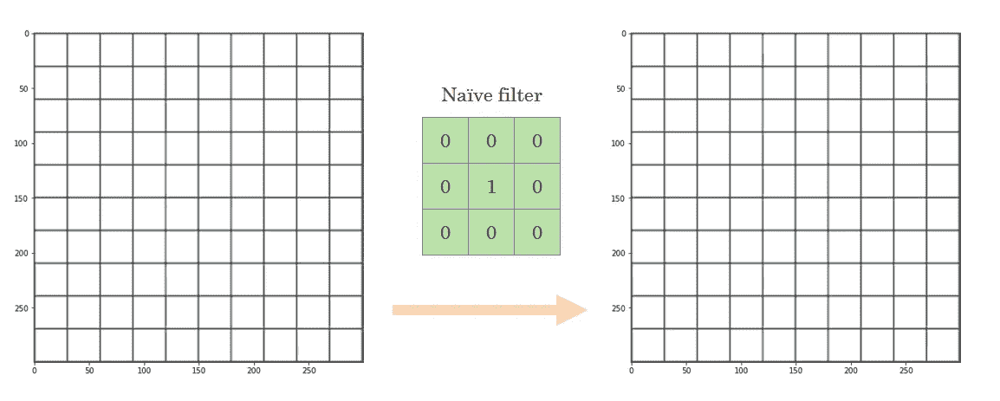*

*来源:自己的阐述*

*这是过滤器背后的想法，现在你可能更好地理解为什么它们被这样称呼了:它们允许我们保留图片中的某种信息，而 T2 忽略其他信息。这是可能的，因为**卷积**运算是如何工作的。*

*但是，让我们用另一个图像来看看关于过滤器的更有趣的事情:*

*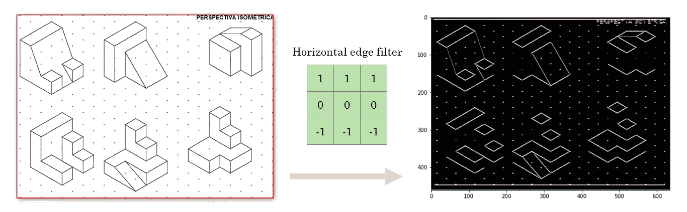*

*来源:自己的阐述*

*如果仔细观察结果，您会看到垂直线被删除，但水平线被保留。但是一个有趣的细节是，因为这个图像是等轴透视的，所以有**而不是**一条单独的**纯水平线**。*

*然而，卷积能够**处理透视图**并且显示实际上是水平的线，尽管透视图并没有这样显示它们。*

*最后，让我们得到一个真实世界的图像，并应用一些过滤器，看看我们得到了什么。为了便于解释，我们将得到一张黑白照片，但对于彩色图像，直觉几乎是一样的。*

*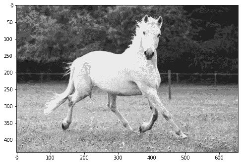*

*[来源](https://www.google.es/search?q=horse%20image&tbm=isch&safe=off&safe=off&tbs=rimg%3ACeQ0hnMRfGHsImAzZ9N83o2WSFHl-lelDd328rae2ZQRymNOExAeo-NQd6qSul8HLBR0ACqvZUsb_13fIuuAxnLdKJHLedLWh4TXDp-tv1KjF9eZLR71HGT7VTi22b-WQc6kQtRmnpZVHtnoqEgkzZ9N83o2WSBElI0VYG_1XfmioSCVHl-lelDd32ETQUcUW5IblYKhIJ8rae2ZQRymMRehU7EbL2BC4qEglOExAeo-NQdxGNGCMtyuORoCoSCaqSul8HLBR0ERZEIXI4CausKhIJACqvZUsb_13cRvLsLAWM1n3IqEgnIuuAxnLdKJBESqprupZwzkSoSCXLedLWh4TXDEThPVrXJ2gebKhIJp-tv1KjF9eYRyxV8Gk95JngqEglLR71HGT7VThH2bgk-WTs7uioSCS22b-WQc6kQEcXu9uBHiYfSKhIJtRmnpZVHtnoRNPgW-0vpp65hz6NI-w9E_1dg&hl=es&ved=0CB4QuIIBahcKEwiora2jgcvpAhUAAAAAHQAAAAAQDg&biw=1684&bih=826)*

*让我们应用一些过滤器，看看会发生什么:*

*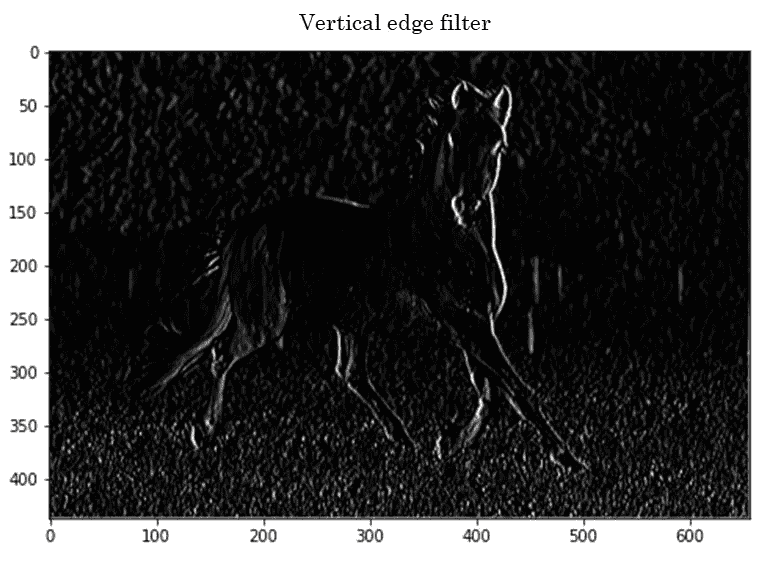*

*来源:自己的阐述*

*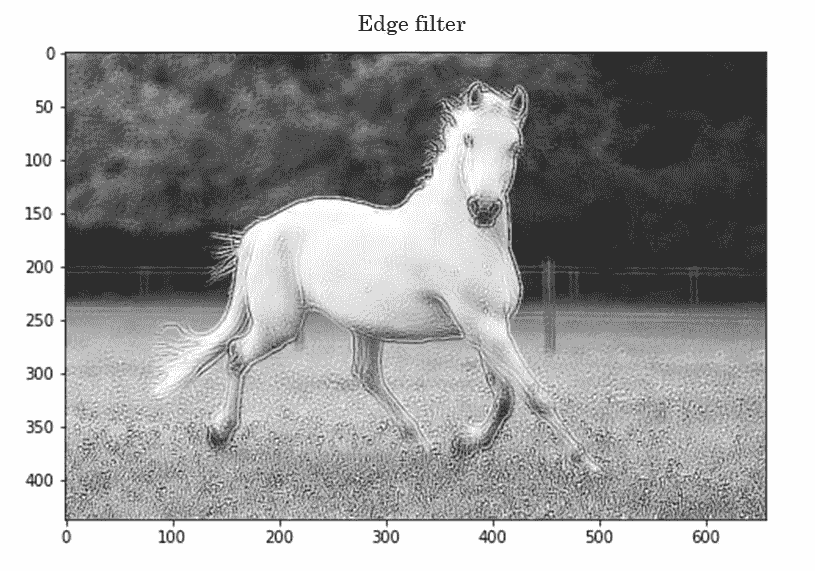*

*来源:自己的阐述*

*正如我们所预料的，根据我们应用的过滤器，我们只从图像中提取我们想要的信息。*

*现在我们已经了解了卷积的工作原理，让我们引入另一个让它更加强大的想法:**池化**。*

# *池化:增强卷积的能力*

*池的概念很简单:*

*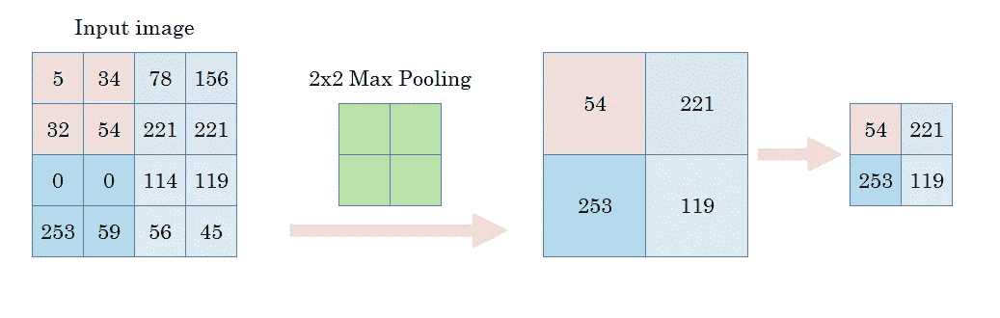*

*来源:自己的阐述*

*也就是说，我们将获取像素组(例如，2x2 像素组)并对它们执行聚合。我们可以进行的一种可能的聚合是取组中像素的最大值(这被称为**最大池化**)。另一种常见的聚合是取平均值(**平均池**)。*

*但是，这有意义吗？要回答这个问题，让我们得到一个以前的图像，并应用一个 *2x2 最大池*:*

*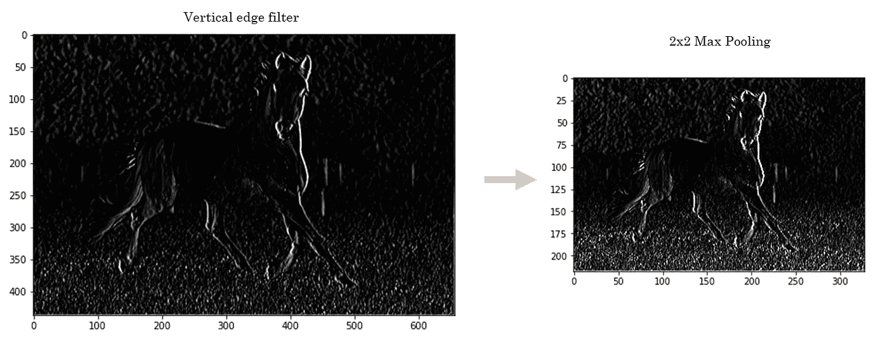*

*来源:自己的阐述*

*我们可以看到两件事:*

*   *首先，**图像尺寸缩小了**到一半:通过采用 2x2 像素的组并只保留最大值，现在图像变大了一半。*
*   *我们在使用垂直边缘滤波器进行卷积时保留的边缘不仅被保留，而且还被**增强**。*

*这意味着我们已经能够减少图像包含的信息(通过仅保留一半的像素)，但仍然保留并增强了滤波器在卷积图像时显示的有用特征。*

# *这如何适应卷积神经网络？*

*最后，我将提供一个直观的解释，说明这两个概念是如何构建在卷积神经网络中的。同样，我不会进入数学细节，因为这超出了本文的目的。*

*一个基本的卷积神经网络可以被视为一系列的卷积层和池层。当图像通过它们时，**重要的特征被保存在**卷积层中，并且由于汇集层，**这些特征被加强**并通过网络保存，而**丢弃所有对任务没有影响的信息**。*

*当我们在神经网络中旅行时，这些重要的特征可以从单线或边(如我们在示例中看到的)到**更复杂的东西**(例如，狗的耳朵)。*

*还有一个细微但至关重要的细节:在我们看到的例子中应用卷积时，我们选择了一个过滤器，然后观察输出。实际上，例如，如果我们正在执行图像分类任务，网络**将学习哪些过滤器允许我们提取最有洞察力的特征，以便区分我们训练数据集中的类别**。*

# *你自己试试吧*

*我已经创建了一个笔记本，这样你就可以自己尝试所有这些想法。您可以上传您想要的图像，并尝试不同滤镜和池的效果。*

*笔记本可以在这里找到[。](https://github.com/miguelfzafra/Convolutional-Neural-Networks/blob/master/CNN_convolutions_and_pooling.ipynb)*

*我建议在 google colab 上运行它，这样你就不必在电脑上安装所有必要的依赖项。*

*读完这篇文章后，我希望你学会了关于卷积和池如何工作以及为什么它们在 CNN 中有用的**直觉**。在下一篇文章中，我们将更详细地介绍图像如何穿过 CNN 的各个层，以及如何在每个步骤中提取特征。*

****免责声明*** *:本帖提供了关于卷积神经网络如何工作的直觉。为了便于解释，我省略了一些概念，如处理彩色图像中的不同通道、步幅、填充等。这些概念对于全面理解 CNN 很重要，所以一定要牢记在心！此外，这篇帖子的灵感来自 deeplearning.ai 的*[*tensor flow in Practice*](https://www.coursera.org/specializations/tensorflow-in-practice)*specialization，对 CNN 背后的直觉做了极好的解释。**