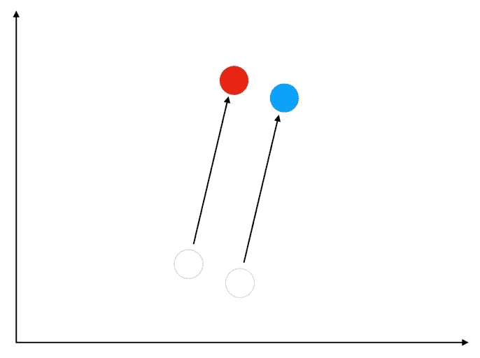
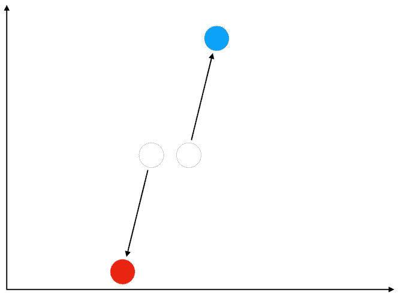
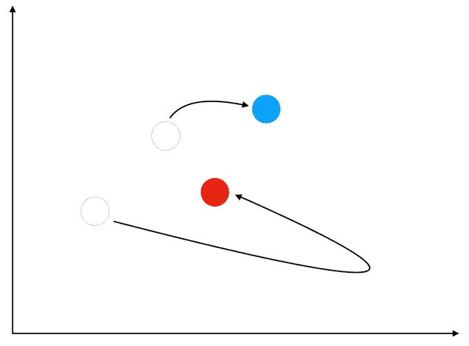
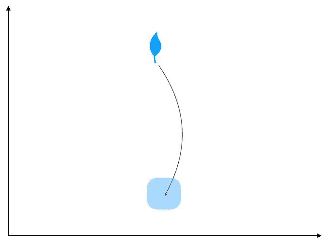
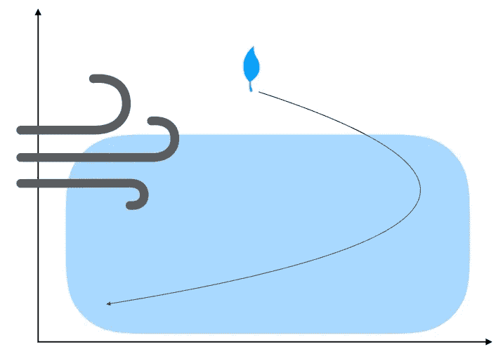
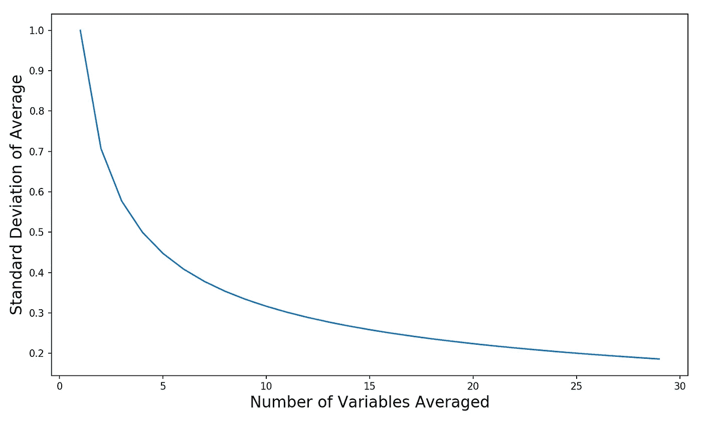
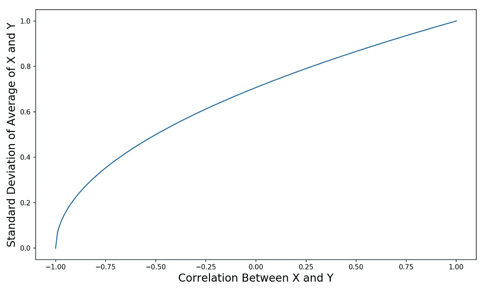

# 理解相关性和多样化

> 原文：<https://towardsdatascience.com/understanding-correlation-and-diversification-661c19a26555?source=collection_archive---------15----------------------->

安德鲁·雷德利在 [Unsplash](https://unsplash.com?utm_source=medium&utm_medium=referral) 上的照片

## 为什么投资不相关的资产是值得的

相关性是金融学和统计学中的一个基本概念。简单地说，相关性告诉我们两个变量一起移动的可能性。高相关性意味着当一个变量上升时，另一个也很可能上升。类似的公司，如可口可乐和百事可乐，它们的股票回报是正相关的:

正相关的事物往往会一起运动

负相关意味着相反(当一个变量上升时，另一个变量通常下降)。股票和国债往往是负相关的。

负相关的事物往往会向相反的方向运动

相关性为零相当于统计独立性。如果两个变量在统计上是独立的，这意味着两者互不影响。如果你和你最好的朋友每人扔一个六面骰子，结果将是独立的(不管你们两个有多少共同的想法)。

不相关的事物彼此独立运动

# 方差和不确定性

是时候做一点统计了。变量的方差是衡量它变化多少的尺度。你可以通过想象一个游戏来描绘变化，在这个游戏中，你把一根羽毛丢在地上，并试图预测它会落在哪里。如果那天没有风(或者你在室内玩)，那就相当容易了。如果没有阵风把它吹来吹去，我们知道羽毛不会飞得太远。因此，我们可以说羽毛的最终潜在着陆点具有低方差:

在没有风的情况下，我们可以合理地确定羽毛会落在哪里(低方差)

如果你碰巧在龙卷风中掉了你的羽毛，那么谁也不知道羽毛会落在哪里(它可能会落在几英里以外或更远的地方)。潜在着陆点的极大范围就是高方差的一个例子:

在大风的情况下，我们不知道羽毛会落在哪里(高方差)

**另一种思考方式是，低方差意味着低不确定性，高方差意味着高不确定性**。因此，在可能的情况下，在金融、数据科学和一般生活中，我们希望减少方差，这是有道理的。更少的差异意味着结果更可预测，计划不太可能出错，我们不太可能承受损失(无论是经济上的还是情感上的)。因此，我们可以在保险、应急计划和对冲上花费更少的时间和资源。

# 低相关性多样化

这就是相关性(或缺乏相关性)的原因。假设我们有两个正态分布的随机变量，X 和 y。这两个变量的均值都是 0，标准差是 1，相互之间的相关性是 0。关于正态分布的基础知识，请看这篇博文。

我们两个随机变量平均值的标准差是多少？我们需要引入一些数学规则来解决这个问题:

*   方差是标准差的平方(因此在我们的例子中，X 和 Y 的方差都是 1，因为 1 = 1):

> Var(X) = Stdev(X)

*   当我们将正态分布的随机变量 X 乘以常数 W 时，方差与常数的平方成比例:

> Var(W*X) = W *Var(X)

*   两个随机变量 X 和 Y 之和的方差等于它们的方差之和，如果 X 和 Y 是独立的:

> Var(X+Y) = Var(X) + Var(Y)

取平均值就像对每个随机变量应用一个常数 0.5，然后求和。因此，我们可以将上述两条规则结合起来，计算出平均值的方差，如下所示:

> Var(0.5 * X+0.5 * Y)= 0.5 * Var(X)+0.5 * Var(Y)

酷，现在我们可以计算 X 和 Y 的平均值的方差和标准差(让我们使用实际数字— Var(X)=1 和 Var(Y)=1):

> var(0.5 * X+0.5 * Y)= 0.5 * 1+0.5 * 1 = 0.25+0.25 = 0.5

为了简化我们的符号，让我们将 X 和 Y 的平均值称为 A。我们可以很容易地计算 A 的标准偏差，因为我们已经知道它的方差:

> stdev(A)= Sqrt(Var(A))= Sqrt(0.5)= 0.71

等等发生什么了？x 和 Y 的标准偏差都是 1，但它们的平均值的标准偏差是 0.71——变量的平均值比单个变量本身的波动性小。我想在这里强调两个关键:

1.  **取平均值很像创建投资组合。**这里，我们将 X 和 Y 分别乘以 0.5，取其平均值。但是我们可以很容易地称 X 为苹果股票回报，Y 为谷歌股票回报。那么我们会把 0.5 理解为一个权重。X 和 Y 的平均值就是平均分配给苹果和谷歌股票的投资组合的回报。**因此，当我们进行投资组合时，我们实际上是在对他们的个人回报进行加权平均。**
2.  **X 和 Y 的平均值的方差(和标准差)低于它们各自的方差。发生这种情况是因为它们彼此独立运动，这使**多样化(一个之字形，而另一个之字形，因此群体的平均运动比任何一个个体的运动更不稳定)。另一种理解方式是大数定律。您进行的独立观察越多，这些观察的平均值就越有可能接近真实值(因此 100 次观察的平均值比仅仅 3 次观察的平均值具有更低的方差)。

重要的是要注意，这种影响只发生在变量的相关性小于 1(理想情况下远小于 1)的时候。**如果两件事完全相关，那么我们不能指望它们的运动多样化——相反，它们会以完全一致的步伐一起运动**(即使我们平均了数千个完全相关的变量，方差也不会减少)。

还要记住，两个不相关变量的平均值的方差并不总是低于变量的单个方差。当一个变量具有高方差而另一个具有低方差时，两个变量的平均值的方差将介于两个个体方差之间。但是由于多样化，平均值的实际方差将明显小于单个变量方差的算术平均值。

我们看到，当我们对两个独立变量取平均值时，标准差是如何从 1 下降到 0.71 的。如果我们可以获得更多不相关的变量来增加我们的投资组合，会怎么样？下图显示了当我们增加更多不相关的随机变量时，标准差会发生什么变化:

添加更多不相关变量对平均值标准差的影响

最初增加的几个变量导致标准差在收益递减开始前急剧下降。这是意料之中的——我们已经包含在平均值中的变量越多，我们就越不应该预期每个新变量会对事物产生影响。但即便如此，我们可以看到大数定律在起作用——我们平均的变量越多，方差越低，我们就越有把握。转到金融领域，**我们能找到的不相关投资越多，我们投资组合回报的方差(和标准差)就越低，我们就越确定我们不会亏钱**。要了解为什么金融行业使用投资组合的标准差作为其风险的代理，请查看我以前的博客。

这正是想要击败世界的对冲基金想要做的。他们试图找到尽可能多的不相关的回报流，将它们组合成一个投资组合，然后希望印钱。通常情况下，事情不会像计划的那样发展，但这是一个美好的梦想。

# 实际问题

好了，现在我们都兴致勃勃地寻找尽可能多的不相关投资来填充我们的投资组合，是时候给我们的游行浇点冷水了:

*   **真正不相关的投资真的很难找到**。你希望你的投资不仅现在是不相关的，而且在经济危机中也是不相关的(当你真正需要多样化的好处时)——而这些更难找到。事实上，大多数投资至少在某种程度上是相关的，这意味着将它们结合起来仍然会减少方差，只是没有那么多。从数学上来说，两项投资的相关性越低，它们就越多样化(见[这里](https://financetrain.com/expected-return-and-variance-for-a-two-asset-portfolio/)的等式)。下图显示了改变两个正态分布随机变量之间的相关性如何改变其平均值的标准偏差:

更高的相关性意味着更少的多样化(更少的方差减少)

*   几乎每个人都拥有的典型风险投资是股票。因此，找到一种与股票负相关的投资将是一件好事，它让我们能够对冲风险(并降低我们整体投资组合的方差)。不幸的是，每个人都想这样。**因此，任何与股票回报呈负相关的投资，比如国债、看跌期权或 VIX 期货，都会被定价为溢价，可能会给你带来低回报或负回报**(嘿，保险从来都不是免费的)。国债很有趣，因为在过去几十年里，它们的回报与股票的回报呈负相关，而且它们的预期回报为正(不像其他对冲基金，你必须直接支付)。因此，股票和债券的核心配置是大多数长期投资组合的关键。然而，这种负相关并不是必然的——在很多年的时间里(比如 20 世纪 70 年代),股票和债券的回报高度相关(利率的持续上升通常会损害股票和债券)。
*   这就引出了我的最后一点——我们想要正的投资组合回报(**我们想要随机变量的平均值尽可能地大于零**)。这意味着**零或负预期收益的不相关随机变量对我们**没有用。是的，将它们加入我们的投资组合会降低总体方差，但也会降低预期回报(加权平均)，这将适得其反。

这篇文章是我投资组合优化入门的第三部分。如果你还没有看过，也看看第 1 和第 2 部分:

[***理解正态分布***](/understanding-the-normal-distribution-with-python-e70bb855b027)

[***了解投资风险***](/understanding-investment-risk-3882c58e00e0)