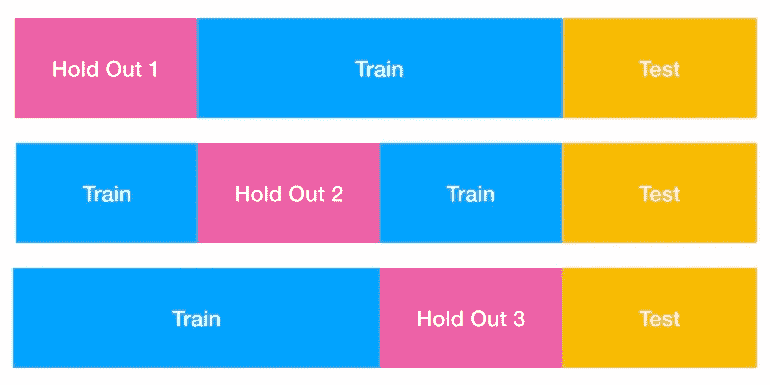

# 了解交叉验证

> 原文：<https://towardsdatascience.com/understanding-cross-validation-419dbd47e9bd?source=collection_archive---------16----------------------->

萨姆·巴耶在 [Unsplash](https://unsplash.com?utm_source=medium&utm_medium=referral) 上拍摄的照片

## 交叉验证如何帮助我们避免过度拟合的陷阱

我记得我建立的第一个量化模型。这是一个基于我研究的各种市场和经济因素，在美国股票和新兴市场股票之间战术性转移资金的模型。

我花了大量的时间设计(实际上是过度设计)我的功能并运行回溯测试，直到我确信我有一个世界无敌的产品。我的模型最后投产的时候，花了一年时间，基本上什么都没做。最终，我认为它产生了轻微的负累积回报。

我认为自己很幸运。回想起来，我意识到我的模型严重高估了，我很幸运，它推荐的赌注没有让我的公司损失惨重。

# 识别模型何时过度拟合

今天我们将讨论**交叉验证，这是一种帮助我们估计模型样本外性能并防止过度拟合**的技术。但首先，让我们谈一谈什么是过度拟合，为什么会发生。

**过度拟合是指我们对现有数据的训练过度，以至于模型失去了泛化能力。**泛化能力好的模型能够合理成功地适应新数据，尤其是那些与该模型到目前为止看到的任何观察结果都不同的数据。因此，如果一个过度拟合的模型不能概括，那么当它投入生产并真正脱离样本时，它很可能表现不稳定(可能很糟糕)。过度拟合的最常见原因是:

*   **伪相关性:**如果我们足够努力地寻找，我们会发现强相关性。例如，我们可能会发现比特币的价格与津巴布韦的披萨价格高度相关。但这最有可能是由于偶然性和随机性，而不是任何真实的东西，我们将钱押在这样的相关性上是愚蠢的。如果我们用一堆与我们试图预测的事物虚假相关的因素来拟合我们的模型，它将不能很好地概括。
*   **过度使用测试集:**这个真的很难完全避免。如果模型在我们的测试集(测试集是我们提供的数据的一部分，以便我们可以评估模型如何在新数据上推广)上工作得不好，那么我们将调整它，直到我们找到在训练集和测试集上都工作得好的配置。这样做的含义是，测试集不再是对我们模型的样本外性能的无偏估计——毕竟，一旦我们开始使用保留集(也称为测试集)做出建模决策，那么我们真的可以认为它仍然是保留的吗？
*   **有偏差的训练集:**我们的训练数据很少能真正代表我们试图建模的人群。因此，我们应该意识到，我们实际上肯定会遇到我们的模型在某些时候发现完全不熟悉的数据。虽然我们应该尽最大努力使样本的特征与总体特征相匹配，但我们也应该知道样本的不足之处。因为这些领域的数据对我们的模型来说是最大的风险。如果我们的样本只代表一小部分人口，那么随着时间的推移，我们的模型将表现不佳。

# 交叉验证有什么帮助

交叉验证是一种技术，它允许我们使用训练集产生测试集，如评分指标。也就是说，它允许我们仅使用我们的训练数据来模拟“超出样本”的影响，因此我们可以了解我们的模型概括得有多好。

如果没有交叉验证，传统的模型训练过程如下所示:

传统列车测试分离

我们在蓝色部分进行训练，直到我们觉得我们的模型已经准备好面对野外。然后我们在测试集上给它打分(黄金部分)。传统方法的缺点是我们只有一次机会。当我们在测试集上测试我们的模型时，我们已经损害了我们的测试数据。如果我们的测试结果很糟糕，那怎么办？我们真的可以放弃所有这些小时的工作吗？或者我们只是开始为测试集优化我们的结果？

要是有一种方法可以模拟我们的模型**可能**在测试集上的表现，而不实际使用测试集就好了。有！这叫做交叉验证。

## 交互效度分析

我们将关注一种特定类型的交叉验证，称为 K-folds(所以当我仅仅说交叉验证时，我指的是 K-folds 交叉验证)。K 折叠交叉验证将我们的训练数据分成 K 个折叠(折叠=子部分)。然后，我们训练和测试我们的模型 K 次，以便每个折叠都有机会成为伪测试集，我们称之为验证集。让我们使用一些视觉效果来更好地理解正在发生的事情:

三重交叉验证

假设我们正在开发一个预测线性回归模型，并使用 R 作为我们的主要评分标准。我们已经将一些数据分成了训练集和测试集。我们主要关心的是我们的模型的样本外预测的准确性(它概括得有多好)。因此，我们决定直到最后才查看测试集(这样我们可以给我们的模型一个智力上诚实的分数)。

但是当我们调整和改进我们的模型时，我们仍然想知道我们所做的改变会如何影响它的样本外性能。所以我们交叉验证:

*   我们决定运行 3 重交叉验证，这意味着我们将训练数据分成大小相等的 3 重。
*   在我们的交叉验证的运行 1 中，折叠 1 被保持(标记为保持 1 的粉红色矩形)。因此，我们在不在折叠 1 中的训练数据(蓝色矩形)上进行训练，然后在折叠 1 上进行验证。这意味着我们使用非折叠 1 训练数据来拟合我们的模型，然后计算并记录我们对折叠 1 中因变量的观察值的预测程度。**至关重要的是，在运行 1 中，我们在模型训练期间没有使用折叠 1 中的任何数据，因此使用折叠 1 计算的 R 有点像样本外的 R。**
*   在运行 2 中，折叠 2 伸出。现在，Fold 1，以前是我们的验证集，已经成为我们的训练集的一部分。我们使用折叠 1 和折叠 3 中的数据来拟合我们的模型，并使用折叠 2(通过 R)对其进行评分。
*   运行 3 结束后，我们现在有三个 R 值(因为每一次折叠都有一次机会)。**三个 R 的平均值给了我们模型中样本外 R 的合理估计。**

> 关于交叉验证的工作原理，需要记住的最重要的一点是，在每次运行中，它报告的得分指标都是根据给出的倍数计算的。

# 结论

使用交叉验证时的一些提示:

1.  重要的是要记住，我们的模型的交叉验证分数(比如 R)最多是对其在测试集上的性能的乐观估计。就像测试集上的性能充其量是对模型的真实概括能力的乐观估计。
2.  如果我们对模型所做的更改增加了训练分数(这是在样本中估计的)，但降低了交叉验证分数，那么这是一个好迹象，表明我们过度拟合了模型。
3.  折叠太少会束缚模型，这是因为在每次交叉验证运行中，有太多的训练数据被保留。例如，对于 2 次折叠，一半的训练数据被保留，这意味着该模型仅适合剩余的一半(导致得分度量低于它们应有的值)。一个不适合的模型和一个过度适合的模型一样糟糕。
4.  在我们训练测试分割之前打乱数据是一个好的做法，以防数据被排序。如果它以某种方式进行了排序，而我们忽略了对它进行洗牌，那么我们的训练测试分割将提供有偏差的数据集，其中任何一个都不能很好地代表实际人群。
5.  一旦我们通过交叉验证完成了模型的改进，我们应该在测试集上测试它之前，在整个训练集上重新调整模型。

***更多数据科学相关帖子由我:***

[*QQ 剧情到底是什么？*](/what-in-the-world-are-qq-plots-20d0e41dece1)

[*理解正态分布*](/understanding-the-normal-distribution-with-python-e70bb855b027)

[*熊猫加入 vs 合并*](/pandas-join-vs-merge-c365fd4fbf49)

[*理解贝叶斯定理*](/understanding-bayes-theorem-7e31b8434d4b)