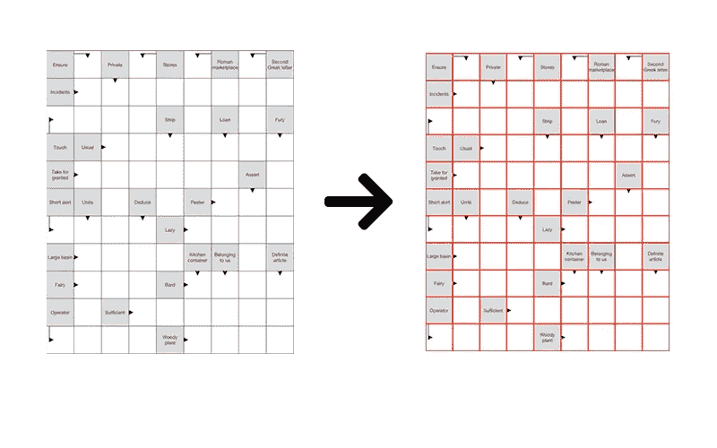
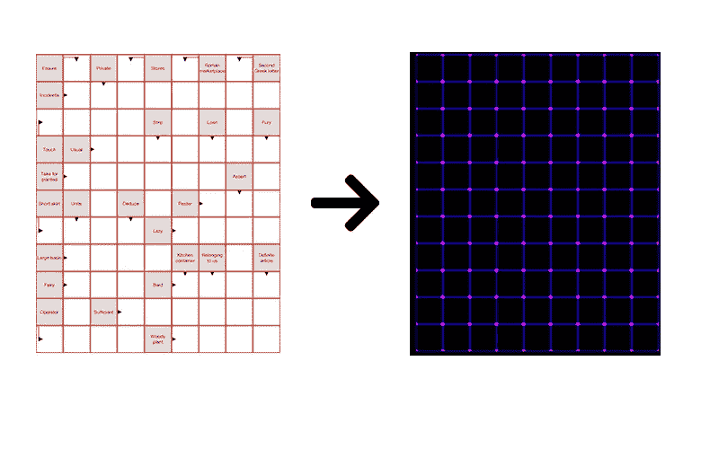
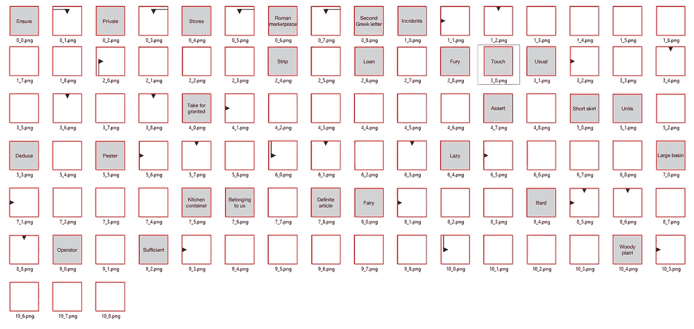
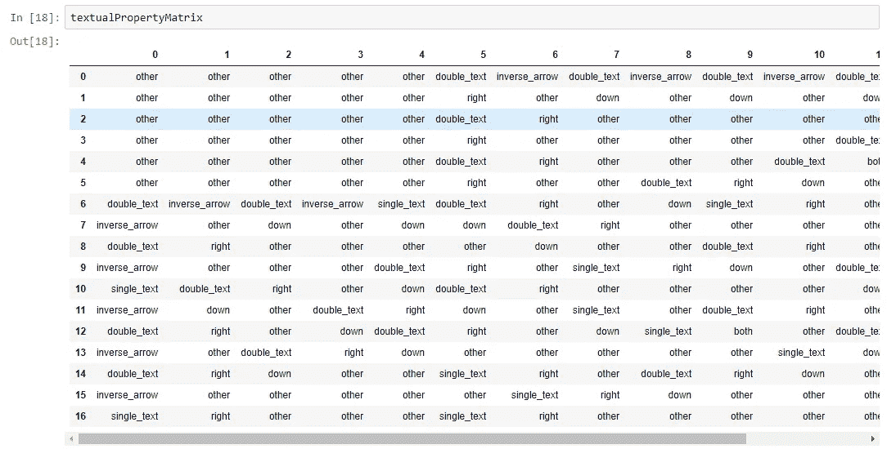

# 用 OpenCV、OCR 和 DNNs 理解纵横字谜

> 原文：<https://towardsdatascience.com/understanding-crossword-puzzles-with-opencv-ocr-and-dnns-f7dd759650b2?source=collection_archive---------49----------------------->

## 你能教机器如何阅读填字游戏吗？


[https://unsplash.com/photos/zlbB-anyO3I](https://unsplash.com/photos/zlbB-anyO3I)

**简介**

最近，我被分配了一个任务，创建一个算法，从纵横字谜照片中提取所有可能的元数据。这对我来说似乎是个有趣的任务，所以我决定试一试。以下是这篇博客将要涉及的话题:

*   基于 OpenCV 的纵横细胞检测与提取
*   Pytorch CNN 纵横字谜细胞分类
*   单元元数据提取

你可以在[我的网站](http://artkulakov.com)和我的 [Github](https://github.com/artkulak/crossword-data-extraction) 上找到完整的代码实现。

**纵横字谜细胞检测**

首先，要提取元数据，您必须了解它的位置。为此，我使用简单的 OpenCV 试探法来识别纵横字谜上的线条，并用这些线条形成一个单元格网格。输入图像需要足够大，以便可以容易地检测到所有的线。



同一图像上的输入图像和输出行

之后，对于细胞检测，我找到了线之间的交叉点，并根据交叉点形成了细胞。



图像线交点

最后，在这一阶段，每个细胞都从图像中切下，并保存为一个单独的文件，以供进一步操作。



从单个图像中提取的细胞

**用 PyTorch CNN 进行纵横字谜细胞分类**

对于细胞分类，一切都很简单。该问题被建模为具有以下目标的多类分类问题:

```
{0: 'both', 1: 'double_text', 2: 'down', 3: 'inverse_arrow', 4: 'other', 5: 'right', 6: 'single_text'}
```

对于每个目标类，我为每个类手工标记了大约 100 个单元格。之后，我用以下架构安装了一个简单的 PyTorch CNN 模型:

```
class Net(nn.Module):
    # Pytorch CNN model class
    def __init__(self):
        super(Net, self).__init__()
        self.conv1 = nn.Conv2d(3, 6, 3)
        self.pool = nn.MaxPool2d(2, 2)
        self.conv2 = nn.Conv2d(6, 16, 3)

        self.conv3 = nn.Conv2d(16, 32, 5)
        self.conv4 = nn.Conv2d(32, 64, 5)

        self.dropout = nn.Dropout(0.3)

        self.fc1 = nn.Linear(64*11*11, 512)
        self.bnorm1 = nn.BatchNorm1d(512)

        self.fc2 = nn.Linear(512, 128)
        self.bnorm2 = nn.BatchNorm1d(128)

        self.fc3 = nn.Linear(128, 64)
        self.bnorm3 = nn.BatchNorm1d(64)

        self.fc4 = nn.Linear(64, 7)
    def forward(self, x):
        x = F.relu(self.conv1(x))
        x = self.pool(F.relu(self.conv2(x)))

        x = F.relu(self.conv3(x))
        x = self.pool(F.relu(self.conv4(x)))

        x = x.view(-1, 64*11*11)
        x = self.dropout(x)
        x = F.relu(self.bnorm1(self.fc1(x)))
        x = F.relu(self.bnorm2(self.fc2(x)))
        x = F.relu(self.bnorm3(self.fc3(x)))
        x = self.fc4(x)
        return x
```

最终的模型预测几乎是下降的，甚至在不同格式的填字游戏中也能很好地概括。

**单元元数据提取**

我的最后一步是从标记的单元格中提取所有元数据。为此，我首先以 Pandas DataFrame 格式创建了每个图像单元的分类表示。



图像单元文本表示

最后，基于 cell 类，我或者使用 Pytesseract 从图像中提取文本，或者如果单元格被归类为箭头单元格之一，则提取箭头坐标和方向。

该脚本的结果输出以 JSON 格式显示如下:

```
{“definitions”: 
[{“label”: “F Faitune |”, “position”: [0, 2], “solution”:{“startPosition”: [0, 3], “direction”: “down”}}, 
{“label”: “anceur”, “position”: [0, 4], “solution”: {“startPosition”: [1, 4], “direction”: “down”}}]
}
```

**结论**

这项工作对我来说是一次很好的经历，并提供了一个很好的机会来深入研究一项混合了简单的 OpenCV 试探法以及使用更前沿的概念(如 OCR 和 DNNs)进行图像分类的任务。谢谢你的阅读！

你可以在我的 [**网站**](http://artkulakov.com/) 上查看其他帖子