# 理解计算机视觉:人工智能如何看待我们的世界

> 原文：<https://towardsdatascience.com/understanding-cv-how-ai-sees-our-world-a977b90bf612?source=collection_archive---------27----------------------->

## 研究人员是如何设法让计算机理解它们看到的东西的？让我们来找出…

> "在所有的感觉中，视觉肯定是最令人愉快的."
> 
> ——海伦·凯勒

人工智能和神经网络如此受欢迎的一个原因可能是费李非教授在斯坦福大学开设的视觉识别公开课。与安德鲁·恩盖(Andrew Ngai)等许多其他有影响的人一起，他们吸引了大量对深度学习的关注。无论是检测医学图像中的癌症组织，还是在自拍照上添加可爱的动物耳朵，还是将汽车开上街道， **C** 计算机 **V** 视觉( **CV** )为我们描绘了一个美好的未来，在这个未来中，机器可以在许多方面让我们的生活更加便利。

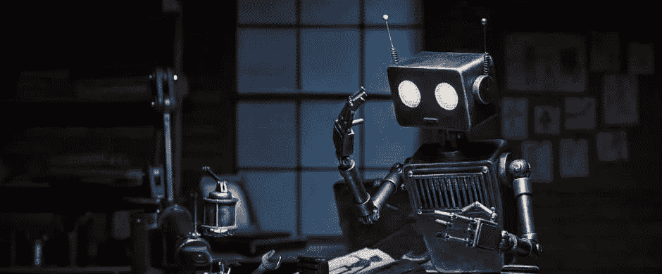

机器人看着手，图像来自 [Quantica](https://quanticaformacion.com/)

在本文中，让我们先来了解一些与 CV 相关的历史。然后，我们将进入一些基本的 CV 技术，如直线和边缘检测。在我们建立了基础和直觉之后，我们将进入现代 CV 模型如何工作的细节。在简要介绍深度学习之后，我们将更详细地了解卷积神经网络的基础知识。最后，我们将回顾一些当今最先进的算法。

# 计算机视觉简史

> "如果我们想让机器思考，我们需要教它们看东西."
> 
> —费·

从人工智能转向，CV 领域的研究开始于 20 世纪 60 年代左右。最早的相关论文之一可能是 Hubel 和 Wiesel 在 1959 年发表的猫的纹状皮层中单个神经元的感受野，他们将电极插入猫的大脑，并在改变猫的视觉后观察反应。

他们在 1962 年发表了另一篇论文，对猫的大脑如何处理视觉信息进行了更详细的研究。神经科学相关方法的早期研究相当糟糕。我在之前的一篇文章中提到过，基于神经网络的方法经历了一段黑暗时期，直到 2000 年。

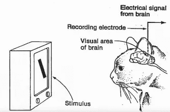

Hubel & Wiesel 的实验，图片来自 [CS231n 幻灯片](http://cs231n.stanford.edu/slides/2016/winter1516_lecture7.pdf)

在这个领域还有其他的进展。例如，霍夫变换(Hough's transform)是以 1962 年保罗·豪格的专利霍夫变换命名的，现在广泛应用于自动驾驶等领域。边缘检测是由 John Canny 在 1986 年提出的，在边缘检测中使用得相当多。边缘检测应用于许多不同的领域，如人脸识别。

当我在加拿大皇后大学(Elon Musk 也去了那里)学习时，格林斯潘教授也展示了他们在机器的对象持久性方面的进展。加拿大人在人工智能研究领域做出了很多贡献，包括著名的 CIFAR。

在我们进入深度学习之前，另一个值得一提的是 Lenna Forsén。如果你在任何与数字图像处理相关的领域，你很可能在某个地方见过她的照片。1960 年，劳伦斯·罗伯茨是第一个在他的硕士论文中使用她的照片的人。

这张照片后来不知何故成了图像处理领域的标准测试图像。《花花公子》杂志计划就肖像权提起诉讼，但当他们意识到这是为了研究和教育时，就好心地放弃了。

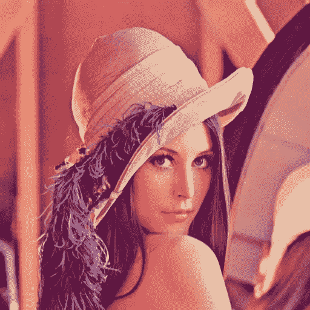

Lenna Forsén 的肖像，图片来自[维基百科](https://en.wikipedia.org/wiki/Lenna)

现在让我们回到神经网络。受 Hubel 和 Wiesel 工作的启发，Kunihiko Fukushima 在 1980 年发明了“新克隆”。Neocognitron 可以说是卷积神经网络的最早版本。网络被用来识别手写字符。

Yann LeCun 因其在卷积神经网络方面的工作而闻名，他于 1989 年将反向传播应用于卷积神经网络。然后他在 1998 年发表了基于梯度的学习算法 [LeNet-5](http://yann.lecun.com/exdb/publis/pdf/lecun-01a.pdf) 。

神经网络的转折点发生在 2012 年。Alex Krizhevsky 和他的 AlexNet 在 9 月 30 日赢得了 ImageNet 竞赛，展示了基于卷积神经网络的方法的优越性能。

ImageNet 的首席科学家和首席研究员费教授于 2006 年开始研究 ImageNet 的想法。她继续在世界各地的会议和会谈中旅行，影响其他人进入计算机视觉领域。

另一个值得一提的可能是约瑟夫·雷德蒙。雷德蒙在 2016 年发明了 YOLO 篮网。YOLO 这个词可能来自一个流行的网络俚语“**Y**ou**O**only**L**ive**O**nce”，暗示人们要充分享受生活，通常用在年轻人将要做出鲁莽举动的时候。在论文中，YOLO 代表“你只看一次”，这提供了基于神经网络的快速对象检测。

Redmon 在他的简历中也认为自己是一匹小马，指的是“我的小马”，这是一个针对小女孩的美国特许经营。

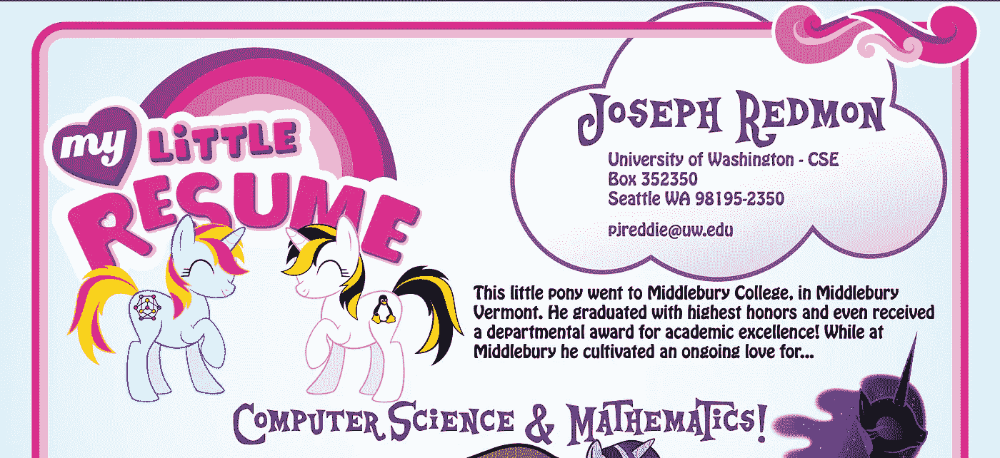

[雷蒙顿简历的潜峰](https://pjreddie.com/static/Redmon%20Resume.pdf)

计算机视觉的进步正以许多不同的方式让我们的世界变得更美好。是时候让我们了解这些算法是如何工作的了！

# 计算机视觉:基础，在神经网络之前

自从有了电视，监视器屏幕就通过调节三种不同颜色的**C**a node**R**y**T**ubes(**CRT**)的亮度来显示图像——Red(**R**)、**G**green(**G**)和 **B** lue ( **B 尽管现在我们的屏幕可能使用了更先进的硬件，如液晶显示器(LCD)或有机显示器(T42)，图像通常以 RGB 表格的形式存储和传输例如，位图将图像存储在范围从 0x000000 到 0xFFFFFF 的十六进制[值的数组中，这些值可以表示范围从 0 到 255 的 3 个数字。](https://simple.wikipedia.org/wiki/Hexadecimal)**

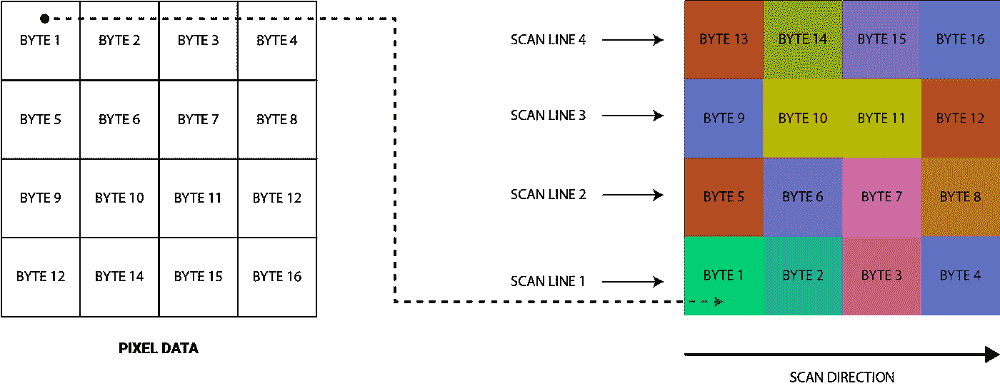

位图插图，来自媒体上的[it 下一篇文章](https://itnext.io/bits-to-bitmaps-a-simple-walkthrough-of-bmp-image-format-765dc6857393)

由于压缩格式或其他约定，某些图像格式可能会以不同的方式存储图像，但它们通常可以转换回 RGB 值数组。在数学直觉的背景下，RGB 值的差异并不代表它们在人类感知方面的实际差异。 **C** 委员会 **I** 国际**de**L’**é**clairage(**CIE**)提出了δ*E*度量，从人类感知的角度更准确地表示了色差。****

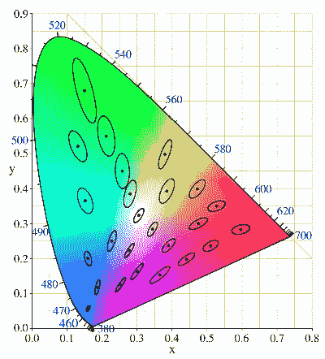

CIE 1931 色彩空间中的麦克亚当图，图片来自[维基百科](https://en.wikipedia.org/wiki/Color_difference)

计算机如何存储和处理图形信息是另一个巨大的领域，我们可以在另一篇文章中深入探讨。

## 边缘检测和特征提取

> “视觉图像是由我们大脑以边缘的形式将像素组打包在一起的能力构建的。”
> 
> —吉尔·博尔特·泰勒

由于像素阵列可能很复杂且有噪声，因此很难垂直分析图像。这也是研究人员通常提取边缘、线条等特征的原因。这些特征可以用简单得多的数值或关系来表示。有许多方法来检测边缘，如采取导数或 Canny 的方法。在本文中，我们将简要回顾一下 Sobel 的方法。

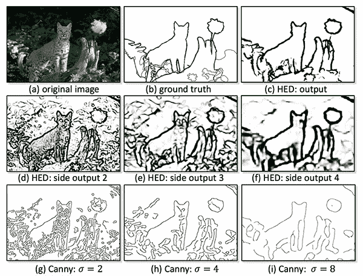

不同边缘检测算法之间的比较，图像来自 [PyImageSearch](https://www.pyimagesearch.com/2019/03/04/holistically-nested-edge-detection-with-opencv-and-deep-learning/)

边缘本质上是像素间的高度差异，因此大多数边缘检测方法试图提取检测到像素间差异的区域。Sobel 的方法通过用两个特殊的核对图像的 3×3 区域进行[卷积](https://en.wikipedia.org/wiki/Kernel_(image_processing)#Convolution)(由操作符 ***** 指示)来检测边缘。核将产生梯度的水平和垂直分量，其可用于计算表示边缘的方向和强度的向量。

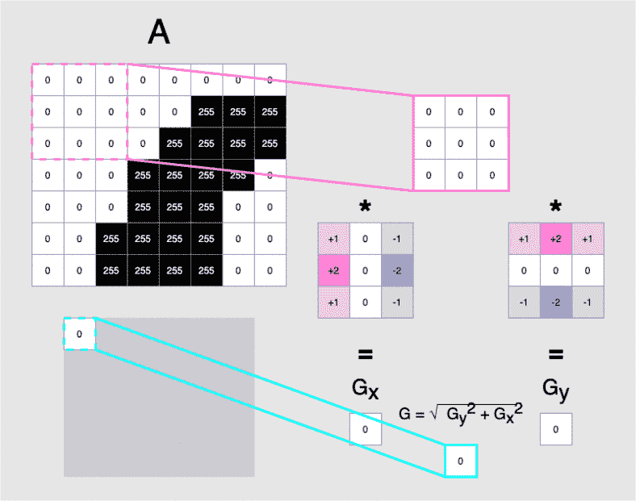

索贝尔方法演示，*作者图片*

关于数学的更多细节可以在[维基百科](https://en.wikipedia.org/wiki/Sobel_operator)上找到，并在下面的视频中解释。作者还制作了其他图像处理算法的视频，如 [Canny 边缘检测器](https://www.youtube.com/watch?v=sRFM5IEqR2w)和[模糊过滤器](https://www.youtube.com/watch?v=C_zFhWdM4ic)。

寻找边缘(Sobel 算子)，视频来自 [Youtube](https://www.youtube.com/watch?v=uihBwtPIBxM)

## 霍夫变换与自动驾驶

> “在苏俄，汽车载着你！”
> 
> —俄罗斯逆转

想象一下，我们是一家汽车公司的工程师，该公司希望发明无人驾驶汽车。在某些时候，我们将不得不教汽车在道路上的车道内行驶。否则，我们的车会像《一家人》里的亚洲女司机一样。

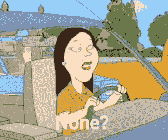

来自[家庭的亚洲女司机](https://www.youtube.com/watch?v=0OMD8v7WrXI)

如果交通线是连续的，那就容易了。我们可以确保当赛车太靠近线的任何一侧时，赛车会向后移动一点。但是我们知道，在大多数地方，比如加利福尼亚，街道上都有虚线。如果汽车只检测到它接近线，它可能会在实线之间的间隙失控。

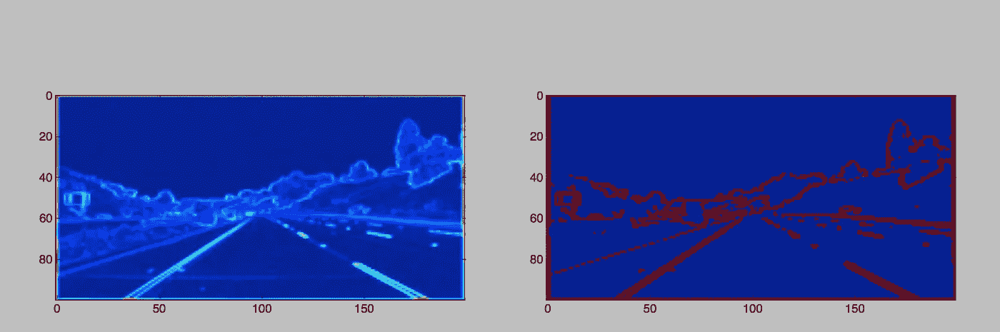

经过处理的虚线图像，来自媒体的图像[文章](https://medium.com/@tempflip/lane-detection-with-numpy-2-hough-transform-f4c017f4da39)

由于霍夫变换，我们将能够从虚线重建直线。霍夫变换将 x-y 空间内的直线转换为 m-c 空间内的点。然而，x-y 空间内的点将被转换成 m-c 空间内的线。m-c 空间还具有这样的性质，即所有与同一点相交的线将对应于 x-y 空间内同一直线上的点。关于 Hough 变换直线检测的更多内容，[这里](http://web.ipac.caltech.edu/staff/fmasci/home/astro_refs/HoughTrans_lines_09.pdf)是一篇论文。

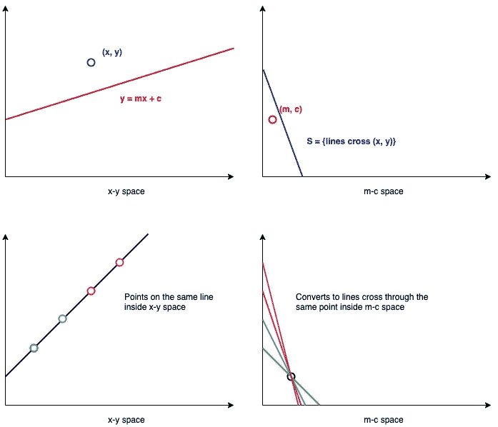

霍夫变换演示，*图片作者*

霍夫变换不仅能检测直线，还能检测圆。阅读[圆形霍夫变换](https://en.wikipedia.org/wiki/Circle_Hough_Transform)和[广义霍夫变换](https://en.wikipedia.org/wiki/Generalised_Hough_transform)了解更多信息！

# 走向深度学习:卷积神经网络和残差神经网络

> “没有人告诉一个孩子如何看，尤其是在早年。他们通过真实世界的经历和例子来学习这一点。”
> 
> —费·

“机器学习”这个短语最早是由亚瑟·塞缪尔在 1952 年提出的。然而，在 2000 年之前，神经网络的研究一直受到严重阻碍。人工神经元的最早版本是由神经生理学家沃伦·麦卡洛克和数学家沃尔特·皮茨在 1943 年发明的。它旨在描述神经元如何在我们的大脑中工作。

在 2012 年 ImageNet 大赛之后，网络公司( **CNN** )成为了明星。从那以后，我们开始在任何可以与之相关的领域中超过 80%的新发表的论文中看到神经网络相关的模型。还有许多其他的机器学习算法，如 k-NN 和随机森林，但在图像处理方面，CNN 的性能不如它们。

## 深度卷积神经网络

每当提到卷积神经网络，数据科学家首先想到的可能是 Yann LeCun，他在 1998 年发表了关于 LeNet-5 的论文。

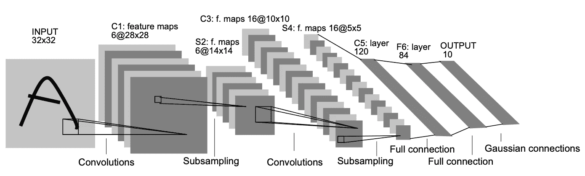

LeNet-5 的架构，图片来自[原文](http://yann.lecun.com/exdb/publis/pdf/lecun-01a.pdf)

典型地，CNN 由 4 种类型的层构成。我在我的 [Alpha Go](/understanding-alphago-how-ai-thinks-and-learns-advanced-d70780744dae) 文章中提到了 3 个，因为它们是更常见的 3 个。研究人员也可能在他们的论文中加入一些小的变化，并发明新的图层类型。这 4 层是卷积层、汇集层、有限线性层和全连接层。

**1。卷积层**

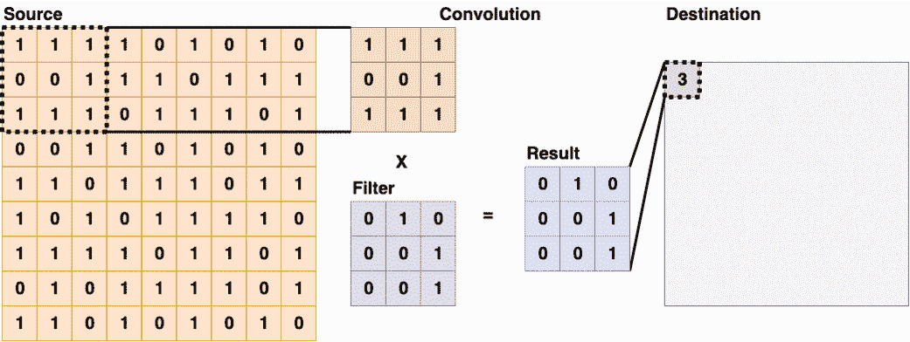

卷积层(3x3)，*图片作者*

卷积层通常作为卷积神经网络的第一层出现。这些类型的图层将使用过滤器扫描源图层，并将总和放入目标图层。有些过滤器擅长检测边缘，有些则擅长其他任务。卷积过程可以提取 2D 图像内部的空间信息，并将其传递给下一层。关于不同种类的卷积滤波器及其在计算机视觉中的应用的更多细节可以在[这里](https://www.saama.com/blog/different-kinds-convolutional-filters/)找到。

**2。汇集层**

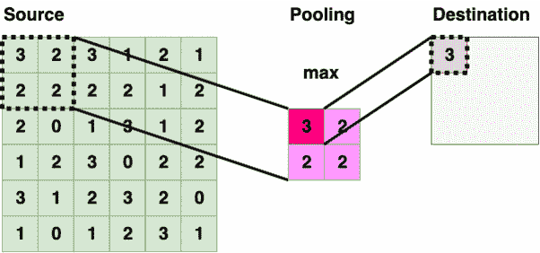

池层(2x2 最大池)，*作者图片*

池层遍历源层，并在有界区域内选择一个特定的值。该值通常是该区域内的最大值、最小值和平均值。将信息缩小也称为“下采样”或“二次采样”。

当计算资源有限时，与将像素直接输入多层感知器的节点相比，通过卷积层和池层预处理的网络更加资源友好。在特殊情况下，“上采样”技术也可以用来产生更多的数据。

**热路层**

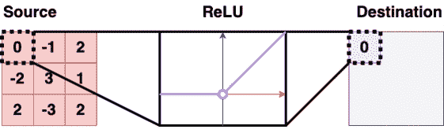

热卢层，*作者图片*

ReLU layer 将值提供给一个 ReLU 函数，该函数只是去掉负值。ReLU 是神经网络中常用的激活函数，因为它可以降低[消失梯度问题](https://en.wikipedia.org/wiki/Vanishing_gradient_problem)的可能性。

**全连接层**

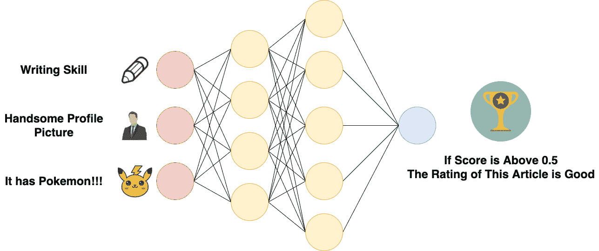

全连接层只是一个人工神经网络，*图片作者*

一个完全连接的层本质上是一个多层感知器，它有时被称为“softmax”，本质上做一些被称为“加权和”的事情。我已经在我的 [Alpha Go 文章](/understanding-alphago-how-ai-thinks-and-learns-advanced-d70780744dae)中解释了更多关于多层感知器的内容，包括前馈和反向传播。

## 深度残差神经网络

2015 年，微软研究院的何和他的团队发表了他们的论文[用于图像识别的深度残差学习](https://arxiv.org/pdf/1512.03385.pdf)。论文将残差学习应用于卷积神经网络，取得了比当时所有其他**S**tate-**o**f-**t**he-**A**rt(**SOTA**)模型更好的性能。

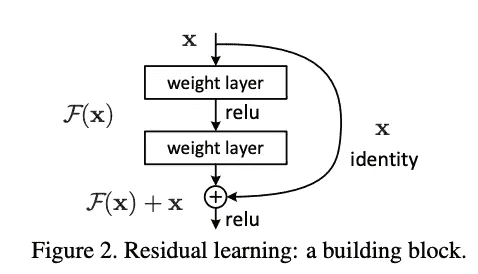

剩余连接示例，图片来自[原始论文](https://arxiv.org/pdf/1512.03385.pdf)

剩余学习的一个关键概念是“捷径连接”的使用。这涉及到在网络的各层之间添加一个连接，这样信息就可以通过跳过层来传递。在对[人脑](https://en.wikipedia.org/wiki/Residual_neural_network)的分析中也发现了这样的结构。具有跳过权重的网络也称为高速公路网络。

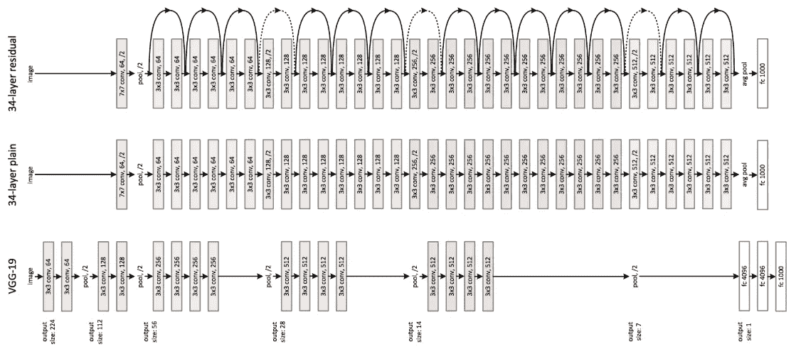

ResNet 与其他型号的对比，图片来自[原纸](https://arxiv.org/pdf/1512.03385.pdf)

该网络还在 [CIFAR-10](https://www.cs.toronto.edu/~kriz/cifar.html) 数据集上实现了更好的性能。

# 今日计算机视觉:语义分割、目标检测和图像分类

> “大哥看着你呢！”
> 
> — 1984，乔治·奥威尔

随着计算机视觉的进步，人工智能现在可以做许多疯狂的事情。出于对隐私侵犯的担忧，欧盟甚至考虑[禁止面部识别](https://www.bbc.com/news/technology-51148501)。而其他国家，如中国，已经将面部识别嵌入他们的[社会信用系统](https://www.youtube.com/watch?v=NOk27I2EBac)。

凡事都有取舍。随着电子支付和街头摄像头的进步，我可以向你保证，上海街头的扒手比过去少多了。与洛杉矶相比，上海的犯罪活动也少得多。

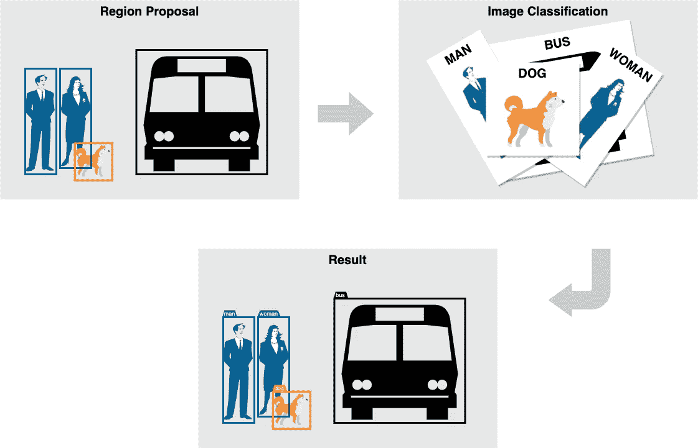

图片分类工作流程，*图片作者*

当我们谈论计算机视觉时，我们脑海中浮现的可能是包围盒中的标签图像。首先通过区域提议过程由区域勾勒出对象的轮廓，然后将检测区域内的内容。有 3 个热门的研究领域:语义分割，对象检测和图像分类。

## 语义分割:CASENet 和 Mask R-CNN

语义分割与边界和边缘的检测高度相关。[例如，CASENet](https://arxiv.org/pdf/1705.09759.pdf) 勾勒出物体的边界。

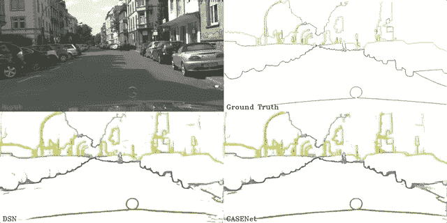

使用 CASENet 进行语义分割，演示来自 [Youtube](https://www.youtube.com/watch?v=BNE1hAP6Qho)

[Mask R-CNN](https://arxiv.org/pdf/1703.06870.pdf) 可能是一个更受欢迎的模型，以语义分割著称。网络从 [R-CNN](https://arxiv.org/pdf/1311.2524.pdf) 发展到快速 [R-CNN](https://arxiv.org/pdf/1504.08083.pdf) 再到[更快的 R-CNN](https://papers.nips.cc/paper/5638-faster-r-cnn-towards-real-time-object-detection-with-region-proposal-networks.pdf) 。

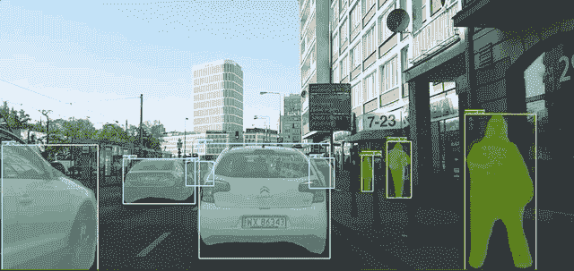

带掩码的语义分割 R-CNN，来自 [Youtube](https://www.youtube.com/watch?v=Yqj7h7qw1Mw) 的演示

## 对象检测:YOLOv1、YOLOv2 和 YOLOv3

> “你只看一次！”
> 
> —约瑟夫·雷德蒙

由 Joseph Redmon 于 2016 年发布的 [YOLOv1](https://arxiv.org/pdf/1506.02640.pdf) 已经在物体检测方面展示了比当时其他模型快得多的速度。作者将该型号逐步改进为性能更好的[约洛夫 2](https://arxiv.org/pdf/1612.08242.pdf) 和[约洛夫 3](https://pjreddie.com/media/files/papers/YOLOv3.pdf) 。

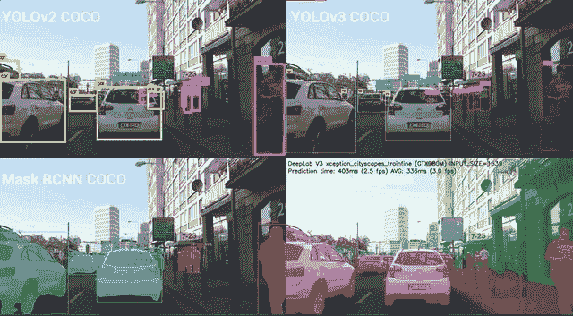

YOLOv2、YOLOv3、Mask R-CNN 和 Deeplab Xception 之间的比较，演示来自 [Youtube](https://www.youtube.com/watch?v=s8Ui_kV9dhw)

## 图像分类:CNN 的图像网络现状和史诗般的失败

ImageNet 邀请世界各地的研究人员在他们的数据集上竞争，最先进的模型仍在快速迭代。也许你会定义下一个 SOTA？

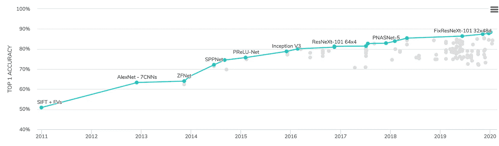

来自[论文的影像分类精度可视化，代码](https://paperswithcode.com/sota/image-classification-on-imagenet)，2020

CNN 上还有其他有趣的事实。一组研究人员在 2019 年 ICLR 上发表了一篇[论文](https://openreview.net/pdf?id=Bygh9j09KX)，显示 CNN 像人类一样基于纹理而不是形状对图像进行分类。

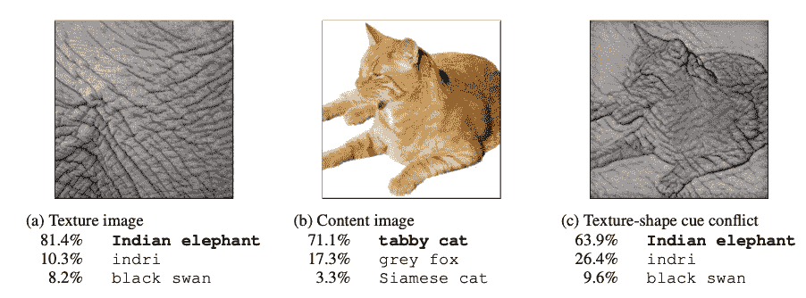

神经网络根据纹理、来自[原始纸张](https://openreview.net/pdf?id=Bygh9j09KX)的图像做出判断

神经网络也容易受到高频干扰。最近一篇关于太极的论文显示，当图片上有波纹时，VGG-16 会把松鼠归类为金鱼。

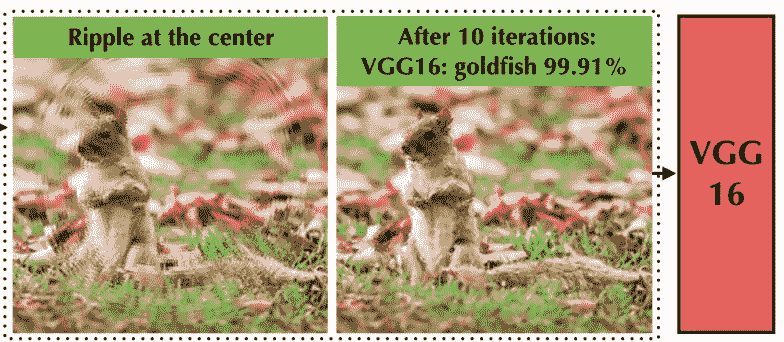

VGG-16 认为有波纹的松鼠是金鱼，图片来自[原文](https://arxiv.org/pdf/1910.00935.pdf)

伊恩·古德费勒很久以前就研究过针对神经网络的[对抗性攻击](https://arxiv.org/pdf/1702.02284.pdf)，当我们学习生成模型时，我们会更深入地研究他。

# 话说到最后…

> “AI 无处不在。这在未来并不是什么可怕的事情。艾和我们在一起。”
> 
> —费·

我终于按计划完成了这篇文章。这个领域有太多的东西要写，你不可能在 10 分钟的文章里写完。我希望这篇文章能引起你对其中一些的兴趣。我可能会在未来的文章中写关于手势识别和社会行为预测的内容。

CV 和 NLP 是人工智能领域的两个热门话题。如今，云人工智能平台正把大部分精力投入到这两个领域，因为它们有潜在的应用价值。我也写过一篇关于 NLP 的[文章。我计划稍后写自动化机器学习、生成模型和云平台。关注我了解更多信息。](/understanding-nlp-how-ai-understands-our-languages-77601002cffc)

此外，我还有一篇关于计算机视觉前端框架的文章。这些框架很容易自己尝试，也许今晚你可以用它们做一些很酷的应用程序！