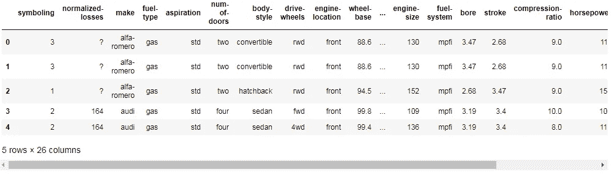
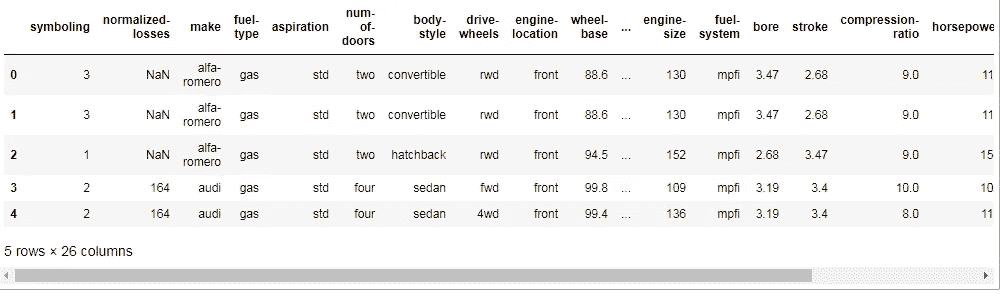
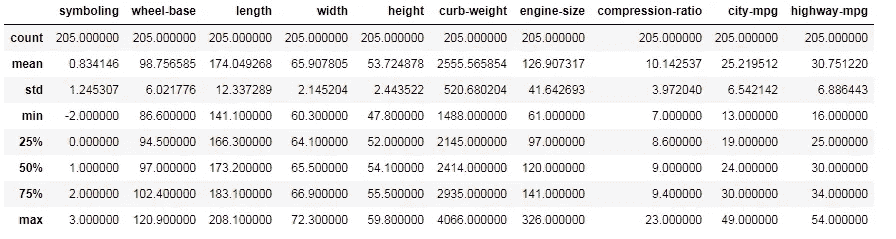
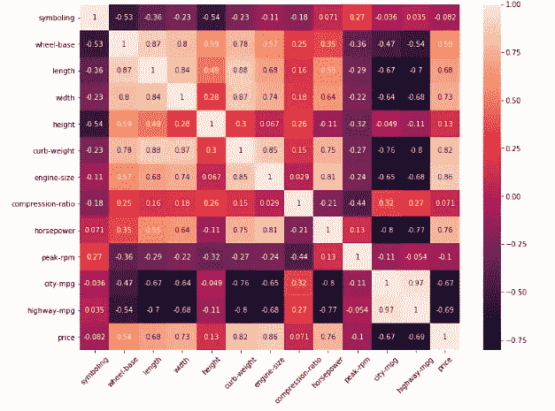
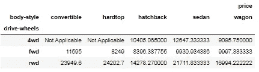

# 逐步了解数据分析

> 原文：<https://towardsdatascience.com/understanding-data-analysis-step-by-step-48e604cb882?source=collection_archive---------9----------------------->

## 对数据集应用数据分析以获得关于数据的见解。


马库斯·斯皮斯克在 [Unsplash](https://unsplash.com?utm_source=medium&utm_medium=referral) 上的照片

在当今世界，每天都有超过 2.5 万亿字节的**数据**被**生成。成为一名数据科学工程师/数据科学家/ML 工程师或任何你可能称之为数据分析艺术的人是你应该掌握的第一件事。**

# 什么是数据分析？

这是一个对数据进行检查、清理、转换和建模的过程，以便我们可以从数据中获取一些有用的信息，并将其用于未来的预测。

数据分析工具使用户更容易处理和操作数据，分析数据集之间的关系和相关性，它还有助于确定模式和趋势以进行解释。

在这里，我们将使用 python 来深入研究数据分析，并研究数据分析的所有重要方面。在这里，我们将使用一个汽车设计数据集，你可以在这里下载。

从导入重要的库和读取数据集开始

```
#importing the important libraries
import numpy as np
import pandas as pd
import matplotlib.pyplot as plt
import seaborn as sns#reading the dataset and creating a dataframe
df = pd.DataFrame(pd.read_csv('car_design.csv'))
df.head()
```



正如我们在这里看到的，数据被加载到名为“df”的数据帧中，因此让我们从数据争论部分开始，如了解数据的维度，数据有多少行和列。

# 步骤 1 理解数据

```
# Dimention of dataset
print("Dataset is of ", df.ndim, " dimension.")# Rows and column of dataset
print("Dataset has ", df.shape[0], " rows.","\nDataset has ", df.shape[1], " columns.")#Knowing the data Types of the columns
print("Data Types :")
print(df.dtypes)
```

上述所有步骤将帮助我们理解数据及其属性。

# 步骤 2 清理数据

当我们浏览数据时，我们看到一些列包含“？”而不是被认为是数据异常的正确数据。我们需要将它替换为“NaN ”,以执行进一步的操作。

```
df = df.replace("?", np.nan)
df.head()
```



这里你可以看到吗？替换为 NaN

现在，我们将用平均值的列替换缺失的数据，即 NaN，此操作只能在数据类型为 float 的列上执行。因此，我们将转换所选的列，将它们转换为 float，并用平均值替换缺失的数据。

```
# Replacing the missing data with respective column meanfor i in ['normalized-losses', 'bore', 'stroke', 'horsepower', 'peak-rpm', 'price']:
    df[i] = df[i].fillna(round(df[i].dropna().astype('float64').mean(),2))
```

# 步骤 3-了解数据的统计摘要

现在数据已经清理完毕，没有任何异常，让我们向前看一下数据的统计描述。为此，我们将使用**描述**功能。描述函数计算与数据框列相关的统计数据摘要。

```
df.describe()
```



数据框的所有数字属性的统计摘要。

现在让我们进入下一步。

# 步骤 4 数据可视化

在此，我们将根据问题陈述尝试可视化不同的列，并找出不同属性之间的关系(如果有的话)。因为我们这样做是为了通用目的，所以我们将可视化我们选择的列。

```
# Plotting histograms of the following numerical attributes --      # "engine-size", "peak-rpm","horsepower","price"hist_col_names = ["engine-size", "peak-rpm","horsepower","price"]
for i in hist_col_names:
    df[i] = df[i].astype(float) # It changes data typeplt.figure(figsize=(15,15))
cnt=1
for i in hist_col_names:
    plt.subplot(4,2,cnt)
    sns.distplot(df[i], hist=True, color = 'darkblue', kde_kws={'linewidth': 4})
    plt.title(i)
    cnt=cnt+1
plt.tight_layout()
plt.show()
```


选定数值属性的分布图。

只要有一点统计学知识，我们就能清楚地理解这些分布图想要表达的意思。在此之后，我们还可以找到不同数字属性的相关性，并使用热图将它们可视化。

**热图**是数据的二维图形表示，矩阵中包含的各个值用颜色表示。

```
# Creating the correaltion matrix
corr = df.corr()# Plotting the correlation matrix on a heatmap
fig, ax = plt.subplots(figsize=(12,9))
sns.heatmap(corr, annot=True)
ax.set_xticklabels(ax.get_xticklabels(), rotation=45);
plt.show()
```



描述不同数值属性之间从正到负的关系的热图。

另一种真正有洞察力的数据可视化图称为箱线图，这是一种通过四分位数图形化描述数字数据组的方法。箱线图也可以有从方框延伸的线，表示上下四分位数之外的可变性。

让我们在数据集的“驱动轮”和“价格”属性之间绘制一个箱线图。这将有助于我们找出不同驱动轮汽车的价格范围。

```
plt.figure(figsize=(8,8))
sns.boxplot(x="drive-wheels", y="price", data=df,linewidth=1.5, palette ='Set2')
```


在这里，我们可以清楚地看到不同驱动轮类别的价格范围。

现在让我们进入最后一步，从数据中获得一些见解。为此，让我们设想我们的问题陈述为“我们需要找出一家新公司推出的不同类型汽车的价格范围？”

# 步骤 5:从数据中得出推论/见解。

为了解决这个问题，让我们先根据驱动轮找出汽车的平均价格。

```
df_group=df[['drive-wheels', 'body-style', 'price']]
drive_wheel_avg=df_group.groupby(['drive-wheels'], as_index=False).mean()
drive_wheel_avg
```

现在，我们将根据不同车型的车身风格显示驱动轮的平均值。

```
group_avg=df_group.groupby(['drive-wheels','body-style'] , as_index=False).mean()group_avg
```

最后一步是将上述步骤中获得的数据转换为数据透视表，以便更好地可视化、精确查看和理解。

```
pivot_table=group_avg.pivot(index='drive-wheels', columns='body-style')
pivot_table=pivot_table.fillna('Not Applicable')
pivot_table
```



该表根据车身风格和驱动轮清楚地描述了不同汽车的价格范围。

该表可以帮助我们根据已经上市的其他公司的数据，找到我们可以推出汽车的价格段。这里我们可以清楚地看到，这种推断只是基于有限的属性，如果我们想要得到更精确的推断，我们需要考虑更多的属性。

在本文中，我向您解释了在处理数据集时应该遵循的基本步骤。遵循这些步骤没有硬性规定，但它们有助于你获得更好的洞察力。

请在我的 [**github**](https://github.com/hmix13/car_design) 中找到数据集和完成的 python 文件，在那里我考虑了更多的属性，你可以通过它们更好地理解。

[](/creating-streamlit-dashboard-from-scratch-59316a74fa1) [## 从头开始创建 Streamlit 仪表板。

### Streamlit 是一个很棒的工具，可以轻松构建视觉上吸引人的仪表板。

towardsdatascience.com](/creating-streamlit-dashboard-from-scratch-59316a74fa1) [](/creating-dataset-using-faker-and-use-it-for-pandas-profiling-6fe26e1b9557) [## 使用 Faker 创建数据集并将其用于熊猫概况分析

### 创建您自己的数据并对其执行操作。

towardsdatascience.com](/creating-dataset-using-faker-and-use-it-for-pandas-profiling-6fe26e1b9557) 

# 在你走之前

***感谢*** *的阅读！如果你想与我取得联系，请随时通过 hmix13@gmail.com 联系我或我的* [***LinkedIn 个人资料*** *。*](https://www.linkedin.com/in/himanshusharmads/) *您也可以在我的**[***Github***](https://github.com/hmix13/car_design)***中查看我在这里使用的代码和数据。****