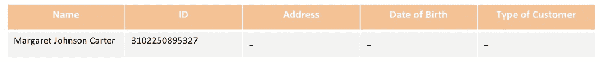
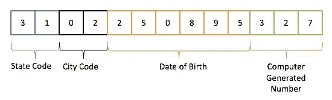
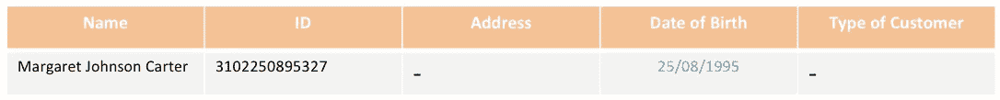
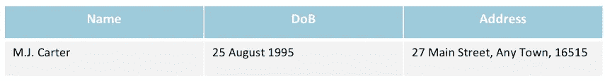
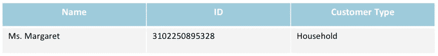
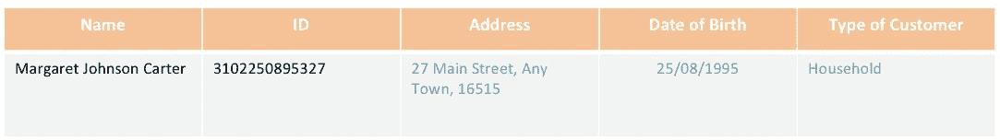

# 用简单的例子理解数据丰富

> 原文：<https://towardsdatascience.com/understanding-data-enrichment-with-simple-example-12ae97bb8f04?source=collection_archive---------18----------------------->

数据丰富在您的数据质量工作中具有特殊的重要性

在主数据管理领域中，有一个低挂的数据质量成果，听起来很简单，但是会将整个 MDM 计划提升到下一个级别。我在这里使用一个*“低挂果实”*术语，因为这个概念非常简单，但可能需要一些时间来实现，这取决于您的组织需求、专业知识等等。在这个机会中，我不打算深入研究进行数据丰富的技术观点，而是试图解释如何实现数据丰富的概念和想法。

在他们关于多领域多维数据模型的非常实用的书中，马克·艾伦和道尔顿·塞尔沃将数据丰富术语阐述为通过补充缺失或不完整的数据来增强现有信息的*过程。*众所周知，许多组织，尤其是大型组织，通常都由独立且分散的信息系统组成，每个信息系统都保存着自己的数据。例如，客户数据可以用不同的格式和完整性级别在不同的应用程序中表示和存储。一个系统存储特定客户的地址信息，而另一个系统出于某种原因只存储他/她的 ID，这种情况并不少见。

照片由[在](https://unsplash.com/@helloquence?utm_source=unsplash&utm_medium=referral&utm_content=creditCopyText) [Unsplash](https://unsplash.com/s/photos/master-data?utm_source=unsplash&utm_medium=referral&utm_content=creditCopyText) 上按顺序拍摄

因此，丰富信息可以通过组合一个数据源和另一个数据源来完成。此外，我们可以通过来自数据本身的信息来丰富数据，如果数据被证明在其中有一些*嵌入的智能*。现在让我们深入这个简单的例子，以便更好地理解。

假设您有一份需要充实的客户数据记录，因为这将是您的黄金数据。该信息表示如下:

原始数据

初始数据只包含姓名和 ID。看看其他数据源，看看我们是否能找到额外的属性来完善我们的黄金数据，这可能很有诱惑力。但是坚持住，不要看得太远，先检查一下你现有的数据是否有一些嵌入式智能。

一些国家的 ID 号中存储了一些数据，我们可以提取这些数据来获取信息。在这个简单的场景中，如果我们看一下我们的虚拟 ID 号，我们可以看到其中包含如下信息…

虚拟编号，仅用于场景目的

瞧啊。在不涉及外部数据的情况下，我们可以仅从客户的 ID 推断出该客户的 DoB

请注意，并非所有类型的标识符号码都具有嵌入式智能。事实上，为了防止欺诈和数据滥用，产生没有存储信息的随机标识符号码现在是一种日益增长的趋势(不久将成为最佳实践)。现在，您的工作是检查您用来识别客户的身份证或任何类型的识别码，并确定是否可以提取任何信息来丰富您的数据。

随着 DoB 问题的解决，现在我们还剩下两个柱需要充实。既然我们已经从现有数据中提取了所有可用的信息，那么现在是时候从其他数据源中寻找了。

假设现在我们有来自系统 A 另一个数据源，它提供如下信息

来自系统 A 的数据

一切看起来都很好，除了一个争论，这个' *M.J .卡特*'是否与我们的' *Margaret Johnson Carter* '相同。

在有时间解决之前，另一个数据源从系统 B 弹出，表示为

来自系统 B 的数据

名字看起来一样，ID 看起来极其一样……*除了最后一个数字……*

虽然您现在已经有了完成黄金数据表的所有必要信息，但您仍然需要头疼地确定这些“M . J Carter”和“Margaret 女士”是否代表与“Margaret Johnson Carter”相同的实体。我想强调的是，这种令人头疼的问题在任何组织中都很常见，因为信息分散在不同的系统中，每个系统都可能属于不同的部门。也有可能是打字错误和其他人为错误，使事情变得更糟。这就是主数据管理工具派上用场的地方(参见我以前的关于 MDM 的文章)

基本上，您需要对所有这些数据进行“匹配”,以确定它们是否代表同一个实体。在进行匹配时，根据相似性比较所有数据属性，并分配最终分数以确定数据是否相同。分数越高，您就越有把握数据代表的是同一个实体。要做到这一点，您可以使用数据匹配工具或发挥您的力量，做一些手动验证。

为了完成我们的场景，假设在做了一些人工验证后，我们现在有足够的信心说这三个名字是同一个人。而现在…

我们完成了数据丰富工作:)

从上面这个非常简单的场景中，我希望你抓住数据丰富工作的概念，并得到一些关于你可以用你的数据做什么的启发。请记住，您不需要手动完成所有这些工作，因为现代 MDM 工具都配备了数据丰富功能。有些可能足够复杂，可以连接到组织外部的数据源，以检索通常在组织内部无法获得的信息。

永远记住，*丰富的数据*包含更强大的信息，因此被滥用的风险更大。数据安全应该始终是我们最关心的问题。

下次见！