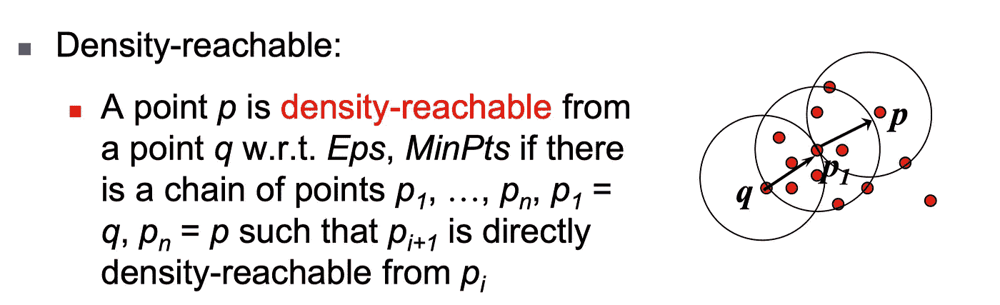
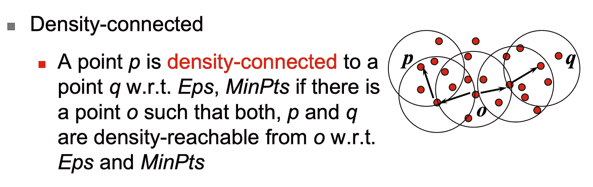
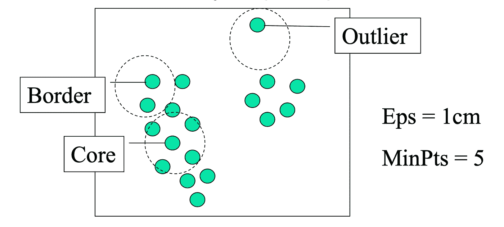
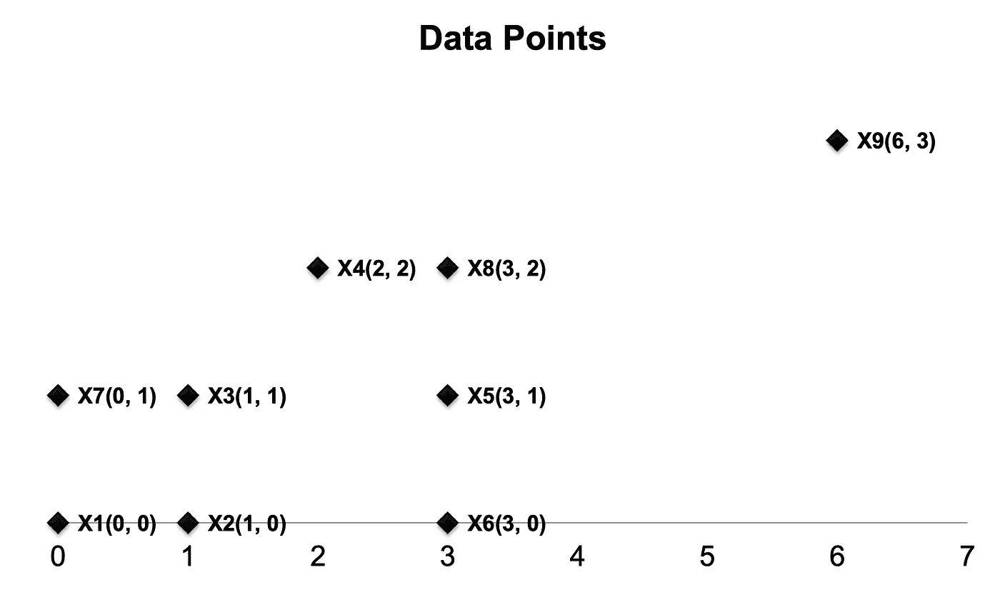

# 从头开始理解 DBSCAN 算法和实现

> 原文：<https://towardsdatascience.com/understanding-dbscan-algorithm-and-implementation-from-scratch-c256289479c5?source=collection_archive---------17----------------------->

## DBSCAN 算法分步，Python 实现，可视化。

# **什么是 DBSCAN**

DBSCAN(带噪声的基于密度的应用空间聚类)是一种常用的无监督聚类算法，于 1996 年提出。与众所周知的 K-mean 不同，DBSCAN 不需要指定聚类数。它可以根据您输入的数据和参数自动检测集群的数量。更重要的是，DBSCAN 可以发现 k-means 不能发现的任意形状的聚类。例如，被不同群集包围的群集。

DBSCAN vs K-means，[信用](https://github.com/NSHipster/DBSCAN)

此外，DBSCAN 可以处理噪声和异常值。所有离群值将被识别和标记，而不被分类到任何聚类中。因此，DBSCAN 也可以用于异常检测(异常值检测)

在我们查看 preusdecode 之前，我们需要先了解一些基本概念和术语。Eps、Minpits、直接密度可达、密度可达、密度连通、核心点和边界点

首先，我们需要为 DBSCAN、Eps 和 MinPts 设置两个参数。

**Eps:小区最大半径**

**MinPts:该点的 Eps 邻域中的最小点数**

并且有**直接密度可达**的概念:一个点 p 是从一个点 q 直接密度可达 w.r.t. Eps，MinPts，如果 NEps (q): {p 属于 D | dist(p，q) ≤ Eps}并且|N Eps (q)| ≥ MinPts。我们来看一个 Minpts = 5，Eps = 1 的例子。让我们看一个例子来理解密度可达和密度连通。

密度可达示例

密度相关示例

最后，如果一个点在 Eps 中有超过指定数量的点(MinPts ),那么这个点就是核心点。这些是在聚类 a 内部的点。并且边界点在 Eps 内具有比 MinPts 少的点，但是在核心点的邻域内。我们还可以定义离群点(噪声点)，即既不是核心点也不是边界点的点。

核心点、边界点、异常点示例

**现在，我们来看看 DBSCAN 算法实际上是如何工作的。这是前解码。**

1.  任意选择一个点 p
2.  基于 Eps 和 MinPts 检索从 p 密度可达的所有点
3.  如果 p 是一个核心点，就形成了一个集群
4.  如果 p 是一个边界点，则没有从 p 密度可达的点，DBSCAN 访问数据库的下一个点
5.  继续该过程，直到处理完所有点

*如果使用空间索引，DBSCAN 的计算复杂度为 O(nlogn)，其中 n 是数据库对象的数量。否则，复杂度为 O(n )*

# 例子

考虑以下 9 个二维数据点:

x1(0，0)，x2(1，0)，x3(1，1)，x4(2，2)，x5(3，1)，x6(3，0)，x7(0，1)，x8(3，2)，x9(6，3)

使用欧几里德距离，Eps =1，MinPts = 3。找到所有的核心点、边界点和噪声点，并使用 DBCSAN 算法显示最终的聚类。让我们一步步展示结果。

数据可视化示例

**首先，计算 N(p)，Eps-点 p 的邻域**

N(x1) = {x1，x2，x7}

N(x2) = {x2，x1，x3}

N(x3) = {x3，x2，x7}

N(x4) = {x4，x8}

N(x5) = {x5，x6，x8}

N(x6) = {x6，x5}

N(x7) = {x7，x1，x3}

N(x8) = {x8，x4，x5}

N(x9) = {x9}

如果 N(p)的大小至少为 MinPts，则称 p 为核心点。这里给定的 MinPts 是 3，因此 N(p)的大小至少是 3。**因此核心点是:{x1，x2，x3，x5，x7，x8}**

然后根据边界点的定义:给定一个点 p，若 p 不是核心点但 N(p)包含至少一个核心点，则称 p 为边界点。N(x4) = {x4，x8}，N(x6) = {x6，x5}。这里 x8 和 x5 是核心点，所以 **x4 和 x6 都是边界点**。显然，左边的点， **x9 是一个噪声点。**

**现在，让我们按照 preusdecode 生成集群。**

1.  任意选择一个点 p，现在我们选择 x1
2.  检索从 x1: {x2，x3，x7}密度可达的所有点
3.  这里 x1 是一个核心点，形成一个集群。因此，我们有 Cluster_1: {x1，x2，x3，x7}
4.  接下来，我们选择 x5，检索从 x5 密度可达的所有点:{x8，x4，x6}
5.  这里 x5 是一个核心点，形成一个集群。因此，我们有了 Cluster_2: {x5，x4，x8，x6}
6.  接下来，我们选择 x9，x9 是一个噪声点，噪声点不属于任何聚类。
7.  因此，算法到此为止。

最终 DBSCAN 集群结果

# Python 实现

下面是一些示例代码，用于从头开始构建 FP-tree，并在 Python 3 中找到所有的频率项集。我还添加了点的可视化，并用蓝色标记所有异常值。

**感谢您的阅读，我期待听到您的问题和想法。如果你想了解更多关于数据科学和云计算的知识，可以在**[**Linkedin**](https://www.linkedin.com/in/andrewngai9255/)**上找我。**

照片由 [Alfons Morales](https://unsplash.com/@alfonsmc10?utm_source=medium&utm_medium=referral) 在 [Unsplash](https://unsplash.com?utm_source=medium&utm_medium=referral) 拍摄

*参考*

*https://github.com/NSHipster/DBSCAN*

*https://en.wikipedia.org/wiki/DBSCAN*