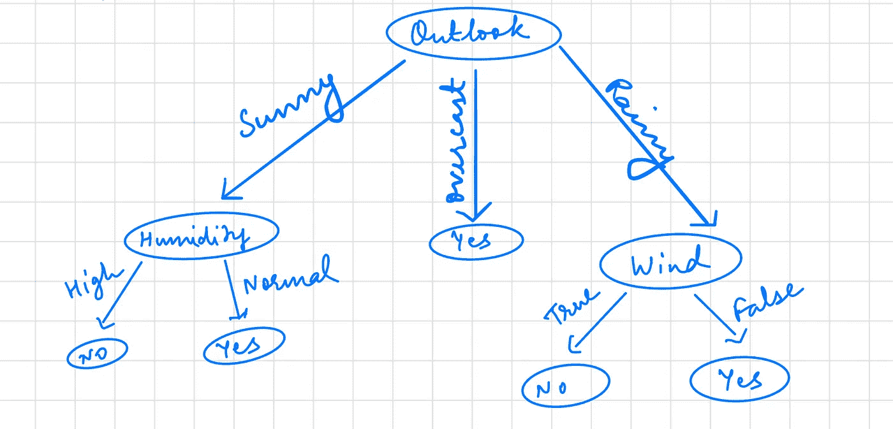

# 理解决策树分类器

> 原文：<https://towardsdatascience.com/understanding-decision-tree-classifier-7366224e033b?source=collection_archive---------17----------------------->

## 概念上以使用 ID3 算法为例

凯文·Ku 在 [Unsplash](https://unsplash.com/s/photos/machine-learning?utm_source=unsplash&utm_medium=referral&utm_content=creditCopyText) 上的照片

在这篇文章中，我们将从概念上讨论决策树分类器的工作原理，这样它以后就可以应用到现实世界的数据集中。

[分类](/basics-of-supervised-learning-classification-d26c00d80100)可以定义为学习一个目标函数 ***f*** 的任务，该目标函数将每个[属性](/journey-into-data-mining-3b5ccfa5343)集合 ***x*** 映射到一个预定义的[标签](/journey-into-data-mining-3b5ccfa5343) ***y*** *。*

**例子:**

*   将一条新闻分配给一个预定义的类别。
*   根据邮件标题和内容检测垃圾邮件
*   基于 MRI 扫描的结果将细胞分类为恶性或良性
*   根据形状对星系进行分类

作为数据科学家或机器学习工程师，在处理真实世界数据集时，决策树可能是一个强大的工具。当您构建随机森林分类器时，也可以串联使用决策树，该分类器是多个决策树共同工作的顶点，根据多数投票对记录进行分类。

一个[决策树](https://medium.com/swlh/machine-learning-decision-tree-implementation-849df3ce36d2)是通过对我们得到的数据集的一个[记录](/journey-into-data-mining-3b5ccfa5343)提出一系列问题来构建的。每次收到一个答案，都会询问后续问题，直到对记录的类别标签得出结论。这一系列问题及其可能的答案可以以决策树的形式组织起来，这是一种由节点和有向边组成的层次结构。树有三种类型的节点:

*   **根节点**，没有输入边，有零个或多个输出边。
*   **内部节点**，每个节点都有一条输入边和两条或多条输出边。
*   **叶节点或终端节点**，每个节点只有一条输入边，没有输出边。

在决策树中，每个**叶节点**被分配一个**类标签**。包括根节点和其他内部节点在内的非终端节点包含属性测试条件，用于分隔具有不同特征的记录。

在深入研究数据集的数学之前，让我们根据给定的数据集直观地构建一个决策树。

作者的样本数据集|图像

当我们检查这个数据集时，我们看到:

1.  属性**房屋所有者**本质上是二元的，仅由*是* & *否*组成
2.  属性**婚姻状况**本质上是分类的，包括*单身、已婚&离婚*
3.  属性**年收入**本质上是连续的，由数值组成
4.  属性**默认借款人**本质上是二元的，仅由*是* & *否*组成，是我们的**目标属性或类标签**

给定这个数据集，为了直观地构建决策树，我们从目标属性**默认借款人**开始

*   初始树包含一个节点，其类别标签为**默认借款人=否**
*   树需要细化，因为这个根节点包含来自两个类的记录
*   记录随后根据**房屋所有者**条件的结果进行划分
*   这是递归完成的
*   从上面的数据集中，所有拥有房屋的借款人(房屋所有人=是)都成功偿还了贷款。然后，根节点的左子节点因此被标记为**默认借款人=否**
*   对于正确的孩子，我们需要应用递归步骤，直到所有记录都属于同一个类

上述步骤可能在一次阅读中就能消化，我鼓励你再读一遍，看看下面的图，以了解这些步骤是如何进行的。

使用直觉构建决策树|作者图片

## 决策树归纳的设计问题

上面的树归纳附带了几个在构建决策树时需要注意的问题。

**→培训记录应该如何拆分？**

对于树生长过程的每个递归步骤，必须选择一个属性测试条件，以进一步将记录划分为更小的子集。

**→分割程序应该如何停止？**

继续展开节点，直到所有记录都属于同一个类，或者所有记录都具有相同的属性值。

## **表示属性测试条件的方法**

决策树归纳算法必须提供一种方法来表达属性测试条件及其对不同属性类型的相应结果。

*   **二元属性:**两种可能的结果。

二元属性分割|按作者分类的图像

*   **名义属性:** a)多路拆分
    b)二进制拆分

多向属性拆分(左)和二进制属性拆分(右)|作者图片

*   **序数属性:** a)多路拆分
    b)二进制拆分

序数属性按作者拆分|图像

> 注意:只要分组不违反属性值的顺序属性，属性值就可以分组在一起。

*   **连续属性:**测试条件可以表示为具有二元结果的比较测试(A < v)或(A≥v ),或具有 v(i) ≤ A ≤ v(i+1)形式的结果的范围，其中 i = 1，2，3… k
    a)对于二元情况，算法必须考虑所有可能的分割位置 v，并选择产生最佳分割的位置。
    b)对于多路分割，算法必须考虑所有可能的连续值范围。

连续属性分割|按作者分类的图像

# 选择最佳分割的方法

为选择最佳分裂而开发的度量通常基于子节点的不纯程度。杂质越小，阶级分布越不均匀。

**示例:**具有类分布(0，1)的节点具有零杂质，而具有均匀类分布(0.5，0.5)的节点具有最高杂质。

## 杂质测量

杂质测量|作者图片

在哪里，

D =训练集，其中 v 属于 D 并且是树节点，

L = {y1，y2，…，yk}标签/类别集

让我们用一些例子来理解上面的杂质测量:

行动中的杂质测量|作者图片

杂质测量比较|作者图片

→为了确定一个测试条件执行得有多好，我们需要比较父节点(分裂前)和子节点(分裂后)的不纯程度。差异越大，测试条件越好。**增益**是一个可用于确定分割质量的标准。

对于将属于 A 的属性 A 的值分割成子节点(v，A)的节点 v，分割的增益为:

信息增益|作者图片

> 注:Inf 增益是信息增益

# 增益比

熵和基尼指数等杂质度量往往倾向于具有大量不同值的属性。有两种策略可以克服这个问题。第一个策略是将测试条件限制为仅二进制分割。这种策略被诸如 CART 之类的决策树算法所采用。另一个策略是修改分割标准，以考虑由属性测试条件产生的结果的数量。例如，在 C4.5 决策树算法中，称为增益比的分割标准用于确定分割的好坏。该标准定义如下:

增益比|作者图片

在哪里，

增益比的组成部分|作者图片

作者对上图中求和条件的解释

# ID3 算法

ID3 算法伪代码|图片作者

让我们用一个样本数据集来理解这个算法。我们将使用的衡量标准是**信息增益**来构建我们的决策树。

样本数据集|源 Tan 的数据挖掘

我没有输入长的方程式，而是用图片来解释我使用的所有快捷键。

目标属性的熵|按作者分类的图像

在上图中 **Y =是，N =否**

游戏信息增益，Windy |作者图片

在上面的图片中，W = T 和 W = F 是真和假，属性 Windy 的值

游戏、展望|作者图片的信息增益

游戏、展望|作者图片的信息增益

在上图中，O = S，O = O，O = R 是属性 Outlook 的晴天、阴天和雨天的值

游戏信息增益，温度|作者图片

在上图中，温度。= Temperature 和 T=H，T=M，T=C 是属性 Temperature 的高温、低温和低温值

玩耍的信息增益，湿度|作者图片

在上图中，H=H，H=N 是湿度属性的高值和正常值

> 因为 outlook 的收益最高，所以 Outlook 是我们的根节点。

现在，用 Outlook = Sunny 计算第一个子节点

展望的信息增益=晴朗，温度|作者图片

展望的信息增益=晴天，湿度|作者图片

Outlook 的信息增益=晴朗、多风|作者图片

既然，Outlook 的信息增益=晴天，湿度最高，它就成为我们的第一个子节点。

对于根节点为 Outlook 的第二个子节点，我们考虑配对 Outlook =阴，并发现当 Outlook =阴时，Play = Yes，则直接导致 Yes 的叶节点

对于 Outlook 位于根节点的第三个子节点，我们考虑配对 Outlook = Rainy

展望的信息增益=雨天、气温|作者图片

展望的信息增益=雨天、气温|作者图片

Outlook 的信息增益=雨天、湿度|作者图片

Outlook 的信息增益=下雨、刮风|作者图片

因为 Outlook = Rainy，Windy 的信息增益最高，所以它成为我们的第三个子节点。

继续向下，深入到第一个子节点，其中 Outlook = Sunny 和湿度，我们观察到湿度的分割是纯的，因此我们不需要计算信息增益并直接放置叶节点。

同样的情况发生在 Outlook = Rainy 和 Windy 上，我们观察到 Windy 上的分裂是纯的。

意思是

*   当前景=晴朗且湿度=高时，目标属性 Play = No
*   当前景=晴朗，湿度=正常时，目标属性 Play = Yes
*   当 Outlook = Rainy and Windy = True 时，目标属性 Play = No
*   当 Outlook = Rainy and Windy = False 时，目标属性 Play = Yes

最终的决策树如下所示:

最终决策树|作者图片

我将免费赠送一本关于一致性的电子书。在这里获得你的免费电子书。

感谢您的阅读。这篇文章到此结束。我希望我能够使决策树的主题更容易理解。这只是决策树领域中使用的一个非常基本的算法。还有更多的算法，我建议读者在理解 ID3 算法后看一看，因为这是所有算法的基础，也是理解其余算法所需要的。

此外，我已经写了一篇[的帖子](https://medium.com/swlh/machine-learning-decision-tree-implementation-849df3ce36d2)，使用 Python3 和 XML 从零开始实现上述决策树，而没有使用任何机器学习库。

 [## 机器学习决策树实现

### 使用 Python 和 XML 的 ID3 算法

medium.com](https://medium.com/swlh/machine-learning-decision-tree-implementation-849df3ce36d2) 

如果你喜欢阅读这样的故事，并想支持我成为一名作家，可以考虑[注册成为一名媒体成员](https://tarun-gupta.medium.com/membership)。每月 5 美元，你可以无限制地阅读媒体上的故事。如果你注册使用我的链接，我会赚一小笔佣金，不需要你额外付费。

 [## 加入我的推荐链接-塔伦古普塔

### 作为一个媒体会员，你的会员费的一部分会给你阅读的作家，你可以完全接触到每一个故事…

tarun-gupta.medium.com](https://tarun-gupta.medium.com/membership) 

这是我的故事索引:

 [## 标记故事列表的快速链接—感谢您的访问

### 我也有一份以快节奏出版为目标的出版物。读书成为作家。

tarun-gupta.medium.com](https://tarun-gupta.medium.com/thank-you-for-visiting-my-profile-9f708062c75e)