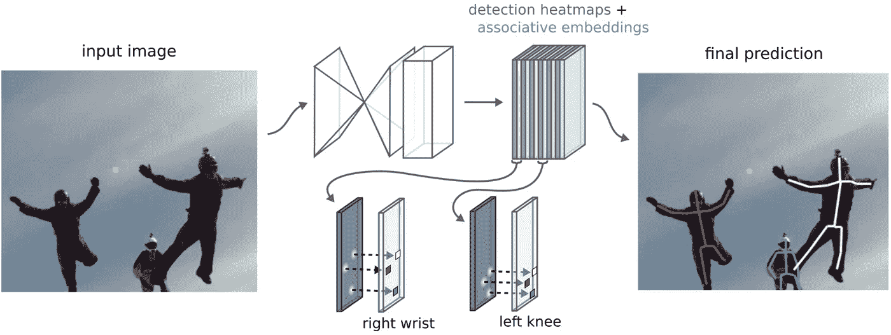
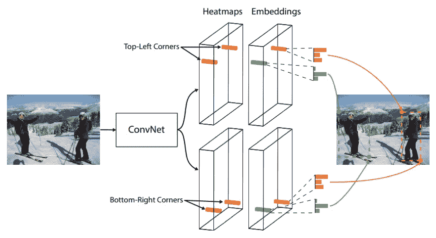
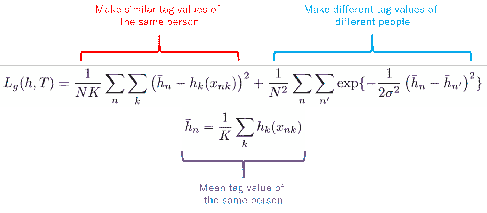
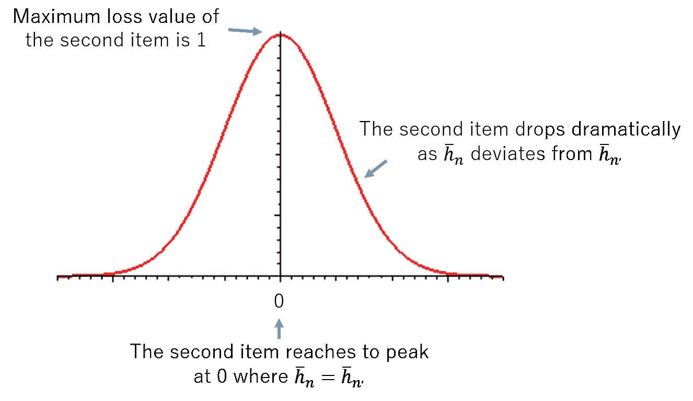
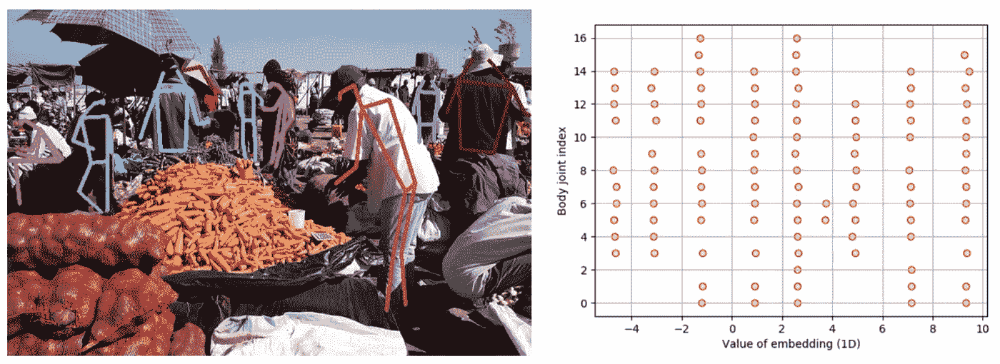

# 理解卷积神经网络中的深度关联嵌入

> 原文：<https://towardsdatascience.com/understanding-deep-associative-embedding-in-convolutional-neural-networks-5a57685ee856?source=collection_archive---------79----------------------->

## 一种无需标记即可对预测进行分组的优雅方法

Alex Alvarez 在 [Unsplash](https://unsplash.com?utm_source=medium&utm_medium=referral) 上的照片

在计算机视觉和深度学习的一些任务中，我们需要先预测所有的结果，然后将结果拆分成几个单独的结果。

在这种精神下，一个常见的任务是多人的姿势估计，其中首先预测图像中所有人的关键点，然后将其分割成单个姿势作为最终预测(图 1)。

图 1:多人的姿势估计

本着这种精神的另一个任务是通过检测和分组对象的成对关键点来形成边界框的对象检测，与 R-CNN 系列作品[Ren 等人]相比，这是形成边界框的相对较新的方法。在他们的新方法[Law 等人]中，每个对象的边界框由两个关键点表示(左上角和右下角)。在推断过程中，首先预测图像中所有对象的关键点，然后分裂成单独的关键点对以获得最终预测(图 2)。

图 2:用于物体检测的角网[Law 等人]

以上两项工作都需要将所有预测的关键点拆分到单独的组中。为了实现在神经网络中作为副作用，分裂和分组算法应该同时满足两个方面:1)属于同一对象的关键点应该被正确地分配到同一组；2)哪一个关键点属于哪一个群体应该是内在理解的，不需要额外的标注工作。

联想嵌入[Newell et al.]正是实现上述讨论的一个很好的选择。

## 联想嵌入

让我们以多人姿势估计为例。为了将所有预测的关键点分组到每个个体，标签也与每个关键点一起被预测，并且预测的标签应该满足两个方面:1)同一个人的标签应该尽可能相等；2)不同人的标签应该容易区分。根据这些方面，Newell 等人提出了以下损失函数来训练标签值(等式。1).

Equ。1:用于学习关联嵌入的标签值的损失函数

在损失函数中，为 N 个人中的每一个预测 K 个关键点和 K 个标签值，从而总共预测 NK 个关键点和 NK 个标签值。

第一项(红色)通过惩罚预测标签值与其平均值的偏差，使同一个人的标签值相似。第二项(蓝色)通过惩罚一个高斯函数使不同人的标签值不同，该高斯函数的峰值在两个不同人的平均标签值相遇的位置，随着两个平均值彼此偏离，损失急剧下降(图 3)。

图 3:等式的第二项的解释。一

**有了这个损失函数，每个人的标签值可以自动学习，无需额外标记。**因此，联想嵌入快速、轻便，易于嵌入到现有的深度学习架构中。

## 预测标签值的结果

图 4:用于多人姿势估计的关联嵌入

如图 4 所示，右边部分是预测的标签值，左边部分是相应的姿态估计。右边部分，y 轴是人体关键点的索引，x 轴是标签的值。红色圆圈代表检测到的关键点的标签值。由于部分人的身体部位被遮挡，检测到的关键点数量因人而异。我们可以很容易地看到，不同人的标签值聚集在不同的垂直线中，这很容易单独分组。

因此，关联嵌入可以以精确和轻量的方式将预测结果分组到个体级别。此外，通过简单地添加损失函数，作为机器学习中的常见实践，关联嵌入不仅可以用于计算机视觉任务，还可以作为更广泛的机器学习领域中的其他任务的强大成分。

**参考文献**

更快的 R-CNN:使用区域建议网络实现实时对象检测，任等，NIPS 2015

关联嵌入:用于联合检测和分组的端到端学习，Newell 等人，NIPS 2017

CornerNet:将对象检测为成对的关键点，Law 等人，ECCV 2018 年

 [## 加入我的介绍链接-陈数杜媒体

### 阅读陈数·杜(以及媒体上成千上万的其他作家)的每一个故事。您的会员费直接支持…

dushuchen.medium.com](https://dushuchen.medium.com/membership)