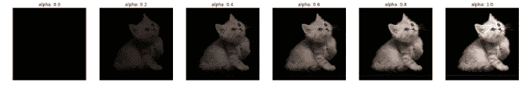
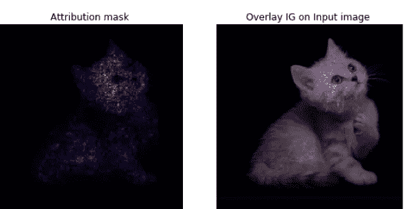
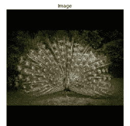
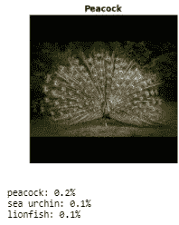
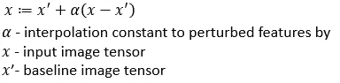
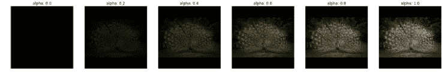
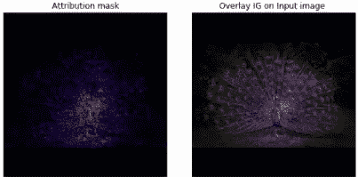

# 理解具有集成梯度的深度学习模型

> 原文：<https://towardsdatascience.com/understanding-deep-learning-models-with-integrated-gradients-24ddce643dbf?source=collection_archive---------7----------------------->

## 理解并实现各种深度学习网络的集成梯度技术，以解释模型的预测

***本帖将帮助你理解积分梯度的两个基本公理，以及如何使用迁移学习模型使用 TensorFlow 实现积分梯度。***

*什么是积分渐变？*

> 集成梯度(IG)是用于深度神经网络的可解释性或可解释性技术，其可视化了有助于模型预测的输入特征重要性

*IG 可以只应用于深度学习的特定用例，还是只应用于特定的神经网络架构？*

集成梯度(IG)计算模型预测输出到其输入特征和**的梯度，不需要对原始深度神经网络进行修改。**

**IG 可以应用于任何可区分的模型，如图像、文本或结构化数据。**

IG 可用于

*   **通过从网络中提取规则来理解特征重要性**
*   **调试深度学习模型性能**
*   **通过理解对预测有贡献的重要特征来识别数据偏差**

*积分渐变是如何工作的？*

***解释 IG 使用深度学习模型进行图像分类***

**积分梯度建立在两个需要满足的公理之上:**

1.  **灵敏度和**
2.  **实现不变性**

## 灵敏度:

为了计算灵敏度，我们建立一个基线图像作为起点。然后，我们构建一系列图像，从基线图像插值到实际图像，以计算综合梯度。

## 实现不变性

当两个功能等效的网络对于相同的输入图像和基线图像具有相同的属性时，实现不变性被满足。

当两个网络的输出对所有输入都相等时，尽管它们的实现非常不同，但它们在功能上是等效的。

# 计算和可视化集成梯度(IG)

**步骤 1:** 从基线开始，基线可以是像素值全为零的黑色图像或全白图像，也可以是随机图像。基线输入是一种中性的预测，是任何解释方法和可视化像素要素重要性的核心。

**第二步:**生成基线和原始图像之间的线性插值。插值图像是基线和输入图像之间的特征空间中的小步长(α),并且随着每个插值图像的强度不断增加。



**步骤 3:计算梯度以测量特征变化和模型预测变化之间的关系。**

梯度告知哪个像素对模型预测的类别概率具有最强的影响。

改变变量会改变输出，并且变量将获得一些属性来帮助计算输入图像的特征重要性。不影响输出的变量没有属性。

**第四步:通过平均梯度计算数值近似值**

**步骤 5:将 IG 缩放到输入图像**以确保在多个插值图像上累积的属性值都是相同的单位。用像素重要性表示输入图像上的 IG。



*如何使用 Tensorflow 实现积分渐变？*

**导入所需的库**

```
**import matplotlib.pylab as plt
import numpy as np
import tensorflow as tf
import tensorflow_hub as hub
from tensorflow.keras.applications.mobilenet_v2 import preprocess_input as mobilenet_v2_preprocess_input**
```

**使用 MobileNetV2 作为 Imagenet 数据集上的传输学习模型**

```
**model = tf.keras.applications.MobileNetV2(input_shape=(224,224,3),                                               include_top=True,                                               weights='imagenet')**
```

**加载 Imagenet 标签**

```
**def load_imagenet_labels(file_path):
  labels_file = tf.keras.utils.get_file('ImageNetLabels.txt', file_path)
  with open(labels_file) as reader:
    f = reader.read()
    labels = f.splitlines()
  return np.array(labels)
imagenet_labels = load_imagenet_labels('**[**https://storage.googleapis.com/download.tensorflow.org/data/ImageNetLabels.txt'**](https://storage.googleapis.com/download.tensorflow.org/data/ImageNetLabels.txt')**)**
```

**加载并预处理图像**

```
**def read_image(file_name):
  image = tf.io.read_file(file_name)
  image = tf.image.decode_jpeg(image, channels=3)
  image = tf.image.convert_image_dtype(image, tf.float32)  
  image = tf.image.resize_with_pad(image, target_height=224, target_width=224)
  return image****img = {'Peacock':'Peacock.jpg'}****img_name_tensors = {name: read_image(img_path) for (name, img_path) in img.items()}**
```

**显示原始输入图像**

```
**plt.figure(figsize=(5, 5))
ax = plt.subplot(1, 1, 1)
ax.imshow(img_name_tensors['Peacock'])
ax.set_title("Image")
ax.axis('off')
plt.tight_layout()**
```



**预测输入图像模型的前三个预测值**

```
**def top_k_predictions(img, k=3):
  image = tf.expand_dims(img, 0)
  predictions = model(image)
  probs = tf.nn.softmax(predictions, axis=-1)
  top_probs, top_idxs = tf.math.top_k(input=probs, k=k)
  top_labels = np.array(tuple(top_idxs[0]) )
  return top_labels, top_probs[0]**#Display the image with top 3 prediction from the model
**plt.imshow(img_name_tensors['Peacock'])
plt.title(name, fontweight='bold')
plt.axis('off')
plt.show()****pred_label, pred_prob = top_k_predictions(img_name_tensors['Peacock'])
for label, prob in zip(pred_label, pred_prob):
    print(f'{imagenet_labels[label+1]}: {prob:0.1%}')**
```



**创建一个黑色基线图像，作为计算特征重要性的起点**

```
**baseline = tf.zeros(shape=(224,224,3))**
```

**生成基线和原始输入图像之间的线性插值**



图像插值

```
**m_steps=50
alphas = tf.linspace(start=0.0, stop=1.0, num=m_steps+1)** **def interpolate_images(baseline,
                       image,
                       alphas):
  alphas_x = alphas[:, tf.newaxis, tf.newaxis, tf.newaxis]
  baseline_x = tf.expand_dims(baseline, axis=0)
  input_x = tf.expand_dims(image, axis=0)
  delta = input_x - baseline_x
  images = baseline_x +  alphas_x * delta
  return images****interpolated_images = interpolate_images(
    baseline=baseline,
    image=img_name_tensors['Peacock'],
    alphas=alphas)**
```

**可视化插值图像**

```
**fig = plt.figure(figsize=(20, 20))****i = 0
for alpha, image in zip(alphas[0::10], interpolated_images[0::10]):
  i += 1
  plt.subplot(1, len(alphas[0::10]), i)
  plt.title(f'alpha: {alpha:.1f}')
  plt.imshow(image)
  plt.axis('off')****plt.tight_layout();**
```



插值图像

**计算模型输出和插值输入之间的梯度**

计算梯度**测量特征变化和模型预测变化之间的关系。**我们用 ***tf。GradientTape*** 计算插值图像与顶部预测类 Id 之间的梯度，顶部预测类 Id 指示哪些像素对模型预测的影响最大

```
**def compute_gradients(images, target_class_idx):
  with tf.GradientTape() as tape:
    tape.watch(images)
    logits = model(images)
    probs = tf.nn.softmax(logits, axis=-1)[:, target_class_idx]
  return tape.gradient(probs, images)****path_gradients = compute_gradients(
    images=interpolated_images,
    target_class_idx=84)**
```

**使用黎曼梯形累积梯度**

```
**def integral_approximation(gradients):**
  # riemann_trapezoidal
  **grads = (gradients[:-1] + gradients[1:]) / tf.constant(2.0)
  integrated_gradients = tf.math.reduce_mean(grads, axis=0)
  return integrated_gradients**
```

将所有步骤放入一个函数中以计算积分梯度

```
[**@tf**](http://twitter.com/tf)**.function
def integrated_gradients(baseline,
                         image,
                         target_class_idx,
                         m_steps=50,
                         batch_size=1):**
  # 1\. Generate alphas.
 ** alphas = tf.linspace(start=0.0, stop=1.0, num=m_steps+1)**# Initialize TensorArray outside loop to collect gradients.    
 ** gradient_batches = tf.TensorArray(tf.float32, size=m_steps+1)**

  # Iterate alphas range and batch computation for speed, memory #efficiency, and scaling to larger m_steps.
  **for alpha in tf.range(0, len(alphas), batch_size):
    from_ = alpha
    to = tf.minimum(from_ + batch_size, len(alphas))
    alpha_batch = alphas[from_:to]**# 2\. Generate interpolated inputs between baseline and input.
  **  interpolated_path_input_batch = interpolate_images(baseline=baseline,                                                       image=image,                                                       alphas=alpha_batch)**# 3\. Compute gradients between model outputs and interpolated inputs.
    **gradient_batch = compute_gradients(images=interpolated_path_input_batch,                                       target_class_idx=target_class_idx)**

    # Write batch indices and gradients to extend TensorArray.
    **gradient_batches = gradient_batches.scatter(tf.range(from_, to), gradient_batch)  **  

  # Stack path gradients together row-wise into single tensor.
 ** total_gradients = gradient_batches.stack()**# 4\. Integral approximation through averaging gradients.
 **avg_gradients = integral_approximation(gradients=total_gradients)**# 5\. Scale integrated gradients with respect to input.
  **integrated_gradients = (image - baseline) * avg_gradients****return integrated_gradients****ig_attributions = integrated_gradients(baseline=baseline,                                       image=img_name_tensors['Peacock'],                                       target_class_idx=84,                                       m_steps=283)**
```

**可视化属性和综合梯度以解释对输入图像的预测**

```
**def plot_img_IG(baseline,
                          image,
                          target_class_idx,
                          m_steps=50,
                          cmap=None,
                          overlay_alpha=0.4):** **attributions = integrated_gradients(baseline=baseline,                                          image=image,                                      target_class_idx=target_class_idx,                                      m_steps=m_steps)** **attribution_mask = tf.reduce_sum(tf.math.abs(attributions), axis=-1)** **fig, axs = plt.subplots(nrows=1, ncols=2, squeeze=False, figsize=   (8, 8))
  axs[0, 0].set_title('Attribution mask')
  axs[0, 0].imshow(attribution_mask, cmap=cmap)
  axs[0, 0].axis('off')** **axs[0, 1].set_title('Overlay IG on Input image ')
  axs[0, 1].imshow(attribution_mask, cmap=cmap)
  axs[0, 1].imshow(image, alpha=overlay_alpha)
  axs[0, 1].axis('off')** **plt.tight_layout()
  return fig****_ = plot_img_IG(image=img_name_tensors['Peacock'],
                          baseline=baseline,
                          target_class_idx=84,
                          m_steps=240,
                          cmap=plt.cm.inferno,
                          overlay_alpha=0.4)**
```



## 结论:

集成梯度(IG)通过突出特征重要性来帮助你解释深度学习模型看什么来进行预测。这是通过计算模型的预测输出到其输入要素的梯度来实现的。它不需要对原始的深度神经网络进行任何修改，可以应用于图像、文本以及结构化数据。IG 基于敏感性和实现不变性两个公理。

## 参考资料:

[深度网络的公理属性](https://arxiv.org/pdf/1703.01365.pdf)

[](https://www.tensorflow.org/tutorials/interpretability/integrated_gradients) [## 集成梯度|张量流核心

### 本教程演示了如何实现综合梯度(IG)，一个可解释的人工智能技术介绍了…

www.tensorflow.org](https://www.tensorflow.org/tutorials/interpretability/integrated_gradients) 

[http://theory y . Stanford . edu/~ ataly/Talks/Sri _ attribution _ talk _ jun _ 2017 . pdf](http://theoryy.stanford.edu/~ataly/Talks/sri_attribution_talk_jun_2017.pdf)