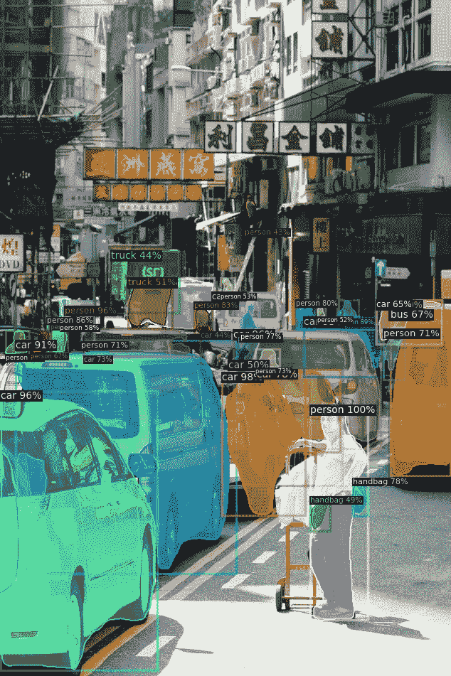
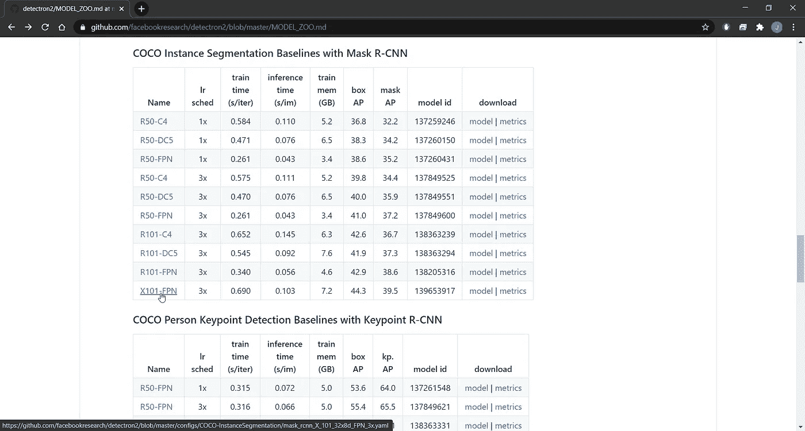
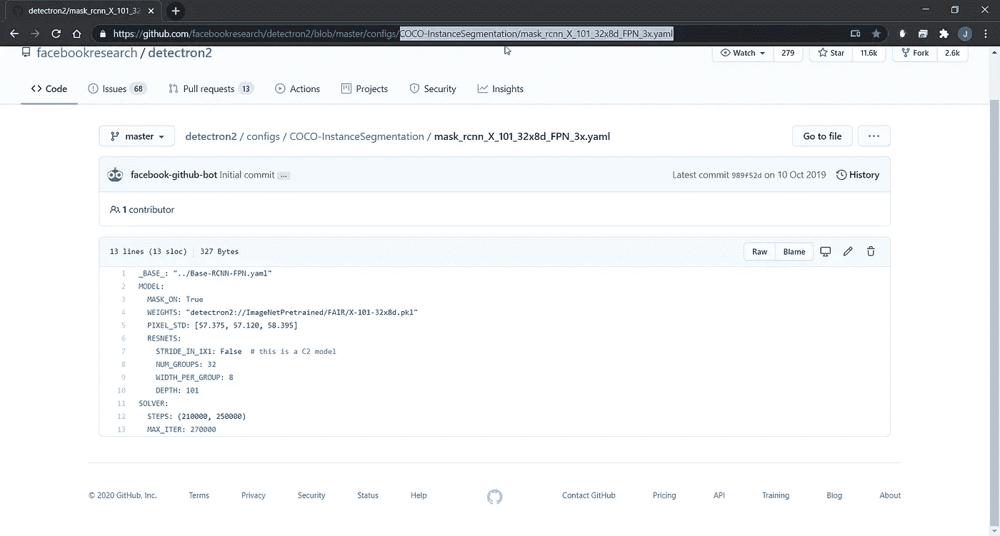
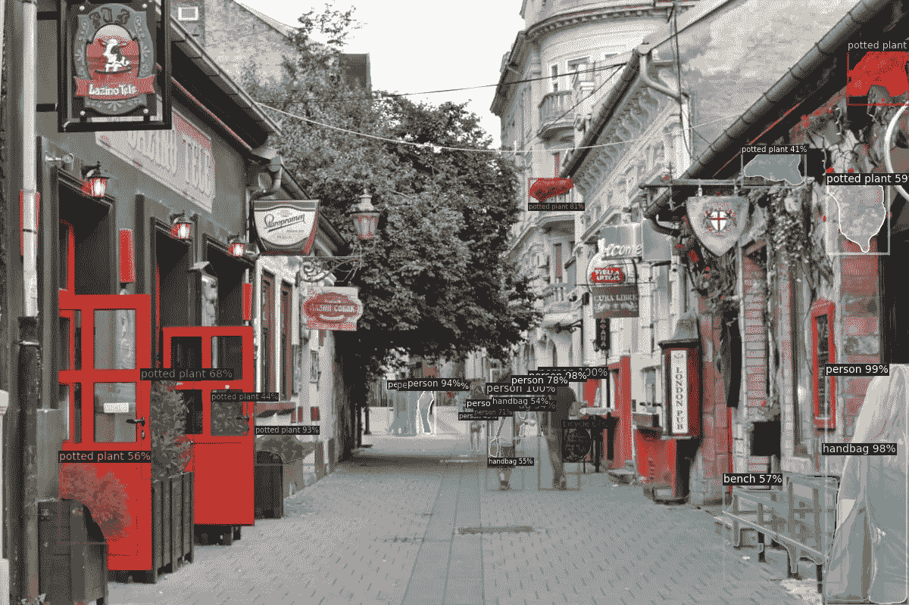

# 了解检测器 2 演示

> 原文：<https://towardsdatascience.com/understanding-detectron2-demo-bc648ea569e5?source=collection_archive---------8----------------------->

## 了解脸书人工智能研究图书馆，了解最先进的神经网络

使用检测器 2 ( [源](https://unsplash.com/photos/KTF-gr3uWvs))进行实例分割

# **简介**

Detectron2 ( [官方库 Github](https://github.com/facebookresearch/detectron2) )是“FAIR 的下一代物体检测和分割平台”。FAIR(脸书人工智能研究所)创建了这个框架，以提供 CUDA 和 PyTorch 实现最先进的神经网络架构。它们还为对象检测、实例分割、人物关键点检测和其他用途提供预训练模型。

Detectron2 的重要但经常被忽略的特性是它的许可方案:库本身是在 Apache 2.0 许可下发布的，预训练模型是在 CC BY-SA 3.0 许可下发布的。这意味着你可以修改现有的代码，将其用于私人、科学甚至商业目的。你所需要做的就是给 FAIR 提供适当的信用。这在科学界很少见，科学界经常使用许可证来强制代码源发布和非商业使用。这非常有限，但幸运的是，对于 Detectron2 来说，情况并非如此。

然而，问题是，研究人员编写的代码通常不遵循干净的代码指南。对于 Detectron2 来说，与替代方案相比，它还不错，但是代码结构肯定很复杂，需要花很大力气才能理解。然而，要使用这个库的强大功能，确实需要了解它。在这篇文章中(希望还有后面的文章),我的目标是阐明 API、代码结构以及如何修改它并在你的项目中使用它。

下面的代码假设你已经安装好了所有的东西，并且正在运行。特别是，你需要一个 Linux 系统(Windows 可能工作，但不被官方支持)，支持 CUDA 的 GPU(安装了 CUDA)，PyTorch >= 1.4 和适当的 Detectron2 版本。鉴于运行这些神经网络所需的计算能力，该库目前不支持 CPU 计算，并且可能会继续支持。如果你们中的许多人在这方面遇到了问题，请在评论中告诉我，我会写另一篇关于所有适当工具的设置的文章。

# **基本设置**

我们将通过修改的 Google Colab 演示使用 COCO 数据集类进行实例分割。目标是创建易于理解的代码框架，完美地用于未来基于 Detectron2 的项目。让我们从获取命令行参数开始:

作为技术细节，我们将编写 Python 3.5 中引入的 Python 类型注释。它们并不强制变量类型，而是旨在帮助程序员(以及 ide，它们提供了更好的注释帮助)更好地理解代码。这样也更容易知道在 Detectron2 文档和源代码中的何处寻找关于模型行为的线索。

这里发生了一些重要的事情。首先，我们导入了`argparse`模块，以便于参数解析。我们的演示可能需要 2 个参数:在 Detectron2 中使用的基本模型和一个或多个要处理的图像的列表。为解析和获取参数定义单独的函数是在`demo.py`(官方 Detectron2 演示文件)和其他建立在它之上的项目(如 Centermask2)中是如何完成的。总的来说，这也是一个很好的代码实践。名称空间类型的行为类似于 Python 字典，但是对值的访问类似于对类中属性的访问，例如`args.base_model`。如果没有提供参数，也没有设置 default，那么它将是适合该参数的空类型，通常是 None(或者是空列表，用于任意数量的选项，如上面的`images`)。

重要的部分是基础模型的默认值。它将用于告诉检测器 2 应该使用模型动物园中的哪个预训练模型(基线)。模型动物园是一组由 FAIR 预先训练的模型，可以通过库 API 轻松下载。整个名单可以在[这里](https://github.com/facebookresearch/detectron2/blob/master/MODEL_ZOO.md)找到。表格包含关于不同模型的各种统计数据，这些统计数据按照精度度量进行升序排序(比如用于实例分段的方框 AP)。根据你的需要，速度或准确性可能更重要；还要注意，这是平均 AP，在特殊情况下，平均分数较低的模型(最有可能是不太敏感的模型)可能工作得更好。我根据我的个人经验选择了默认值——X101-FPN 往往会给出太多的误报，而且在实践中它比 R101-FPN 慢 1.5-2 倍。为了获得标识您感兴趣的任何型号的字符串，请按照下面显示的步骤操作。

选择您想要使用的模型

突出显示的部分是模型路径—使用它来告诉 Detectron2 您想要使用动物园中的哪个模型

第一次使用模型时，它是从模型动物园下载的，所以可能需要一点时间。

# **车型配置**

现在我们有了基本的设置，是时候配置我们的模型了。Detectron2 实际上需要被告知使用哪个模型，在哪里找到文件等等。幸运的是，使用来自模型动物园的预先训练好的模型非常简单:

首先，我们添加了一些新的导入。它们应该被添加到文件的顶部，紧挨着前面的`argparse`导入。`get_cfg()`函数只初始化一个空的配置，稍后我们会用所需的设置填充它。类型`CfgNode`很少出现在类似这里的几个配置行之外，它的行为类似于`argparse.Namespace`，因为属性是通过点来访问的。

`merge_from_file()`方法需要一个字符串(本地文件的文件路径)或来自`model_zoo.get_config_file()`的配置文件作为参数。它将另一个配置文件加载到我们在`cfg`中的配置中。当模型在自定义数据集上接受训练并保存在磁盘上时，通常会使用本地文件。更多情况下，我们只想使用来自 Detectron2 model zoo 的预训练模型，并选择和加载此处由`args.base_model`指定的配置文件。

`cfg.MODEL.WEIGHTS`是训练时学习的神经网络权重。我们也可以像加载配置文件一样加载它们，只需向模型动物园提供字符串。请注意，实际上我们正在加载一个检查点文件——实际上神经网络训练永远不会“完成”,模型可能会在以后被额外训练。较早停止训练的原因主要是避免过度拟合或缺乏计算能力/时间。当权重以这种方式加载时，使用权重文件中的最后一个检查点(训练最多的神经网络)。

`cfg.MODEL.ROI_HEADS.SCORE_THRESH_TEST`是一个非常重要的可调超参数。它改变了我们的模型对于要被检测的对象必须具有的最小置信度。换句话说，当物体离得很远，不太明显时，等等。该阈值必须更低才能正确检测到它。然而，将其设置得太低可能会导致错误检测或多次检测到相同的对象(这可以通过非最大抑制(NMS)算法来减少，但不能完全消除)。因此，这个超参数需要根据您的具体情况进行调整。50% (0.5)是一个很好的默认值。

现在我们终于准备好初始化将完成所有实际工作的类了— `DefaultPredictor`。它只是使用配置中提供的神经网络来进行预测，一次在一台机器和一幅图像上进行预测。一个重要的警告是，它采用 BGR 格式的图像，而不是 RGB 格式——如果您使用 OpenCV ( `cv2`)加载图像，这是默认的行为，但其他库如 Pillow 可能使用 RGB 并需要改变格式。

我们终于准备好使用我们的模型了！

# **执行实例分割**

像以前一样，将导入放在文件的开头。新代码遍历提供的图片，并对每张图片进行预测，将它们可视化，并将结果保存到文件中。

使用`cv2.imread`自动使用 BGR 格式，所以在这里派上用场。结果图像是一个 3D Numpy 数组，其中维度为:

*   行数(图像高度)
*   列数(图像宽度)
*   表示给定像素的 BGR 值的 3 元素数组(0-255 范围内的整数)

正如你所看到的，下面几行我们使用了`[:, :, ::-1]`切片，这意味着“取所有行、所有列和所有第三维，但是颠倒最后一个的顺序”。这意味着为了可视化，我们将使用 RGB——没有它，颜色会很奇怪(但是你当然可以自己尝试！).

加载部分之后是真正的事情:使用`predictor(img)["instances"]`来实际使用神经网络并进行实例分割。预测器返回一个只包含一个键-值对的字典，即映射到实例对象的“实例”键。这是一个专门为在 Detectron2 中返回结果而设计的类。它充当关于图像和实际结果的元数据的存储。实例对象包含相当多的信息，足够写一篇单独的文章，但是现在我们可以在不弄乱其内部结构的情况下使用它。现在重要的是要记住 predictor 在 GPU 上工作，并返回仍然在 GPU 上的数据，包括许多 PyTorch 张量。如果您想在 CPU 上处理这些数据(例如，大多数库只处理 PyTorch CPU tensors 或 Numpy 数组)，您必须用`.to("cpu")`函数显式地转换它，我们在下面几行中做了这些。

`Visualizer`是一个用于在图像上绘制来自 Detectron2 神经网络(不仅仅是实例分割，还有其他类型)的结果的类(对于视频你应该使用`VideoVisualizer`)。它的论据是:

*   `img_rgb`:进行预测的基础图像
*   `metadata`:提供来自数据集的附加数据，比如类(类别)名称映射。在 Detectron 内部，处理的是类编号，而不是名称——它们首先使用元数据从字符串转换成数字，在这里，我们给 Visualizer 这些信息以将数字映射回字符串。这样，我们将显示“汽车”而不是“2”。这里我们只传递训练期间使用的元数据(来自该模型的 COCO 数据集)
*   `scale`:改变输出图像的尺寸，如果您的输入图像太小或太大，这很有用

调用`draw_instance_predictions`告诉 Visualizer 我们已经完成了实例分割，并将结果作为参数传递。我们首先需要将它发送到 CPU，因为可视化代码不像神经网络那样在 GPU 上运行。它返回`VisImage`对象，这是一个带有一些附加信息(比例、宽度和高度)的图像包装器。`get_image()`方法从中提取图像矩阵。我们也应用与上面相同的技巧将其更改为 RGB。

剩下的就是保存文件了。事实证明，在文件名后附加“_processed”将文件保存在原文件旁边并不容易，regex 是最简单的方法。`"(.*)\."`提取完整的文件路径和文件名，直到扩展名之前的点，并用`.group(0)`捕获。用`[:-1]`去掉圆点，然后我们可以更改名称(和扩展名，因为 OpenCV 知道如何处理”。png”在目标文件路径中)。最后，保存处理后的图像。

# **使用示例**

下面是完整的代码([直接链接](https://gist.github.com/j-adamczyk/93f7b2f62c31c5e0b5e8ee32ba958588)):

让我们试试样本图像上的代码。如果图像与`demo.py`文件在同一个目录中，您可以从那里用`python --images image.png`运行它:

输入图像([源](https://pixnio.com/media/crowd-town-architecture-street-building))

使用 Detectron2 进行实例分割后的结果

正如你所看到的，它工作得很好！可视化工具添加了边界框(检测到的对象周围的矩形)、类名(例如“盆栽”)和以%为单位的类的模型确定性度量。即使在具有挑战性的条件下(不同的比例、彼此非常接近的物体、部分障碍物),大多数物体也能被正确地检测到，并且分割掩模相当精确。这就是那些尖端神经网络的强大之处。

# 摘要

在本文中，我们仅仅触及了探测器 2 的表面。这是一个庞大的库，有很多功能和技术细节，有非常复杂的类模型。我希望这能帮助你开始并更好地理解这个演示。如果你对我在这里写的东西还有疑问，或者想要关于 Detectron2 的其他文章(任何特定的主题)，请在评论中告诉我。