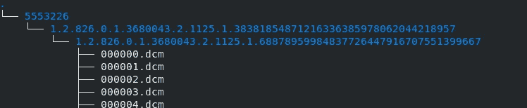
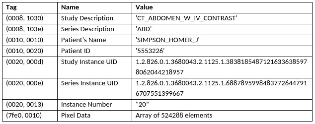

# 了解 DICOM

> 原文：<https://towardsdatascience.com/understanding-dicom-bce665e62b72?source=collection_archive---------15----------------------->

## 如何阅读、书写和组织医学图像

DICOM 是在医院数据库中存储和传输医学图像的主要文件格式。

还有其他存储图像的文件格式。除了 DICOM，您还可以看到以 NIFTI 格式(文件后缀为。nii”)、PNG 或 JPEG 格式，甚至像 NumPy 数组这样的 Python 文件对象。

那么为什么要用 DICOM 呢？其他文件格式可能更方便，但在临床实践中，一切都使用 DICOM 格式。随着我的项目越来越先进，我经常发现自己重写代码来直接读写 DICOM 文件。此外，DICOM 文件是明确的，因为每个文件都包含一个文件头，详尽地记录了医院、患者、扫描仪和图像信息，就像每次拍摄 iPhone 照片时，智能手机信息甚至 GPS 都被编码在元数据中一样。

【DICOM 的建议读数

DICOM 文件格式记录在 [DICOM 标准](https://www.dicomstandard.org/)中，这是大多数信息学专家的必读文件。

对于一个初学者的背景，[这个博客](http://dicomiseasy.blogspot.com/)也是一个很好的介绍。

**DICOM 的挑战**

对于深度学习任务，最终目的通常是将图像数据加载为 NumPy 或其他文件，在这种情况下，DICOM 可能会很困难:

1.  DICOM 为每个切片保存一个文件，因此 3D 扫描可能有数百个文件
2.  DICOM 文件以唯一标识符(UID)命名。这使得很难从文件夹级别对文件进行排序(在某些情况下，文件名太长，以至于超过了 Windows 计算机上 256 个字符的最大值，从而导致保存/加载问题)
3.  患者和医院信息嵌入在文件头中，这使得 DICOM 很难匿名

虽然混乱，但这种组织结构是 DICOM 的重要优势。稍后，我将分享一些我编写的示例 Python 代码，它们可以帮助绕过这些问题。

**识别 DICOM 文件**

每个 DICOM 文件都是独立的——识别文件所需的所有信息都嵌入在每个文件头中。这些信息分为 4 个层次——患者、研究、系列和实例。

*   “患者”是接受检查的人
*   “研究”是在某个日期和时间在医院进行的成像程序
*   “系列”—每个研究由多个系列组成。一个系列可以代表在一次研究中对患者进行多次物理扫描(通常用于 MRI ),也可以是虚拟的，即对患者进行一次扫描，然后以不同的方式重建数据(通常用于 CT)
*   “实例”-3D 图像的每个切片都被视为一个单独的实例。在这种情况下，“实例”与 DICOM 文件本身同义

为了说明这种层次结构，这里有一些来自癌症成像档案馆 (TCIA) 的 [*的公开胰腺癌数据集的文件:*](https://www.cancerimagingarchive.net/)

图一。按“患者”、“研究”、“系列”和“实例”级别组织的 DICOM 文件示例。图片作者。

表 1 显示了使用 [PyDicom](https://pydicom.github.io/) (一个允许读取和写入 Dicom 文件的 python 包)打印出的标题。我删除了大部分不相关的信息，还创建了一些“虚假”的患者数据。

表 1:显示患者、系列、研究和实例 uid 和文本描述的 DICOM 标题部分的打印输出。图片作者。

从表 1 中的两个描述字段中，我们可以看到该文件来自腹部的 CT 检查，该检查使用了对比剂，这与来自胰腺癌成像数据库的该扫描相一致。这个系列“ABD”可能是唯一的，也可能有其他的。在临床 CT 研究中，通常会看到定位扫描(“拓扑结构图”)以及“矢状”和“冠状”扫描，它们在不同的平面上突出显示解剖结构。

**唯一标识符:uid**

除文本描述外，扫描还通过唯一的患者 ID (5553226)、研究 ID(1 . 2 . 826 . 0 . 1 . 3680043 . 2 . 1125 . 1)进行识别。38381854871216336385978062044218957)，系列 UID (1.2.826.0.1。3680043 . 2 . 1 . 1)和实例号(20)。

如果您要加载该文件夹中的下一个 DICOM 文件，患者 ID、病历报告 UID 和系列图像 UID 将具有相同的值，只有实例编号不同(在本例中为“21”)。

文本描述很有帮助，但 uid 是识别扫描的关键。与描述不同，uid 对于在医院进行的每个患者、系列和研究都是独特的。

此外，uid 实际上不是随机数，它们编码了关于文件身份的信息，甚至是如何压缩的信息。UID 的完整描述在 Dicom 标准的[第 6 部分](http://dicom.nema.org/medical/dicom/current/output/pdf/part06.pdf)中。

我见过的大多数 DICOM 病历报告都是以“三层”文件夹结构组织的，如图 1 所示，文件首先按患者 UID 排序，然后是病历报告实例 UID，然后是系列图像实例 UID，最后文件名本身就是实例编号。

**结论**

在这个例子中，我简要介绍了如何识别 DICOM 文件，以及如何使用这些信息对数据集进行排序。

在下一篇文章中，我将描述我写的一个 python 脚本，它可以根据文件头中的 UID 信息将一组 DICOM 文件重新组织到一个一致且易于理解的文件夹结构中。