# 了解 DICOMs

> 原文：<https://towardsdatascience.com/understanding-dicoms-835cd2e57d0b?source=collection_archive---------12----------------------->

**2020 年 9 月更新** : [fast.ai](https://github.com/fastai/fastai) 版本 2 于 2020 年 8 月正式发布。下面使用的`fastai`是指最新版本，目前为`2.0.9`

*一个* ***深入实践*** *方法，如何使用*[***fastai***](https://github.com/fastai/fastai2)***的*** *医学成像模块查看和操作 DICOM 图像，并为机器学习做好准备。*

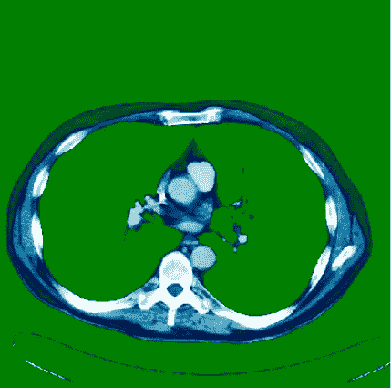

使用像素选择和“ocean_r”色图生成的图像

## 什么是 DICOMs？

DICOM(**D**I**I**maging and**CO**communications in**M**edicine)是事实上的标准，它建立了允许医学图像(X 射线、MRI、CT)和相关信息在来自不同供应商、计算机和医院的成像设备之间交换的规则。DICOM 格式提供了一种合适的方法，该方法符合[医疗信息交换](https://www.himss.org/interoperability-and-health-information-exchange) (HIE)标准，用于在医疗机构之间传输医疗相关数据，并符合 [HL7](https://www.hl7.org/implement/standards/) 标准，该标准是使临床应用能够交换数据的消息标准。

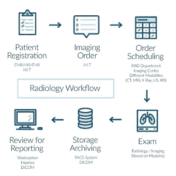

典型的放射学工作流程[ [图像认证](https://www.extrahop.com/company/blog/2016/introduction-to-dicom-protocol/)

DICOM 文件通常有一个 ***。dcm*** 扩展，提供了在单独的**【标签】**中存储数据的方法，例如患者信息、*图像/像素数据*、使用的机器以及更多信息(如下所述)。

DICOM 文件主要由打包成一个文件的*标题*和*图像像素强度*数据组成。标题中的信息被组织成一系列标准化的标签。通过从这些标签中提取数据，用户可以访问有关患者人口统计、研究参数等重要信息。

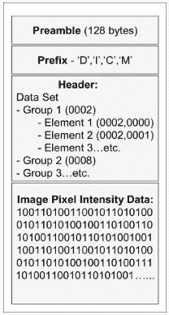

DICOM 的一部分[ [图像来源](http://europepmc.org/articles/PMC3354356/figure/F2/)

***16 位*** DICOM 图像有从 **-32768** 到 **32768** 的值，而***8 位*** 灰阶图像存储从 **0** 到 **255** 的值。DICOM 图像中的数值范围非常有用，因为它们与 [***Hounsfield 标度***](https://en.wikipedia.org/wiki/Hounsfield_scale) 相关联，Hounsfield 标度是一种用于描述放射密度的定量标度(或一种观察不同组织密度的方式——更多解释见下文)

## 安装要求

为了能够完成本教程，您需要在计算机上安装这些依赖项

安装说明可以在他们的 Github 页面查看: [fastai](https://github.com/fastai/fastai)

还需要安装`pydicom(` **Pydicom** 是一个 python 包，用于解析 dicom 文件，可以很容易地将 DICOM 文件转换成 python 结构，以便于操作。

*   `pip install pydicom`

而`scikit-image(`是图像处理的算法集合)

*   `pip install scikit-image`

`kornia(`是一个包含操作符的包库，这些操作符可以插入到神经网络中，以训练模型来执行图像变换、核几何、深度估计和低级图像处理，如直接在张量上操作的滤波和边缘检测

*   `pip install kornia`

> *有关如何使用 fastai 的医学成像模块的更多信息，请访问我的* `[*github*](https://github.com/asvcode/MedicalImaging)` [*页面*](https://github.com/asvcode/MedicalImaging) *或我的* [*医学成像教程博客*](https://asvcode.github.io/MedicalImaging/) *(哪个更适合查看笔记本教程:)*

## 数据集

这里列出了 3 个 DICOM 数据集，您可以随意使用。这 3 个数据集各有不同的属性，显示了不同 DICOM 数据集中可以包含的信息的巨大差异。

*   `fastai`库中方便地提供了`SIIM_SMALL`数据集((250 个 DICOM 文件，~30MB ),但是其某些属性受到限制，例如，它没有`RescaleIntercept`或`RescaleSlope`,并且其像素范围被限制在 0 到 255 的范围内
*   Kaggle 有一个很容易访问的(437MB) [CT 医学图像数据集](https://www.kaggle.com/kmader/siim-medical-images)来自癌症成像档案馆。数据集由 100 幅图像(512 像素乘 512 像素)组成，像素范围从-2000 到+2000
*   超声数据集中的[甲状腺分割提供低质量(从 253px 到 253px)的 DICOM 图像，其中每个 DICOM 图像有多个帧(平均 1000 帧)](https://opencas.webarchiv.kit.edu/?q=node/29)

让我们加载依赖项:

```
#Load the dependancies
from fastai.basics import *
from fastai.callback.all import *
from fastai.vision.all import *
from fastai.medical.imaging import *import pydicom
import seaborn as sns
matplotlib.rcParams['image.cmap'] = 'bone'
from matplotlib.colors import ListedColormap, LinearSegmentedColormap
```

> 了解一些关于 fast.ai 的知识是有益的，超出了本教程的范围，fast.ai 文档页面有一些优秀的[教程](https://dev.fast.ai/)让你快速入门。

## ….关于数据如何存储在 DICOM 文件中的更多信息

使用`pydicom.dcmread`打开 DICOM 文件，例如使用`SIMM_SMALL`数据集:

```
#get dicom files
items = get_dicom_files(pneumothorax_source, recurse=True, folders='train')#now lets read a file:
img = items[10]
dimg = dcmread(img)
```

您现在可以查看 DICOM 文件中包含的所有信息。对每个元素的解释超出了本教程的范围，但是 [*这个*](http://dicom.nema.org/medical/dicom/current/output/chtml/part03/sect_C.7.6.3.html#sect_C.7.6.3.1.4) 站点有一些关于每个条目的优秀信息。信息由 **DICOM 标签**(例如:0008，0005)或 **DICOM 关键字**(例如:特定字符集)列出。

比如说:

```
dimg
```

现在生成:

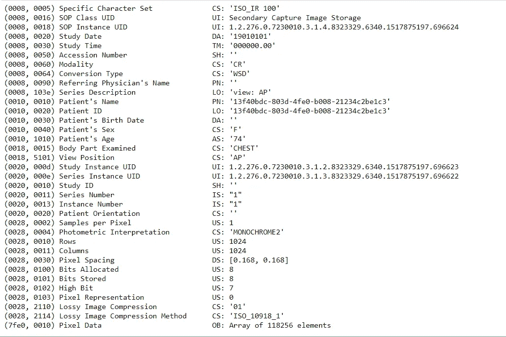

从“dimg”创建的“head”信息

以下是上述标签信息的一些要点:

*   **像素数据** (7fe0 0010)(最后一项)——这是存储原始像素数据的地方。为每个图像平面编码的像素的顺序是从左到右、从上到下，即左上像素(标记为 1，1)首先被编码
*   **光度解释** (0028，0004)——又名颜色空间。在这种情况下，是单色 2，其中像素数据被表示为单个单色图像平面，其中最小样本值被显示为黑色[信息](http://dicom.nema.org/medical/dicom/current/output/chtml/part03/sect_C.7.6.3.html)
*   **每像素样本数** (0028，0002) —这应该是 1，因为该图像是单色的。例如，如果色彩空间是 RGB，这个值将是 3
*   **存储的位数** (0028 0101) —每个像素样本存储的位数
*   **像素表示** (0028 0103) —可以是无符号的(0)或有符号的(1)
*   **有损图像压缩** (0028 2110) — 00 图像没有经过有损压缩。01 图像已经过有损压缩。
*   **有损图像压缩方法**(0028 2114)——说明使用的有损压缩类型(在本例中为 JPEG 有损压缩，由`CS:ISO_10918_1`表示)

未包含在`SIMM_SMALL`数据集中的重要标签:

*   **重新缩放截距** (0028，1052) —其中值 *b* 与存储值(SV)和输出单位之间的关系。*输出单位= m*SV + b* 。
*   **重标度斜率** (0028，1053)——*m*在重标度截距(0028，1052)指定的方程中。

*RescaleIntercept* 和 *RescaleSlope* 用于将图像的像素值转换为对应用有意义的值。计算新值通常遵循线性公式:

*   ***new value****=(****raw pixel value*********rescale slope****)+****RescaleIntercept***

并且当关系不是线性时，利用 *LUT* (查找表)。

> 当我们在下面查看另一个数据集时，所有这些将变得更加清晰

上面的列表是有限的，使用另外两个数据集会告诉你每个文件可以有大量的标签。值得指出的是，在可能有`ImageComments`的`tag`的地方，可能有额外的信息(然而并不总是这样)。这个`tag`可能包含对建模有用的信息。

## …那像素数据呢？

默认情况下，pydicom 将像素数据作为文件中的**原始字节**读取，通常`PixelData`通常不会立即有用，因为数据可能以各种不同的方式存储:

*   像素值可以是有符号或无符号的整数，也可以是浮点数
*   可能有多个图像帧
*   每帧可能有多个平面(即 RGB ),像素的顺序可能不同。这只是几个例子，更多信息可在 [pycidom](https://pydicom.github.io/pydicom/stable/old/working_with_pixel_data.html#dataset-pixel-array) 网站上找到

这是`PixelData`的样子:

```
dimg.PixelData[:200]
```

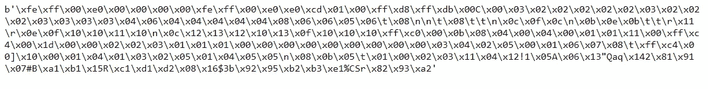

像素数据

由于解释`PixelData`的复杂性， *pydicom* 提供了一种简单的方法来以方便的形式获得它:`pixel_array`，它返回一个包含像素数据的`numpy.ndarray`:

```
dimg.pixel_array, dimg.pixel_array.shape
```

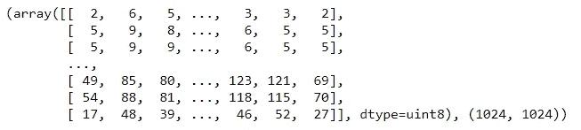

像素阵列

## 加载每个文件有 1 帧的 DICOMs

`SIIM_SMALL`数据集是一个 DICOM 数据集，其中每个 DICOM 文件都有一个包含 1 幅图像的`pixel_array`。在这种情况下，`fastai.medical.imaging`中的`show`功能可以方便地显示图像

```
source = untar_data(URLs.SIIM_SMALL)
items = get_dicom_files(source)
patient1 = dcmread(items[0])
patient1.show()
```

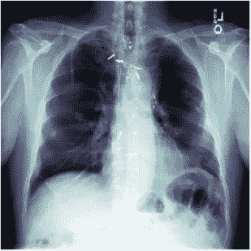

patient1.show()将显示上面的图像

从`CT medical image dataset`加载一个图像怎么样，每个 DICOM 文件也包含一个帧。这张图片是 CT 扫描的切片，看着肺，心脏在中间。

```
csource = Path('C:/PillView/NIH/data/dicoms')
citems = get_dicom_files(csource)
patient2 = dcmread(citems[0])
patient2.show()
```

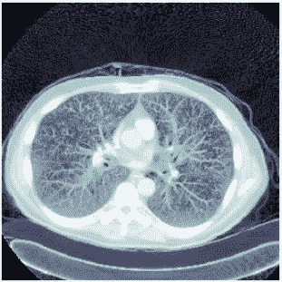

patient2.show()

然而，如果一个 DICOM 数据集每个文件有多个帧呢？

## 加载每个文件有多个帧的 DICOMs

超声数据集中的[甲状腺分割是一个数据集，其中每个 DICOM 文件都有多个帧。](https://opencas.webarchiv.kit.edu/?q=node/29)

开箱后，您无法使用`fastai`查看来自多帧 DICOM 文件的图像，因为这将导致出现`TypeError`，但是我们可以自定义`show`功能，以便检查文件是否有多于 1 帧，如果有，您可以选择查看多少帧(默认为 1)以及打印每个文件中有多少帧。

**2020 年 9 月更新:**我向库提交了一个 PR，现在它是`fastai.medical.imaging`模块中`show`函数的一部分，所以可以开箱即用。

```
#updating to handle multiple frames
[@patch](http://twitter.com/patch)
[@delegates](http://twitter.com/delegates)(show_image, show_images)
def show(self:DcmDataset, frames=1, scale=True, cmap=plt.cm.bone, min_px=-1100, max_px=None, **kwargs):
    px = (self.windowed(*scale) if isinstance(scale,tuple)
          else self.hist_scaled(min_px=min_px,max_px=max_px,brks=scale) if isinstance(scale,(ndarray,Tensor))
          else self.hist_scaled(min_px=min_px,max_px=max_px) if scale
          else self.scaled_px)
    if px.ndim > 2: 
        gh=[]
        p = px.shape; print(f'{p[0]} frames per file')
        for i in range(frames): u = px[i]; gh.append(u)
        show_images(gh, cmap=cmap, **kwargs)    
    else: 
        print('1 frame per file')
        show_image(px, cmap=cmap, **kwargs)
```

`Fastai`有一个非常直观的方法，你可以用 ***修补*** 代码，因此有了上面的`@patch`，你可以很容易地给代码添加不同的功能

现在我们可以加载甲状腺数据集了:

```
tsource = Path('C:/PillView/NIH/data/thyroid')
titems = get_dicom_files(tsource)
patient3 = dcmread(titems[0])
patient3.show(10)
```

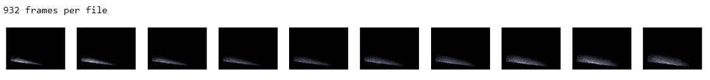

patient3.show(十)。我们指定了 10，因此它显示了这 1 个文件中总共 932 帧中的前 10 帧

## 了解组织密度

使用 [CT 医学图像数据集](https://www.kaggle.com/kmader/siim-medical-images)，我们现在可以尝试其他有用的`fastai.medical.imaging`功能。如前所述 ***16 位*** DICOM 图像的像素值范围从 **-32768** 到 **32768**

`patient2`以上是来自该数据集的 DICOM 文件。

```
#lets convert the pixel_array into a tensor.  Fastai can #conveniently do this for us
tensor_dicom = pixels(patient2) #convert into tensorprint(f'RescaleIntercept: {patient2.RescaleIntercept:1f}\nRescaleSlope: {patient2.RescaleSlope:1f}\nMax pixel: '
      f'{tensor_dicom.max()}\nMin pixel: {tensor_dicom.min()}\nShape: {tensor_dicom.shape}')
```

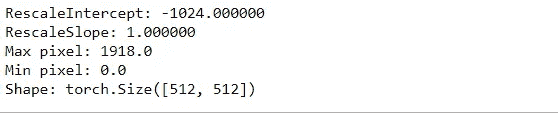

RescaleIntercept、RescaleSlope、最大和最小像素值

该图像中`RescaleIntercept`为`-1024`,`RescaleSlope`为`1`,`max`和`min`像素分别为`1918`和`0`，图像尺寸为`512`乘以`512`

绘制像素强度直方图，你可以看到大部分像素的位置

```
plt.hist(tensor_dicom.flatten(), color='c')
```

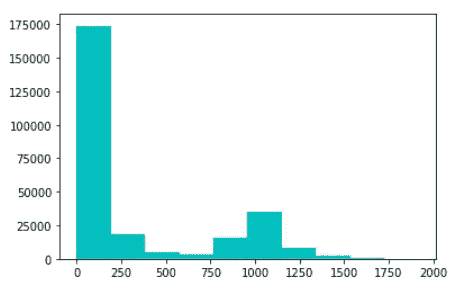

像素值直方图

直方图显示最小像素值为`0`，最大像素值为`1918`。直方图主要是双峰的，大多数像素位于`0`和`100`像素之间以及`750`和`1100`像素之间。

该图像有一个`-1024`的`RescaleIntercept`和一个`1`的`RescaleSlope`。这两个值允许将像素值转换成 [Hounsfield 单位( *HU* )](https://en.wikipedia.org/wiki/Hounsfield_scale) 。在*和*中测量 CT 扫描上不同组织的密度

大多数 CT 扫描的范围从`-1000` *HUs* 到`+1000` *HUs* 其中水是`0` *HUs* ，空气是`-1000` *HUs* 并且组织越致密 *HU* 值越高。金属有一个高得多的 *HU* 范围`+2000`HU*HU*s 所以对于医学成像来说一个范围`-1000`到`+1000`HU*s 是合适的*

上述像素值与组织密度不正确对应。例如，大多数像素在对应于水的像素值`0`和`100`之间，但是该图像主要显示充满空气的肺。亨斯菲尔德标度上的空气是`-1000` *胡* s

这就是`RescaleIntercept`和`RescaleSlope`的重要之处。Fastai2 提供了一种方便的方式`scaled_px`来相对于`RescaleIntercept`和`RescaleSlope`重新缩放像素。

请记住:

***重新调整像素=像素*重新调整斜率+重新调整交点***

Fastai 再次提供了一个方便的方法`scaled_px`，将`pixel_array`转换为`tensor`，并通过考虑`RescaleIntercept`和`RescaleSlope`来缩放这些值。

```
#convert into tensor taking RescaleIntercept and RescaleSlope into #consideration
tensor_dicom_scaled = scaled_px(patient2)
plt.hist(tensor_dicom_scaled.flatten(), color='c')
```

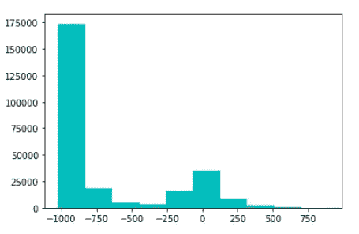

使用“scaled_px”的缩放像素直方图

现在让我们看看最大和最小像素值:

```
print(f'Max pixel: {tensor_dicom_scaled.max()}\nMin pixel: {tensor_dicom_scaled.min()}')
```

重新缩放后，最大像素值为`894`，最小值为`-1024`，我们现在可以根据 *Hounsfield 比例*正确地看到图像的哪些部分对应于身体的哪些部分。

查看直方图的顶端，值超过 300 *HUs* 的图像看起来像什么？

`show`功能具有指定`max`和`min`值的能力

```
patient2.show(max_px=894, min_px=300, figsize=(5,5))
```

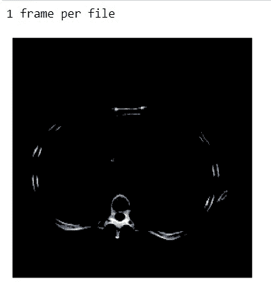

查看 300 像素和 894 像素之间的像素值

回想一下，我们让*为*修补了`show`函数，现在它显示这个数据集有`1 frame per file`。 *HU* 值高于`+300`通常会显示图像内的骨骼结构

那么在`-250`和`250`的范围内，我们有一个峰值像素呢？

```
patient2.show(max_px=250, min_px=-250, figsize=(5,5))
```

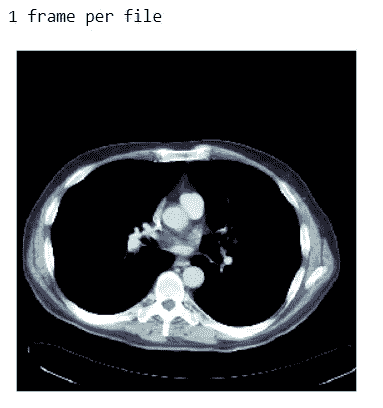

像素范围在-250 像素和+250 像素之间

在这个范围内，你现在可以看到主动脉和心脏的部分(图片中间)以及肌肉和脂肪。

在-250 像素和-600 像素之间，我们注意到像素分布很低，怎么办

```
patient2.show(max_px=-250, min_px=-600, figsize=(5,5))
```

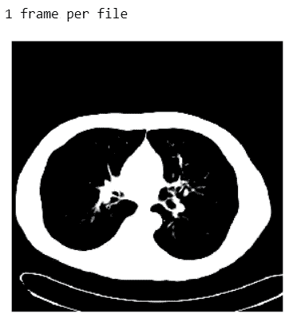

在这个范围内，你只能看到轮廓。直方图显示在这个范围内没有很多像素

-1000px 到-600px 之间呢？

```
patient2.show(max_px=-600, min_px=-1000, figsize=(5,5))
```

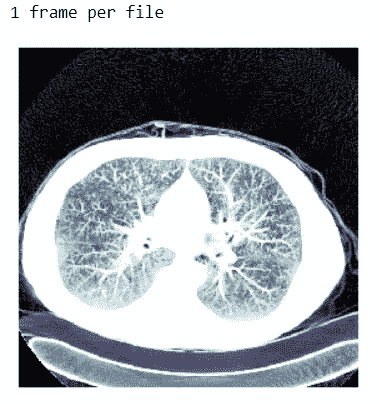

在这个范围内，你可以清楚地看到肺部的支气管

```
patient2.show(max_px=-900, min_px=-1024, figsize=(5,5))
```

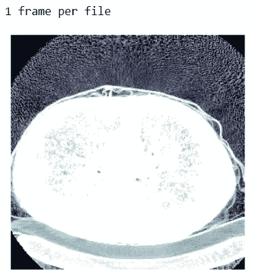

在这个范围内，你现在也可以清楚地看到扫描仪的曲线。

默认情况下，`show`函数的`max_px`值为`None`，而`min_px`值为`-1100`

```
patient2.show(max_px=None, min_px=-1100, figsize=(5,5))
```

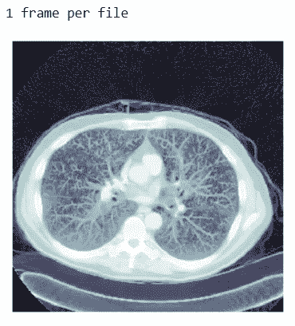

如上所述的图像缩放确实是为了人类的利益。计算机屏幕可以显示大约 256 种灰度，而人眼只能检测大约 6%的灰度变化，这意味着人眼只能检测大约 17 种不同的灰度。

DICOM 图像可能具有从`-1000`到`+1000`的宽范围，并且为了使人类能够看到图像中的相关结构，使用了`windowing`过程。Fastai 提供各种`dicom_windows`，因此屏幕上只显示特定的 *HU* 值。更多关于窗口化的内容可以在 [*这里找到*](https://asvcode.github.io/MedicalImaging/medical_imaging/dicom/fastai/2020/04/28/Medical-Imaging-Using-Fastai.html)

## ….关于窗口的旁注

DICOM 图像可以包含大量的像素值，而`windowing`可以被视为一种处理这些值的方法，以改变图像的外观，从而突出显示特定的结构。一个窗口有两个值:

`l` =窗位或中心，也称为亮度

`w` =窗口宽度或范围，又名对比度

**举例:**从[到这里](https://www.kaggle.com/dcstang/see-like-a-radiologist-with-systematic-windowing)

大脑物质窗口

l = 40(窗口中心)w = 80(窗口宽度)

显示的体素范围从 0 到 80

计算体素值:

*   最低可见值=窗口中心-窗口宽度/ 2
*   最高可见值=窗口中心+窗口宽度/ 2

(最低可见值= 40-(80/2)，最高可见值= 40 + (80/2))

因此，所有大于 80 的值都是白色的，所有小于 0 的值都是黑色的。

## ….但是计算机真的关心窗口、缩放比例吗？

如果`windowing`是为了人类的利益，当数据有一个*均匀分布*时，计算机从训练中产生更好的结果，正如本文中提到的[不像放射科医生](https://www.kaggle.com/jhoward/don-t-see-like-a-radiologist-fastai/data)那样看

回头看看像素分布，我们可以看到图像并没有均匀分布


重新缩放像素的直方图

fastai 有一个函数`freqhist_hist`，它根据您为`n_bins`设置的值将像素值的范围分成多个组，这样每个组都有大约相同数量的像素。

例如，如果您将`n_bins`设置为 1，像素值将被分成两个不同的像素箱。

```
ten_freq = tensor_dicom_scaled.freqhist_bins(n_bins=1)
fh = patient2.hist_scaled(ten_freq)
plt.hist(ten_freq.flatten(), color='c'); show_image(fh, figsize=(7,7))
```

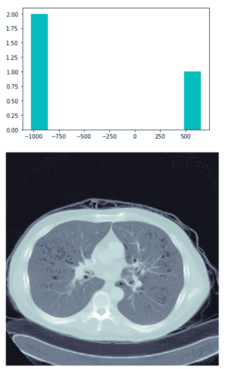

将像素分成两个不同的箱

在这种情况下，您可以在`-1000` *处看到图像的两个极边，在*处看到空气部分，在`500` *处*处可以清楚地看到骨骼结构，但这种分布对于机器学习模型来说仍不完全可接受。

`n_bins`在`100`(这是`show`使用的默认数字)

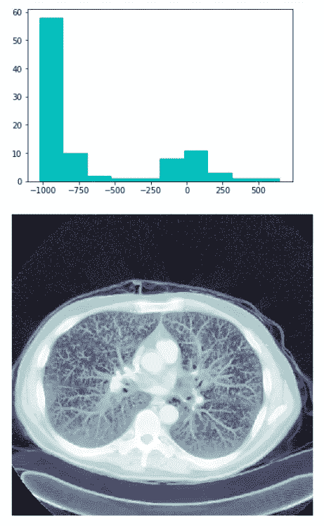

分布在 100 个箱内的像素

那么在`n_bins`处`100000`的像素显示出更均匀的分布呢

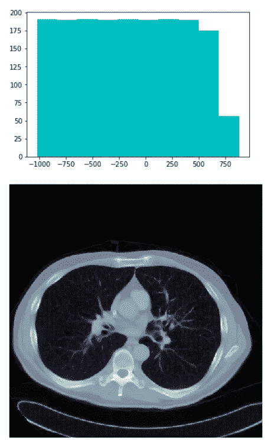

分布在 100000 个箱上的像素

这对训练结果有什么影响。这将是下一篇教程的主题。

## 参考资料:

1.  [https://www . himss . org/inter operability-and-health-information-exchange](https://www.himss.org/interoperability-and-health-information-exchange)
2.  [https://www.hl7.org/implement/standards/](https://www.hl7.org/implement/standards/)
3.  [https://en.wikipedia.org/wiki/Hounsfield_scale](https://en.wikipedia.org/wiki/Hounsfield_scale)
4.  [https://github.com/fastai/fastai2](https://github.com/fastai/fastai2)
5.  [https://www . ka ggle . com/jhoward/don-t-see-like-a-放射科医生-fastai/data](https://www.kaggle.com/jhoward/don-t-see-like-a-radiologist-fastai/data)
6.  [https://www . ka ggle . com/DC stang/see-like-a-a-放射科医生-系统开窗](https://www.kaggle.com/dcstang/see-like-a-radiologist-with-systematic-windowing)