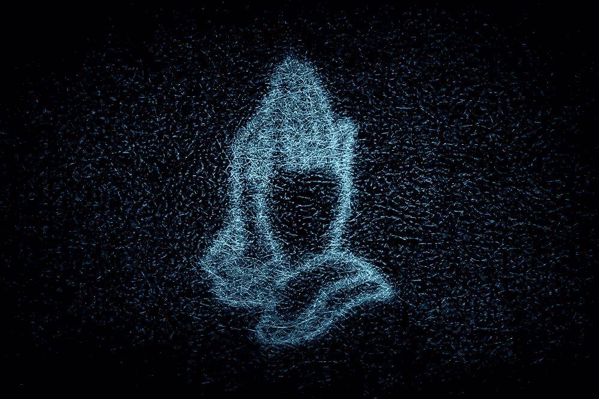
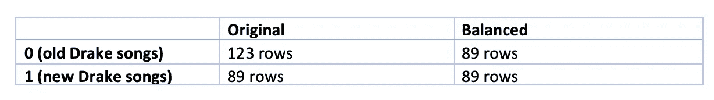
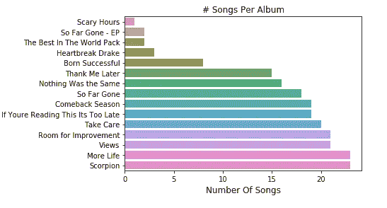
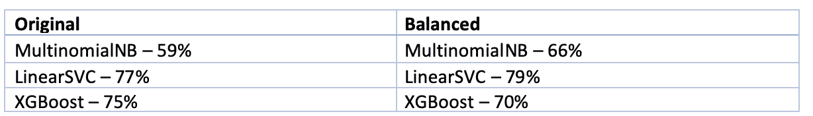
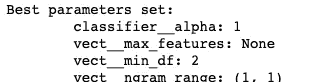
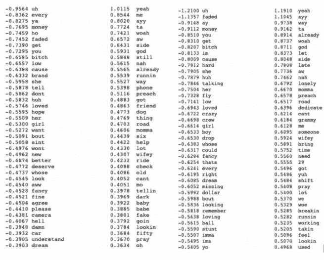
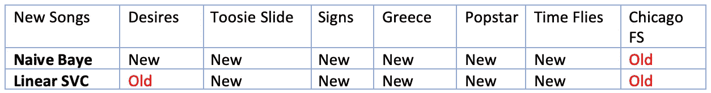
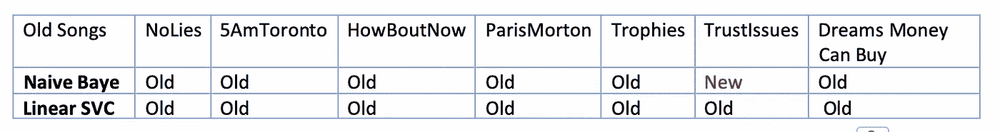

# 新老德雷克歌词与人工智能

> 原文：<https://towardsdatascience.com/understanding-differences-between-drakes-old-vs-new-songs-using-text-classification-and-lstm-6381fb568b31?source=collection_archive---------45----------------------->

## 使用文本分类和 LSTM 模型理解德雷克的老歌和新歌之间的差异。



德鲁·比默|[https://unsplash.com/photos/Kxc7dgkjdNo](https://unsplash.com/photos/Kxc7dgkjdNo)

德雷克的歌词随着时间的推移有变化吗？如果是这样，那怎么做？

我用机器学习识别老德雷克歌词和新德雷克歌词，准确率 86%！这说明新旧德雷克歌曲歌词是有区别的。现在，让我们找出这些差异，并测试模型预测哪些歌曲是新旧德雷克歌曲。

*   ** *如果对过程和结果不感兴趣，请跳到第 5 和第 6 节。*

**本文共分 7 节:**

1)数据探索、清理和处理

2)使用计数矢量器的 ML 建模

3)使用 Tfidf 矢量器的 ML 建模

4)对 2 和 3 中的顶级型号进行参数调整

5)分析来自模型的前 40 个特征，以发现新旧德雷克之间的差异。

6)让我们通过预测单曲和 mixtape 歌曲是旧的还是新的 Drake 来看看模型的运行情况。

7)使用 LSTM 的序列建模

# 1)数据预处理

我用 Genius API 收集了德雷克歌词的数据集。我只收录他官方专辑中的歌曲。因此没有单打和功能

这些数据不需要太多争论。我只是将所有文本转换成小写，并删除了字母表和数字之外的任何字符。

新德雷克的歌是 2014 年以后的歌，老德雷克的歌是 2014 年以前的。出现这种情况的两个原因是:

1)大家普遍认为德雷克最好的项目是在 2014 年之前。

2) 2014 年是一个很好的中间点，为每个类别提供了一个相当平衡的数据集。

我还执行随机抽样，并创建一个更加平衡的数据集。我将展示使用两个数据集的结果。

```
*#Creating column to define new drake vs old drake*
*#1 represents new drake, 0 represents old drake*

df['drake'] = np.where(df['year'] > 2014, 1, 0)
```



在这里你可以看到德雷克专辑和歌曲的分布

```
sns.countplot(y=df['album'].values, order=df['album'].value_counts(ascending=**True**).index)
plt.title('# Songs Per Album')
plt.xlabel('Number Of Songs', fontsize=12)
plt.show()
```



**数据准备阶段:**

```
*#Tokenizing Dataset*
**from** **nltk.tokenize** **import** word_tokenize
df['lyrics'] = df['lyrics'].apply(word_tokenize)*#Stop word removal* 
**from** **nltk.corpus** **import** stopwords **from** **collections** **import** Counter   stop = stopwords.words('english') *#I keep words in this list as I feel they are useful in predicting drake songs* *#Furthermore, I tested accuracy with and without stop words. This setup is the best* remove_stop = ['i', 'me', 'myslef', 'we', 'you', 'we', 'she', 'her', 'they'] stop = list((Counter(stop)-Counter(remove_stop)).elements()) df['lyrics'] = df['lyrics'].apply(**lambda** x: [item **for** item **in** x **if** item **not** **in** stop])*#Lemitization*
**from** **nltk.stem** **import** WordNetLemmatizer 

**def** lemmatize_text(text):
    lemmatizer = WordNetLemmatizer()
    **return** [lemmatizer.lemmatize(w) **for** w **in** text]df['lyrics'] = df['lyrics'].apply(lemmatize_text)
```

接下来，我将数据集分为训练和测试，其中 80%用于训练，20%用于测试。此外，我还将使用 K-fold 验证来测试准确性，因为它对于像这样的较小数据集更准确。

```
*#Defining X and Y*
X = df['lyrics']
y = df['drake']*## Divide the dataset into Train and Test*
**from** **sklearn.model_selection** **import** train_test_split
X_train, X_test, y_train, y_test = train_test_split(X,y,test_size= 0.2, random_state = **None**)
```

# 2)使用计数矢量器的 ML 建模

现在是时候用计数矢量器测试模型了。计数矢量器计算文本中的词频，并用词频创建一个数组。

```
*# Applying Countvectorizer
# Creating the Bag of Words model*
*#I tried different n_gram ranges and unigram works best*
**from** **sklearn.feature_extraction.text** **import** CountVectorizer
cv = CountVectorizer()
cv.fit(X_train)
trainx_cv = cv.transform(X_train)
testx_cv = cv.transform(X_test)#For cross validation I create a new count vectorizer and use it in a sklearn pipeline with the model.#Example pipeline.
mnb = Pipeline([('vect', CountVectorizer()), ('mnb', MultinomialNB())])
cvs = cross_val_score(mnb, X, y)
print("Accuracy: %0.2f (+/- %0.2f)" % (cvs.mean(), cvs.std() * 2))# The pipeline will do feature extraction in each fold separately and prevent leakage.
```

接下来，我为文本分类创建了以下模型:

注意:我使用训练/测试/分割和交叉验证来测试模型。以下是交叉验证准确性，因为它们对于像这样的较小数据集更准确。


为了节省空间，我不包括这些代码。我的 Github 上有它们的代码。

# 3)使用 TF-IDF 矢量器的 ML 建模

接下来，我重复相同的步骤，但是这次我使用 TF-IDF 矢量器，而不是计数矢量器。TF-IDF 做的事情与 count vectorizer 相同，但是值与 count 成比例增加，与单词的频率成反比。

```
#Lets try with Tf-IDF
#Steps are repeated as before
#I tried different n_gram ranges and unigram works best
from sklearn.feature_extraction.text import TfidfVectorizer
tf=TfidfVectorizer()
tf.fit(X_train)
trainx_tf = tf.transform(X_train).toarray()
testx_tf = tf.transform(X_test).toarray()#For cross validation I create a new tfidf vectorizer and use it in a sklearn pipeline with the model.#Example pipeline.
mnb = Pipeline([('vect', TfidfVectorizer()), ('mnb', MultinomialNB())])
cvs = cross_val_score(mnb, X, y)
print("Accuracy: %0.2f (+/- %0.2f)" % (cvs.mean(), cvs.std() * 2))# The pipeline will do feature extraction in each fold separately and prevent leakage. 
```

TF-IDF 矢量器的精度为:



# 4)参数调整

好了，现在我们知道朴素贝叶斯使用计数矢量器的性能最好，线性 SVC 使用 TF-IDF 矢量器的性能最好。现在让我们尝试进一步优化模型参数:

```
#Multinomial NB tunning
pipeline = Pipeline([
    ('vect', CountVectorizer()),
    ('classifier', MultinomialNB()),
])parameters = {
    'vect__max_df': (0.5, 0.75, 1.0),
    'vect__min_df': (1,2,3),
    'vect__max_features': (None, 5000, 10000,15000),
    'vect__ngram_range': ((1, 1), (1, 2)),  # unigrams or bigrams
    'classifier__alpha': (1, 0.1, 0.01, 0.001, 0.0001, 0.00001),
}
Best_NB = GridSearchCV(pipeline, parameters, n_jobs=-1, verbose=1)
Best_NB.fit(X_train, y_train)
best_parameters = Best_NB.best_estimator_.get_params()
```



在相同的测试数据集上比较调优前后的准确性。

请记住，前面几节中的精度是交叉验证精度。在这里，我比较了同一测试数据集上的火车测试分割精度，以查看相同数据上的性能的直接比较。


```
#LinearSVC tunning
pipeline = Pipeline([
    ('tfidf', TfidfVectorizer()),
    ('clf', LinearSVC()),
])parameters = {
    'tfidf__max_df': (0.90, 1.0),
    'tfidf__min_df': (1,2,3,),
    'tfidf__ngram_range': ((1, 1), (1, 2)),  # unigrams or bigrams
    'clf__C': (0.1, 1, 10, 100, 1000),
    'clf__penalty': ('l1', 'l2'),
}
Best_SVC = GridSearchCV(pipeline, parameters, n_jobs=-1, verbose=1)
Best_SVC.fit(X_train, y_train)
best_parameters = Best_SVC.best_estimator_.get_params()
```


总体而言，在平衡数据集上训练的模型表现稍好。后来，当我对一些新数据进行测试时，我注意到在原始数据集上训练的模型对老歌略有过度拟合，因为它们完美地预测了老歌，但新歌的准确性不如在平衡数据集上训练的模型。在平衡数据集上训练的模型在老歌预测准确性方面略有下降，可能是因为通过移除 30%的数据集而遗漏了一些重要的老歌特征。因此，将来当德雷克推出另一张专辑时，我会用更多的数据重新测试它。

所以现在我们有超过 80%准确率的模型。这表明，有一些特征有助于成功地区分德雷克歌曲是新的还是旧的德雷克。现在让我们来看看新德雷克和老德雷克的不同之处。

# 5)特征重要性

为此，我将查看模型系数值。此外，我只分析顶级模型。

```
*#Thanks to tobique for the method. Link: https://stackoverflow.com/questions/11116697/how-to-get-most-informative-features-for-scikit-learn-classifiers*
*#This method look at the coeficient values and orders them based on most negative and positive* 
*#The most positive values link to words defining old drake song*
*#The most negative values link to words defining new drake song*

**def** show_most_informative_features(vectorizer, clf, n=20):
    feature_names = vectorizer.get_feature_names()
    coefs_with_fns = sorted(zip(clf.coef_[0], feature_names))
    top = zip(coefs_with_fns[:n], coefs_with_fns[:-(n + 1):-1])
    **for** (coef_1, fn_1), (coef_2, fn_2) **in** top:
        print ("**\t%.4f\t%-15s\t\t%.4f\t%-15s**" % (coef_1, fn_1, coef_2, fn_2))
```

正如《代码》中所提到的，这种方法的所有功劳都归 Tobique 所有。这种方法查看模型系数，然后根据最大负值和最大正值对它们进行排序。它还将系数映射到特性名称，这使我们很容易理解它们。在我们的例子中，最负的系数与老德雷克歌曲歌词相关，最正的系数与新德雷克歌曲歌词相关。以下是两款车型的 40 大特色:



**老德雷克关键词:**嗯，布特，嗯，钱，美元，汽车，嚯，锄头，婊子，女孩，爱情，她，她，你，爱过，错过，低，品牌，褪色，梦想，球，船员。

**新德雷克关键词:**耶，伊，哇，仍然，不，妈妈，传道，祈祷，上帝，工作，轮班，奉献，妻子，感觉，孤独，宝贝，宝贝，六，侧，婴儿床。

要注意的第一个变化是，老德雷克通常使用短语 uh，bout，huh，ho，而新德雷克使用 ayy，woah，nah 来代替。

老德雷克谈论更多的是爱情/关系，女人，金钱/汽车/品牌等物质化的东西，他的船员(朋友)，被淡化(high)。

新德雷克已经不再谈论女性、人际关系和唯物主义，现在他在唱/说唱各种不同的东西，包括上帝/祈祷、他的母亲、多伦多(又名六人组)、工作和他的感受。

最后，德雷克还改变了他谈论女性的方式。在他以前的歌曲中，他使用了 b*tch，hoes 和 girl，而 new Drake 使用 babe，baby 和 wifey。

因此，随着德雷克作为一个人的成熟，他的歌词也成熟了。此外，他的新歌词似乎也更加多样化，针对更多的观众。

# 6)预测单曲/混音歌曲

现在，让我们用更多的歌曲来测试最好的模型。我从他的单曲和最新的 mixtape Dark Lane 样带中收集了更多的歌词。我收集的数据包括 14 首歌，7 首新歌和 7 首老歌。在这里，您可以看到模型准确预测了哪些歌曲。

错误的预测用红色表示。



在这个数据集上，朴素贝叶斯和线性 SVC 模型都获得了 12/14 的正确预测！！！

线性 SVC 认为欲望是一首古老的德雷克歌曲，而朴素贝叶斯模型认为信任问题是一首新的德雷克歌曲。你认为欲望听起来像老德雷克，信任问题听起来像新德雷克吗？

另一个值得注意的有趣的点是，两个模型都预测芝加哥自由泳是一首老歌，而它是一首新的德雷克歌曲。你觉得芝加哥自由式听起来像老德雷克吗？

该项目已成功识别德雷克的老歌风格和新歌风格的变化。

如果有你想让我测试的歌曲，请告诉我。

# 7)LSTM 序列模型

最后，对于那些感兴趣的人，我还使用 LSTM 进行了序列分析，看看在特定序列中使用的单词是否能区分新旧德雷克。为此，我进一步将歌词分成 4462 行单行句子，看看德雷克的新旧歌词中是否有序列。然而，LSTM 模型给出了 60%的准确率。

```
x = df_final['lyrics'].values y = df_final['drake'].values  x_train, x_test, y_train, y_test = \  train_test_split(x, y, test_size=0.2, random_state=**None**)tokenizer = Tokenizer(num_words=100) tokenizer.fit_on_texts(x) xtrain= tokenizer.texts_to_sequences(x_train) xtest= tokenizer.texts_to_sequences(x_test)vocab_size=len(tokenizer.word_index)+1maxlen=15 xtrain=pad_sequences(xtrain,padding='post', maxlen=maxlen) xtest=pad_sequences(xtest,padding='post', maxlen=maxlen)embedding_dim=50
model=Sequential()
model.add(layers.Embedding(input_dim=vocab_size,
      output_dim=embedding_dim,
      input_length=maxlen))
model.add(layers.LSTM(units=50,return_sequences=**True**))
model.add(layers.LSTM(units=10))
model.add(layers.Dropout(0.5))
model.add(layers.Dense(8))
model.add(layers.Dense(1, activation="sigmoid"))
model.compile(optimizer="adam", loss="binary_crossentropy", 
     metrics=['accuracy'])
model.summary()model.fit(xtrain,y_train, epochs=20, batch_size=16, verbose=**False**)

loss, acc = model.evaluate(xtrain, y_train, verbose=**False**)
print("Training Accuracy: " + str(acc))loss, acc = model.evaluate(xtest, y_test, verbose=**False**)
print("Test Accuracy: " +  str(acc)
```

因此，我不认为老德雷克和新德雷克歌词之间有太多的顺序关系。这种差异归结于单词的使用，而不是它们的使用顺序。

# 感谢您的阅读

请随时留下任何反馈和建议。

我的下一个项目是理解新旧说唱歌曲的区别。敬请关注。

笔记本:[https://github.com/HamzaKazmi/Drake_Lyrics_Analysis](https://github.com/HamzaKazmi/Drake_Lyrics_Analysis)

这个项目的灵感来自鲁斯兰的工作，他使用 LSTM 生成德雷克歌词。[https://towards data science . com/generating-drake-rap-lyrics-using-language-models-and-lstms-8725 d71b 12](/generating-drake-rap-lyrics-using-language-models-and-lstms-8725d71b1b12)