# 使用 R 理解发行版

> 原文：<https://towardsdatascience.com/understanding-distributions-using-r-490620c2bb08?source=collection_archive---------27----------------------->

## R 中的分布基础是数据可视化的先决条件

你如何传达数据驱动的发现？

数据可视化！

有各种各样的工具可以实现这一点，本文将介绍其中的一个工具——r。

但是在我们开始使用 R 可视化数据之前，我们需要理解一些概念和术语。在这篇文章结束时，我希望你能够理解:

a)分布以及如何使用它们来汇总您的数据集

b)直方图和密度图之间的差异

c)正态分布&使用标准单位

d)如何使用分位数图检查正态分布

e)何时以及如何使用箱线图

这里我们介绍一个问题。假设有一个来自另一个星球的霸主，我们需要向他描述身高，比如说，一群学生。为此，我们首先需要收集学生的性别和身高数据。向外星霸主解释数据集的一种方式是简单地与它共享数据集。

展示这些数据的另一个更简单的方法是通过分布——所有列表中最基本的统计汇总。在描述一系列分类变量或连续变量时，会用到不同形式的分布。例如，在这种情况下，可以使用 prop.table()命令对变量“sex”进行汇总，以生成频率表，并帮助我们理解给定数据集中男性和女性两个类别的比例。

```
library(dslabs)
data(heights)
# make a table of category proportions
prop.table(table(heights$sex))
```

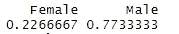

有了更多的类别，我们可以利用条形图来描述分布。但是对于数字数据，绘制分布图可能更具挑战性。这是因为单个数据点可能不是唯一的。一个人可能报告他/她的身高为 68.897 英寸，而另一个人可能报告同样的身高为 68.503 英寸。很明显这些人是分别从 175 和 174 英寸换算出来的身高。

这种条目的表示需要分布函数。这就是“累积分布函数”概念发挥作用的地方。随机变量 X 的 CDF 定义为，

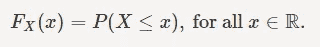

让我们假设 X 是一个离散随机变量，范围 R = {x1，x2，x3…}并且范围 R 从下面有界(即 x1)。下图显示了生成的 CDF 的一般形式。CDF 是一个非减函数，当 x 变得足够大时，它趋近于 1。

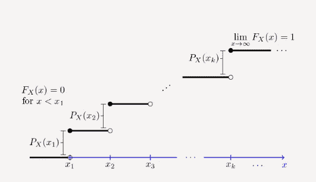

来源:https://www.probabilitycourse.com/chapter3/3_2_1_cdf.php

# 柱状图

回到高度的数据集示例，当我们为它构建 CDF 时，我们需要评估它是否回答了重要的问题，如分布集中在哪里，哪个范围包含大多数数据，等等。虽然 CDF 可以帮助回答这类问题，但它要困难得多。

相比之下，我们现在利用直方图来更好地理解数据。只要看一眼剧情，霸王就能从中推断出重要的信息。

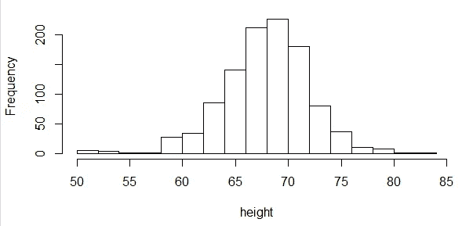

我们可以在 69 英寸左右对称分布，大部分数据位于 63 到 74 英寸之间。有了这种近似，我们总是会丢失一些信息。在这种特殊情况下，影响可以忽略不计。

# 密度图

我们还可以利用平滑的密度图来显示数据的分布。在平滑噪声的同时，图中的峰值有助于识别大部分值集中的区域或范围。

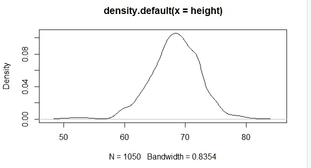

密度图优于直方图的一个主要优点是，它们更能确定分布的形状。例如，具有比如说 5 个面元的直方图不会像 15 个面元的直方图那样产生可区分的形状。然而，在使用密度图时，不存在这样的问题。

# 正态分布

让我们更进一步，计算这个数据集的平均值和平均偏差。我们都熟悉正态分布的含义。当您从独立来源的随机数据集合中绘制点时，它会生成一条钟形曲线(或高斯曲线)。在这个图表中，曲线的中心将给出数据集的平均值。

以下是 R 中用于生成正态分布函数的内置函数:

1.  **dnorm()** —用于针对给定的平均值和标准差，找出每个点的概率分布的高度。

```
x <- seq(-20, 20, by = .1)
y <- dnorm(x, mean = 5, sd = 0.5)
plot(x,y)
```

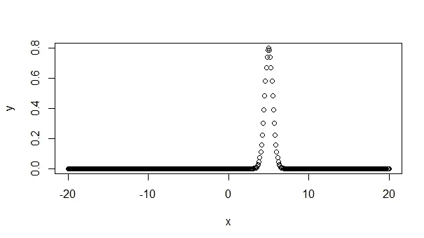

**2。pnorm()** —也称为“累积分布函数”(CDF)，pnorm 用于找出正态分布随机数小于给定数值的概率。

```
x <- seq(-10,10,by = .2)
y <- pnorm(x, mean = 2.5, sd = 2)
plot(x,y)
```

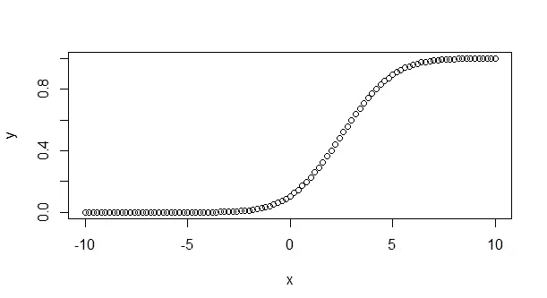

**3。qnorm()** —获取概率值并给出一个数字，其累积值与概率值匹配。

```
x <- seq(0, 1, by = 0.02)
y <- qnorm(x, mean = 2, sd = 1)
plot(x,y)
```

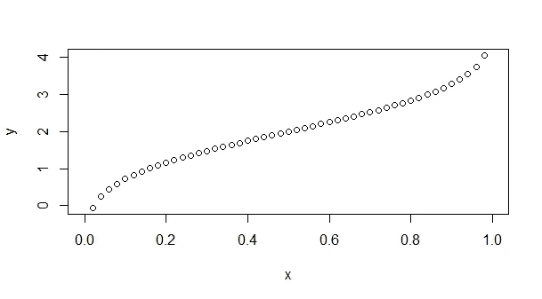

**4。rnorm()** —该函数用于生成正态分布的随机数。

```
y <- rnorm(50)
hist(y, main = "Normal DIstribution")
```

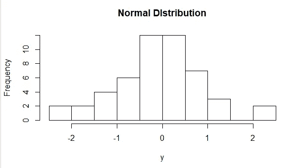

**正态分布方程:**


```
# define x as vector of male heights

library(tidyverse)

library(dslabs)

data(heights)

index <- heights$sex=="Male"

x <- heights$height[index]# calculate the mean and standard deviation manually

average <- sum(x)/length(x)

SD <- sqrt(sum((x - average)^2)/length(x))# built-in mean and sd functions 

average <- mean(x)

SD <- sd(x)

c(average = average, SD = SD)
```

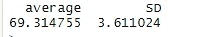

在数据集高度的情况下，这种分布以平均值为中心，大多数数据点在平均值的两个标准偏差范围内。我们观察到这种分布仅由两个参数定义——均值和标准差，因此这意味着如果数据集遵循正态分布，则可以用这两个值来概括。

在 R 中，我们利用函数标度来获得标准单位。数学上，标准单位定义如下:

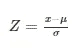

它基本上告诉我们一个物体 x(在这种情况下是高度)偏离平均值的标准偏差的数量。

```
# calculate standard units
 z <- scale(x)# calculate proportion of values within 2 SD of mean
 mean(abs(z) < 2)
```

平均值的-2 和+2 圈内的值的比例约为 95%,这正是正态分布的预测值。

但是我们如何检查这些分布是否是正态分布的近似值呢？

# **分位数—分位数图**

这里主要概念是，我们定义一系列比例 p，并基于定义的分位数 q，使得数据中低于 q 的值的比例是 p。因此，如果数据的分位数等于正态分布的分位数，我们可以得出数据近似正态分布的结论。

现在让我们计算样本和理论分位数，以检查数据点是否落在同一直线上。

```
# calculate observed and theoretical quantiles
p <- seq(0.05, 0.95, 0.05)
observed_quantiles <- quantile(x, p)
theoretical_quantiles <- qnorm(p, mean = mean(x), sd = sd(x))# make QQ-plot
plot(theoretical_quantiles, observed_quantiles)
abline(0,1)
```


事实上，这些值落在单位线上，这意味着这些分布很好地近似为正态分布。

***注:***

*a)分位数的特例，百分位数是定义 p = 0.01，0.02，0.03…时得到的分位数。，0.99*

*b)四分位数是第 25、50 和 75 个百分位数，第 50 个百分位数给出了中值。*

# 箱线图

如果数据集不符合正态分布，并且两个参数(均值和标准差)不足以汇总数据，会发生什么情况？箱线图在这种情况下会很有帮助。将数据集分为三个四分位数，箱线图表示数据集中的第一个四分位数、第三个四分位数、最小值、最大值和中值。

让我们使用相同的“身高”数据集来创建学生性别(男/女)和身高之间关系的基本箱线图。

```
data(heights)
boxplot(height~sex, data=heights, xlab="Sex",ylab="height")
```

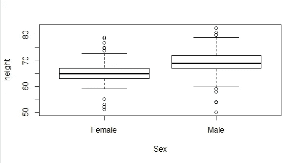

从上面的图中，我们可以推断出两组的标准偏差几乎是相似的，尽管平均来看，平均比女性高。

如果你想进一步了解测试统计中其他/不常见的分布，请参考 R Stats 包中的‘分布’(下面给出的链接)

 [## 分布

### 分布在统计包密度，累积分布函数，分位数函数和随机变量…

www.rdocumentation.org](https://www.rdocumentation.org/packages/stats/versions/3.6.2/topics/Distributions)