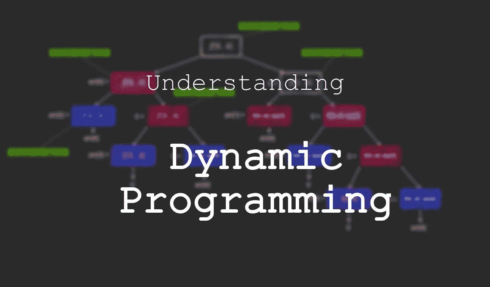
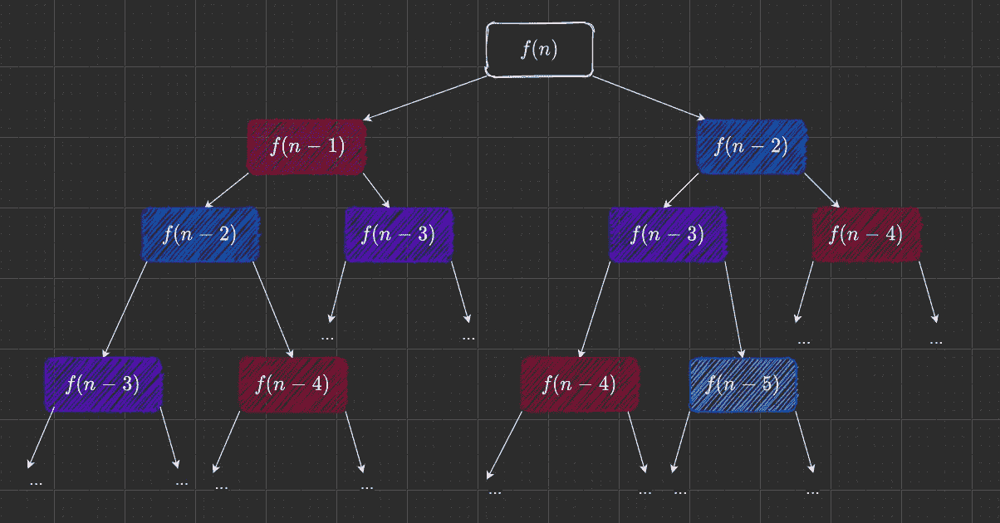
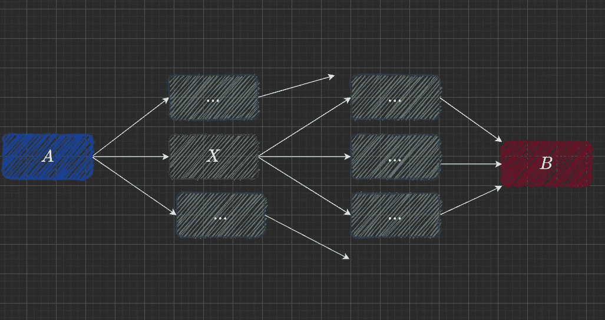
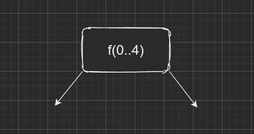
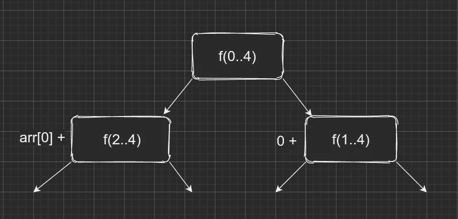
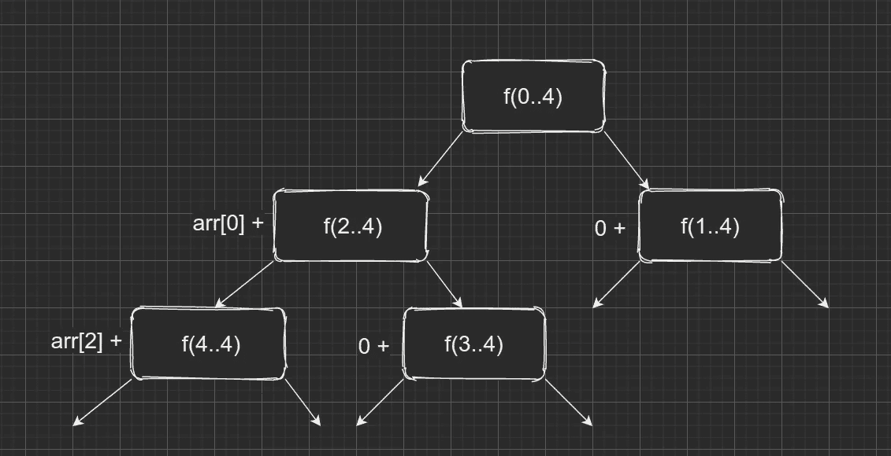
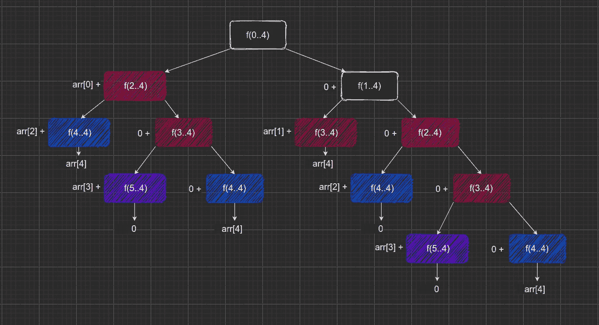
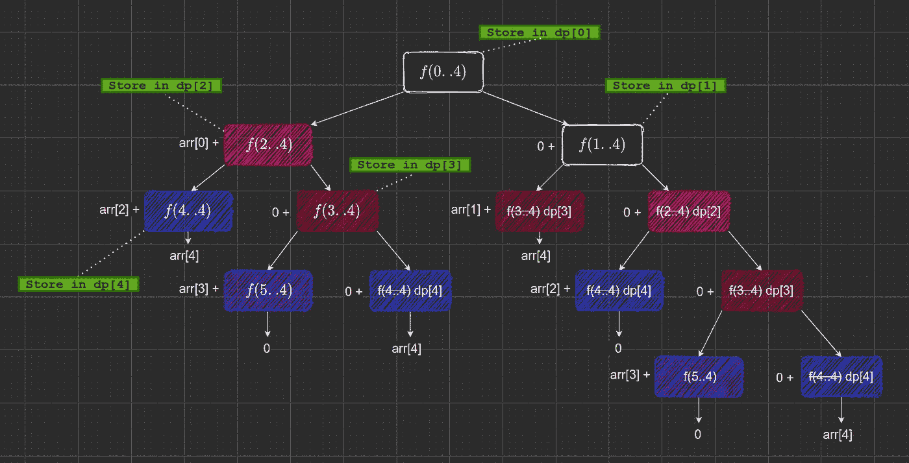
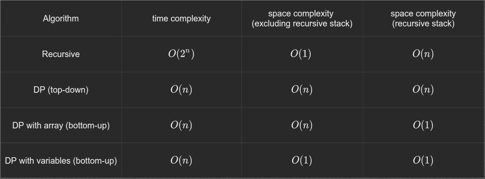

# 理解动态编程

> 原文：<https://towardsdatascience.com/understanding-dynamic-programming-75238de0db0d?source=collection_archive---------5----------------------->

## 流行优化技术的直观指南。



作者图片

**动态编程**，或称 DP，是一种优化技术。它被用于多个领域，尽管本文主要关注它在算法和计算机编程领域的应用。这是算法面试中经常被问到的话题。

由于 DP 不是很直观，大多数人(包括我自己！)经常发现将问题建模为动态编程模型很棘手。在这篇文章中，我们将讨论什么时候使用 DP，然后讨论它的类型，最后通过一个例子。

# 目录

```
**When is DP used?
**  - Overlapping Sub-problems
  - Optimal Substructure**The Two kinds of DP
**  - The top-down approach
  - The bottom-up approach**An example
**  - The Problem
  - The analysis
  - A recursive Solution
  - The base case
  - A dynamic programming approach
  - Improving the Algorithm
```

# 什么时候使用 DP？

要使 DP 工作，问题必须满足两个必要条件。

*   重叠子问题
*   最优子结构

让我们更详细地看一下这些。

## 重叠子问题

这个属性正是它听起来的样子:重复的子问题。但是为了使这个有意义，我们需要知道什么是子问题。

一个**子问题**只是手头问题的一个较小版本。在大多数情况下，这意味着传递给递归函数的参数值更小。

如果你在找一本书的某一页，你会怎么做？你可以把书翻到某一页，然后把你所在的页码和你要找的页码进行比较。

如果当前页面比要求的页面小，您将开始在当前页面和最后一页之间查找。另一方面，如果当前页码更大，您将开始在书的开头和当前页面之间搜索。

你会继续下去，直到你找到那一页。

如果你必须把它建模成一个递归函数，那会是什么样子？可能是这样的。

**注:** *以下代码片段以伪代码的形式编写，以提高可读性*

非常简单。有一个 ***getpage*** 函数返回我们正在寻找的页面( ***target_page*** ，此处)。该函数查看从 _ 页 到 _ 页 ***到 _ 页*** 之间的中间页，并检查是否匹配。

否则，该函数会查看我们正在查看的部分的左半部分或右半部分。

但是那两个对 ***getpage*** 的递归调用代表什么呢？您会注意到，在每次递归调用时，我们都将搜索空间减少了一半。我们现在做的是解决同一个问题，就是在更小的空间里，寻找一个特定的页面。我们在解决子问题。

**分而治之，**或 **DAC** 算法通过子问题的原理工作。“划分”部分指的是将一个问题分成子问题。像 mergesort 和 quicksort 这样的排序算法就是很好的例子。请注意，二分搜索法并不完全是 DAC 算法，原因很简单，它没有“合并”步骤，而实际的分治算法会合并其子问题的结果，以获得最终的解决方案。

既然我们已经回答了什么是子问题的问题，我们继续讨论另一个词:“**重叠**”。

当这些子问题需要解决不止一次时，就称之为重叠问题。查看调用图，计算第 n 个斐波那契项的值。

递归关系是:

```
the relation **f(n) = f(n - 1) + f(n-2)**the base case
**f(0) = 0
f(1) = 1**
```



递归斐波纳契调用树。f(n)是第 n 个斐波那契数——作者使用 [draw.io](https://app.diagrams.net/) 创建的图像。

这些调用用阴影表示重叠的子问题。相比之下，二分搜索法的子问题并不重叠。

## 最优子结构性质

最优子结构属性稍微复杂一些:它指的是在计算总体最优解时可以直接考虑子问题的最优解的场景。

举个简单的例子？说你要找从 ***A*** 到 ***B*** 的最短路径。设 ***X*** 为 ***A*** 和 ***B*** 之间的中间点，用**单边**将其连接到*。*

**

*使用中间节点寻找最短路径—作者使用 [draw.io](https://app.diagrams.net/) 创建的图像。*

*为了解决这个问题，我们可以找到从所有中间节点( ***X*** )到 B 的最短路径，然后找到从 A 到 X 的路径加上从 X 到 B 的最短路径，这是所有 X 中最短的。*

```
*shortest(A, B) = min(AX + shortest(X, B)) for all intermediate nodes X.*
```

*我们在这里做的是使用一个最优的中间解( ***【最短(X，B)】***)并使用它(而不是考虑子问题的每个解)来找到最终的最优答案。*

# ***两种 DP***

## *自上而下(记忆化)方法*

*在自上而下的方法中，我们从问题的最高层开始。在这种方法中，我们首先检查是否已经解决了当前的子问题。如果有，我们就返回那个值。如果没有，我们解决子问题。我们使用递归调用来解决我们的子问题。*

*由于这些调用需要解决我们以前没有见过的更小的子问题，我们继续这样做，直到我们遇到一个我们已经解决或知道答案的子问题。*

## *自下而上(制表)的方法*

*在这种方法中，我们从最底层开始，然后一路向上。因为我们从“基本情况”开始，并使用我们的递归关系，我们真的不需要递归，所以，这种方法是迭代的。*

*这两种方法的主要区别在于自底向上计算所有的解，而自顶向下只计算那些需要的解。例如，为了找到源和目的地之间的最短路径，使用自顶向下的方法，我们只计算最短路径附近的中间点的距离，在每个阶段选择最小值。*

*另一方面，在自底向上的方法中，我们最终计算网格上每个点和目的地之间的最短距离，最终返回从起点到终点的最短距离。*

*作为比较，让我们看一个可能的自顶向下和自底向上的函数，它返回第 n 个斐波那契项。*

*C++中自顶向下的动态编程解决方案*

*自底向上的动态规划解决方案*

*虽然这两种方法具有相同的渐近时间复杂度，但是自顶向下实现中的递归调用可能导致堆栈溢出，由于自底向上方法的迭代性质，这不是问题。*

*请记住，尽管我们迭代地实现了后者，但您的逻辑仍然会使用非常基本的递归方法中的递归关系，正如我们将在本例中看到的那样。*

# ***一个例子***

*让我们来看一个问题，我们将使用两种动态编程方法来解决这个问题。*

## *问题是*

*找出一个数组中元素的最大和，确保不包括相邻的元素。让我们假设没有元素是负的。*

```
***example 1:
[1, 2, 3]    => 1 + 3 = 4****example 2:
[1, 1, 1, 1] => 1 + 1 = 2****example 3:
[2, 5, 2]    => 5 = 5***
```

## ***分析***

*首先，让我们试试**贪婪的方法。***

*因为我们的目标是最大化我们选择的元素的总和，我们可以希望通过选择最大的元素，忽略它的邻居，然后继续这样做来实现这一点。在这里，我们确保每一步都有一个最大值。但是，这只有在局部情况下才是正确的，当然，我们正在寻找全球性的解决办法。*

*这种方法在某些情况下是可行的。*

```
***[1, 5, 1, 10, 1, 5, 1]***
```

*这里，我们首先选择 10，因为它是最大的元素。然后我们忽略它的邻居，这样我们就不会违反不允许选择相邻元素的条件。*

*接下来，我们选择两个 5，因为它们是下一个最大的元素，然后忽略它们的邻居。我们的算法到此结束，因为没有任何元素了。我们得到的结果——10+5+5——实际上是正确的答案。*

*但是这并不总是有效的。举以下例子:*

```
***[1, 1, 9, 10, 9, 1, 1]***
```

*在每一步，如果你选择了最大的元素，忽略了它的邻居，并继续这样下去，你最终会选择 10，然后 1，然后在忽略了两个 9 之后再次选择 1，这样加起来就是 12，但正确的答案应该是 1 + 9 + 9 + 1，也就是 20。*

*很明显，这种方法是不正确的。让我们从一个基本的递归解决方案开始，逐步发展到一个使用动态编程的解决方案。*

*这就是贪婪和动态编程方法之间的区别。贪婪方法关注的是尽最大努力在每一步实现目标，而 DP 则着眼于全局。与 DP 不同，使用贪婪的方法，不能保证最终会得到最优解。贪婪算法经常陷入局部最大值，导致次优解。*

## ***递归解***

*稍微思考一下，你可能会发现我们有一个条件需要记住:**没有相邻元素**。你可能会发现:*

*   *我们可以选择考虑求和中的一个元素，也可以忽略它*
*   *如果我们考虑它，我们将不得不忽略它的相邻元素*

*为了简洁起见，让 ***f(a..b)*** 代表调用到 ***f*** 我们的数组从索引 ***a*** 到索引 ***b*** (含两者)。那个函数 ***f*** 将代表我们的递归函数，它将解决这个问题。*

*所以 ***f(0..4)*** 表示从索引 0 到索引 4 运行该功能。*

**

*我们的函数调用表示—作者使用 [draw.io](https://app.diagrams.net/) 创建的图像。*

*从一个单元格指向的两个箭头代表我们对后续函数调用的选择。因为这是一个最大化问题，我们必须从这些选项中选择最大值。*

*让我们回到我们的数组。*

```
***[5, 10, 100, 10, 5]***
```

*记住上面讨论的条件，让我们实际写下我们将要做的事情。*

*我们的第一个调用将在整个数组上进行，如上所示，数组长度为 5。*

```
***f(0..4)***
```

*对于索引为 0 的元素(这里恰好是 5)，我们可以选择:*

*   ***将其包含在我们的总和中:**我们当前的总和将是 5 +数组其余部分的最大总和，但不包括下一个元素(索引 1)。这样，我们的和就变成了 ***5 + f(2..4)*** 。或者概括一下， ***arr[0] + f(2..4)****
*   ***排除它:**我们当前的和将正好等于剩余数组的最大和。这可以写成: ***0 + f(1..4)*** 。请注意，我们的下一个调用来自索引 1，而不是上一个案例中的 2。因为我们不考虑索引 0 处的元素，所以我们可以自由地考虑索引 1 处的元素——我们不会被迫忽略它。*

**

*我们函数的最初几次调用——作者使用 [draw.io](https://app.diagrams.net/) 创建的图像。*

*这里的图表直观地解释了这一点。如前所述，给定级别的所有箭头代表我们的选择，我们从中选择最大的一个。*

*所以我们最终的答案是:*

```
***f(0..4) = max(arr[0] + f(2..4), f(1..4))***
```

*让我们在下一次迭代中对此进行扩展。*

*首先，我们将为左边的树做这件事，它是 ***f(2..4)*。这就像我们第一次调用 f 时做的一样，记住 ***arr[0] +*** 部分还在。它将被加到 ***f 的值(2..4)*** 在返回调用树的途中。***

*我们的选择:*

*   ***考虑 *arr[2]* 在我们的 sum:** 我们这个阶段的 sum 就变成了 ***arr[2] + f(4..4)*** 。记住，因为我们考虑的是索引 2 处的元素，所以我们必须忽略下一个元素——索引 3。*
*   ***忽略 *arr[2]* :** 我们这里的 sum 与剩余数组的最大结果相同，无需忽略相邻元素。所以，那就是 ***f(3..4)*** 。*

**

*调用树的第三层——作者使用 [draw.io](https://app.diagrams.net/) 创建的图像。*

*就像以前一样，**的值为 *f(2..4)*** 将是我们两个选择中的最大值。*

```
***f(2..4) = max(arr[2] + f(4..4), f(3..4))***
```

## ***基地案例***

*你认为 ***f(4..4)*** 会评价到什么？按照我们的符号，它是我们对从索引 4 到索引 4 的数组进行函数调用的结果。这意味着我们在单个元素上调用函数。单个元素的最大和就是它本身。*

*另一件要记住的事情是:在 ***f(a..b)*** ，a 永远不应该大于 b。因为这个调用表示从索引 a 开始，一直到索引 b，所以如果*比*大，我们就必须返回 0。没有元素就没有最大和。***

***我们在这里有我们的基本情况。我们的函数 ***f*** 在单个元素上调用时，会直接返回该元素，如果不在有效范围内，则返回 0。没有进一步的递归调用。这就是为什么它被称为基础案例。***

**在我们的例子中，我们把**称为 *f(3..4)*** 导致对 ***f 的无效调用(5..4)*** ，我们通过返回 0 来处理。我们稍后将概括这一点。**

```
****f(4..4) = arr[4]
f(5..4) = 0****
```

## ****递归关系****

**让我们再看看我们的结果。**

```
**first call: **f(0..4) = max(arr[0] + f(2..4), f(1..4))**second call:
**f(2..4) = max(arr[2] + f(4..4), f(3..4))**the base case:
**f(4..4) = arr[4]
f(5..4) = 0****
```

**注意到前两个结果中的模式了吗？如果我们概括这些，我们得到:**

```
****f(a..b) = max(arr[a] + f(a+2 .. b), f(a+1, b))****
```

**这还不是我们关系的最简化版本。注意这里出现的 ***b*** 。实际上，回过头来看看我们在前一个块中的具体调用。**

**他们不会改变。没有 ***b + 1*** 或 ***b + 2*** 。总是 ***b*** 。而我们第一次调用中的 ***b*** 的值是多少？最后一个索引。由于 ***b*** 在我们整个算法中是常数，所以可以去掉。**

**我们的递归关系变成:**

```
****f(a) = max(arr[a] + f(a+2), f(a+1))****
```

**其中 ***f(a)*** 是从索引 ***a*** 起对数组的调用。**

**另一件要意识到的事情是，类似于我们如何移除*b，因为它总是等于数组中的最后一个索引，引用单个元素的基本情况只有在该元素是数组中的最后一个元素时才会发生。***

***我们基本情况的概括版本是:***

```
*****f(n-1) = arr[n-1]** where **n** is the size of the array
**f(a) = 0** if **a** >= **n** where **n** is the size of the array***
```

***因此，我们有我们的关系:***

```
*****f(a) = max(arr[a] + f(a+2), f(a+1))
f(n-1) = arr[n-1]** where **n** is the size of the array
**f(a) = 0** if **a** >= **n** where **n** is the size of the array***
```

***让我们基于这个关系实现递归方法。***

***这个函数可以这样调用:***

```
*****array := [1, 5, 2, 4, ...]
return f(array, 0)*****
```

***这会有多复杂？***

***如果我们根据数组的大小( ***n*** )来估算复杂度，我们会得到这样的结果:***

```
****T(n) = T(n-2) + T(n-1) + O(1)****T(0) = O(1)****
```

**直观地说，对大小为 n 的数组 f 的每个调用(表示为***【T(n)】***)都会导致对大小为 ***n-2*** 和 *n-1* 的数组 f 的两个调用。也就是说，在每个阶段，我们对 ***f*** 的调用次数都会翻倍。**

**渐近时间复杂度是指数级的。用上面的推理，我们得到**o(2^n).******

***这是对上限的一个宽松估计，因为 ***n-2*** 树必然会在 ***n-1*** 树之前结束，所以我们做的比加倍调用略少。实际的复杂度是***o(phi^n)—φ***是黄金比例—或者***【o(1.618^n】，*** 比我们原来的估计略小，但是还是坚持 **O(2^n)** 。***

**另一件要注意的事情是，上面的递归关系类似于第 n 个斐波那契项，因此会给出类似的复杂性。**

## **动态规划方法**

**这就是动态编程发挥作用的地方。**

****

**注意调用图中重复出现的子问题——作者使用 [draw.io](https://app.diagrams.net/) 创建的图像。**

**如果你仔细观察，你会看到我们之前谈到的重叠的子问题。**

**现在到了重要的部分——将这种递归实现转换成动态编程方法。如果我们存储正在重复的函数调用的值会怎么样？**

**让我们维护一个数组，其中第 I 个元素是 ***f(i)*** 的值，依次是从索引 ***i*** 到结尾的数组的最大和。**

```
****dp[i] = f(i..n) = f(i)****
```

**因为我们已经有了 f(i)的结果，**

```
****dp[i] = max(arr[i] + f(i + 2), f(i + 1))****
```

**现在我们有了这个关系，我们可以走两条不同的路。要么我们走自顶向下的路线，在这里我们的函数仍然是递归的，就像上面的结果一样，要么我们去掉所有的递归调用，走自底向上的路线。**

**我们将关注自底向上的路线，但是让我们讨论自顶向下的方法。**

## **-自上而下的方法**

**看看我们之前的结果。**

```
****dp[i] = max(arr[i] + f(i + 2), f(i + 1))****
```

**这就是我们实现自顶向下方法所需要的。对于任何对 ***f*** 的调用，我们将首先在我们的数组 ***dp*** 中检查我们之前是否已经进行了那个调用，如果已经进行了，我们将直接使用预先计算的值。**

**另一方面，如果我们正在进行的调用以前从未做过，我们必须计算整个事情。在这种情况下，一旦我们得到一个值，我们确保将它存储在我们的数组 ***dp*** 中，这样我们就不必重复整个过程。**

**调用树应该如下所示:**

****

**自顶向下动态编程方法中的调用树—作者使用 [draw.io](https://app.diagrams.net/) 创建的图像。**

**让我们实现这个算法。**

**存储子问题结果所需的额外空间随着输入数组的大小而线性增长。因此，除了递归堆栈所需的 ***O(n)*** 空间之外，我们还有一个 ***O(n)*** 空间用于 ***dp*** 数组，n 是输入数组的大小。**

**时间复杂度虽然更难计算，但与输入大小成线性关系。这是因为我们正在存储我们已经解决的子问题的答案，因此，我们有***【O(n)***个独特的子问题需要解决。这个结果也可以用我们使用自底向上方法得到的复杂度来验证。**

## **-自下而上的方法**

**回想一下，在这种方法中，我们试图通过遵循迭代方法来消除所有的递归调用，其中我们从基本情况或“底部”开始，并向上进行。**

**让我们用访问 ***dp*** 的元素来替换对 ***f*** 的其他调用。**

```
****dp[i] = max(arr[i] + dp[i + 2], dp[i + 1])****
```

**基例呢，***f(n-1)= arr【n-1】***？这将是数组 ***dp*** 的最后一个元素。**

```
****dp[n-1] = arr[n-1]****
```

**就这样，我们有了自下而上 ***dp*** 方法的解决方案！**

**让我们实现它，就像我们对递归方法所做的那样。**

**这个函数可以这样调用:**

```
****array := [1, 5, 2, 4, ...]
output(f(array))****
```

**这里的复杂性在空间和时间上都是线性的。**

**为什么？**

**我们正在运行单个 for 循环 ***n-1*** 次，并且在每次迭代中，我们都在执行常数时间操作——线性时间复杂度。**

**由于数组 ***dp*** 的大小取决于输入数组的大小——当然，这是可变的——我们的空间复杂度也是线性的。**

## ****改进算法****

**但是我们能做得更好吗？让我们看看。**

**在渐近时间复杂度方面，我们做不到更好。为了找到答案，我们必须检查数组的每个元素。所以我们做不到比线性时间更好。**

**但是空间复杂度呢？我们需要维护一个大小为 ***n*** 的数组来解决问题吗？**

**仔细观察 for 循环中的代码行:**

```
****dp[i] = max(arr[i] + dp[i + 2], dp[i + 1])****
```

**在任何时间点，我们需要填充的***DP【I】***就是 ***dp*** 中的下两个元素——在索引 ***i +1*** 和 ***i + 2*** 。没有理由保持我们所有的结果。我们只需要跟踪最后两次迭代。**

**让我们在这里使用三个变量。为了便于联系，我们将它们命名为***i0******i1***和***I2***。**

```
****dp[i]   --> i_0
dp[i+1] --> i_1
dp[i+2] --> i_2****
```

**注意，在我们循环的下一次迭代中，我们的循环计数器 **i** *，*变成了 ***i + 1*** ，因为我们在每次迭代中都在递减 ***i*** 。***DP【I+1】***将是下一个***DP【I+2】******DP【I】***将是下一个***DP【I+1】***和***DP【I+2】***——因为***DP【I+1】我们就不需要它了*****

**用我们的三个新变量替换它，循环中的代码变成:**

```
****i_0 := max(arr[i] + i_2, i_1)
i_2 := i_1
i_1 := i_0****
```

**我们初始化这些变量就像我们的数组实现一样。**

```
****dp[n-1] = arr[n-1] --> i_1 = arr[n-1]
dp[n] = 2          --> i_2 = 0****
```

**需要记住的最后一件事是:如果输入数组只有一个元素会怎样？我们的循环，从 ***n-2*** 到 ***0*** ，一次都不会运行。**

**因此，我们用值 ***i_1*** 初始化 ***i_0*** 。因此，如果循环从不运行—输入数组只有一个元素—返回 ***i_0*** 将返回 ***i_1*** 的值，这是数组中唯一的元素。**

**最后我们返回 ***i_0*** 而不是***DP【0】***。**

```
****return dp[0] --> return i_0****
```

**因此，我们最终的算法应该是这样的。**

**就像前面的动态编程方法一样，只需传入一个数组或对数组的引用就可以调用这个函数。**

```
****array := [1, 5, 2, 4, ...]
return f(array)****
```

**对于任意长度的数组，我们只需要三个变量。这样，我们算法的空间复杂度现在是 ***O(1)*** —常数。**

**总结我们的结果，**

****

**我们的实现摘要—作者使用 [draw.io](https://app.diagrams.net/) 创建的图像。**

**比较递归方法和我们的自顶向下方法，很明显**我们是在用空间复杂度换取更好的时间复杂度**。当然，因为两者都是递归的，所以它们有递归调用栈所需的额外空间。**

**同样，最低的两行是我们自底向上方法的结果。它们是迭代的，所以它们不需要在堆栈上递归存储函数记录。由于它们本质上与自顶向下方法的算法相同，所以它们具有相同的线性时间复杂度。**

**最好的情况是**自底向上的方法，需要 O(1)个空间**——这意味着我们的 dp 算法使用的空间不会随着输入大小 n 而改变。**

## ****代码****

**让我们用 C++实现我们的**常数空间自底向上动态规划**的最终算法。变量名和函数名与之前相同。**

****注意:**最后的空间复杂度优化步骤看起来稍微难一点，但是正如我们刚刚看到的，它极大地提高了您的空间利用率。看看你是否能在第 n 个斐波那契项的自下而上方法中找到类似的关系。**

# **结论**

**动态编程通常不太直观或简单。话说回来，大多数复杂的事情都不是。但是通过练习，事情会变得更容易。网上有大量的动态编程练习题，这将帮助你更好地了解何时应用动态编程，以及如何更好地应用它。希望这篇文章是一个好的起点。**