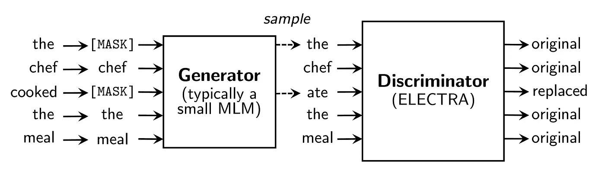
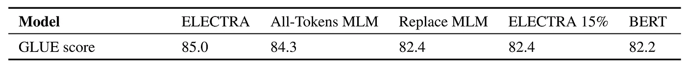
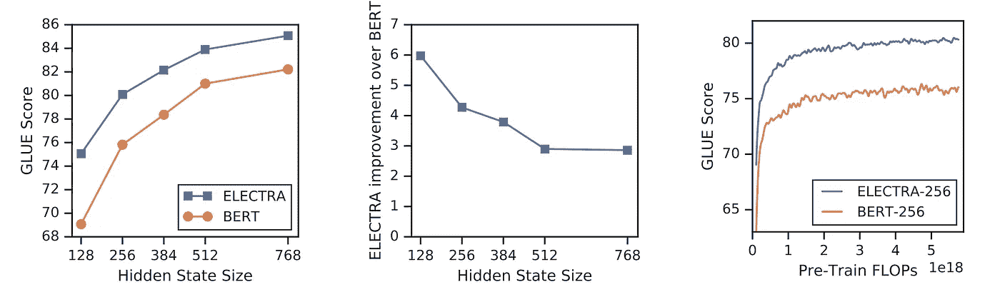
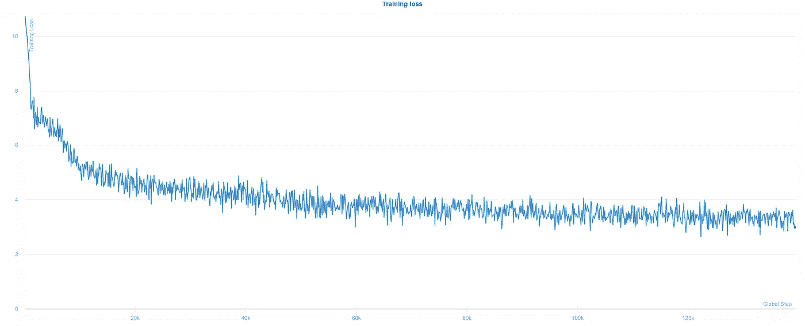
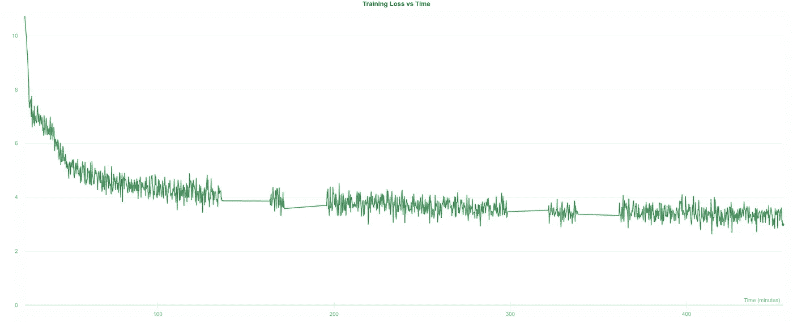

# 理解 ELECTRA 并训练一个 ELECTRA 语言模型

> 原文：<https://towardsdatascience.com/understanding-electra-and-training-an-electra-language-model-3d33e3a9660d?source=collection_archive---------6----------------------->

## 变形金刚模型如何学习语言？伊莱克特拉有什么新消息？如何在单个 GPU 上训练自己的语言模型？让我们来了解一下！


[https://pix abay . com/photos/woman-studying-learning-books-1852907/#](https://pixabay.com/photos/woman-studying-learning-books-1852907/#)

# 内容

*   介绍
*   什么是前期培训？
*   蒙面语言模型(MLM)
*   ELECTRA 预培训方法
*   ELECTRA 方法的效率增益
*   训练你自己的 ELECTRA 模型
*   装置
*   数据准备
*   语言建模模型
*   训练模型
*   扔掉发生器，得到鉴别器
*   微调预训练模型
*   总结

# 介绍

训练一个用于特定自然语言处理任务的转换器模型的过程相当简单，尽管可能不太容易*。*从一个随机初始化的 Transformer 模型开始，放在一起一个巨大的(我指的是*巨大的*)数据集，其中包含您感兴趣的一种或多种语言的文本，*在巨大的数据集上预先训练*Transformer，并且*使用您的特定任务数据集(可能相对较小)，在您的特定任务上微调*预先训练的 Transformer。

这种方法的优点是，最后一步(微调)只需要标记数据。就我个人而言，如果说我在深度学习方面的工作有什么不喜欢的地方，那就是给数据贴标签！我相信任何深度学习实践者都会同意，标记是耗时的、乏味的，并且可能容易出错。

## 什么是前期培训？

预训练是 Transformer model 学习 *model* 一种语言的过程。换句话说，转换器将学习表示文本序列的良好的、依赖于上下文的方式。这种知识可以在下游任务中重用，大大减少了所需的*任务特定的、标记为*的数据量，因为模型已经学习了语言特性，现在只需要*微调*其表示来执行特定的任务。对于预训练，在数据方面的唯一要求是大量(希望)干净的数据。不需要贴标签！我一想到如果有必要标记用于预先训练伯特的数十亿字节的文本，人们将不得不经历的折磨就不寒而栗。

这很好，但是转换器如何从大量未标记的文本中学习语言表示呢？嗯，最初的 BERT 模型依赖于两个预训练任务，***【MLM】***和 ***下一句预测*** 。在*下一句预测中，*该模型的任务是预测两个文本序列是否自然地相互跟随。据说这项任务有助于某些下游任务，如 BERT 论文中的问题回答和自然语言推理，尽管在后来的 RoBERTa 论文中显示这是不必要的，因为它只使用了*掩蔽语言建模。*不管怎样，我们更感兴趣的是第一种方法， **MLM** ，因为这正是 [**厄勒克特拉**](https://openreview.net/pdf?id=r1xMH1BtvB) 预训练法旨在改进的地方。

## 蒙面语言模型(MLM)

在屏蔽语言建模中，一定比例的记号*(记号是文本序列中一个单位的术语。它可以是一个单词或一个单词的一部分)*被屏蔽，并且该模型的任务是为屏蔽的记号预测原始记号。被屏蔽的标记可以用实际的屏蔽标记(例如[MASK])替换，或者用来自词汇表的另一个随机标记(模型已知的所有标记的集合)替换。

配备了这种预训练技术的 BERT 能够在许多下游 NLP 任务中粉碎先前设置的基准。然而， [ELECTRA 论文](https://openreview.net/pdf?id=r1xMH1BtvB)的作者注意到 **MLM** 方法只从任何给定例子的屏蔽记号(通常为 15%)中学习。这导致用 **MLM** 训练语言模型所需的计算资源大幅增加。 **MLM** 的另一个缺点是*掩码令牌*只出现在预训练阶段，而不会在微调或下游使用期间出现。这种差异也导致使用 **MLM** 训练的模型性能略有下降。

## ELECTRA 预培训方法

ELECTRA ( *E* 有效地 *L* 获得*E*n 以 *C* 分类 *T* oken *R* 替换 *A* 精确地)是一种新的预训练方法，旨在匹配或超过 **MLM** 预训练模型的下游性能，同时在预训练阶段使用明显更少的计算资源。ELECTRA 中的预训练任务基于检测输入序列中被替换的标记。这个设置需要两个变压器模型，一个发生器和一个鉴别器。



ELECTRA 预培训设置(来源— [ELECTRA 论文](https://openreview.net/pdf?id=r1xMH1BtvB))

让我们一步一步地分解训练前的流程。

1.  对于给定的输入序列，用一个**【掩码】**记号随机替换一些记号。
2.  *发生器*预测所有屏蔽记号的原始记号。
3.  *鉴别器*的输入序列是通过用发生器预测替换**【屏蔽】**标记构建的。
4.  对于序列中的每个令牌，*鉴别器*预测它是原始的还是已经被*生成器*替换。

*生成器*模型被训练来预测屏蔽记号的原始记号，而*鉴别器*模型被训练来预测在给定损坏序列的情况下哪些记号已经被替换。这意味着*鉴别器*损耗可以在**所有输入令牌**上计算，因为它对每个令牌执行预测。使用 **MLM** ，仅在**屏蔽令牌**上计算模型损失。这是两种方法之间的关键区别，也是 ELECTRA 效率更高的主要原因。

这种设置类似于 GAN(生成对抗网络)的训练设置，除了*生成器*没有被训练来试图欺骗*鉴别器*(因此它本身不是对抗的*)。此外，如果*生成器*碰巧正确预测了*屏蔽令牌*的原始令牌，则该令牌被认为是原始令牌(因为该令牌没有被破坏/改变)。*

**鉴别器*模型用于下游任务，而*发生器*在预训练后被丢弃。*

# *ELECTRA 方法的效率增益*

*ELECTRA 论文强调了 ELECTRA 预培训方法的主要改进，并阐明了为什么会看到这些改进。*

**除非另有说明，所有分数都是 ELECTRA 论文中给出的胶水基准分数。**

## *针对所有输入令牌和仅屏蔽令牌定义的损失*

*如前所述，*鉴别器*模型的损失是在序列中的所有记号上定义的，因为它必须预测每个记号是原始的还是替换的。为了证明这种差异的重要性，作者将 *ELECTRA* 模型与经过相同训练的模型 *(ELECTRA 15%)* 进行了比较，除了 *ELECTRA 15%* 只计算了*屏蔽令牌*的鉴频器损耗。胶水基准用于比较。*

*可以看出，原始的 *ELECTRA* 方法得到了 **85.0** 的分数，而 *ELECTRA 15%* 得到了 **82.4** 。(作为对比，*伯特*得了 82.2 分)*

**ELECTRA* 还与另一个模型*(全令牌 MLM)* 进行比较，其中*屏蔽令牌*被替换为*生成器预测*，该模型的任务是预测输入中所有令牌的原始身份。损失也是在所有输入令牌上计算的。*全代币 MLM* 车型得分 **84.3** ，超过*伯特的*82.2，直追*伊莱克特拉的* **85.0** 。*

*这清楚地表明，计算所有输入令牌的损失的能力显著地提高了预训练模型的性能。*

## *预训练和微调之间的屏蔽令牌差异*

*为此，将原始的*伯特*模型与使用 **MLM** 预训练目标训练的*(替换 MLM)* 模型进行比较，除了*屏蔽令牌*被替换为来自生成器的令牌而不是实际的【屏蔽】令牌。*

**取代 MLM* 车型得分 **82.4** ，略胜*伯特的*82.2。这种差异表明，预训练/微调差异对*伯特的*表现略有损害。*

*相比之下，从所有输入标记中学习似乎比解决*屏蔽标记*的预训练/微调不匹配具有更大的影响。*

*在表格中总结比较结果；*

**

*模型比较(来源— [ELECTRA 论文](https://openreview.net/pdf?id=r1xMH1BtvB))*

## *适用于较小型号的 ELECTRA 与 BERT*

*与 *BERT* 相比， *ELECTRA* 的性能增益在较小的模型尺寸下更大。*

**

*ELECTRA 和 BERT 之间的模型尺寸比较(来源— [ELECTRA 论文](https://openreview.net/pdf?id=r1xMH1BtvB))*

# *训练你自己的 ELECTRA 模型*

**ELECTRA* 预训练方法的一个巨大优势是可以在单个 GPU 上训练你自己的语言模型！*

*下面，我将向您展示如何使用[简单变形金刚](https://github.com/ThilinaRajapakse/simpletransformers)库来训练您自己的语言模型。*

## *装置*

1.  *从[这里](https://www.anaconda.com/distribution/)安装 Anaconda 或 Miniconda 包管理器。*
2.  *创建新的虚拟环境并安装软件包。
    `conda create -n simpletransformers python pandas tqdm`
    `conda activate simpletransformers`
    *
3.  *如果您使用 fp16 培训，请安装 Apex。请遵循此处的说明[。(从 pip 安装 Apex 给一些人带来了问题。)](https://github.com/NVIDIA/apex)*
4.  *安装简单变压器。
    `pip install simpletransformers`*

## *数据准备*

*我们将在世界语上训练我们的语言模型(灵感来自拥抱脸的教程[这里](https://huggingface.co/blog/how-to-train))。不会世界语也不用担心，我也不会！*

*为了预先训练一个模型，我们需要一个世界语的(最好是大的)文本语料库。我将使用莱比锡全集中的世界语文本文件。具体来说，我下载了以下数据集:*

1.  *2011 年—混合(100 万句)*
2.  *2012 年—新闻抓取(100 万句)*
3.  *2012 年—网络(100 万句)*
4.  *2016 —维基百科(30 万句)*

*通过使用更大的数据集，你应该能够改善结果。*

*下载数据集并将档案解压到一个目录`data/`。*

*将所有“句子”文件移动到`data/`目录中。*

**面向 Linux/bash 用户的脚本。(别人:你怎么不上 Linux？😉)**

```
*for d in */;
  do mv d/*sentences.txt .;
done;*
```

*如果您打开其中一个文件，您会注意到它们有两列，第一列包含索引，第二列包含文本。我们只需要文本，所以我们将删除索引，合并所有文本，并将文本分成训练和测试文件。*

*现在我们准备开始训练了！*

## *语言建模模型*

*在简单的转换器中，所有的语言建模任务都用`LanguageModelingModel`类来处理。在简单的转换器中执行任何 NLP 任务时，您都可以使用大量的配置选项，尽管您不需要设置每个选项(尽可能使用合理的默认值)。*

**常见配置选项及其用法列表* [*此处*](https://github.com/ThilinaRajapakse/simpletransformers#default-settings) *。**

**语言造型具体选项及其用法* [*此处*](https://github.com/ThilinaRajapakse/simpletransformers#additional-attributes-for-language-modeling-tasks) *。**

*以上要点建立了一个可以用来训练我们新模型的`LanguageModelingModel`。*

*在泰坦 RTX GPU 上，单个训练周期(采用这种配置)需要不到 2 个小时。为了加快训练速度，你可以增加`evaluate_during_training_steps`或者干脆关掉`evaluate_during_training`。*

*当用简单的转换器从零开始训练一个语言模型时，它会自动从指定的`train_file`为我们创建一个标记器。您可以通过在`train_args`中设置一个`vocab_size`来配置经过训练的分词器的大小。在我的例子中，我使用了 52000 个词汇。*

*您也可以根据需要配置*发生器*和*鉴别器*模型的架构。配置选项设置在`train_args`中的两个字典`generator_config`和`discriminator_config`中。ELECTRA 论文推荐使用尺寸为*鉴别器*的 0.25-0.5 倍的*发生器*型号。他们还建议减少隐藏层的数量，并保持*发生器*和*鉴别器*之间的其他参数不变。考虑到这一点，我为*鉴别器*和一个类似的*生成器*选择了一个*小(12 层)*架构，尽管隐藏层数只有原来的 1/4。*

```
*"generator_config": {"embedding_size": 128,"hidden_size": 256,"num_hidden_layers": 3,},"discriminator_config": {"embedding_size": 128,"hidden_size": 256,}*
```

**你可以在这里* *找到所有的架构配置选项及其默认值* [*。*](https://huggingface.co/transformers/model_doc/electra.html#electraconfig)*

## *训练模型*

*既然我们已经建立了模型，我们需要做的就是开始训练。*

*运行上面的脚本将开始训练我们的语言模型！*

**

*语言模型的训练损失*

*可以看看所有的训练进度信息(还有好多图表！)[这里](https://app.wandb.ai/thilina/Esperanto%20-%20ELECTRA?workspace=user-thilina)在 Wandb 上。*

*令人惊讶的是，ELECTRA 预训练方法让我们可以在几个小时内，在单个 GPU 上训练一个全新的语言模型！下面的图表讲述了完整的故事。*

**

*培训损失与时间*

**曲线的平坦部分是简单变压器进行评估的地方。遗憾的是，我忘了为评估设置一个更大的批量，所以评估比预期慢了很多。**

## *扔掉发生器，得到鉴别器*

*当使用 ELECTRA 预训练方法时，通常在训练后丢弃*发生器*，仅使用*鉴别器*。为此，一旦训练完成，简单的变压器将分别保存*发生器*和*鉴别器*。*

*但是，如果您在训练完成前终止训练，您的模型将被保存为一个包含*鉴别器*和*生成器*的`LanguageModelingModel`。为了分别提取*鉴别器*或*发生器*，您可以使用`save_discriminator()`或`save_generator()`方法。*

*下面的脚本演示了如何加载一个`LanguageModelingModel`并分别提取*生成器*模型。*

*这将把在`outputs/best_model`中找到的经过训练的语言模型加载到`LanguageModelingModel`中，然后只把鉴别器保存到`discriminator_trained/discriminator_model`中。*

## *微调预训练模型*

*现在我们有了一个可以“理解”世界语的模型，我们可以继续在一个特定的 NLP 任务中对它进行微调。为此，我们可以使用拥抱脸提供的世界语中的词性标注数据集([训练](https://s3.amazonaws.com/datasets.huggingface.co/EsperBERTo/data/pos-train.txt)和[标签](https://s3.amazonaws.com/datasets.huggingface.co/EsperBERTo/data/pos-labels.txt))。*

*在我的例子中，我下载了文件并保存到`data/pos-tagging`。*

*利用这一点，我们可以在词性数据集上将我们的 ELECTRA 预训练模型(即*鉴别器*)训练为`NERModel`。(关于变形金刚的命名实体识别的更多信息，你可以在这里查看我的文章*

*结果如下:*

```
*eval_loss = 0.18994220502207695f1_score = 0.9025234264922376precision = 0.9197880191456026recall = 0.8858950119055756*
```

*如您所见，该模型只需几个小时的训练就能在下游任务中表现出色！*

# *总结*

*伙计们，这就是如何用 ELECTRA 从头开始训练一个全新的语言模型*！**

*我对这种可能性感到兴奋，因为 ELECTRA 应该大大降低训练自己的语言模型的计算资源障碍。希望我们将会看到越来越多的语言模型被开发出来用于世界上所有的语言！*

*一如既往，一个巨大的大喊拥抱脸和他们的[变形金刚](https://github.com/huggingface/transformers)库，谁的工作使这一切成为可能！*