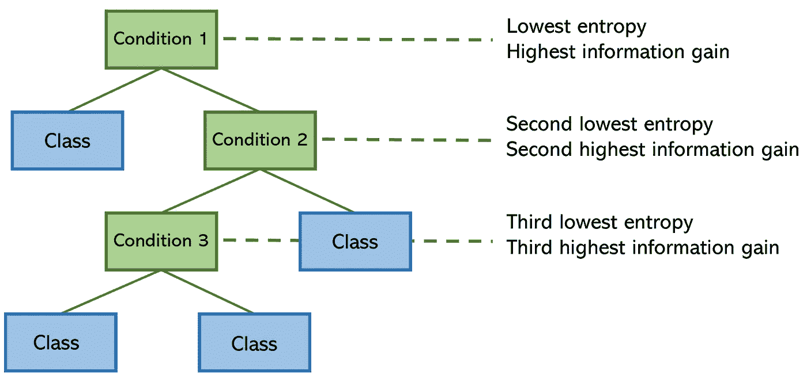
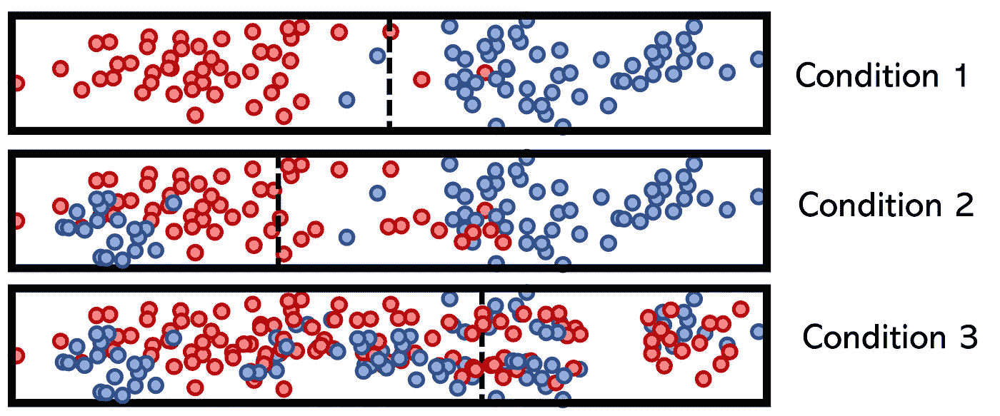
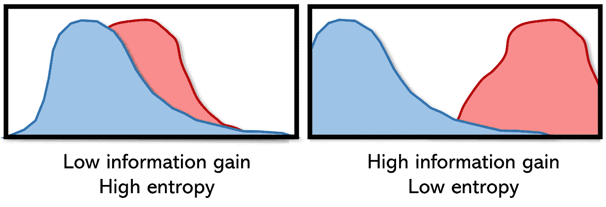

# 理解熵:机器学习的黄金标准

> 原文：<https://towardsdatascience.com/understanding-entropy-the-golden-measurement-of-machine-learning-4ea97c663dc3?source=collection_archive---------11----------------------->

来源: [Unsplash](https://unsplash.com/photos/Ai7sV3SSMIQ)

## 从决策树到神经网络

**TL；DR:** 熵是对系统中混沌的一种度量。因为它比其他更严格的指标(如准确性或均方误差)更具动态性，所以使用熵来优化从决策树到深度神经网络的算法已经显示出可以提高速度和性能。

它在机器学习中无处不在:从决策树的构建到深度神经网络的训练，熵都是机器学习中必不可少的度量。

熵源于物理学——它是对系统中无序或不可预测性的一种度量。例如，考虑一个盒子里的两种气体:最初，系统具有低熵，因为这两种气体是完全可分的；然而，一段时间后，气体混合，系统的熵增加。据说，在一个孤立的系统中，熵永远不会减少——没有外力，混沌永远不会变暗。

例如，考虑掷硬币——如果掷硬币四次，事件出现`[tails, heads, heads, tails]`。如果你(或一个机器学习算法)要预测下一次掷硬币，你将能够以任何确定性预测结果——该系统包含高熵。另一方面，带有事件`[tails, tails, tails, tails]`的加权硬币具有非常低的熵，根据当前的信息，我们几乎可以肯定地说下一个结果将是反面。

大多数适用于数据科学的场景都介于极高熵和极低熵之间。高熵意味着低信息增益，低熵意味着高信息增益。信息增益可以被认为是系统中的纯度:系统中可用的干净知识的数量。

决策树在其构造中使用熵:为了尽可能有效地将输入沿着一系列条件导向正确的结果，具有较低熵(较高信息增益)的特征分裂(条件)被放置在树上较高的位置。

为了说明低熵和高熵条件的概念，假设要素的类别由颜色(红色或蓝色)标记，分割由垂直虚线标记。

决策树计算特征的熵，并对它们进行排列，使得模型的总熵最小(信息增益最大)。从数学上来说，这意味着将最低熵条件放在顶部，这样它可以帮助它下面的分裂节点减少熵。

决策树训练中使用的信息增益和相对熵被定义为两个概率质量分布 *p* ( *x* )和 *q* ( *x* )之间的“距离”。它也被称为 kull back-lei bler(KL)散度或运土机距离，用于训练生成的对抗性网络，以评估生成的图像与原始数据集中的图像相比的性能。

神经网络最喜欢的损失函数之一是交叉熵。无论是分类的、稀疏的还是二元交叉熵，该度量都是高性能神经网络的默认定位损失函数之一。它还可以用于优化几乎任何分类算法，如逻辑回归。像熵的其他应用一样，如联合熵和条件熵，交叉熵是熵的许多严格定义中的一种，适合于一个独特的应用。

交叉熵，像库尔巴克-利伯散度(KLD)，也处理两个分布 *p* 和 *q* 之间的关系，代表真实分布 *p* 和近似分布 *q* 。然而，KLD 度量的是两个分布之间的相对熵，而交叉熵度量的是两个分布之间的“总熵”。

该度量被定义为使用模型分布 *q* 对来自具有分布 *p* 的源的数据进行编码所需的平均比特数。如果我们考虑一个目标分布 *p* 和近似值 *q* ，我们会想要减少使用 *q* 而不是 *p* 来表示一个事件所需的比特数。另一方面，相对熵(KLD)测量在分布 *q* 中表示来自 *p* 的事件所需的*额外*比特数。

交叉熵可能看起来像是一种度量模型性能的迂回方法，但它有几个优点:

*   基于准确性/误差的度量有几个问题，包括对训练数据的顺序极度敏感，不考虑置信度，并且对可能给出错误结果的数据的各种属性缺乏鲁棒性。它们是非常粗糙的绩效衡量标准(至少在训练期间)。
*   交叉熵度量信息内容，因此比仅仅强调勾选所有方框的指标更加动态和健壮。预测和目标被视为分布，而不是一系列等待回答的问题。
*   它与概率的性质密切相关，尤其适用于 sigmoid 和 SoftMax 激活(即使它们仅用于最后一个神经元)，有助于减少消失梯度问题。逻辑回归可以被认为是二元交叉熵的一个版本。

虽然熵并不总是最好的损失函数——特别是在目标函数 *p* 没有明确定义的情况下——但它通常会提高性能，这解释了它为什么到处存在。

通过在机器学习中使用熵，它的核心组成部分——不确定性和概率——可以通过交叉熵、相对熵和信息增益等概念得到最好的表达。熵在处理未知方面是显而易见的，这是建模中非常需要的。当模型基于熵进行优化时，它们能够带着更高的知识和目的感在不可预测的平原上漫游。

# 感谢阅读！

如果你对最新的文章感兴趣，可以考虑[订阅](https://andre-ye.medium.com/subscribe)。如果你想支持我的写作，通过我的[推荐链接](https://andre-ye.medium.com/membership)加入 Medium 是一个很好的方式。干杯！

 [## 每个 ML 工程师都需要知道神经网络的可解释性

### 可解释的人工智能:激活最大化，灵敏度分析，等等

towardsdatascience.com](/every-ml-engineer-needs-to-know-neural-network-interpretability-afea2ac0824e)  [## 每个机器学习算法都可以表示为一个神经网络

### 算法中的算法

towardsdatascience.com](/every-machine-learning-algorithm-can-be-represented-as-a-neural-network-82dcdfb627e3) 

> 除非另有说明，所有图表均由作者创建。