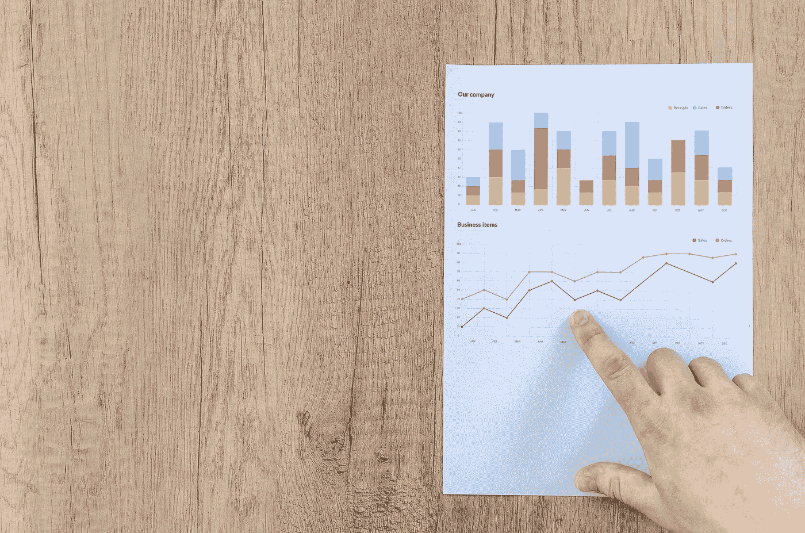
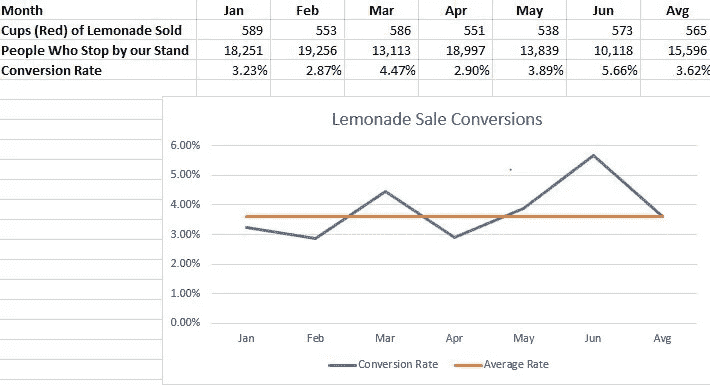

# 了解实验指标

> 原文：<https://towardsdatascience.com/understanding-experiment-metrics-ecb0d759f743?source=collection_archive---------54----------------------->

## 定义基线测量和转换率

照片由 [Pexels](https://www.pexels.com/photo/background-board-chart-data-590041/?utm_content=attributionCopyText&utm_medium=referral&utm_source=pexels) 的 [Lukas](https://www.pexels.com/@goumbik?utm_content=attributionCopyText&utm_medium=referral&utm_source=pexels) 拍摄

在我的实验设计系列的第一部分[思考实验设计](/thinking-about-experimental-design-f7f3090c7b6d)，我们讨论了实验的基础:目标、条件和度量。在本帖中，我们将离开最初的实验设置，开始理解基线指标以及选择适当的转换指标和比率的细微差别。

# **简介**

我介绍了一个商业环境中的实验的目标，使用柠檬水摊位的例子:在可比较的时间范围内，在*受控条件下*(杯子的颜色)，测量结果(售出杯子的数量)的*差异。在这个例子中，我没有提到任何实验的一个关键要素——**一个假设**，一个基于有限证据的初步推测。严格地说，实验的目的是验证或反驳一个假设提出的观点。对于我们的柠檬水摊位示例，一个合理的假设可能是“柠檬水杯子的颜色影响售出的杯子数量。”*

# **从基线开始**

如果我们刚刚开始我们的柠檬水摊位(或其他小企业/业务线)，你能看到立即设计这个特定的实验(或任何实验)来验证一个假设的问题吗？撇开市场调查不谈，我们没有任何可靠的(由硬数据支持的)预测来预测我们售出的杯子数量！

如果我们红色杯子的前两周销量很差，接下来的两周蓝色杯子的销量有所增加，我不会轻易得出蓝色杯子更好的结论。销售额的突然变化可能是因为人们在开业前几周不知道我们的摊位，直到最近才发现我们的摊位。记住，**实验的目标是了解增量变化的效果。**当我们引入一个大的变化(即开始我们的摊位或彻底改造我们的店面)，我们将不稳定性引入我们现有的业务，这将掩盖和/或扭曲我们的实验条件的影响。

> 在进行实验之前，重要的是建立一个稳定的基线，用于判断我们的增量变化的效果。

为了让我们的例子更具体，假设我们已经经营了一年半的柠檬水摊位。我们在社区中相对知名，但是我们已经没有办法继续发展我们的业务了。在对我们的业务目标进行优先排序并对相关转化指标和比率*进行头脑风暴后，我们决定分析转化指标:

> 售出的杯子数量/光顾我们摊位的人数。

我生成了一些虚拟数据，代表我们去年的月销售额。我们的业务相对于转换率的稳定性。现在，当我们引入我们的实验条件(改变杯子的颜色)时，我们有了一个可靠的可预测的基线转化率(平均 3.62%)，我们可以用它来比较我们的新结果。

作者图片

# **思考我们转化率的变化**

在这一点上，很容易忘记我们的目标指标是转换率，并开始头脑风暴的增量变化，增加售出的杯子数量。**使用转换率而非绝对值要求我们将关注点从单一指标扩展到两个相关指标之间的关系，从关注规模扩展到关注规模效率&。**

为了提高我们的转换率，我们必须制定一个策略，使售出杯子的数量增长速度快于光顾我们摊位的人数增长速度。改变杯子的颜色或设计可能是一个有趣的商业计划；这是假设我们相信人们驻足我们的摊位主要是为了柠檬水和我们漂亮的摊位，而不是因为杯子的颜色。

从商业角度来看，我们经常读到使用数据和实验来提供可操作的见解。除了我们的基线速率之外，在我们的每个实验条件下设定合理的目标速率也很重要；我们不想对转换率的任何微小变化采取行动。设定目标转换率既是一门科学，也是一门艺术，可以基于过去的数据和直观的商业感觉。在我们的柠檬水的例子中，我们可以说，如果我们的转换率在接下来的几个月里是 4.12%，增加了 0.5%，我们将改变杯子的颜色。

# **结论:**

总结一下我们在柠檬水示例中取得的成果:

1.  我们定义了我们的商业目标:*增加售出的杯子*

2.我们定义了我们的转换指标和转换率:*售出的杯子&售出的杯子/客流量*

3.我们开发了一个可控的增量变化，它将(假设地)影响我们的结果

4.我们建立了一个比较稳定的基线。

如果我们的转换指标达到了目标，我们就可以在新的条件下开展业务，对吗？不完全是。

到目前为止，你可能已经意识到，我没有在我们的实验中引入任何统计数据！在这一点上，可能还不完全清楚为什么我们需要统计数据来验证我们的假设和完成我们的实验。尽管如此，在处理这种不确定性时，我们需要一种量化决策过程的方法；我们用统计学来量化实验证据的强度。在本系列的下一篇文章中，我将开始介绍基本统计概念和检验统计的思想，因为它们适用于我们的实验设计。

[1]:莫妮卡·瓦希。(2020).*实验设计的数据科学。领英学习。*[https://www . LinkedIn . com/learning/the-data-science-of-experimental-design](https://www.linkedin.com/learning/the-data-science-of-experimental-design)

[2]: *图标&图片。像素:*[https://www.pexels.com/](https://www.pexels.com/)