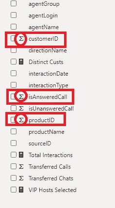
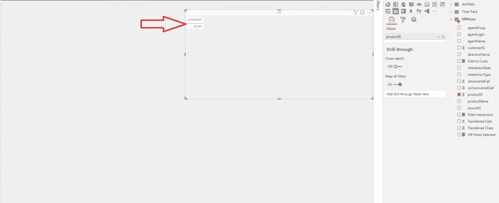
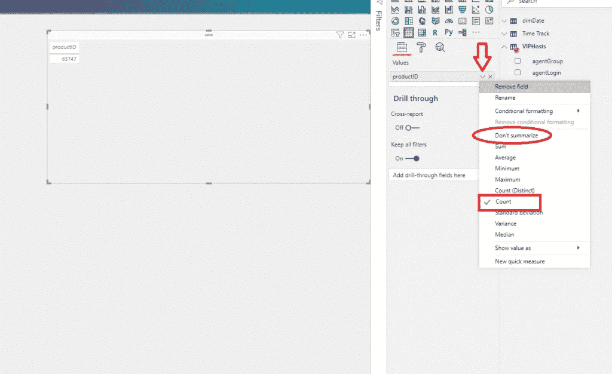
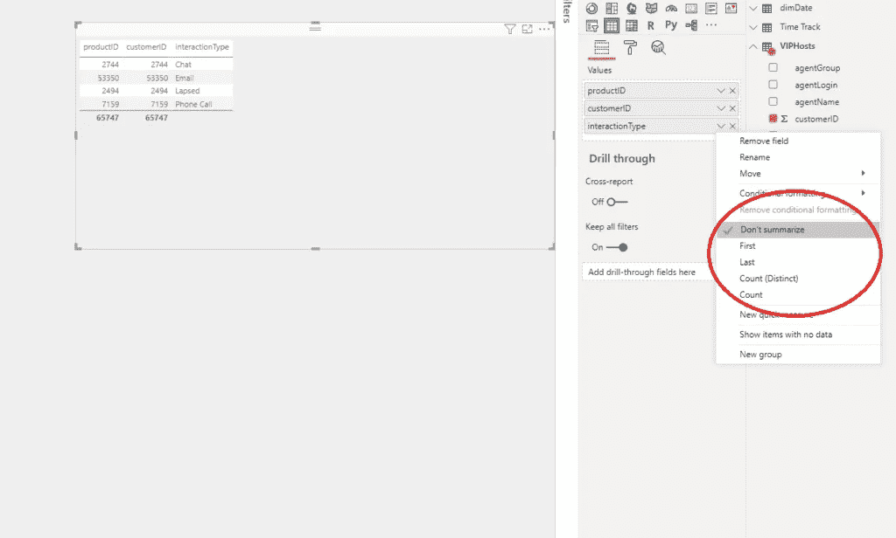
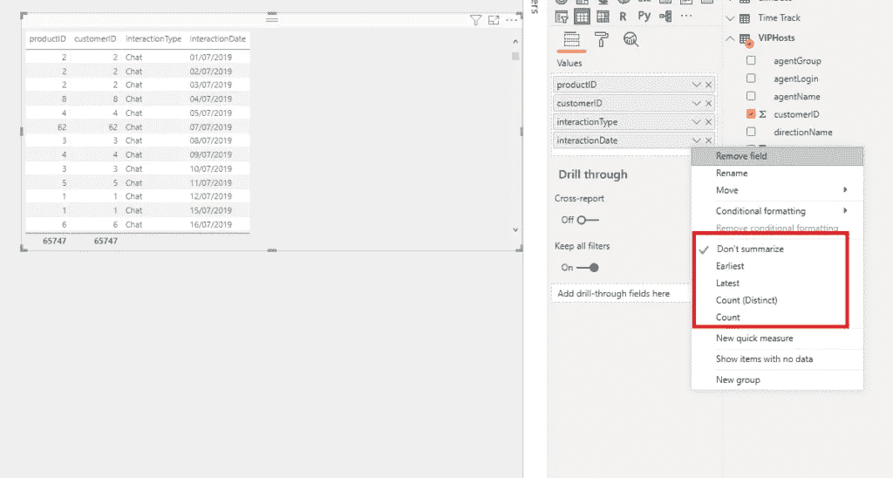
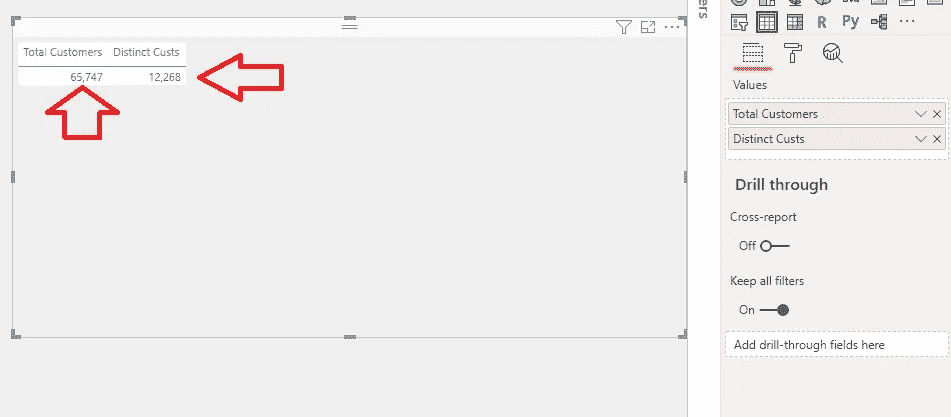
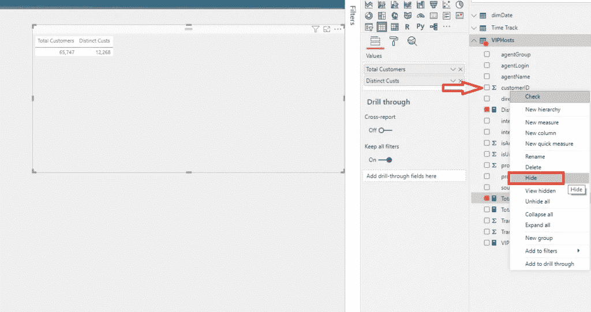
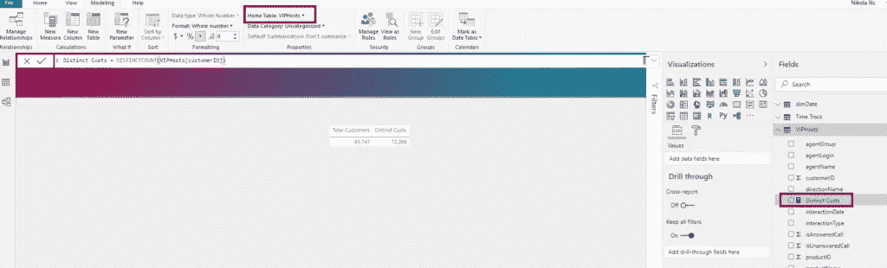
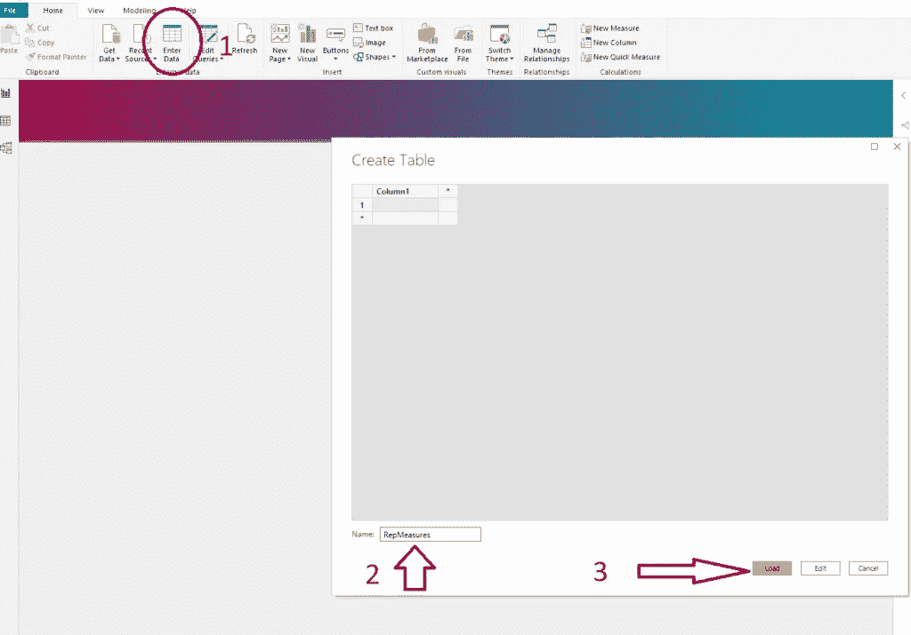
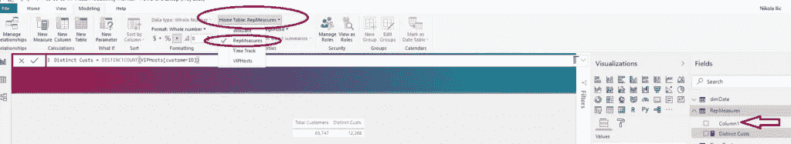

# 理解 Power BI 中的显式和隐式度量

> 原文：<https://towardsdatascience.com/understanding-explicit-vs-implicit-measures-in-power-bi-e35b578808ca?source=collection_archive---------3----------------------->

## 检查 Power BI 数据模型中隐式和显式度量之间的重要差异，以及为什么您应该考虑避免更简单的方法


Alex Andrews 在 Pexels.com 拍摄的照片

对于新的 Power BI 用户来说，最具挑战性的概念之一是理解度量和计算列之间的差异。或者说得更具体一点，概念本身并不是什么大问题，但 Power BI 菜鸟最让人望而生畏的，就是要明白什么时候用哪个。

因为我已经写了计算列和度量值的[用例，并且简要解释了当您想要使用其中每一个时的不同场景，所以在最近的数据之星会议上，我有一个问题要解释显式和隐式度量值之间的区别。我已经在这里](https://data-mozart.com/powerbi/calculated-columns-vs-measures-in-power-bi/)简短地回答了[，但是我答应为这个话题写一篇单独的文章。](https://data-mozart.com/learning/new-stars-of-data-qa/)

因此，在本文中，我将只关注度量，并尝试深入解释显式和隐式度量之间的差异。

## 隐性的，显性的……什么？！

好了，你已经听说过功率 BI 中的度量，就是这样。现在究竟什么是隐性措施？！还是露骨？不要惊慌，继续阅读，我向你保证，在这篇文章结束时，你会对这两者有很好的理解，以及它们的主要优点和缺点是什么。

***隐性措施—【感谢】动力匕***

首先，我知道我们都喜欢[自动为我们](/how-i-speed-up-my-power-bi-report-5x-155255415895)创造的东西，Power BI 在这方面做得很好。Power BI 为我们做的事情之一是创建隐式度量。



正如您在上面的插图中所注意到的，Power BI 识别了我们的数据模型中的数值字段，并自动用适马符号对它们进行了标记。这意味着，一旦将这些列值拖到报表视图中，就会对它们进行汇总。

让我们看看这在现实中是如何工作的:



我将我的 productID 列拖到表 visual 中，我看到 Power BI 自动应用了某种聚合。现在，您可以定义要应用于特定列的聚合类型，或者根本不进行聚合(提示:选择不汇总选项):



这里，Power BI 对我的 productID 列执行了 Count aggregate 函数。看着上面的图片，人们可以(太)容易地得出结论，当使用隐式度量时有很大的灵活性-您可以在一组预定义的聚合之间进行选择，甚至包括花哨的统计计算，如标准差、方差或中位数…所有这些，只需单击一下！

***那么，既然(几乎)一切都已经为我们预烤好了，为什么还要有人费心去写 DAX 呢？***

在我向您展示为什么使用隐式度量会回来困扰您之前，让我简单地概述一下隐式度量如何在您的数据模型中与非数值字段[一起工作。](/how-to-reduce-your-power-bi-model-size-by-90-b2f834c9f12e)



我的文本字段 InteractionType 可以总结为四种不同的方式:First、Last、Count (Distinct)和 Count。当然，它也可以是非汇总的，就像上面的例子一样。

类似地，日期列也提供了自己的一组预定义聚合:



## 隐性措施的局限性

无论通过使用自动创建的度量来节省时间和精力的可能性看起来多么有吸引力，您都应该尽量避免，因为它有一些明显的缺点。

假设您有一个非加性或半加性的度量，比如产品的单价，或者银行账户余额。您不希望在报告中简单地对这些值求和，因为这不是这些度量的预期行为。因此，如果使用隐式度量，很容易发生您的报告产生意想不到的错误结果。

隐式度量的另一个限制是不能在多个不同的聚合类型中使用它们。假设我既想知道我的客户总数，又想知道独特客户的总数。通过使用隐式度量，我只能选择其中一个选项…

## 明确的措施=更大的灵活性！

[使用 DAX 语言以显式方式编写度量](/dynamic-filtering-in-power-bi-5a3e2d2c1856)，在开始时需要更多的时间和精力，因为你需要做一些手工工作。但是，你以后会结出果实的，相信我。

回到我们之前的挑战—在我们的报告中显示客户总数和唯一(独特)客户总数可以使用显式方法轻松解决:

```
Total Customers = COUNT(TableName[CustomerID])
Total Unique Customers = DISTINCTCOUNT(TableName[customerID])
```



因此，正如您所注意到的，我们使用同一个列作为多个不同度量的引用，以产生期望的结果。

虽然隐式度量可以支持一些非常基本的场景，但是一旦您的报表需要更复杂的计算，您就必须切换到显式度量。

然而，使用显式度量而不是隐式度量的主要优点是它们的 ***可重用性*** 。您只需定义一次度量，就可以根据需要多次引用它。

另一个明显的好处是更容易维护数据模型。如果创建基本显式度量，例如:

```
Sales Amt = SUM(TableName[Sales Amount])
```

您可以在 20 个不同的衡量标准中使用此衡量标准作为参考(例如，计算毛利润、年同比等。)!如果需要更改任何后台逻辑，只需在一个地方(在基本度量中)进行更改，所有引用的度量将自动应用新的逻辑。

## 措施—最佳实践

现在，您已经了解了隐式和显式度量之间的区别以及使用后者的明显优势，让我总结一些关于在您的报告中使用度量的最佳实践:


Pexels.com 上永恒幸福的照片

*   ***不要忘记正确设置度量值的格式*** —这意味着，如果您正在处理与金钱相关的值(例如销售额)，您可能希望将它们设置为货币格式。与格式保持一致，如果你的数字限制在两位小数，那么在整个报告中坚持使用它
*   ***一旦您完成了基于特定列的显式度量的创建，您应该在报表*** 中隐藏该列。这样，您就可以防止对该列的不充分使用(例如，对账户的银行余额进行简单求和)。因此，作为数据建模者，您负责汇总选项



在本例中，我定义了“客户总数”和“唯一客户总数”度量值，所以我不希望有人执行 customerID 的求和。因此，我将隐藏字段列表中的 customerID 列。

*   ***将您的度量组织到单独的文件夹中*** —当您的报表只有几个度量时，这不是问题。但是，当您需要操作数十甚至数百个度量时，事情会变得更加复杂。为了防止这种情况，我总是使用下面的技巧来更好地组织我的度量。默认情况下，该度量将位于您创建它的表中。您可以通过单击该度量来更改它，然后在建模选项卡下，更改该特定度量的主表:



然而，这只是将度量从一个表移动到另一个表，并不能解决问题。为了解决这个问题，我需要创建一个全新的表，只保存我的度量。

在 Home 选项卡下，选择 Enter Data 并创建一个名为 RepMeasures:



单击 Load，您将在模型中看到一个新表。之后，单击您的度量，并在 Home 表下选择 RepMeasures。

最后，只需简单地删除第 1 列，就可以了。



这样，您可以对您的度量进行分离和分组。相信我，这将使您的生活变得更加容易，尤其是当您在报表中创建多个度量时。

## 结论

正如我已经说过的:我们都喜欢走一条更容易的路来实现我们的目标。这是完全合理的，Power BI 是您在这条道路上的“最好的朋友”。

但是，在选择采用哪种方法时，有许多重要的考虑因素需要考虑。我不想说:千万不要用隐性措施！通过写这篇文章，我只是想指出在使用它们时一些可能的陷阱和限制，以及为什么您仍然应该更喜欢写显式的方法。

感谢阅读！

成为会员，阅读 Medium 上的每一个故事！

订阅[这里](http://eepurl.com/gOH8iP)获取更多有见地的数据文章！