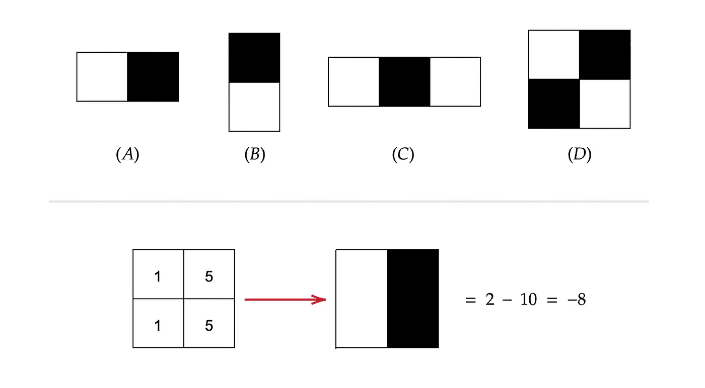
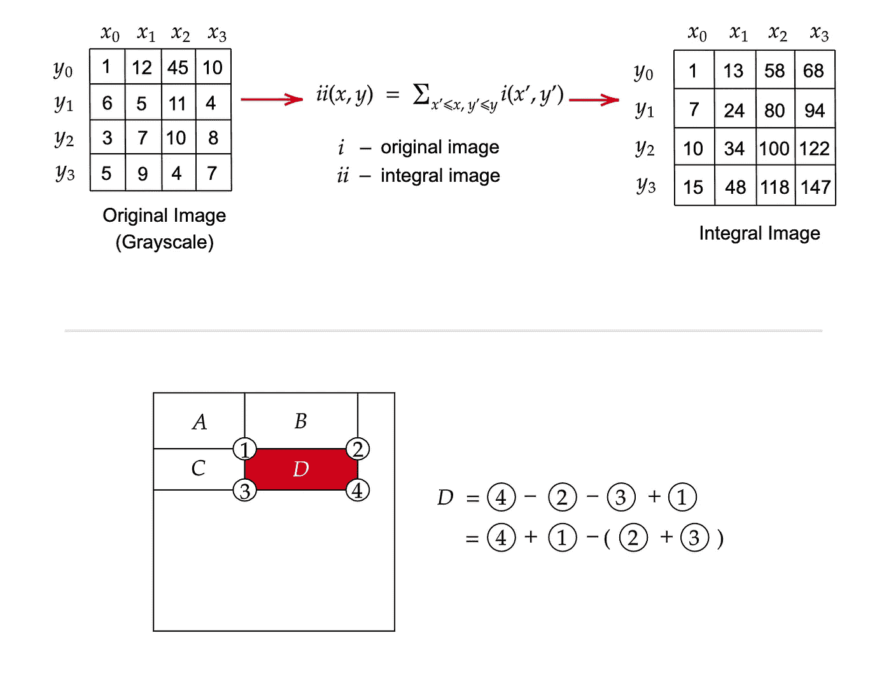
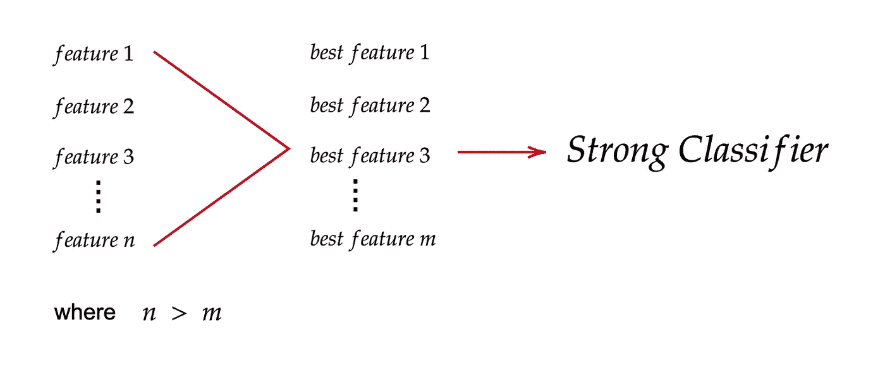
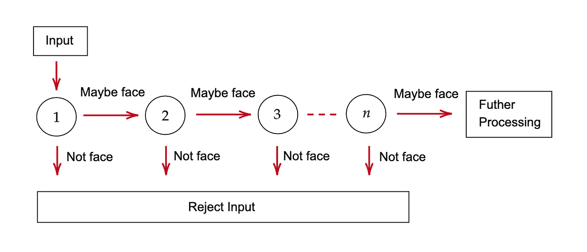
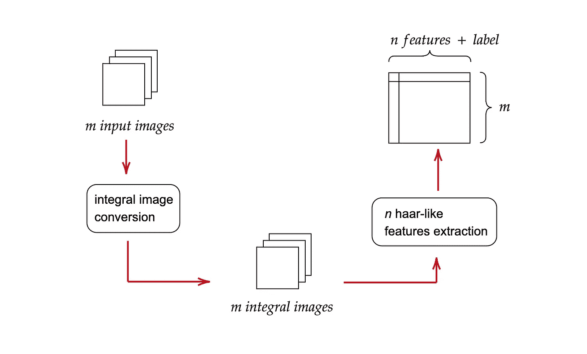
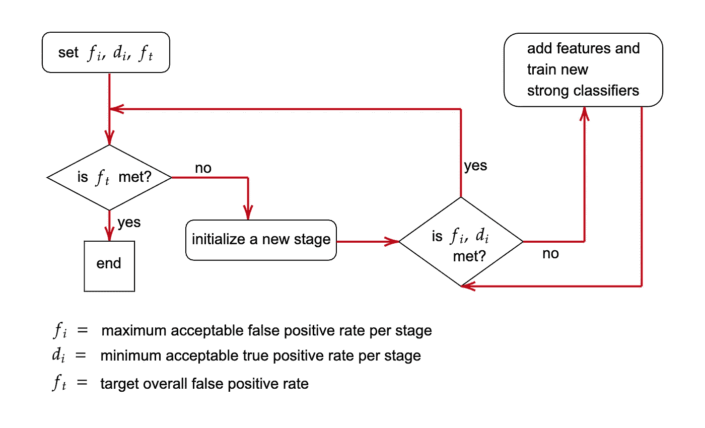

# 用 Viola-Jones 对象检测框架理解人脸检测

> 原文：<https://towardsdatascience.com/understanding-face-detection-with-the-viola-jones-object-detection-framework-c55cc2a9da14?source=collection_archive---------11----------------------->

## 了解最流行的人脸检测框架之一

在我的毕业照中检测到面孔

# 一.动机

从 Instagram 滤镜到自动驾驶汽车，计算机视觉技术现在已经深深融入了许多人的生活方式。一个重要的计算机视觉应用是让计算机检测图像中的物体的能力。在这些对象中，人脸最受关注，因为它在安全和娱乐方面有许多有用的应用。因此，本文主要关注一个流行的人脸检测框架，称为 Viola-Jones 对象检测框架。

> 这里的目的是向您提供对框架的理解，以便您可以放心地使用 OpenCV 提供的开源实现。我想帮助您理解幕后发生的事情，并希望让您更加欣赏 OpenCV 这样的库为您处理所有的复杂性。如果你想要一个“从头开始”的实现，可以参考 Anmol Parande 的这个 [Python 实现](https://github.com/aparande/FaceDetection)。我也推荐你看看 Ramsri 关于这个话题的[视频](https://youtu.be/WfdYYNamHZ8)。

# 二。概念

由 Paul Viola 和 Michael Jones 早在 2001 年开发的 Viola-Jones 对象检测框架可以快速准确地检测图像中的对象，并且特别适合人脸(Viola & Jones，2001)。尽管年代久远，该框架仍然是人脸检测领域的领军人物，与其 CNN 的许多对应部分不相上下。Viola-Jones 对象检测框架结合了*类 Haar 特征*、*积分图像*、*AdaBoost 算法*和*级联分类器*的概念，创建了一个快速准确的对象检测系统。因此，为了理解框架，我们首先需要单独理解这些概念，然后弄清楚它们是如何连接在一起形成框架的。

> 如果您已经了解下面的概念，并且只是想知道这些概念是如何协同工作的，您可以跳到第三部分。

## 类哈尔特征

图 1:类哈尔特征(上)和如何计算它们(下)。

通常在计算机视觉中，特征是从输入图像中提取的，而不是直接使用它们的强度(RGB 值等)。类似哈尔的特征就是一个例子。其他例子包括[方向梯度直方图](https://en.wikipedia.org/wiki/Histogram_of_oriented_gradients)(HOG)(LBP)等。类哈尔特征由暗区域和亮区域组成。它通过取亮区域的强度之和并减去暗区域的强度之和来产生单个值。有许多不同类型的 Haar-like 特征，但是 Viola-Jones 对象检测框架只使用图 1 中的那些。不同类型的 Haar-like 特征让我们从图像中提取有用的信息，例如边缘、直线和对角线，我们可以用它们来识别对象(即人脸)。

## 整体图像

图 2:原始图像到积分图像的转换(上)以及如何使用积分图像计算矩形区域(下)

积分图像是图像的中间表示，其中积分图像上的位置值( *x* ，y)等于原始图像上( *x 【T7， *y* )位置上方和左侧(包括两端)的像素之和(Viola & Jones，2001)。这种中间表示是必不可少的，因为它允许快速计算矩形区域。为了说明，图 3 示出了红色区域 D 的总和可以在恒定时间内计算，而不是必须遍历该区域中的所有像素。由于提取 Haar-like 特征的过程包括计算暗/亮矩形区域的总和，积分图像的引入大大减少了完成这项任务所需的时间。*

## AdaBoost 算法

图 3:使用 AdaBoost 算法的目的是从 n 个特征中提取最佳特征。注意:最佳特征也称为弱分类器。

AdaBoost(自适应增强)算法是一种机器学习算法，用于在所有可用特征中选择最佳特征子集。该算法的输出是一个分类器(也称为预测函数、假设函数)，称为*“强分类器”*。强分类器由*【弱分类器】*(最佳特征)的线性组合组成。从高层次来看，为了找到这些弱分类器，该算法运行 *T* 次迭代，其中 *T* 是要找到的弱分类器的数量，由您设置。在每次迭代中，该算法会找出所有特征的错误率，然后选择该次迭代中错误率最低的特征。

> 你可以参考 StatQuest 的这个有趣的[视频](https://www.youtube.com/watch?v=LsK-xG1cLYA)来更详细地了解 AdaBoost 算法

## 级联分类器

图 4:级联分类器

级联分类器是一种多级分类器，可以快速准确地进行检测。每个阶段由 AdaBoost 算法产生的强分类器组成。从一个阶段到另一个阶段，强分类器中的弱分类器的数量增加。输入是按顺序(逐级)评估的。如果用于特定阶段的分类器输出否定结果，则输入被立即丢弃。如果输出为正，则输入被转发到下一级。根据 Viola & Jones (2001)，这种多阶段方法允许构建更简单的分类器，然后可以用于快速拒绝大多数负面(非面部)输入，同时在正面(面部)输入上花费更多时间。

# 三。基于 Viola-Jones 目标检测框架的人脸检测

在学习了 Viola-Jones 对象检测框架中使用的主要概念后，您现在可以学习这些概念是如何协同工作的了。该框架包括两个阶段:培训和测试/应用。让我们一个一个来看。

## 培养

这一阶段的目标是为一个人脸生成一个级联分类器，它能够准确地对人脸进行分类，并快速丢弃非人脸。为此，您必须首先准备好训练数据，然后通过对该训练数据使用改进的 AdaBoost 算法来构建级联分类器。

1.  **数据准备**

> 概念:积分图像+类哈尔特征

图 5:数据准备过程

假设你已经有了一个由正样本(人脸)和负样本(非人脸)组成的训练集，第一步就是从那些样本图像中提取特征。Viola & Jones (2001)推荐图像为 24 x 24。由于每种类型的 Haar-like 特征在 24×24 窗口中可以具有不同的大小和位置，因此可以提取超过 160，000 个 Haar-like 特征。尽管如此，在这个阶段，需要计算所有 160，000+ Haar-like 特征。幸运的是，积分图像的引入有助于加速这一过程。图 5 展示了数据准备的整个过程。

**2。用改进的 AdaBoost 算法构建级联分类器**

图 6:构建级联分类器的过程

> 概念:AdaBoost 算法+级联分类器。

可以想象，直接使用全部 160，000+个特征，计算效率很低。Viola & Jones (2001)提出了两种解决方案。首先，使用 AdaBoost 算法将特征数量减少到只有少数有用的特征。其次，将剩余的特性分成几个阶段，并以逐阶段(级联)的方式评估每个输入。Viola & Jones (2001)设计了 AdaBoost 算法的修改版本，以便能够训练级联分类器。图 6 显示了 Ramsri 在其视频(Ramsri，2012)中提供的算法的简化版本。

> 在他们的论文中，Viola & Jones (2001)提到他们的级联分类器有 38 个阶段(38 个强分类器)，由超过 6000 个特征组成。

**测试/应用**

图 7:Viola-Jones 对象检测框架中的滑动窗口检测过程

想象一下，我们需要检测上图中的人脸。Viola & Jones (2001)使用滑动窗口方法，其中不同比例的窗口在整个图像上滑动。比例因子和移动步长是供您决定的参数。所以对于上图，有 *m* 子窗口来评估。对于子窗口 *i* ，框架将该子窗口的图像大小调整为 24 x 24 的基本大小(以匹配训练数据)，将其转换为完整的图像，并通过在训练阶段产生的级联分类器进行馈送。如果子窗口通过级联分类器中的所有阶段，则检测到人脸。

# 四。结论

总之，您已经了解了 Viola-Jones 对象检测框架及其在人脸检测中的应用。今天的许多技术都受益于保罗·维奥拉和迈克尔·琼斯的工作。通过理解框架如何工作，你可以自信地实现你自己的工作版本，或者使用 OpenCV 提供的开源实现。我希望我的解释能让你朝着那个方向前进，并促使你使用这个令人敬畏的框架创造出令人惊叹的技术。

*喜欢这篇文章并想表达您的支持？关注我或者给我买咖啡*

# 参考

岑，K. (2016)。*Viola-Jones 实时人脸检测器的研究*。检索自[https://web . Stanford . edu/class/cs 231 a/prev _ projects _ 2016/cs 231 a _ final _ report . pdf](https://web.stanford.edu/class/cs231a/prev_projects_2016/cs231a_final_report.pdf)

h .詹森(2008 年)。*实现 Viola-Jones 人脸检测算法*。DTU 丹麦技术大学博士论文。检索自[https://pdfs . semantic scholar . org/40 B1/0e 330 a 5511 a 6a 45 f 42 c8 b 86 da 222504 c 717 f . pdf](https://pdfs.semanticscholar.org/40b1/0e330a5511a6a45f42c8b86da222504c717f.pdf)

Mordvintsev 和 k . Abid(2013 年)。基于哈尔级联的人脸检测。 *OpenCV-Python 教程*。检索自[https://opencv-python-tutro als . readthedocs . io/en/latest/py _ tutorials/py _ obj detect/py _ face _ detection/py _ face _ detection . html](https://opencv-python-tutroals.readthedocs.io/en/latest/py_tutorials/py_objdetect/py_face_detection/py_face_detection.html)

帕帕乔治欧，C. P .，柳文欢，m .，&波焦，T. (1998)。一个通用的目标检测框架。*第六届国际计算机视觉会议。*555–562。doi:101109/iccv . 1998.710772

拉姆斯瑞。(2012 年 9 月 16 日)。 *Viola Jones 人脸检测与跟踪讲解*。从 https://youtu.be/WfdYYNamHZ8[取回](https://youtu.be/WfdYYNamHZ8)

维奥拉，p .和琼斯，M. (2001)。使用简单特征的增强级联的快速对象检测。*2001 年 IEEE 计算机学会计算机视觉和模式识别会议论文集，1* ，I-511 — I-518。doi: 10.1109/CVPR