# 理解变脸者:一个新的变脸模型

> 原文：<https://towardsdatascience.com/understanding-faceshifter-a-new-face-swapping-model-983b81a9d37d?source=collection_archive---------30----------------------->

## 简单而完整的解释

如今，深度学习可以在图像合成和处理领域产生惊人的结果。我们已经看到了让虚构人物产生幻觉的网站、展示名人说出他们从未说过的话的视频和让人们跳舞的工具，这些都有足够的真实性来愚弄我们大多数人。其中一个新颖的壮举是 FaceShifter [1]，这是一个深度学习模型，可以交换图像中的人脸，性能超过最先进的技术。在本文中，我们将了解它是如何工作的。

# 问题陈述

我们有一个源人脸图像 Xₛ和一个目标人脸图像 Xₜ，我们希望生成一个新的人脸图像 Yₛₜ，它具有 Xₜ的属性(姿势、灯光、眼镜等)，但具有 Xₛ.人的身份图 1 总结了这一问题陈述。现在，我们继续解释这个模型。

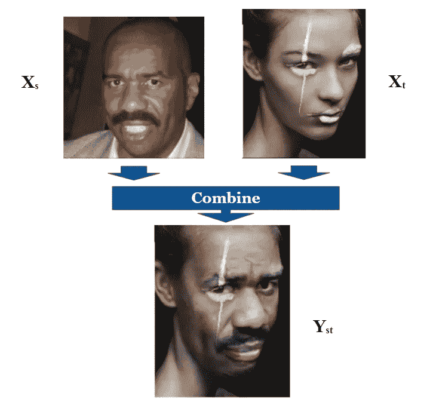

图一。换脸的问题陈述。显示的结果来自 FaceShifter 模型。改编自[1]。

# 变脸者模型

FaceShifter 由两个网络组成，分别叫做 AEI-Net 和 HEAR-Net。AEI-Net 产生一个初步的面部交换结果，而 HEAR-Net 对这个结果进行提炼。让我们打破这个管道。

# AEI-Net

AEI-Net 是“自适应嵌入式集成网络”的缩写。这是因为 AEI-Net 由 3 个子网络组成:

1.  身份编码器:将 Xₛ嵌入到描述图像中人脸身份的空间中的编码器。
2.  多级属性编码器:一种编码器，用于将 Xₜ嵌入到一个空间中，该空间描述了我们交换人脸时想要保留的属性。
3.  AAD 生成器:一个生成器，它整合了前面两个子网络的输出，生成了与 Xₛ.身份交换的 Xₜ的脸

AEI-Net 如图 2 所示。让我们充实它的细节。

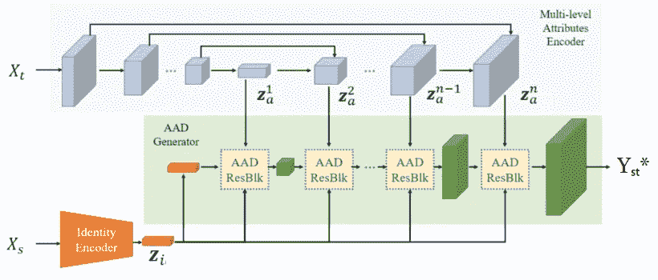

图二。AEI-Net 的体系结构。改编自[1]。

## 身份编码器

这个子网络将源图像 Xₛ投影到低维特征空间。输出只是一个向量，我们称之为 zᵢ，如图 3 所示。这个向量编码了 Xₛ人脸的身份，这意味着它应该提取我们人类用来区分不同人的人脸的特征，如他们眼睛的形状，眼睛和嘴巴之间的距离，嘴巴的曲率等等。

作者使用预先训练好的编码器。他们使用了一个经过人脸识别训练的网络。这有望满足我们的要求，因为区分人脸的网络必须提取与身份相关的特征。

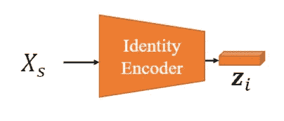

图 3。身份网络。改编自[1]。

## 多级属性编码器

这个子网对目标图像 Xₜ.进行编码它产生多个矢量，每个矢量以不同的空间分辨率描述 Xₜ的属性，特别是 8 个矢量，称为 zₐ.这里的属性指的是目标图像中人脸的配置，如人脸的姿势、轮廓、面部表情、发型、肤色、背景、场景照明等。如图 4 所示，它是一个具有 U 形网络结构的 ConvNet，输出向量只是上扩/解码部分中每一级的特征映射。请注意，这个子网不是预先训练的。

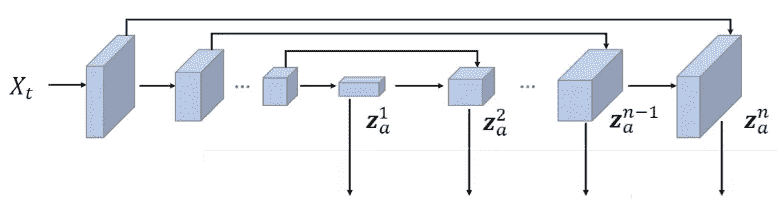

图 4。多级属性编码器体系结构。改编自[1]。

将 Xₜ表示为多个嵌入是必要的，因为在单个空间分辨率下使用单个嵌入将导致产生具有交换面的所需输出图像所需的信息丢失(即，有太多我们想要从 Xₜ保留的精细细节使得压缩图像不可行)。这在作者进行的消融研究中很明显，他们试图仅使用前 3 个 zₐ嵌入而不是 8 个来表示 Xₜ，这导致了图 5 中看到的更模糊的输出。

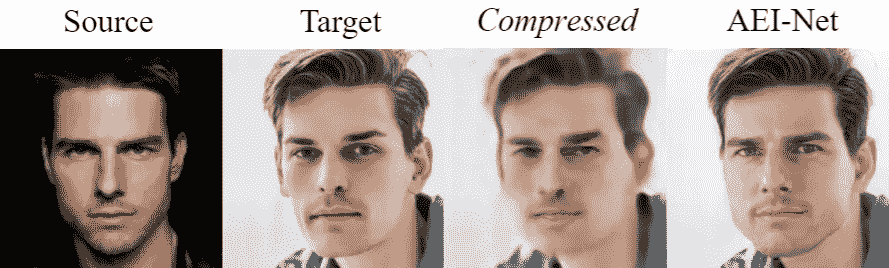

图 5。使用多个嵌入来表示目标的效果。如果我们使用前 3 个 zₐ嵌入，则输出是压缩的，当我们使用全部 8 个时，输出是 AEI 网。改编自[1]。

## AAD 发电机

AAD Generator 是“自适应注意反规范化生成器”的首字母缩写。它按照增加空间分辨率的顺序综合前两个子网络的输出，以产生 AEI-Net 的最终输出。它通过堆叠一个名为 AAD Resblock 的新块来实现，如图 6 所示。

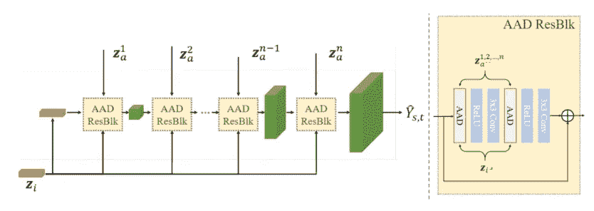

图 6。左图为 AAD 发生器架构，右图为 AAD ResBlock。改编自[1]。

这个模块的新部分是 AAD 层。让我们把它分成 3 个部分，如图 7 所示。第 1 部分从较高的层面告诉我们如何编辑输入要素地图 hᵢₙ，使其在属性方面更像 Xₜ。具体地说，它输出两个与 hᵢₙ大小相同的张量；一个包含将与 hᵢₙ中的每个像元相乘的缩放值，另一个包含移位值。第 1 部分图层的输入是属性向量之一。同样，第 2 部分将告诉我们如何编辑 hᵢₙ的特征地图，使其在身份上更像 Xₛ。

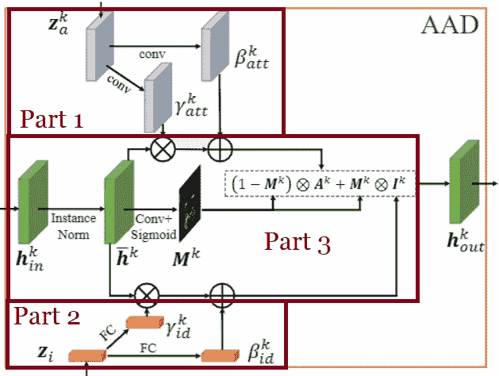

图 7。AAD 层的架构。改编自[1]。

第 3 部分的任务是选择我们应该在每个单元/像素上听哪个部分(2 或 3)。例如，在与嘴相关的细胞/像素处，这个网络会告诉我们多听第二部分，因为嘴与身份更相关。这在图 8 所示的实验中得到了实证。

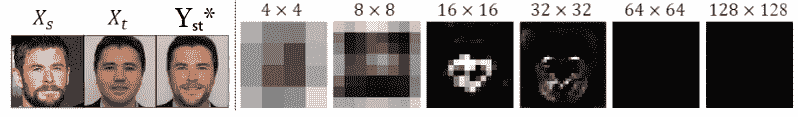

图 8。展示 AAD 层第三部分所学内容的实验。右图显示了整个 AAD 生成器在不同步长/空间分辨率下的第 3 部分输出。明亮的区域表示我们应该听身份(即第二部分)的细胞，黑色区域用于听第一部分。注意，在高空间分辨率下，我们主要听第一部分。改编自[1]。

因此，AAD 生成器将能够一步一步地构建最终图像，其中在每一步中，在给定身份和属性编码的情况下，它决定放大当前特征地图的最佳方式。

现在，我们有一个网络，AEI 网，可以嵌入 Xₛ和 Xₜ，并以一种实现我们目标的方式整合他们。我们将把 AEI 网的输出称为 Yₛₜ*.

## 培训损失

一般来说，损失是我们希望网络做什么的数学公式。训练 AEI-Net 有 4 个损失:

1.  我们希望它输出一个真实的人脸，所以我们会像任何一个 GAN 一样有一个对抗性的损失。
2.  我们希望生成的人脸具有 Xₛ.的身份我们拥有的唯一代表同一性的数学物体是 zᵢ.所以，这个目标可以用下面的损失来表示:

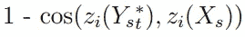

3.我们希望输出具有 Xₜ.的属性为此的损失是:

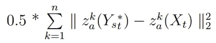

4.作者基于以下想法增加了另一个损失，即如果 Xₜ和 Xₛ实际上是相同的图像，网络应该输出 Xₜ:

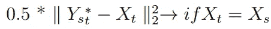

我相信这最后的损失是必要的，以推动 zₐ实际编码属性，因为它不像 zᵢ.预先训练据猜测，如果没有它，AEI 网络可能会忽略 Xₜ，让 zₐ只生产零。

我们的总损失只是以前损失的加权总和。

# 听觉网络

AEI-Net 是一个完整的网络，可以进行面部交换。然而，它在保留遮挡方面不够好。具体来说，只要目标图像中有遮挡部分面部的项目(如眼镜、帽子、头发或手)应该出现在最终输出中，AEI-Net 就会将其删除。这样的项目应该仍然存在，因为它与将要改变的身份无关。因此，作者实现了一个称为“启发式错误确认细化网络”的附加网络，它具有恢复这种遮挡的单一工作。

他们注意到，当他们把 Xₛ和 Xₜ作为 AEI 网络的输入时，同样的图像仍然不能保持如图 9 所示的遮挡。

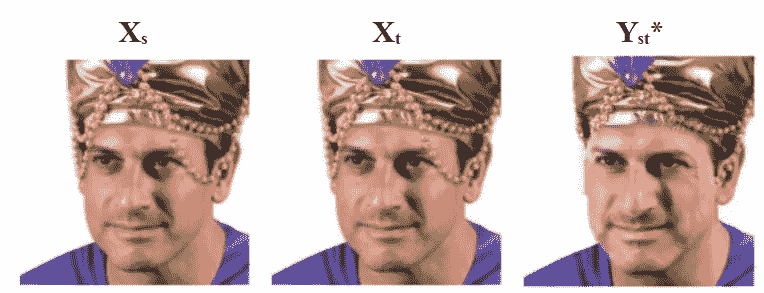

图 9。当我们输入与 Xₛ和 Xₜ.相同的图像时，AEI 网络的输出注意头巾上的链子是如何在输出中丢失的。改编自[1]。

因此，他们没有把 Yₛₜ*和 Xₜ作为听觉网络的输入，而是把 Yₛₜ* & (Xₜ -Yₜₜ*)作为听觉网络的输入，其中 Yₜₜ*是 AEI 网络的输出，而 Xₛ和 Xₜ是同一个图像。这将使听觉网络指向遮挡未被保留的像素。在图 10 中可以看到听觉网络。

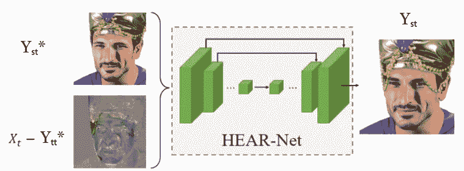

图 10。听觉网络的结构。改编自[1]。

## 培训损失

HEAR-Net 的损失是:

1.  保留身份的损失:

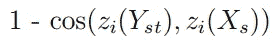

2.没有改变 Yₛₜ*的损失:

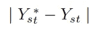

3.一个建立在这样一个事实上的损失，如果 Xₛ和 Xₜ是相同的图像，那么听觉网络的输出应该是 Xₜ:

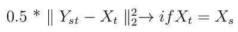

总损失是这些损失的总和。

# 结果

变脸者的结果是惊人的。在图 11 中，您可以找到一些它对数据集之外的图像(例如来自野外的图像)的泛化性能的例子。请注意它是如何在不同的艰苦条件下正确工作的。

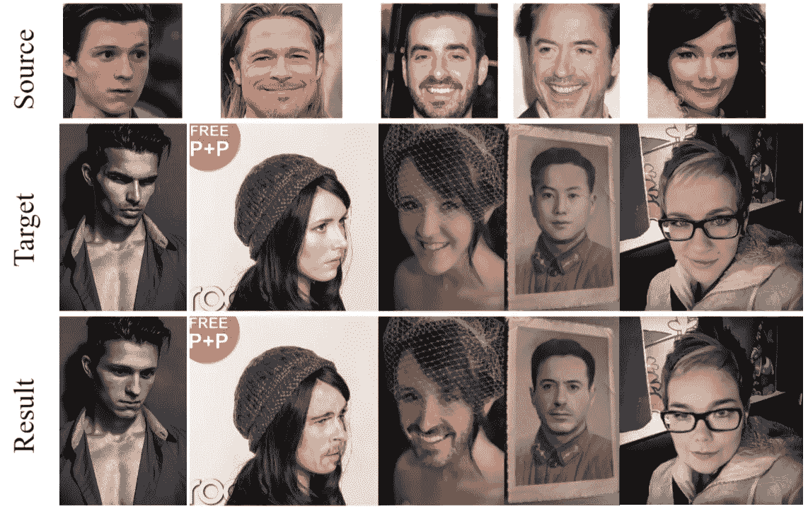

图 11。结果证明了 FaceShifter 的卓越性能。改编自[1]。

# 参考

[1] [李，鲍，杨，陈，文，人脸变换:实现高逼真度和遮挡感知的人脸交换(2019)，Arxiv .](https://arxiv.org/abs/1912.13457)