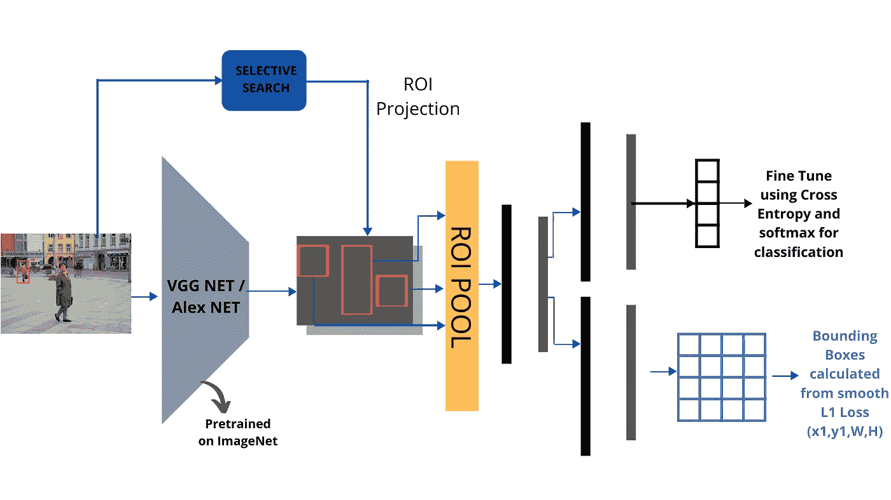

# 了解快速 R-CNN 和用于目标检测的更快 R-CNN。

> 原文：<https://towardsdatascience.com/understanding-fast-r-cnn-and-faster-r-cnn-for-object-detection-adbb55653d97?source=collection_archive---------9----------------------->

## 让我们详细了解这些基于区域提议的卷积神经网络的最新技术。

使用 Canva 设计

我在上一篇文章中已经详细讨论了对象检测和 R-CNN。你可以在这里阅读[以获得更好的直觉。](/understanding-object-detection-and-r-cnn-e39c16f37600)

人们需要了解这些用于对象检测的最先进的模型，这些模型随着时间的推移而发展，现在被认为是当今更强大的网络的强大基础。

让我们进入主题。

因此，使用 R-CNN 版本进行对象检测存在一些缺点。它们是:

1.  它消耗大量的时间、存储和计算能力。
2.  它有一个复杂的多阶段训练管道(3 个阶段——对数损失、SVM 和 BBox 回归器的 L2 损失)。

在 R-CNN 一年后开发的**快速 R-CNN** ，非常有效地解决了这些问题，在测试时间内比 **R-CNN** 快 **146 倍**。

# 快速 R-CNN

R-CNN 中使用的选择性搜索为每个图像生成大约 2000 个区域提议，并且每个区域提议被馈送到基础网络架构。这意味着，对于单个图像，将有 2000 次向前传递。考虑用 1000 幅图像的数据集来训练网络。那将是 2M 总共**(2000 * 1000)次向前传球**这是巨大的！****

**所以，快速 R-CNN 是基于一个想法，**

> **为什么不考虑每张图片运行一次 CNN，然后找到一种方法在 2000 个提案中共享计算结果？**

**在快速 R-CNN 中，图像只被传送到底层 CNN 一次，而选择性搜索则照常运行。然后，通过选择性搜索生成的这些区域提议被投影到由 CNN 生成的特征地图上。这个过程叫做 **ROI 投影**(感兴趣区域)。**

**在开始 ROI 投影之前，需要了解一下**子采样率**。它是特征图尺寸与图像原始尺寸的比值。举个例子，**

****

**使用 Canva 设计**

**ROI 投影的思想是我们从 ROI 提议中获得边界框的坐标，并且我们需要通过相对于二次采样比率投影 ROI 提议来将它们投影到特征图上。**

****

**使用 Canva 设计**

**上图看起来有点复杂，但事实并非如此。考虑一个大小为 688 x 920 的图像被传送到 CNN，CNN 的二次采样率是 T2 的 1/16。所得到的特征图的大小导致了**43×58**(**688/16**x**920/16**)。类似地，ROI 提议的大小**320×128**，在二次采样之后导致**20×8**。通常，边界框的坐标以两种方式表示。**

1.  **盒子中点的坐标(X，Y)，宽度，高度。[X，Y，W，H]**
2.  **边界框的对边坐标。[X1，Y1，X2，Y2]**

**这里，我们考虑第一个符号。从图中可以看出，ROI 建议的中点是 **(340，450)** ，这导致了特征图中的 **(21，28)** 。以这种方式，ROI 提议被投影到特征图上。**

**在网络中使用固定大小的图像的主要原因是因为完全连接的层。这些期望固定大小的向量，因为分配了固定的权重。这是网络不接受可变尺寸图像的主要原因。为了解决这个问题，Fast R-CNN 的作者想出了一个想法 **ROI Pooling** 其中特征图上的 ROI 投影被分成固定的维度。**

****

**使用 Canva 设计**

**如上所示，将红框视为 8 x 8 特征图上的 ROI 投影。假设我们需要一个 2×2 尺寸的输出。那么如果有奇数个维度，就不可能将它们等分。在这种情况下，我们将四舍五入到最接近的值。如图所示，假设我们得到一个 **5 x 4** 大小的提案。为了将其转换成固定尺寸的盒子，我们将高度和宽度除以所需的高度和宽度，即 5/2×4/2 = 2.5×2。对它们取整，任何一种方法都给出 **2 x 2** 和 **3 x 2** 。然后对每个块进行最大池化，并计算输出。这样，对于任何大小可变的区域建议，我们都可以获得固定维度的输出。所以现在，输入的大小没有限制。**

****

**使用 Canva 设计**

**因为还涉及到第三个维度，即特征地图中的深度，你可以这样想象，就像在一副卡片上戳一个洞。如上所述，您必须以相同的方式将 ROI Pool 应用于每个切片。**

****

**使用 Canva 设计**

**在 Fast R-CNN 中，我们使用一个 7 x 7 的网格进行池化。我们还去掉了最后一个池层。ROI 合并应用于最后一个卷积层的特征图。上面的例子是针对 AlexNet 架构的。**

****

**使用 Canva 设计**

**RCNN 的变化是，他们已经摆脱了 SVM 分类器，而是使用 Softmax。用于 Bbox 的损失函数是平滑 L1 损失。快速 RCNN 的结果是速度的指数增长。在准确性方面，没有太大的改进。这种架构在 PASCAL VOC 07 数据集上的准确率为 **66.9%** 。这里的总损失是分类损失和回归损失的总和，并且网络用单个损失反向传播，由此我们可以摆脱多阶段训练问题。**

## **结果:**

****

**使用 Canva 设计**

# **更快的 R-CNN**

**即使有了所有这些进步，在快速 R-CNN 过程中仍然存在一个剩余的瓶颈，即区域提议器。众所周知，检测物体的第一步是在物体周围生成一组潜在的包围盒。在快速 R-CNN 中，使用**选择性搜索**创建区域提议，发现一个相当慢的过程是整个对象检测过程的瓶颈。**

**因此，我们需要一种更好的技术，它给出少于 2000 个区域建议，比选择性搜索更快，与选择性搜索一样准确或更好，并且应该能够提出具有不同纵横比和比例的重叠 ROI。**

**从快速 R-CNN，我们知道区域提议依赖于已经用 CNN 的前向传递计算的图像的特征。**

> ****那么，我们为什么不将 CNN 的结果重新用于地区提案，而不是运行一个单独的选择性搜索算法呢？****

**首先，让我们了解不同纵横比和比例的重叠 ROI 的概念。**

****

**使用 Canva 设计**

**从图像中，我们看到许多物体相互重叠。我们看到一辆汽车，一辆自行车，一个人拿着一台电视机，电视机里还有一只狗。选择性搜索可以解决这个问题，但我们最终会得到大量的 ROI。我们需要想出一个能有效解决这个问题的主意。**

**如果我们在不同的物体周围画边界框，它看起来是这样的。**

****

**使用 Canva 设计**

**实现这个有点复杂，但是锚盒的想法让它变得简单。我们来了解一下这些锚盒是什么意思。**

**一般来说，对象可以放在正方形的盒子里，也可以放在长方形的盒子里，或者放在长方形的盒子里。概括地说，他们可以说是大，小，或中等大小。因此，通过实验发现，使用 3 种不同比例和 3 种不同纵横比的盒子可以检测到图像中的任何对象。**

****

**使用 Canva 设计**

**如果我们考虑上面的重叠图像，很有可能组合所有这些框，如上所示，会给你所有的重叠建议，但不是很准确。物体的主要部分将被覆盖。这可能是一种可以用来解决我们替换区域提议者的目的的技术。我们可以考虑一些替代方案，例如:**

**1.移除选择性搜索并在特征地图上应用滑动窗口。但有了这个，我们就能检测到大多数单一尺度的物体。**

**2.为了处理多种尺度，我们必须在输入端使用影像金字塔。但是使用 5 种不同比例的图像(几乎每个物体都可以被检测到)会使网络变慢 4 倍。**

**3.另一种选择是在特征图上使用不同大小的滑动窗口(如上图所示，9 个)。这个概念被称为特征金字塔。这包括在特征地图上使用 9 个不同大小的滑动窗口。**

**但是对于一个 600x1000 的图像，我们会有一个大约 40x60 的特征图。并且在每个位置使用 9 个不同的滑动窗口，对于特征图中的所有 40x60 值，我们最终得到 40x60x9 =~20，000 个建议。与仅提供 2000 个建议的选择性搜索相比，我们的建议几乎多了 10 倍。这将在计算上更加昂贵，并且还会有更多的误报。**

**4.考虑使用简单的 CNN BBox 回归器来代替选择性搜索，以获得图像的近似区域建议，该区域建议可以进一步馈送到底层的快速 R-CNN 架构。这是更快的 R-CNN 背后的核心思想。让我们再深入一点。**

****

**使用 Canva 设计**

**这个为我们提供近似 ROI 的网络被称为**区域建议网络(RPN)** 。那么，我们如何设计这种 RPN，使其能够给出可以进一步处理的近似 ROI 呢？**

**这里的想法是我们利用上面讨论的 9 个盒子。这些被称为**锚盒**或参考盒。在图像上的任何一点，我们都会得到大约 9 个不同比例和长宽比的不同边界框。**

**在特征图上使用大小为 3×3 的滑动窗口，并且在每个滑动窗口的顶部，我们将这 9 个框放置在中心，以检测各个窗口中存在的任何对象。让我们放大 RPN。**

****

**使用 Canva 设计**

**这就是我们如何从图像的所有区域得到不同的区域建议。9x 代表，该部分在 9 个不同的锚中重复 9 次。由此，我们得到所需的 ROI。但这里的问题是，我们又一次得到了大量的提议。**

**考虑同样的 40x60 特征地图的例子，我们再次避开 **20K** 建议(40 x 60 x 9)。这些盒子中最多有一个没有任何对象，这样的盒子应该被删除。为此，我们使用一个**二元分类器**来预测盒子是否包含前景或任何背景。这样，所有包含背景的盒子都被去掉了。我们假设大概有 15K 的背景盒。我们还剩下 5000 多个盒子。由于分类在最后包括 max 层的 S **，我们得到每个框的置信度得分，指示该框内存在对象的概率。通过这种方式，我们可以根据置信度得分对盒子进行排序，并将前 n 个提议用作 ROI。n 可以相应地调整。****

**此外，请注意，由于我们在 RPN 中不使用 ROI 池层，我们在那里使用卷积运算，其作用类似于滑动窗口，这里的 FC 层由卷积运算代替，类似于 R-CNN 的前身 Overfeat 的卷积运算。**

****

**使用 Canva 设计**

**因此，首先用一个 3×3 的窗口或过滤器对特征图进行卷积，这为我们提供了所需的锚点，然后对每个分类和回归部分进行 1×1 卷积。**

****

**使用 Canva 设计**

**总的来说，这是更快的 R-CNN 的架构。**

**更快的 R-CNN 是用 4 个损耗联合训练的:**

1.  **RPN 分类(对象前景/背景)**
2.  **RPN 回归(锚点→ ROI)**
3.  **快速 RCNN 分类(对象类)。**
4.  **快速 RCNN 回归(ROI →边界框)**

## **结果:**

****

**使用 Canva 设计**

# **结论**

**希望这能理清你对越来越快 R-CNN 的理解。在 2015 年 12 月，**更快的 RCNN** 与主干网络 as **ResNet -101** 一起赢得了 **COCO 物体检测竞赛**，被认为是迄今为止最先进的物体检测模型。希望你今天学到了新东西！我将在接下来的文章中讨论更多关于 Mask R-CNN 和 Detectron2 的内容。**

**如果你想取得联系，请在 [**LinkedIn**](https://www.linkedin.com/in/aakarsh-yelisetty-6b691b171/) 上联系我。**

**如果你想了解更多关于交叉熵的知识，你可以在这里阅读我以前的文章。**

# **参考**

1.  **[https://arxiv.org/pdf/1506.01497.pdf](https://arxiv.org/pdf/1506.01497.pdf)**
2.  **[https://arxiv.org/pdf/1504.08083.pdf](https://arxiv.org/pdf/1504.08083.pdf)**
3.  **[http://cs 231n . Stanford . edu/slides/2017/cs 231n _ 2017 _ lecture 11 . pdf](http://cs231n.stanford.edu/slides/2017/cs231n_2017_lecture11.pdf)**