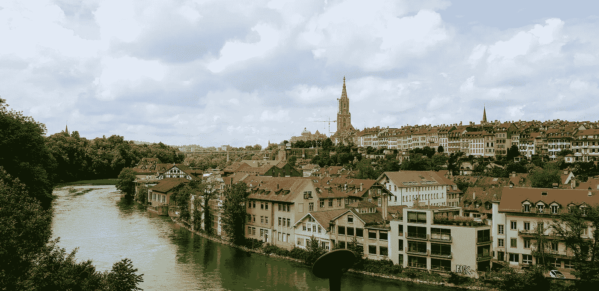
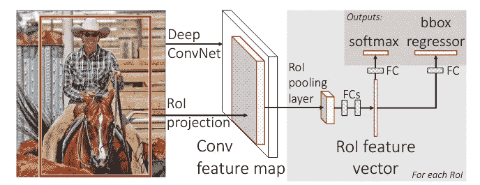
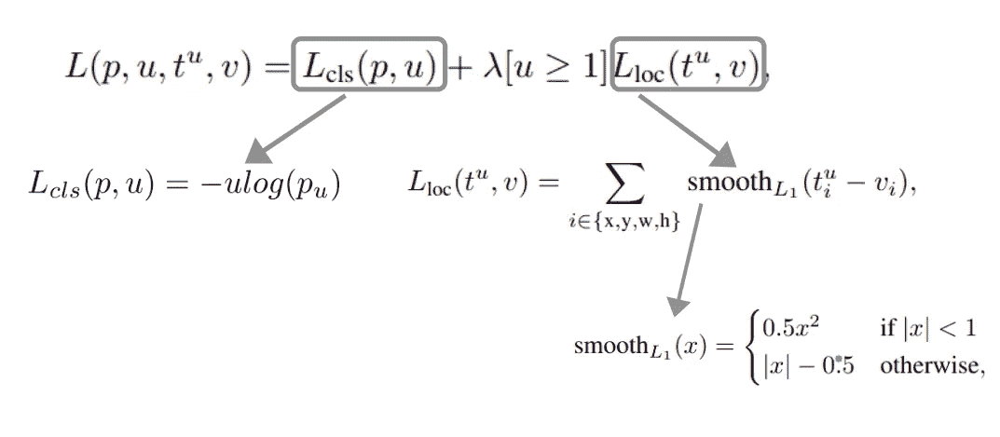
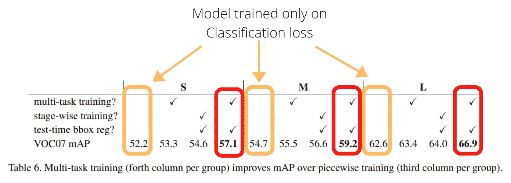
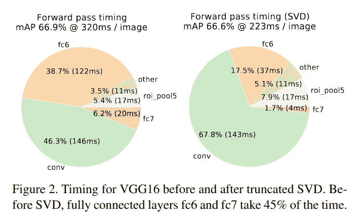
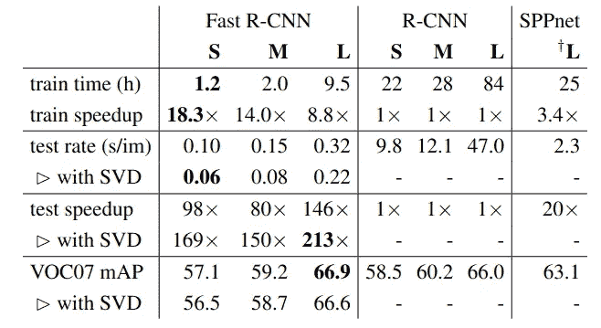
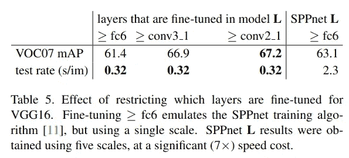
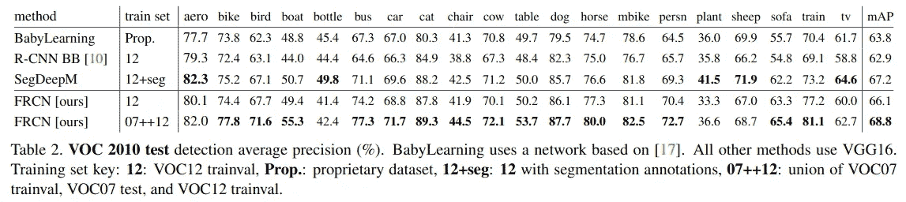

# 理解用于目标检测的快速 RCNN

> 原文：<https://towardsdatascience.com/understanding-fast-rcnn-for-object-detection-7a1c3f63fc66?source=collection_archive---------36----------------------->

## 快速递归神经网络综述

## fast-RCNN 论文强调了 SPPNet 和 RCNN 的缺点，并建立了一个相对快速和准确的模型

瑞士伯尔尼——作者图片

Fast-RCNN 模型是通过克服 [SPPNet](https://arxiv.org/pdf/1406.4729.pdf) 和 [RCNN](https://arxiv.org/pdf/1311.2524.pdf) 的缺点而构建的。我已经写了关于这两个方面的文章，您应该在继续之前看一下:

 [## 了解具有 CNN 功能的区域(R-CNN)

### R-CNN 的架构细节以及模型设计和论文的要点。

towardsdatascience.com](/understanding-regions-with-cnn-features-r-cnn-ec69c15f8ea7)  [## 了解用于对象检测和分类的 SPPNet

### SPPNet 允许可变大小的 CNN 输入图像，并可用于分类和对象检测

towardsdatascience.com](/understanding-sppnet-for-object-detection-and-classification-682d6d2bdfb) 

该博客与上述两个博客的结构相同，即学生和教师之间的对话。

## 教师

我们之前看过 R-CNN 和 SPPNet。尽管这些模型表现得非常好，但它们都有一些缺点。以下是两种架构共有的**缺点**:

*   **多阶段训练:**首先在 ImageNet(预训练权重 us)上训练分类模型，然后针对检测数据集进行微调。在微调之后，softmax 被一个用于对象检测任务(在硬挖掘的数据上进行训练)的 one-vs-rest 分类器所取代。通过向最后一个池化图层的要素添加边界框回归器来提高性能。这是一个多阶段的过程，培训是一步一步进行的。
*   **高空间和时间复杂度:**在微调网络之后，并且在训练 SVM 和包围盒回归器之前，将特征缓存到磁盘以避免重复计算。生成这些特性需要大量时间，存储这些特性也需要数百 GB 的空间。

**spp net 特有的缺点:**

*   **低效微调卷积层:**与 R-CNN 不同，SPP 层很难更新它之前卷积层的权重。避免卷积层的微调会妨碍模型的性能。

所有上述缺点都在 Fast-RCNN 论文中得到解决。顾名思义，它是 RCNN 的一个相对快速的版本，并且利用了 SPPNet 的一些架构细节。

## 学生

R-CNN 论文中显示的深入分析和 SPPNet 层中引入的新颖 SPP 层让我非常惊讶，以至于我没有注意到任何这些缺点。**您能解释一下 Fast-RCNN 中使用的模型架构吗？**

## 教师

作者在 Fast-RCNN 论文中分析了三组模型:

*   **小号(S):** 卡芬内模型
*   **VGG _ 美国有线电视新闻网 _M_1024 (M):** 与卡芬内相似的型号，但更宽
*   **VGG16 (L):** 非常深的 VGG-16

我们将把我们的讨论限制在 VGG-16(预先在 ImageNet 上训练过)，这是他们最深的网络。

Fast-RCNN 架构—论文

输入图像被发送到 VGG-16 并被处理直到最后的卷积层(没有最后的汇集层)。并且在这之后，图像被发送到小说的**感兴趣区域(RoI)** 池层。该池图层始终为最后一个卷积图层输出的每个要素地图输出一个 7 x 7 的地图。**这个 7 x 7 的地图是通过池化产生的，其中窗口大小根据输入图像而改变。**顺便说一句，来自该图的展平特征产生了与 VGG-16 的预训练 FC-6 层所期望的相同大小的特征向量。然而，最后的 1000 路 softmax 层被替换为 21 路 Softmax(与 RCNN 和 SPPNet 情况下的 SVM 不同)。另外**对于边界框回归器，分支从最后一个 FC-7 层**开始，而不是卷积层特征图。

> **注意:**RoI pooling 层只是 SPP 层的**特例，其中只使用了一个金字塔等级。在这种情况下(7 x 7)。此外，每个子窗口和步距的计算来自 SPPNet 论文。**

## 学生

你上面提到的一个缺点是，**SPP 层不能有效地反向传播。请你解释一下这个问题是如何解决的？**此外，**这种架构如何解决空间和时间复杂性等其他问题？**

## 教师

**当区域提议来自不同图像时，反向传播在 SPP 层变得无效**。然而，他们提出了一种微调网络的有效方法。使用 N=2 个输入图像，并且对于每个图像，他们对每个图像采样 R=128 个 RoI。此外，他们用地面真实边界框拍摄 25% IoU 大于 0.5 的前景图像。为 IoU 与地面真值箱之间的间隔[0.1，0.5]；这些建议被视为背景。提交人声称:

> 较低的阈值 0.1 似乎是硬示例挖掘的启发

> **注意:**通过 RoI 合并层的反向传播具有与任何正常最大合并层类似的实现。作者已经用数学方法描述过了。更简单的理解，参考[这个答案](https://datascience.stackexchange.com/a/11703)。

既然我们已经看到了反向传播在这个网络中是如何发生的，那么让我们也来看看多阶段训练的**问题是如何处理的**。作者没有单独训练，而是将包围盒回归器和 softmax 层一起训练。他们将这个损失函数**命名为多任务损失函数**。

多任务损失函数—按作者分类的图像

在上图中:

*   **类预测(p):** 每个 RoI 的离散概率分布[p = (p0，p1，p2 … pk)](包含 k+1 个类，其中 k = 0 为背景类)
*   **类别标签(u):** 是正确的类别
*   **每次损失的权重(λ):** 该值始终等于 **1**
*   **艾弗森括号函数[u ≥ 1]:** 这个赋值给**其中一个类不是背景**，否则为零。
*   **预测边界框标签(t):** t = (tx，ty，tw，th)给出所选 RoI 图像中 **u** 中每个类别的预测边界框元组。
*   **基本事实包围盒标签(v):** v = (vx，vy，vw，vh)给出了 **u** 中正确类的相应基本事实包围盒。

口头上，**交叉熵损失用于训练最后 21 路 softmax 层**，而 **smoothL1 损失处理为 84 回归单元**处理包围盒定位而添加的密集层的训练。这两个损失的总和用于微调剩余的网络，这与新的 softmax 和回归层的训练一起发生。

为了证实这种新的训练方法不会妨碍表演，本文给出了以下分析。

作者编辑的论文中的多任务训练分析

黄色框表示在训练或测试时没有边界框回归量的训练，而红色框表示使用多任务损失函数进行训练和微调后的结果。剩下的两列不言自明。**需要注意的关键点是，使用这种多任务损失可以改善结果。**

## 学生

他们使用的损失函数确实改善了 Pascal VOC 2007 上的地图。**那么，是不是由于这种多任务训练，避免了缓存这些特性，从而节省了我们将它们生成并写入磁盘的时间？**

## 教师

是的，这个观察是正确的。此外，作者还提供了一些关于提高速度的更多信息。据观察，将奇异值分解(SVD)应用于 FC 层，将运算分成两个矩阵乘法，并减少了计算时间。

> **奇异值分解:**将一个矩阵分解成三个矩阵，其中一个对角矩阵夹在两个正交矩阵之间。对角矩阵表示特定轴上的方差，并且是降序排列的。因此，从对角矩阵中选择顶部的 **t** 对角值，意味着选择在输出中贡献最大的值，因为它们具有高方差。**(如果你对 SVD 的直觉不熟悉的话可以看看这个系列视频上的** [**线性代数**](https://www.youtube.com/watch?v=fNk_zzaMoSs&list=PLZHQObOWTQDPD3MizzM2xVFitgF8hE_ab) **然后再查看一下** [**这个视频**](https://www.youtube.com/watch?v=rYz83XPxiZo) **)**

SVD 时序分析来自[论文](https://arxiv.org/pdf/1504.08083.pdf)

虽然该模型比 RCNN 和 SPPNet 更快，但使用 SVD 可以在 mAP 下降最小的情况下缩短时间。对于上图，**前 1024 个值选自 FC-6 层的 25088 x 4096 矩阵，前 256 个值选自 4096 x 4096 FC-7 层。**下图显示了该型号在速度方面与其他型号相比的表现。

与另一个模型的时间比较— [论文](https://arxiv.org/pdf/1504.08083.pdf)

上图可以总结如下:

*   **Fast-RCNN 模型的训练速度比 RCNN 快 9 倍，预测速度比 RCNN 快 213 倍**
*   **快速 RCNN 也比 SPPNet 训练快 3 倍，预测快 10 倍，提高。**

## 学生

该文件是否提供了对他们架构的任何分析？

## 教师

通过实现前面描述的硬挖掘策略，反向传播变得很容易实现。然而，在深层 VGG-16 网络中哪些层需要微调也进行了探索，并在下面进行了描述。

作者发现，对于 VGG-16，**微调来自 conv3_1 的所有图层显著影响了地图。**微调 Conv2 层时，训练速度下降，微调 conv1 层超过 GPU 内存。然而，训练 Conv 层后的结果显示，与未被训练的层相比，在 mAP **(从 61.4%到 66.9%)** 中有巨大的跳跃。因此，微调卷积层也变得至关重要，这是 SPPNet 的一个主要缺点。之前讨论的所有结果均从 conv3_1 开始微调。

作者将他们的模型与当代模型进行了比较，快速 RCNN 的性能优于它们。我已经展示了 pascal VOC10 的结果。pascal VOC 2007 和 VOC 2012 的结果可以在论文中看到。

Pascal VOC 2010 的结果— [论文](https://arxiv.org/pdf/1504.08083.pdf)

本文分享的其他一些观察结果如下:

*   作者分析了改变输入网络的建议数量的影响。**据观察，增加区域提案并不一定会增加地图。**
*   作者还尝试了在多尺度环境中的训练和测试，其中训练的规则保持与 SPPNet(从最接近 224 的尺度中选择的区域建议)的规则相同。他们还使用了与 SPPNet 相同的一套标尺，但将最长的一边修剪到 2000 像素。**据观察，虽然精确度有所提高，但单秤处理在速度和精确度之间提供了最佳平衡。**

论文中最重要的细节已经讨论过了，但是还是建议看一下论文。在阅读 Fast-RCNN 论文之前，请确保先阅读 RCNN，然后再阅读 SPPNet。

# 参考

R.Girshick，J. Donahue，T. Darrell，J. Malik，[用于精确对象检测和语义分割的丰富特征层次，](https://arxiv.org/pdf/1311.2524.pdf)计算机视觉和模式识别，2014 年

K.何，X 张，s 任，孙军，[用于视觉识别的深度卷积网络空间金字塔池](https://arxiv.org/pdf/1406.4729.pdf)，，2014

R.Girshick，[快速 R-CNN](https://arxiv.org/pdf/1504.08083.pdf) ，ICCV，2015