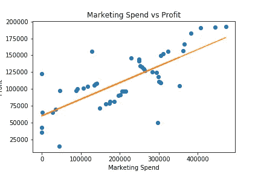
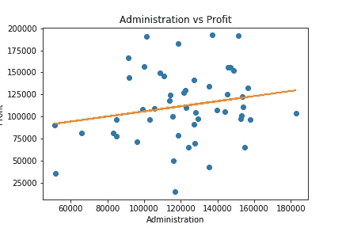
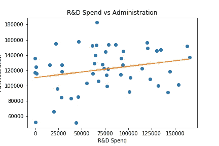
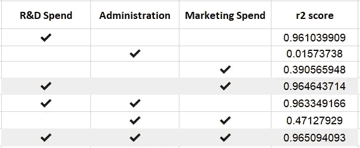

# 理解使用相关矩阵和散点图进行特征提取

> 原文：<https://towardsdatascience.com/understanding-feature-extraction-using-correlation-matrix-and-scatter-plots-6c19e968a60c?source=collection_archive---------13----------------------->

## 世界上的数据非常庞大，需要非常有意识地进行处理，以获得我们希望通过新的数据科学方法实现的任何合理结果。

在处理给定数据集中的大量要素时，本文将讨论一个非常基本且重要的概念。


在 [Unsplash](https://unsplash.com?utm_source=medium&utm_medium=referral) 上由 [Carlos Muza](https://unsplash.com/@kmuza?utm_source=medium&utm_medium=referral) 拍摄的照片

任何典型的机器学习或深度学习模型都是为了从大量数据中提供单一输出，无论这些数据是结构化的还是非结构化的。这些因素可能在不同的系数和程度上有助于所需的结果。需要根据它们在确定输出时的**显著性，并考虑这些因素中的**冗余，过滤掉它们。****

在监督学习中，我们知道总有一个输出变量和 n 个输入变量。为了非常清楚地理解这个概念，让我们举一个简单的线性回归问题的例子。

在简单的线性回归模型中，我们最终会从模型中生成一个 y=mx+c 形式的方程，其中 x 是自变量，y 是因变量。由于只有一个变量，y 必须依赖于 x 的值。虽然在实时计算公交车从 A 到 b 的平均速度时，可能很少有其他被忽略的外部因素，如空气阻力。这些因素肯定会对输出产生影响，但意义最小。在这种情况下，我们的常识和经验帮助我们选择因素。因此，我们选择司机给汽车的加速度，忽略空气阻力。但是在我们不知道输入变量对输出的重要性的复杂情况下呢？数学能解决这个难题吗？

是啊！这里就出现了**关联的概念。**

相关性是一种统计方法，表示两个或多个变量一起波动的程度。简单来说，它告诉我们一个变量对于另一个变量的微小变化有多大的变化。根据变化的方向，它可以取正值、负值和零值。因变量和自变量之间的高相关值表明自变量在确定输出时具有非常高的重要性。在有许多因素的多元回归设置中，必须找到因变量和所有自变量之间的相关性，以建立一个具有更高精度的更可行的模型。人们必须永远记住**更多的特征并不意味着更好的准确性。**如果更多的特征包含任何不相关的特征，从而在我们的模型中产生不必要的噪声，那么这些特征可能会导致精度下降。

两个变量之间的相关性可以通过各种度量来发现，如 ***皮尔逊 r 相关、肯德尔等级相关、斯皮尔曼等级相关等。***

Pearson *r* 相关性是最广泛使用的相关统计量，用于测量线性相关变量之间的相关程度。任何两个变量 x，y 之间的皮尔逊相关性可通过下式得出:


n-观察次数，I-表示第 I 次观察

让我们考虑一下关于纽约、加利福尼亚和佛罗里达的新创业公司的数据集 50_Strartups。数据集中使用的变量是利润、R&D 支出、管理支出和营销支出。这里利润是被预测的因变量。

让我们首先对每个独立变量分别应用线性回归，以直观地显示与独立变量的相关性。



从散点图中，我们可以看到，R&D 支出和利润具有非常高的相关性，因此，与 R&D 支出相比，预测产量和营销支出与利润的相关性较低，具有更大的意义。



但是，管理和利润之间的分散表明，它们之间的相关性非常小，最终可能会在预测过程中产生噪声。因此，为了获得更好的结果，我们可以在模型中排除这个特性。

这个过程消除了我们模型中无关紧要和不相关的特性。但是，冗余功能怎么办？

**冗余特征**:虽然有些特征与我们的目标变量高度相关，但它们可能是冗余的。**任何两个自变量如果高度相关，则被认为是冗余的。这造成了不必要的时间和空间浪费。甚至两个变量之间的冗余度也可以通过相关性找到。**

注:**因变量和自变量之间的高相关性是理想的，而两个自变量之间的高相关性是不理想的。**



上面两张图显示了独立变量之间的相关性。我们可以在第一张图中看到较高的相关性，而在第二张图中看到非常低的相关性。这意味着我们可以排除第一张图中两个特征中的任何一个，因为两个独立变量之间的相关性会导致冗余。但是要去掉哪一个呢？答案很简单。与目标变量具有更高相关性的变量保留，而另一个被移除。

确定变量之间的相关性:

```
df = pd.DataFrame(data,
columns=['R&D Spend','Administration','Marketing Spend','Profit'])
corrMatrix = df.corr()
print (corrMatrix)
```

输出:输出显示一个 2*2 矩阵，显示所有变量之间的 Pearson r 相关性。


数据集中所有变量之间的相关性。

最后，基于它们的 r2 分数比较各种多元回归模型。



通过选择特征的组合来评分。

从实验分数中，我们观察到:

->相关性低的自变量导致 r2 得分较低。(例如:仅管理)

->相关性较高的变量在我们的模型中为我们提供了较高的 r2 分数(例如:R&D 支出和营销支出)

>**消除冗余变量或无关变量可能会/可能不会导致我们的精度损失可以忽略不计，但使它在许多约束条件下成为一个非常有效的模型。**

供进一步参考:

数据集:【https://www.kaggle.com/farhanmd29/50-startups 

代号:[https://github.com/Tarun-Acharya/50_Startups_Regression](https://github.com/Tarun-Acharya/50_Startups_Regression)