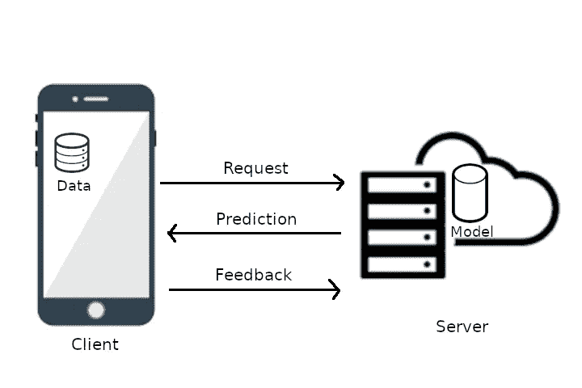
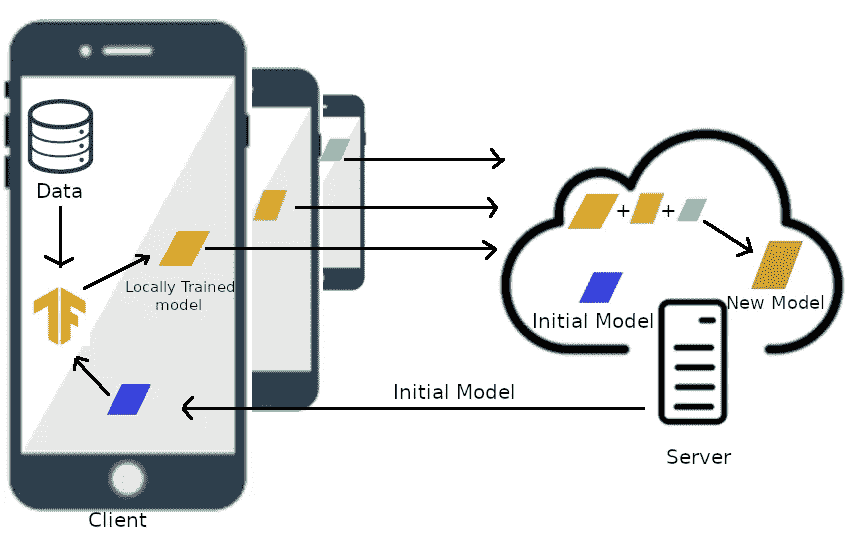
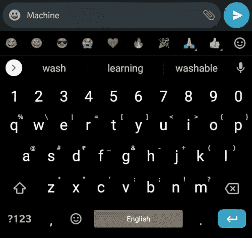

# 理解联合学习

> 原文：<https://towardsdatascience.com/understanding-federated-learning-99bc86a0d026?source=collection_archive---------34----------------------->

## 关注机器学习中的隐私

图片来自[皮克斯拜](https://pixabay.com/?utm_source=link-attribution&utm_medium=referral&utm_campaign=image&utm_content=1944688)

随着对隐私的日益关注，联邦学习已经成为现代机器学习中的基本概念之一。联合学习旨在训练一个模型，而无需将个人信息或可识别数据上传到云服务器。你可能已经知道，机器学习模型需要大量的数据来训练。但有时训练数据是敏感的，人们越来越不愿意与第三方分享他们的个人数据。随着对隐私的日益关注，联合学习现在在大多数机器学习应用中是必不可少的。

> 数据诞生于边缘

全球超过 10 亿台边缘设备(如手机、平板电脑和物联网设备)不断产生数据。对于公司和开发者来说，这些数据可以通过训练更好的模型来使他们的产品和用户体验更好。通常，客户端将数据发送到服务器，模型在服务器上运行推理并返回预测。一旦模型返回预测，客户端就发送反馈，模型使用反馈进行自我修正。虽然这在收集数据和减少边缘设备上的计算负担方面具有优势，但它面临着关于离线使用、等待时间以及更重要的隐私的问题。

云上的模型推理。作者图片

虽然该模型可以在本地进行训练和推断，但它也有其局限性。单个用户提供的数据太少，无法对模型进行充分训练。在这种情况下，其他设备的数据不起作用，这导致了非一般化的数据。这已经成为隐私和更好的智能之间的斗争，直到最近几乎没有解决方案。

**联合学习是如何工作的？**

在联合学习中，服务器将训练好的模型(M1)分发给客户端。客户端根据本地可用的数据训练模型。然后，这些模型而不是数据被发送回服务器，在服务器中，它们被平均以产生新的模型(M2)。这个新模型(M2)现在充当主要模型，并再次分发给客户。重复这个过程，直到模型获得满意的结果。在每一次迭代中，模型都会变得比原来好一点。因此，联合学习产生了更好的智能，而用户的个人数据在他们的设备中是安全的。

联合学习。作者图片

预测我的下一个单词。

联合学习最常见的例子是谷歌的键盘应用 Gboard。机器学习模型改善了用户体验，如滑动打字、自动更正、下一个单词预测、语音转文本等。联合学习在这里发挥了巨大的作用，因为你输入的内容对你来说是非常私人的，你不会想把你的数据发送到服务器。本地模型使用您的数据进行训练，然后发送到服务器，就像来自不同客户端的许多其他模型一样。服务器取这些新模型的平均值来产生一个新模型。服务器现在向客户端分发最新的模型。这个过程永远重复。

**安全协议**

即使用户数据没有上传到服务器，也有可能对模型进行逆向工程以获取用户数据。模型聚合和客户端数据加密用于解决这个问题。

联合学习协议将模型输出进行组合和求和，并且服务器只能访问集合模型，而不能访问单个模型。这里，设备只报告计算所需的数据。服务器将该模型分发给所有客户端。

掩蔽用于在聚合期间从客户端消除相反的数据点。由于被屏蔽的值被发送到服务器，任何人都很难截取这些值并对任何个人数据进行反向工程。

**张量流联邦**

TensorFlow Federated(TFF)是由 Google 的 TensorFlow 团队开发的一个开源框架，用于分散数据的联合学习。TFF 仍处于起步阶段，有很多需要改进的地方。在撰写本文时，TFF 只提供本地模拟运行时，没有部署选项。

您可以使用 pip 软件包管理器安装 TensorFlow Federated。

`pip install tensorflow_federated`

TensorFlow Federated 提供了两套接口，即联邦学习(FL)和联邦核心。使用联合学习接口，开发人员可以实现联合训练或联合评估，开发人员可以将联合学习应用于现有的 TensorFlow 模型。联邦核心接口用于测试和表达新的联邦算法，并运行本地运行时模拟。

我将在下一篇博客中写更多关于 TensorFlow Federated 的内容。

**结论**

这个博客是对联合学习的一个快速总结，我将很快发表更多深入的博客。我打算写更多关于一些鲜为人知的机器学习概念的博客。关注我以获取最新更新。

你可以在 [Twitter](https://twitter.com/CleanPegasus) 、 [LinkedIn](https://www.linkedin.com/in/arunkumar-l/) 和 [Github](https://github.com/CleanPegasus) 上找到我。