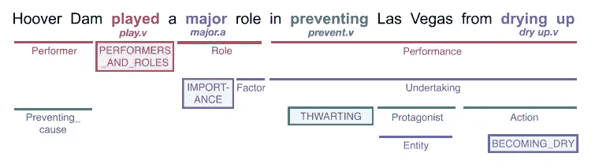
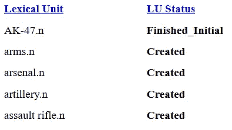

# 理解自然语言处理中的框架语义分析

> 原文：<https://towardsdatascience.com/understanding-frame-semantic-parsing-in-nlp-bec84c885061?source=collection_archive---------25----------------------->

## 让计算机理解我们语言含义的尝试

帕特里克·托马索在 [Unsplash](https://unsplash.com?utm_source=medium&utm_medium=referral) 上的照片

研究计算语言学可能具有挑战性，尤其是因为语言学家创造了许多术语。它可以是任务的形式，如词义消歧、共指解析或词汇化。每个任务的属性都有术语，例如，词条、词性标签(POS 标签)、语义角色和音位。

这篇文章旨在用通俗的语言给出对**框架语义解析**任务的广泛理解。从它的用途、一些术语定义和现有的框架语义解析模型开始。本文将不包含对定义、模型和数据集的完整参考，而是仅包含主观上重要的东西。

框架语义解析任务始于 FrameNet 项目[1]，其中完整的参考资料可在 [its 网站](https://framenet.icsi.berkeley.edu) [2]获得。它旨在捕捉单词的意思。

# 语义框架解析用于什么？

语义框架解析可用于需要更深入理解单词含义的应用，如问答。它试图确定文本在谈论什么(框架的过度简化的解释)以及谁对谁做了什么(框架元素或语义角色的过度简化的解释)。考虑一个例子

> 香蕉价格上涨了 5%
> 
> 香蕉价格上涨了 5%
> 
> [香蕉价格]上涨了[5%]

括号中的短语是论元，而“增加”、“上升”、“上升”是谓语。

所有这些句子的意思都一样，但是计算机怎么能理解它们呢？例如，我们希望能够问一台电脑，

> "香蕉的价格上涨了多少？"

给定一个混合结构，它可能会感到困惑，找不到正确的答案。

但是如果这台计算机能把那些句子解析成语义框架呢？它将识别出这很可能是一个[运动方向](https://framenet2.icsi.berkeley.edu/fnReports/data/frameIndex.xml?frame=Motion_directional)帧。然后，它将从与运动方向帧相关的帧元素中识别出[香蕉的价格]是*主题*并且[5%]是*距离*。知道了这一点，它应该用*距离*框架元素*来回答。*

# 术语定义

阅读文章和论文进行框架语义解析是令人困惑的。乍一看，阅读材料中的大多数术语很难理解。因此，理解一些核心术语是非常重要的。

## 框架(语义框架)

框架，或语义框架，是句子一部分的范畴。这个范畴表示句子的一部分会有某些成分。在某种意义上，语义框架就像一本规则书。当你看到句子的一部分有这个语义框架，你就知道那部分句子里可能还有什么了。让我给你看一个例子

> 西拉试图挥动她的剑来抵挡，但是剑太重了。

你会注意到**剑**是一种“武器】，**她的**(可以和西拉一起引用)是一种“持用者”。这句话很有可能被归类为包含“武器”框架(见[框架索引](https://framenet.icsi.berkeley.edu/fndrupal/frameIndex))。根据“武器”框架，它必须具有“武器”元素。或者，它可能包含一个“持用者”角色，如本例所示。

## 目标

应该用框架标记的单词或单词序列。最好能看到一个例子。

图 1:经过框架语义解析的句子示例[4]

图 1 显示了一个有 4 个目标的句子示例，用突出显示的单词和单词序列表示。这些目标是“发挥”、“重大”、“预防”和“枯竭”。这些目标中的每一个都将直接对应于一个框架——执行者和角色、重要性、阻挠、成为干巴巴的框架，用方框来标注类别。

## 框架元素

框架元素是语义框架*、*的组成部分，特定于某些框架。这意味着如果你已经看到了[帧索引](https://framenet.icsi.berkeley.edu/fndrupal/frameIndex)你会注意到有高亮显示的单词。这些是框架元素，每个框架可以有不同类型的框架元素。

在图 1 中，框架元素用下划线表示。例如，“胡佛大坝”，“一个主要角色”，“在防止拉斯维加斯干涸”是框架演员和角色的框架元素。

但接下来你可能会想，哇！但这不就是整句话吗？那么一个框架能覆盖整个句子吗？这取决于每个特定的框架规则。我再给你举个短一点的例子，“拉斯维加斯”是 BECOMING _ DRY frame 的一个框架元素。看到了吗？它不必是一个完整的句子。

## 引理

词条是词的基本形式。在英语中， **runs，ran，run** 会有相同的引理: **run** 。一个引理并不确切地表示一个词，因为它可能包含不止一个词，例如，“原子武器”或“火焰喷射器”。

## 词汇单位

在这个上下文中，词汇单元是一对基本形式的单词(词条)和一个框架。在帧索引处，一个词汇单元也将与其词性标签配对(如名词/n 或动词/v)。我相信目的是明确说明这个引理指的是哪个意思(一个引理/词有多个意思称为多义)。

来源[帧索引](https://framenet.icsi.berkeley.edu/fndrupal/frameIndex)

# 现有模型

解决这一任务的典型管道是识别目标、分类哪个帧和识别参数。

建立自动框架语义标注的早期工作包括两个步骤:识别句子中框架元素的边界和框架标注[3]。这项早期工作使用了大量的语法特征作为框架标记的输入。短语类型(名词短语、动词短语和从句)、语法功能、位置、语态和中心词。该系统的最终结果在识别框架元素边界上达到 66%,在框架标注上可以达到 80%的准确率。

最近的一个模型使用了神经网络方法来进行框架语义解析，看看它们是否可以减少语法特征的使用[4]。他们将任务分成三部分:目标识别、框架标记和参数识别。

目标识别是确定哪些单词或短语要被标记的任务。目标也可以被称为谓语，它可以是名词或动词。他们使用 3 个特征来进行目标识别:记号、记号的词性和记号引理。它们还结合了使用手套表示的预训练的令牌嵌入和训练的令牌嵌入。然后，他们使用 bi-lstm 层，最后一层将用于预测下一个令牌是否是目标。

这里的帧标记任务与前面的方法意思相同。这里，作者建议使用基于 bi-lstm 的分类器。该模型应该至少采用标记、词条、词性标签和目标位置，这是早期任务的结果。

这里我觉得有趣的是论点识别部分。论元识别可能不是你们中的一些人可能认为的“论元”，而是指**谓元结构**【5】。换句话说，给定我们发现了一个谓语，哪些词或短语与它相连。本质上和**语义角色标注**【6】一样，谁对谁做了什么。主要区别是语义角色标注假设所有谓词都是动词[7]，而在语义框架解析中没有这样的假设。

# 参考

[1] Baker，Collin F .，Charles J. Fillmore 和 John B. Lowe1998.“伯克利框架工程”，86 年。[https://doi.org/10.3115/980845.980860.](https://doi.org/10.3115/980845.980860.)

[2]框架网项目网站。[https://framenet.icsi.berkeley.edu](https://framenet.icsi.berkeley.edu)。

[3]吉尔迪、丹尼尔和丹尼尔·茹拉夫斯基。2002."语义角色的自动标注."计算语言学 28 (3)。https://doi.org/10.1162/089120102760275983[。](https://doi.org/10.1162/089120102760275983)

[4] Swayamdipta、Swabha、Sam Thomson、克里斯·戴尔和 Noah A. Smith。2017."用软最大间隔分段 RNNs 和句法支架进行框架语义分析."【http://arxiv.org/abs/1706.09528\. 

[5][https://en . Wikipedia . org/wiki/Argument _(语言学)](https://en.wikipedia.org/wiki/Argument_(linguistics))。

[6][https://en.wikipedia.org/wiki/Semantic_role_labeling](https://en.wikipedia.org/wiki/Semantic_role_labeling)。

7 詹姆斯·马丁·茹拉夫斯基。2019.语音和语言处理第 3 版。[https://web.stanford.edu/~jurafsky/slp3/](https://web.stanford.edu/~jurafsky/slp3/)。