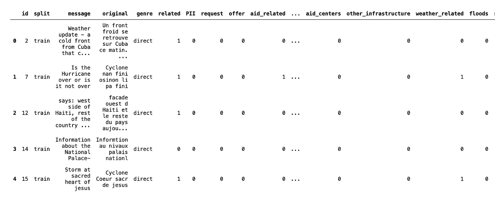
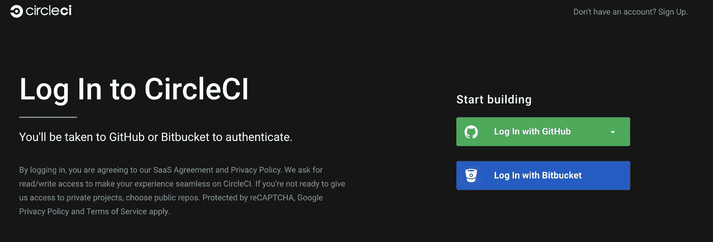
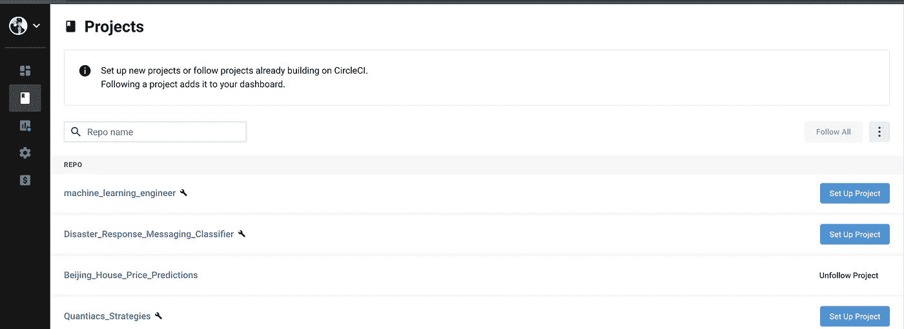
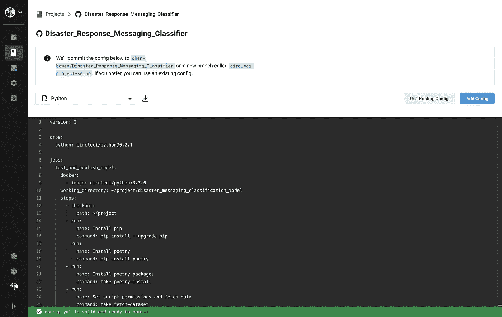
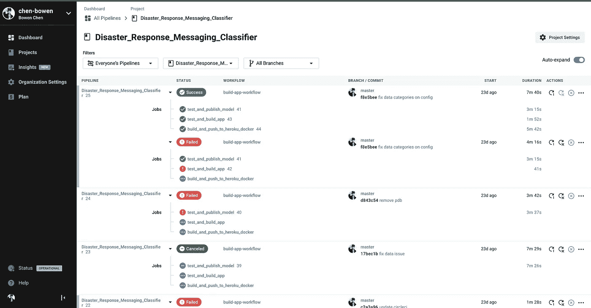
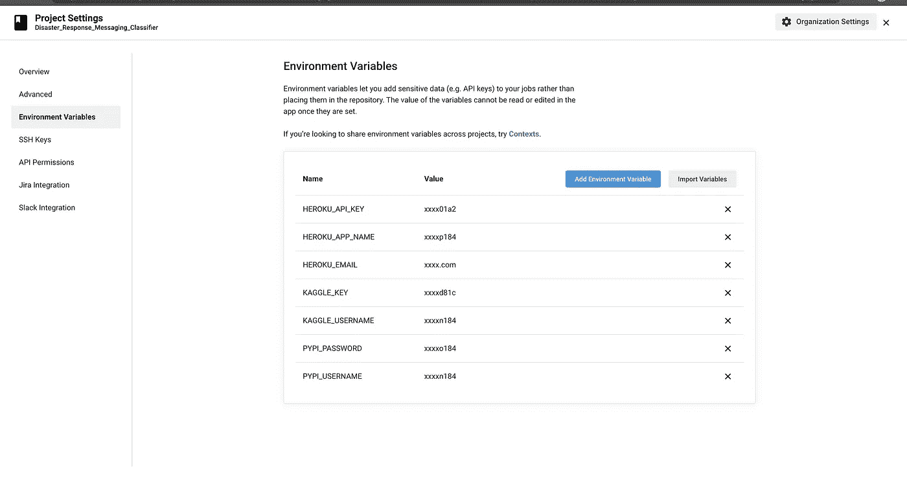
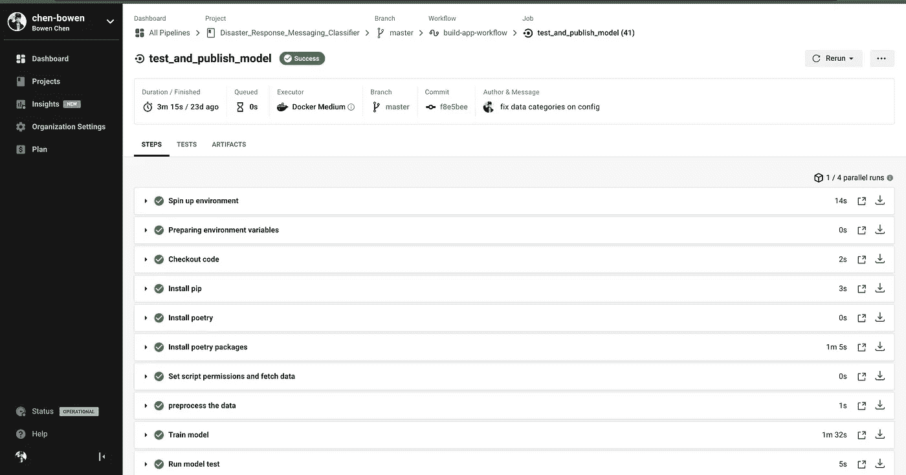

# 理解全栈数据科学:Jupyter 笔记本中的 NLP 模型如何帮助阻止灾难，第一部分

> 原文：<https://towardsdatascience.com/understanding-full-stack-data-science-how-the-nlp-model-in-your-jupyter-notebooks-could-actually-d813adf62321?source=collection_archive---------45----------------------->

## 自然语言处理

## 从研究到生产的灾害信息分类模型——模型的自动训练、测试和打包


[甄虎](https://unsplash.com/@zhenhu2424?utm_source=unsplash&utm_medium=referral&utm_content=creditCopyText)在 [Unsplash](https://unsplash.com/?utm_source=unsplash&utm_medium=referral&utm_content=creditCopyText) 上拍照

So . S

紧急情况随时随地都可能发生。当我们穿越这个毁灭性的全球疫情时，我们现在见证了所有一线急救人员的绝对才华。事实上，派遣救援队只是他们已经很辛苦的工作的一部分。当灾难发生时，援助请求信息会从所有不同的渠道快速而猛烈地传来。来自不同渠道的所有请求救援的信息会很快淹没人类的劳动。

因此，需要一种自动且可靠的方式将救援请求消息快速分类到正确的对应信道中。一个自然的选择是用一些机器学习模型构建一个消息分类器。所以我们通常会拿起我们的 jupyter 笔记本开始开发，对吗？事实上，这只是这里所做工作的一部分。借助 Jupyter 笔记本电脑，我们可以创建引人入胜的数据视觉效果和易于阅读的模型表示，但这些模型只能被观看，不会产生任何实际影响。因此，能够将模型转换成生产就绪的代码库对于团队直接创建功能是至关重要的。在这篇博文中，我们将通过在 PaaS 平台 Heroku 上构建一个完全容器化的、持续集成的灾难消息应用程序来说明全栈数据科学实践。**由于我们使用的数据集(图 8 灾难消息)在数据科学社区中相当有名，我们将主要关注用于生产模型的高级工具，**如 Sklearn Pipeline、Pytest、Docker 和 CircleCI。为了避免这篇文章太长而无法阅读，我们将重点讨论这个模型的构建和打包过程

## 项目总体结构

由于会涉及到各种不同的文件，因此对项目结构有一个清晰的理解对项目的成功至关重要。在项目的根目录下，我们会有一个标准的`.gitignore`文件和一个`ReadMe.md`文件。还存在 4 个子目录，

*   **。circle ci**—circle ci 持续集成工具所需，包含`circleci.config`文件，用于自动化模型培训和部署工作流
*   **disaster _ messaging _ class ification _ model**—包含机器学习模型包，该包将传入的消息预测到其适当的类别中
*   **disaster_messaging_app** —包含 API 和 docker 文件，可用于训练好的机器学习模型，将由 circleci 部署
*   **笔记本** —包含探索性分析笔记本

**。circleci** 和**笔记本**文件夹的用途非常明显。当我们构建这些模块时，我们将看看**disaster _ messaging _ class ification _ model**和 **disaster_messaging_app** 中有什么。

## 获取数据

我们将使用 Kaggle 的多类别灾难响应消息数据集，其中包含英语消息、原始消息、消息发送通道以及所有 37 种二进制编码的消息类别。一封邮件可以属于多个类别。前 5 行如下所示。



disaster_response_messages.csv 前 5 行

我们可以手动下载数据并将文件保存到数据文件夹中。然而，在一般实践中，为了确保我们总是从数据源获得最新的数据，我们将使用 shell 脚本来自动化数据提取过程。对于我们的项目，数据来自 Kaggle 的[多语言灾难响应消息](https://www.kaggle.com/landlord/multilingual-disaster-response-messages)。该数据集包含从多个渠道提取的 30，000 条消息。一般过程如下，

*   从 Kaggle 的多重灾难响应消息中下载数据
*   解压缩下载的 zip 存档文件，并将 CSV 文件保存到同一目录
*   删除 zip 存档文件
*   通过将验证 CSV 和测试 CSV 中的内容复制到培训 CSV 中，将所有消息文件合并成一个文件(我们将在后面设置培训测试验证)
*   将培训文件重命名为`disaster_response_messages.csv`
*   删除两个额外的 CSV 文件-验证 CSV 和测试 CSV

所有这些步骤都可以在终端外壳命令中完成，

使用这个 shell 脚本，上面的整个过程可以在下面一行中执行

```
sh fetch_data.sh
```

执行后，您将能够看到`disaster_response_messages.csv`文件存在于**disaster _ messaging _ class ification _ model**目录的 data 文件夹中。现在我们已经有了数据，我们可以继续为这个机器学习模型构建、训练和设置预测管道。

## 构建模型

对于我们大多数人来说，构建模型应该是一个相对熟悉的过程。我们获取数据，将相关的机器学习框架导入到我们的 jupyter 笔记本中，训练模型，然后评估模型。在 sklearn pipelines 的帮助下，我们可以构建一个自包含的、稳定的、可复制的模型管道。由于这个**disaster _ messaging _ classification _ model**目录包含多个相关文件，我们将从查看该文件夹的结构开始。

在**灾难 _ 消息 _ 分类 _ 模型**子目录中，包含以下文件/子目录

*   **配置** —包含模型和日志记录的配置文件
*   **数据** —下载数据的保存目录
*   **特征**-包含创建模型管线中使用的特征的模块
*   **模型** —包含机器学习模型的训练和预测脚本
*   **脚本** —包含`fetch_kaggle_dataset.sh` shell 脚本的目录
*   **测试** —包含确保机器学习模型稳定行为的 python 单元测试
*   **trained_model** —用于保存训练好的机器学习模型 pickle 文件和性能报告的目录，该文件夹不提交，将由数据实用函数自动创建(托管在 **utils** 目录中)
*   **utils** —包含用于数据预处理、模型构建和可视化创建的实用函数
*   **可视化**——包含构建显示在前端的单词云的`generate_visuals.py`。
*   **Makefile**—circle ci 正在使用的重要自动化脚本。关于这个文件的更多细节稍后
*   **py project . toml**—**依赖定义文件，用于生成依赖锁文件(更多信息[此处](https://python-poetry.org/))**
*   ****poem . lock**—调用`poetry lock`从`pyproject.toml` 文件生成的锁文件**
*   ****setup.py** —项目打包定义文件，包含所有安装需求和安装包**

****数据预处理****

**为了将数据提取为模型可用的格式，我们将按照以下步骤提取 CSV 并将转换后的数据保存到 SQLite 数据库中。**

1.  **从保存在**数据**目录的 CSV 文件中加载数据作为熊猫数据帧(用`load_data(*messages_filepath*)`函数定义)**
2.  **在加载的数据帧中添加一列指示数据串测试分割(用`train_test_split_label(*df*)`功能定义)**
3.  **将数据帧保存到 SQLite 数据库中(用`save_data(*df*, *database_filename*)`函数定义)**

**4.定义一个调用上述 3 个步骤的函数(用`process_data()`定义)**

**由于原始数据相对干净，大多数数据转换操作将在我们创建标记化句子特征时执行(接下来)。**

****特征—标记器****

**要将原始文本转换为机器可读的单词标记，我们需要构建一个标记化器，删除停用词(如 this、that、I、am……)，将单词按字母排序为原始格式，删除 URL 并去掉多余的空白。该模块在名为`message_tokenizer.py`的文件中被构建为一个转换器。由于这个 tokenizer 转换器被用作一个特性创建器，我们将把它放在**特性**目录中。**

****模型管道—培训****

**该模型的流水线仅由 4 个步骤组成，**

1.  **记号化——由我们上面定义的记号化器完成**
2.  **计数矢量化—对所有句子进行字数统计，这由 sklearn 的计数矢量化工具完成**
3.  **TF-IDF-使用计数矢量化文本，可以使用 sklearn 的 TF-IDF 转换器计算 TF-IDF 特征**
4.  **Adaboost 模型——一旦创建了特性，我们就可以将模型作为管道的最后一步**

**上述 4 个步骤可以很容易地构建成如下所示的管道函数。**

**作为下一步，我们可以继续构造训练函数，它包括如下步骤**

1.  **从数据库加载训练数据(在`model_utils.py`的`load_data_from_db`功能中定义)**
2.  **构建模型管道(在上述函数`build_model_pipeline()`中定义)**
3.  **符合模型**
4.  **保存模型管线(在`model_utils.py`的`save_pipeline`功能中定义)**
5.  **从数据库加载测试数据(在`model_utils.py`中定义)**
6.  **评估模型(在`model_utils.py`中定义)**

**`load_data_from_db`函数可以选择加载训练数据还是测试数据(默认为“train”)，具体定义如下**

**`save_pipeline()`功能将以`config.py`中定义的特定命名约定( *model_name_version.pkl* )将新训练的模型保存到特定位置( **trained_models 目录**),同时删除旧版本的模型管道以避免引用冲突。具体定义如下所示**

**`evaluate_model()`函数将使用内置的 sklearn 评估 API 并生成性能报告，该报告将保存在**trained _ models/performance _ report**目录中。具体定义如下所示**

****模型管道—预测****

**在对模型进行训练、保存和评估之后，我们现在就可以使用该模型在新数据到来时生成一些预测。预测脚本只包含 3 个步骤，可以在一个函数中实现**

1.  **收集输入数据并将其转换为与训练数据相同的形式**

**2.加载管道并使用输入数据进行预测**

**3.组装包含预测结果和模型版本的有效负载**

**具体定义如下所示**

****可视化——文字云****

**我们将建立将在前端使用的单词云可视化。由于我们的前端只使用 javascript 来显示单词云视觉效果，我们将依靠 Plotly 的特殊布局结构和`plotly_wordcloud`函数来生成我们的消息来自的 3 个不同渠道中最常用的单词的 3 个视觉效果——新闻、社交媒体和直接消息。**

**总体步骤如下，**

1.  **使用`visual_utils.py`中定义的`load_data_from_db_visual`将保存的数据库中的信息数据作为数据帧加载**
2.  **通过数据帧的`channel`列分割数据帧，并获得具有特定通道的子数据帧**
3.  **使用`plotly_wordcloud`函数生成一个可以被前端解释的 JSON 格式的字符串**

**`VisualsGeneration`类定义如下。**

**`plotly_wordcloud`功能(配方由 Prashant [提供，此处为](https://github.com/PrashantSaikia/Wordcloud-in-Plotly/blob/master/plotly_wordcloud.py))遵循以下一般步骤。**

1.  **创建单词云对象**
2.  **创建 5 个列表，收集列表中每个单词的单词、频率、字体大小、位置、方向和颜色列表，从单词云对象的`.layout_`属性中提取**
3.  **创建布局和数据跟踪，然后使用 Plotly 内置包构建图形**

**该函数定义如下:**

## ****自动训练/打包****

**随着模型管道、训练和预测脚本的构建，我们可以在终端中使用一系列 shell 命令来执行与该模型相关的工作流。例如，我们可以在终端中调用以下两个命令来打包保存的训练模型，并将模型上传到 PyPI 服务器。**

```
python setup.py sdisttwine upload --skip-existing dist/*
```

**执行模型打包将需要存在训练数据、所有安装在当前执行环境中的依赖包，并且模型已经被训练和保存。换句话说，在我们最终上传训练好的模型之前，我们需要完成一系列的步骤。**

****构建依赖关系定义****

**我们将从为我们的模型包创建适当的环境定义开始，这可以通过构建由 python 依赖管理工具[poem](https://python-poetry.org/)使用的`pyproject.toml`文件来完成。pyproject。toml 文件如下所示，**

**然后，我们可以在终端中调用`poetry lock`，这将生成一个`poetry.lock`文件，其中包含该项目所需的所有锁定版本的包依赖项。锁定版本将允许我们在安装包依赖关系时有必要的一致性，以防部分依赖包收到更新，这会给我们的项目带来意想不到的问题。**

****建立包装定义****

**对于我们上传到 PyPI 服务器的每个 python 包，我们需要创建一个`setup.py`文件。幸运的是，我们可以使用名为 [depshell](https://github.com/dephell/dephell) 的工具为我们创建文件。我们只需要调用下面的命令来创建`setup.py`文件。**

```
pip install dephelldephell deps convert
```

**创建的`setup.py`文件如下所示**

****创建自动化生成文件****

**由于要执行这么多 shell 命令，简单地创建一个包含所有步骤的文件对于可读性和透明性来说并不理想。幸运的是，我们可以创建一个`Makefile`,有效地将步骤聚集成组，这些组只包含完成单个任务的命令。例如，要安装和构建包依赖关系定义，我们可以将以下一系列命令写入 Makefile，**

```
**poetry-install**:poetry lockpoetry config virtualenvs.create false \&& poetry export --without-hashes -f requirements.txt --dev\|  pip install -r /dev/stdin \&& poetry debug
```

**然后要执行这一系列的命令，我们只需要在终端中调用`make poetry-install`，上面所有的命令集都会被执行。下面概述了将放入 Makefile 的步骤**

1.  **从诗锁文件安装依赖项**
2.  **从 Kaggle 获取数据集**
3.  **从 dephells 构建 setup.py 文件**
4.  **安装 nltk 资源(用于删除句子的停用词和词条)**
5.  **通过调用`data_utils.py`预处理数据**
6.  **通过调用`train.py`训练模型**
7.  **通过调用`test.py`来测试模型**
8.  **将模型包上传到 PyPI**

**完整的 Makefile 如下所示，**

**这很好，因为许多步骤可以总结成一个简短的 make 语句。为了进一步使整个过程自动化，我们将使用一个配置文件来指示 circleci 一个接一个地执行这些步骤。**

****配置 CircleCI 持续集成工具****

**CicleCI 是一个强大的持续集成工具，它允许我们的模型被自动训练、测试和打包，以供发布。它还使用自己的托管 docker 映像，模拟其他人有效使用您的项目的过程，因为它遵循本地安装项目时相同的设置步骤。我们只需要在名为`.circleci`的指定文件夹中定义一个`config.yaml`文件。更多关于 circleci 的资源和文档可以在[这里](https://circleci.com/docs/)找到。**

**所以，现在的问题变成了我们需要遵循什么步骤来使这个项目从零开始工作？我们已经有了 Makefile 中的大部分步骤，我们只需要连接它们。**

1.  **安装 pip 工具/将 pip 工具升级到最新版本**
2.  **安装诗歌工具(通过 pip 安装)**
3.  **使用上面定义的 make 命令安装诗歌锁文件中的依赖项**
4.  **使用上面定义的 make 命令从 Kaggle 获取数据集**
5.  **使用上面定义的 make 命令预处理原始数据**
6.  **使用上面定义的 make 命令训练模型**
7.  **使用上面定义的 make 命令运行模型测试**
8.  **初始化 PyPI 的凭证文件——这将允许我们将包上传到 PyPI 服务器**
9.  **使用上面定义的 make 命令创建并上传模型包**

**circle 配置文件将以 3 行常规头开始，指示 circleci 的 python docker 映像版本，在我们的例子中是 0.2.1。**

**然后在下一行，`jobs`将指示完成我们项目中定义的任务(我们上面定义的 9 个步骤)所要完成的自动化工作流步骤的开始。`config.yaml`文件将如下所示。**

****设置 CircleCI****

**在用 yaml 文件配置 CI 工作流之后，我们将继续到 CircileCI 的网站并设置它与 github 存储库之间的连接。**

**我们将从使用包含我们的项目资源库的 github 帐户登录 CircleCI 开始。**

****

**然后，我们将导航到左侧菜单栏上的第二个图标(**项目**)并找到我们对应的项目存储库。对我来说，它叫做`Disaster_Response_Messaging_Classifier`。然后，我们将单击蓝色的“设置项目”按钮。**

****

**在语言下拉菜单中，我们将选择“Python”，然后将我们的`config.yaml`文件复制到下拉菜单正下方的编辑器中。然后点击“添加配置”按钮。**

****

**我们将登陆**仪表板**页面。由于我的项目已经构建了多次，工作流完成的状态将在仪表板上显示为行项目。要设置完成项目所需的环境变量，我们将单击左上角的“项目设置”按钮。**

****

**在下一页中，导航到左侧面板并单击“环境变量”。我们将需要添加以下 4 个环境变量，以使工作流完全发挥作用。**

1.  **`**KAGGLE_KEY**` —设置 Kaggle 的 API 时获得。关于如何设置的更多资源可以在[这里](https://github.com/Kaggle/kaggle-api)找到。**
2.  **`**KAGGLE_USERNAME**` —设置 Kaggle 的 API 时获得**
3.  **`**PYPI_USERNAME**` —在 PyPI 服务器上注册账户时获得**
4.  **`**PYPI_PASSWORD**` — 在 PyPI 服务器上注册账户时获得**

****

**其他 3 个环境变量用于部署，这将在[第 2 部分](/understanding-full-stack-data-science-how-the-nlp-model-in-your-jupyter-notebooks-could-actually-460f17baf30b)中讨论。**

**我们现在已经为我们的项目设置好了持续集成工具，现在是时候看看它是如何工作的了。**

****提交、推送、观察和验证****

**如题所示。我们将提交并推动回购，并观察工作流程自行进行。如果一切正常，我们将看到以下屏幕，指示工作流已成功完成。**

****

**然后，我们可以登录到我们的 PyPI 服务器，验证包是否被正确地推送到主机中。它确实在我们的项目列表中，耶！**

****

## **结论/结尾**

**我们现在已经成功地完成了机器学习模型的构建，该模型将帮助我们将消息分类到它们正确的通道中。更重要的是，我们已经完全自动化了该模型的模型构建、训练和打包过程。每次，当我们想要更改模型定义，或者甚至想要在有新数据进入时重新训练模型时，我们所要做的只是提交和推送。**

**谢谢你坚持到最后。这只是故事的一部分，因为我们将在[第二部分](/understanding-full-stack-data-science-how-the-nlp-model-in-your-jupyter-notebooks-could-actually-460f17baf30b)中谈论一些更令人兴奋的部署过程，这些过程将使这个项目真正端到端。**