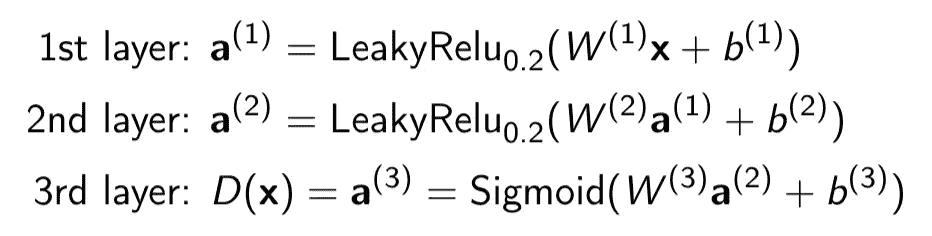
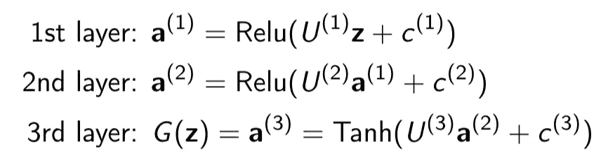
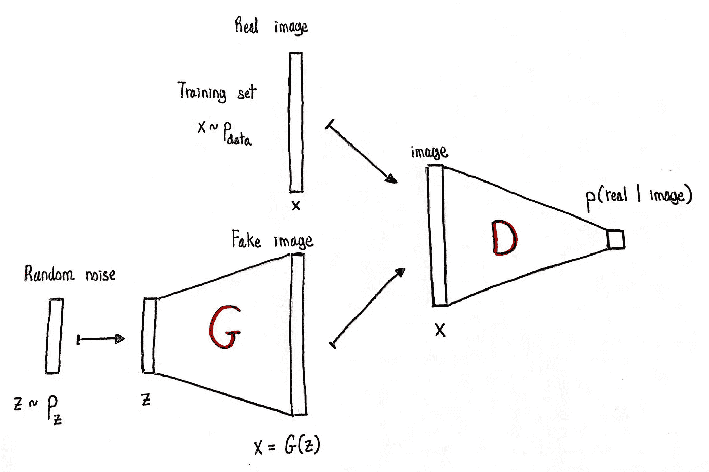
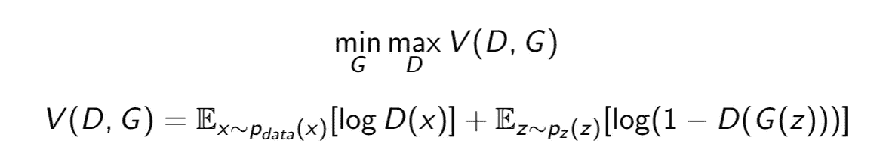
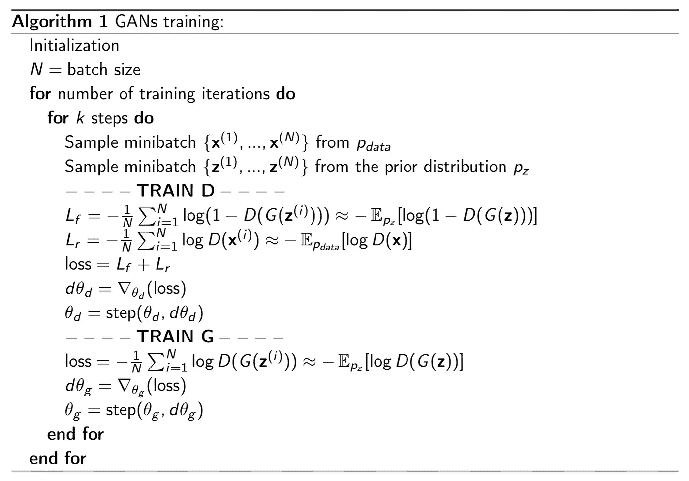
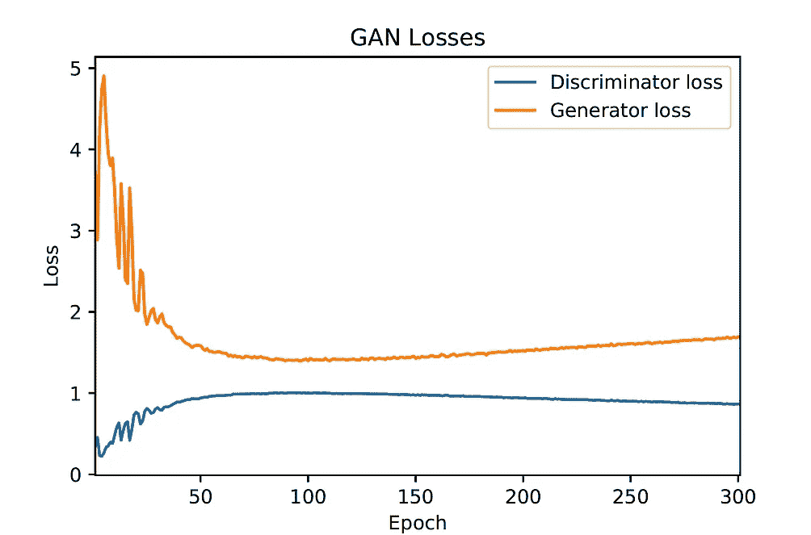
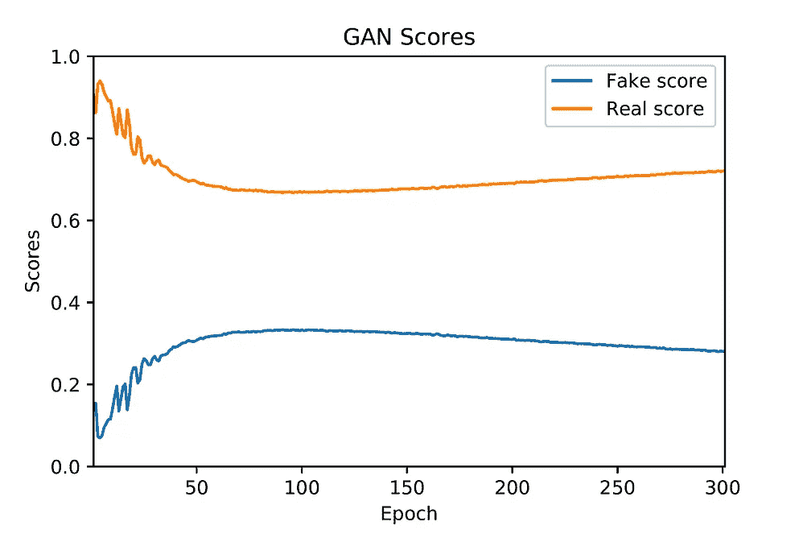
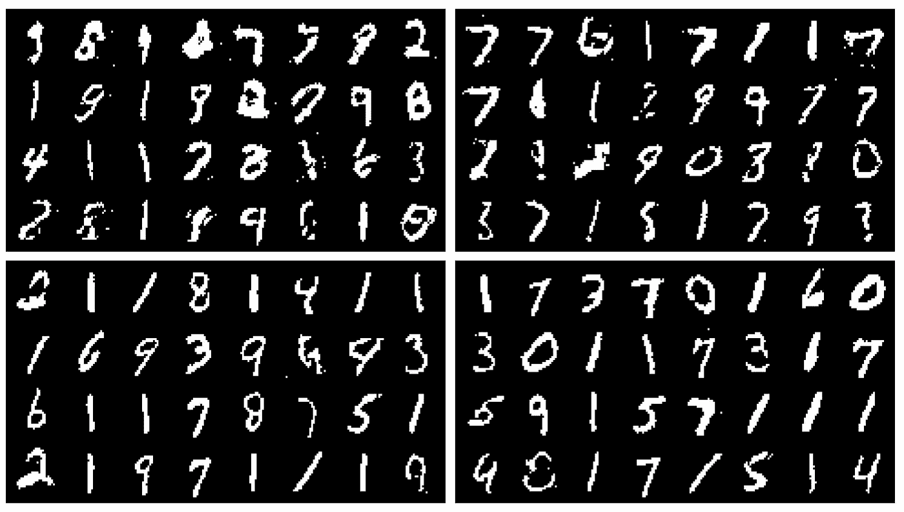
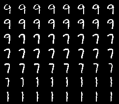
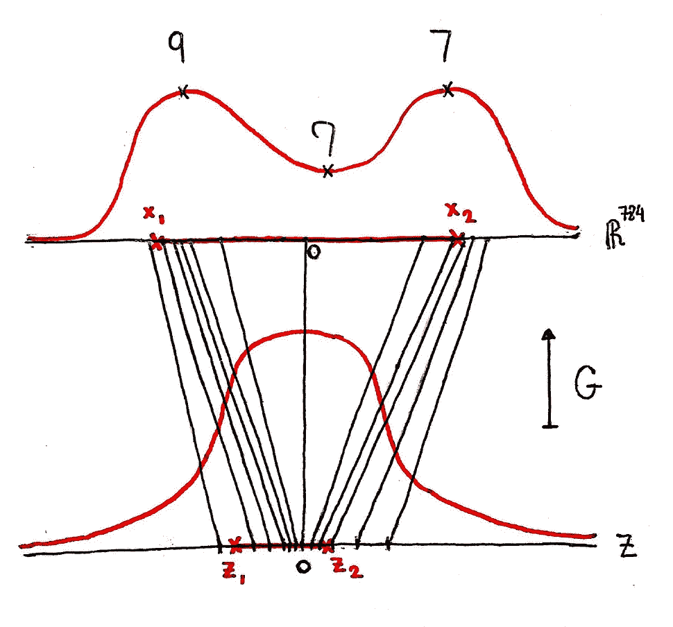

# 理解甘斯:MNIST 案例研究。

> 原文：<https://towardsdatascience.com/understanding-gans-mnist-case-study-e3c9ad4ae3a7?source=collection_archive---------51----------------------->

## 这篇文章帮助你理解和发展关于这个算法如何工作的直觉。

在本文中，我们将介绍使用 GANs 生成手写数字(MNIST)的整个过程。如果你的目标是理解理论，获得直觉，那就继续读下去。如果你只是想学习如何编码，你可以在 Jupyter 笔记本上找到。此外，我们假设深度学习和机器学习概念的最低背景。如果你对一般的深度生成模型感兴趣，我将很快发表我的学士论文(查看我的生物网页，这是论文的一部分)，其中调查了 4 个最常用的模型并对它们进行了比较。现在我们开始吧！

我们将定义一个生成新图像的代理( **G** ，生成器)，另一个( **D** ，鉴别器)，用于鉴别图像是真是假。这两个代理将在接下来的游戏中进行几轮较量。每一轮将包括以下步骤。

*   g 生成新的图像。
*   d 将被给予几个图像，包括生成的和真实的。
*   d 会把这些图像分为真假。
*   g 和 D 将从他们所犯的错误中吸取教训，改进他们的方法/系统。

遵循这个过程，G 和 D 会越来越强。请注意，如果它们最终是完美的，生成的图像将无法与真实的图像区分开来，D 将无法辨别真假。一旦发生这种情况，G 将是我们正在寻找的采样器。

# 生成器和鉴别器代理

我们将使用简单的神经网络来定义这些代理。值得注意的是，CNN 可能会提供更好的图像结果，但我们希望保持简单，更多地关注 GANs 的核心组件。

鉴别器将学习从图像空间到[0，1]空间的映射。该输出将被解释为图像是真实的概率。另一方面，生成器将学习从潜在空间到图像空间的映射。网络架构如下:

所使用的图像大小为 784，2 个隐藏层为 256，鉴别器输出层为 1，潜在空间为 64。

我们如何用这种结构对新图像进行采样？我们将在潜在空间(多元正态分布 **q(z)** )中定义一个先验分布，我们将从该空间中对噪声进行采样。然后，我们将使用生成器对其进行转换，以获得所需的图像。

**z** ~ q( **z** )， **x** = G( **z** )

在下图中，我们可以看到网络的结构。我们将在下一节看到它们是如何交互的。

甘斯结构。

# 培养

前面描述的博弈可以正式写成一个极小极大博弈:

最初由 Goodfellow [1]提出。

现在，让我们看看为什么这和游戏是一样的。如果鉴别器识别出 **x** 为真(D( **x** ) = 1)，V 函数的第一项为 0，如果识别出为假(D( **x** ) = 0)。因此，由于图像来自真实分布，D 的目标是最大化它(将真实图像分类为真实)。如果鉴别器发现它是假样本，第二项为 0，如果生成器欺骗了鉴别器，则为-∞。现在，D 想要最大化，G 想要最小化。所以这个博弈中生成器的目标是最小化 V(D，G)而鉴别器的目标是最大化，就像公式中写的那样。

训练中使用的算法如下:

从算法中可以看出，训练将在一个代理和另一个代理之间交替进行。注意一些事情:首先，我们可以通过改变阶跃函数来使用任何我们想要的优化算法。在这种情况下，我们使用了深度学习社区广泛接受的 Adam 算法[2]。第二，我们没有像极小极大游戏中那样优化生成器。这里，不是最小化 **log(1-D(G(z)))** 的期望，而是最大化 **log D(G(z))** 。这是因为根据[1]的作者，它在训练中更稳定。

# 结果

我们运行了 300 个**时期的算法，批次大小为 **N = 32** 。**

从下图中可以看出，直到第 100 个纪元，发生器越来越欺骗鉴别器。然而，在这一点上，它开始慢慢减少，鉴别器越来越能够区分真假。重要的是要明白，这并不意味着发电机没有学习。这只意味着鉴别器比发生器学习的“更多”。然而，很明显，代理 G 有一些限制(非常简单的网络)，这可能是它不收敛到完美采样器的原因。

GANs 结果。在右边可以看到分数。这基本上是 D(G(z))对于伪分数的期望，并且对于真实分数具有相同但真实的图像。另一方面，人们可以看到 G 和 D 想要最小化的损失。回想一下:本来 G 想最小化，D 想最大化。然后，我们改变了 G 最大化另一个值的目标。在那之后，我们将目标转换为负数，这意味着它们都最小化。

还要注意，我们讨论的是 **70\%** 对 **30\%** 的准确性，这意味着生成器平均会欺骗鉴别器 10 次中的 3 次——完美是 10 次中的 5 次，这意味着鉴别器没有线索。现在，鉴别器能够在生成的图像中识别出与真实图像不同的模式，但是我们人类能够做到吗？在下图中，您可以看到不同训练阶段的样本。我们发现的有趣结果是，人类感觉不到生成和真实之间的任何差异[3]。对于手写数字来说，这可能并不令人惊讶，但是这些算法也用于面部生成，例如，这种结果更加强大。

GANs 生成的图像。左上是纪元 50、右上 100、左下 200 和右下 300。

尽管我们看到结果令人惊讶，但我们必须记住，直方图对人眼来说也是完美的，但它不会实现我们的概括目标，它只是记忆。为了测试我们是否过度拟合，我们将搜索每个生成图像的最近邻。如下图所示，生成的影像(左侧)与其在数据集中的最近邻影像(右侧)之间存在明显差异。我们不能断定我们没有过度适应，但至少我们看到我们正在学习一些有意义的东西。

左边是生成的图像，右边是根据欧几里德距离对应的最近邻。

现实情况是，从潜在空间到图像空间的映射是连续的，这意味着在一个空间中接近的图像在另一个空间中也会是接近的。现在，由于我们使用多元正态作为先验分布(单峰)，如果我们在潜在空间中采样 2 个向量并对它们进行插值，则得到的线也将是非常可能的，这表明图像也应该是手写数字。这一切意味着这个插值的图像应该是不同手写数字之间的连续平滑变换，如下图所示(插值:9 → 7 → 1)。这在本图中有进一步的探讨:

在右图中，我们可以看到使用 g 进行空间转换的真实情况。在本例中，我们可以看到如何从单峰分布变为多峰分布，这基本上是现实中正在发生的事情，但在更高维度中，每座“山”都是不同的数字。此外，如果我们在潜在空间中采样 2 个点，对它们进行插值，并投影图像，可以看到会发生什么。右边的图是在 2 个不同点之间的潜在空间中的插值结果，从先前采样(多元正态分布)。

更多细节请访问 GitHub 中的代码。我的学士论文将很快在我的网站上发布，你也可以看看。

# 参考

[1] Goodfellow，I .、Pouget-Abadie，j .、Mirza，m .、Xu，b .、Warde-Farley，d .、Ozair、…、Bengio，Y. (2014)。生成对抗网络。在*神经信息处理系统的进展*(第 2672-2680 页)。

[2]金马博士和巴律师(2014 年)。亚当:一种随机优化方法。arXivpreprint arXiv:1412.6980。

[3] Salvia，v .，Sanfeliu，A. (2020)。图像生成的最新深度生成模型分析。(这是我的学士论文，很快就可以在我的网页上看到。)

https://github.com/VictorSP17/Simple_GAN_MNIST[(在这里你可以找到这份文件的代码。)](https://github.com/VictorSP17/Simple_GAN_MNIST)

[5]https://github.com/jsuarez5341/GAN-MNIST-Pytorch