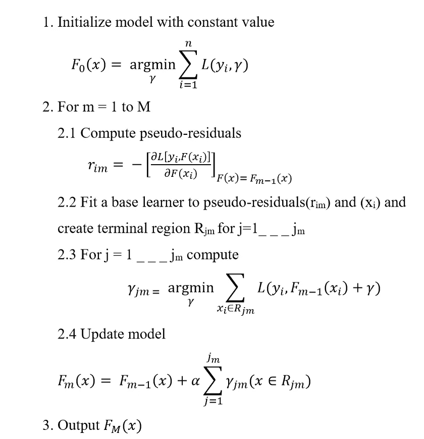
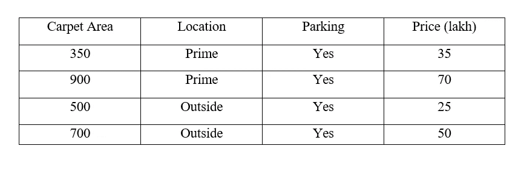
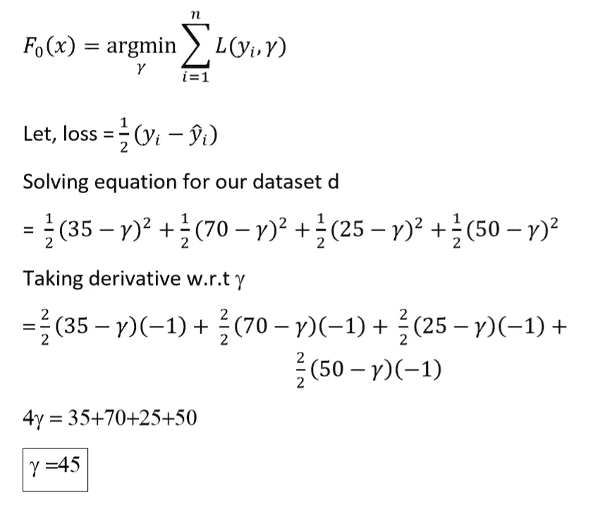
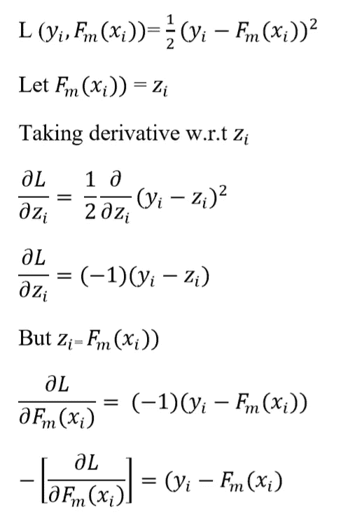
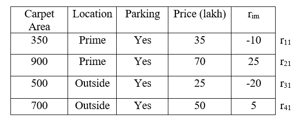
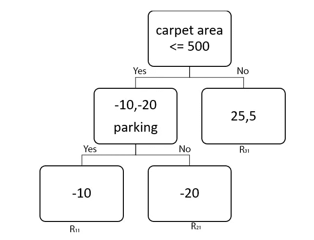
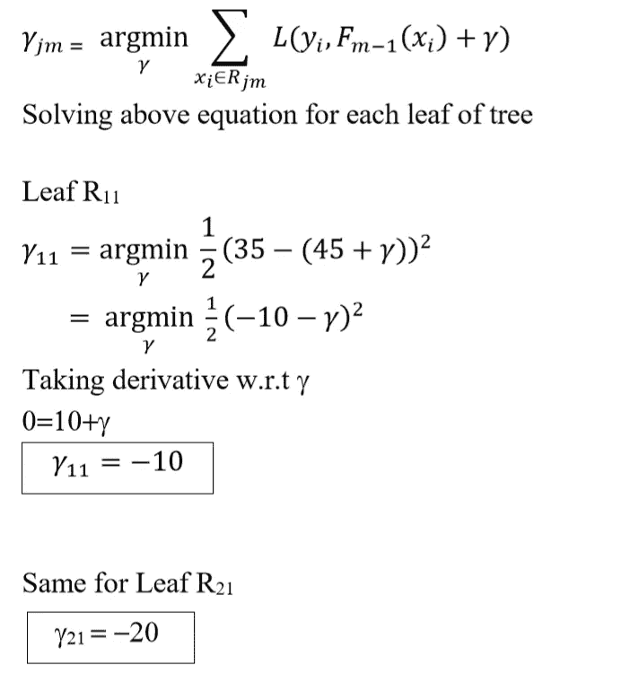
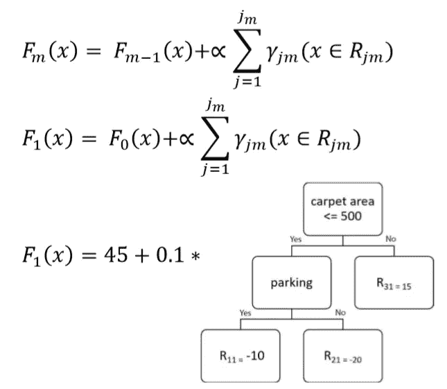
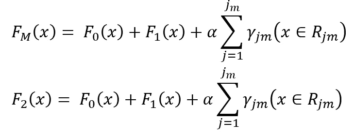

# 使用小数据集从头理解梯度增强

> 原文：<https://towardsdatascience.com/understanding-gradient-boosting-from-scratch-with-small-dataset-587592cc871f?source=collection_archive---------20----------------------->

# 什么是助推？

Boosting 是一种非常流行的集成技术，在这种技术中，我们将许多弱学习者组合起来，将他们转化为强学习者。增强是一种顺序操作，其中我们以渐进的方式建立相互依赖的串联弱学习器，即弱学习器 m 依赖于弱学习器 m-1 的输出。用于增强的弱学习者具有高偏差和低方差。简而言之，boosting 可以解释为 boosting =弱学习者+加法梳理。

# 梯度推进算法

梯度推进是一种用于回归和分类问题的机器学习技术，它以弱预测模型的集合的形式产生预测模型，通常是决策树([维基百科定义](https://en.wikipedia.org/wiki/Gradient_boosting#:~:text=Gradient%20boosting%20is%20a%20machine,prediction%20models%2C%20typically%20decision%20trees.))

# 算法步骤:

作者图片

现在让我们在一个小数据集(D)上应用所有这些步骤。数据集的大小保持非常小，以避免冗长的计算。这是一个预测公寓价格(以 10 万卢比计)的数据集，使用的参数包括地毯面积、位置(位于城市黄金地段或城外)和停车场(我们有公寓停车场吗)数据集:

作者图片

# 第一步:

梯度增强的第一步是用常数值初始化模型 F0(x)。也就是说，我们必须找到γ(γ)的最佳值，以使损耗值降低。现在让我们为数据集(D)求解步骤 1 中的方程

作者图片

# 第二步:

这一步是我们建立所有弱学习者的循环。这里 m=1 表示我们正在构建第一个弱学习器，并且我们已经在步骤 1 中构建了基础学习器 F0(x)

# 第 2.1 步

这里我们首先计算伪残差，也称为假残差。与残差相比，使用伪残差的最大优点是，他们让我们有任何损失函数。也就是说，它们帮助我们最小化我们选择的任何损失函数，直到损失函数是可微的。大多数伪残差几乎与残差相似，或者与残差成一定比例。

以下等式显示了伪残差与实际残差是如何相似的。

作者图片

对于所使用的损失函数，伪残差完全等于实际残差，但这并不总是正确的，因为随着损失函数的改变，方程和值也改变。在上面的等式中，Fm(Xi)表示前一阶段来自弱学习者的预测值

算法步骤 2.1 中给出的方程与上述方程的 L.H.S .相同，用简单的英语来说，这两个方程都可以解释为损失函数相对于阶段 m-1 的模型构建的负导数

让我们计算数据集(D)的伪残差

作者图片

在上表中，rim 是实际值(yi)和模型预测值(F0(x))的差值，r 表示残差，m 表示我们正在制作的弱学习器的数量，I 表示实例的数量，因此这里 r11 表示实例 1 的弱学习器 1 的残差。

# 第 2.2 步

在这一步，我们训练下一个弱学习者 F1(X)。让本周的学习者成为决策树。

在梯度推进中，如果我们使用决策树作为弱学习器，那么决策树的深度应该在 2 到 9 之间，默认情况下设置为 3。此外，请注意，深度必须在 2 到 9 之间并不是一条经验法则，这在很大程度上取决于我们的数据集。

在梯度推进中，我们在 Xi 和伪残差上训练我们的弱学习者，即我们将使用地毯面积、停车场和位置来预测我们在步骤 2.1 中计算的伪残差。我们数据集的决策树

作者图片

决策树的叶子被称为终端区域(Rjm)。其中 m 是我们刚刚制作的树的索引，因为这是第一棵树，m=1，j 是树中每片叶子的索引。

# 第 2.3 步

在这一步中，我们确定每个叶子的输出值。在上面的树中，有一个具有 2 个条目的叶子，所以不清楚它的输出值应该是什么，所以叶子的输出值可以通过求解以下方程来计算

作者图片

注意:给定任何损失函数，叶的输出值总是该叶的残差的平均值。

# 第 2.4 步

在这一步，我们更新我们的模型。步骤 2.4 的等式有两个部分，第一部分显示我们对伽马(γ)的初始预测，即 F0(x)，第二部分代表我们在步骤 2.3 之前刚刚构建的树。因此，该等式可以表示为

作者图片

在上面的等式中，alpha(α)代表学习率。α的值在 0 到 1 之间变化，设α= 0.1。梯度提升中的学习率参数用于控制每个弱学习器的贡献，这些弱学习器被串联添加。

**Record1** :新预测= 45+0.1 *(10)= 44，与模型 F0(x)所做的早期预测相比，更接近真实值。这意味着我们朝着正确的方向迈出了一小步。

**记录 2** :新的预测= 45+0.1*(15)=46.5，与之前模型 F0(x)的预测相比，更接近真实值。这意味着我们朝着正确的方向迈出了一小步

**记录 3** :新的预测= 45+0.1 *(20)= 43，与模型 F0(x)的早期预测相比，更接近真实值。这意味着我们朝着正确的方向迈出了一小步。

**Record4** :新预测= 45+0.1*(15)= 46.5，与模型 F0(x)做出的早期预测相比，更接近真实值。这意味着我们朝着正确的方向迈出了一小步。

现在我们已经完成了步骤 2 的第一次迭代。我们将继续迭代，直到 M 的值达到 M 的值，这里 M 是构建一个算法所需的弱学习者总数。实际上，对于梯度提升，M = 100。但是为了简单起见，让我们保持 M=2

现在我们将再次重复步骤 2。这意味着对于 m=2，我们将计算伪残差，拟合下一个弱学习器 F2(x)，计算叶子的输出，并将更新模型。这里我们完成第 2 步得到的 m 的值达到了 m 的值

# 第三步

作者图片

在步骤 3 中，我们计算梯度推进算法的输出。上面的等式代表了我们算法的最终输出。当 m = 2 时，上述等式的第 3 部分表示步骤 2 中的树构建。这里 M = 2，这意味着 F2(x)是梯度增强算法的输出。

希望这篇文章能帮助你增加对梯度推进的理解。我们知道梯度推进是一种强大的机器学习算法，但这不应该阻止我们了解它是如何工作的。我们对算法了解得越多，我们就能更好地有效使用它，并解释它是如何做出预测的。

**感谢阅读。**