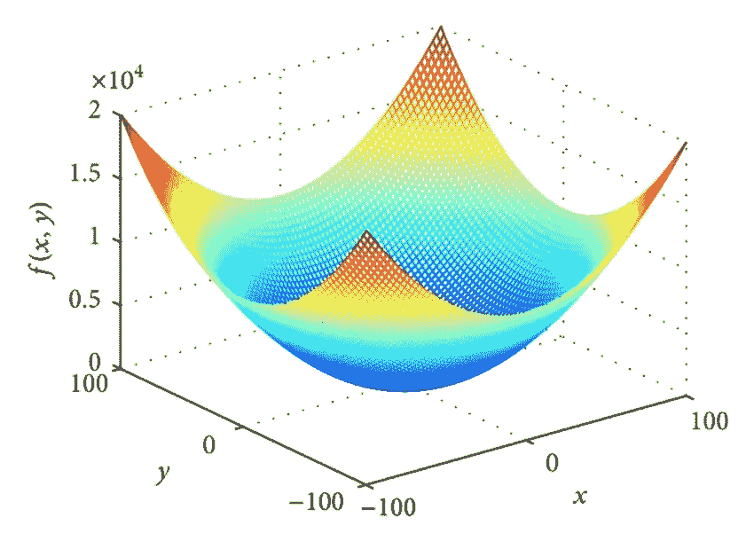
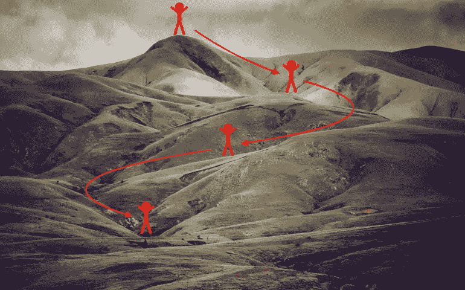
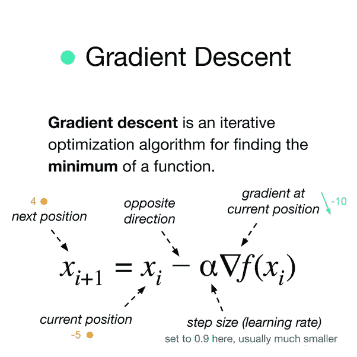
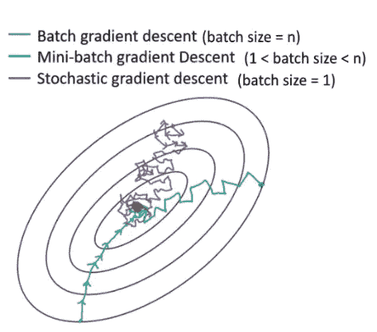
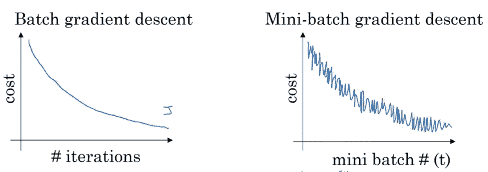
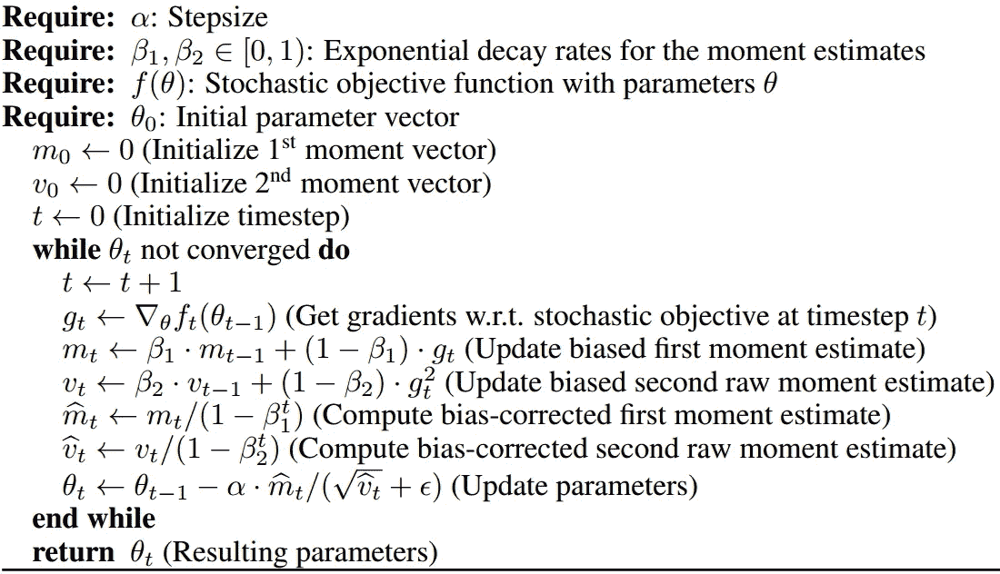
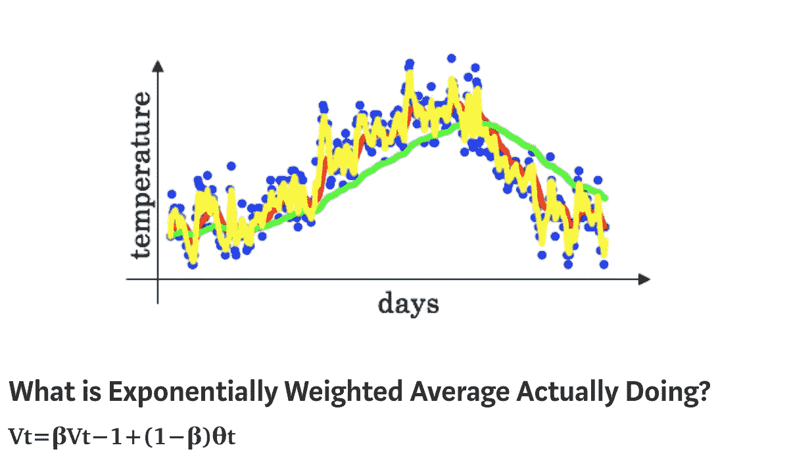
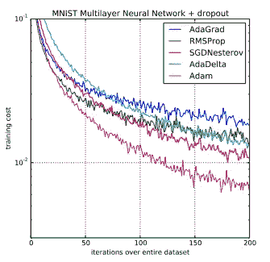

# 了解梯度下降和 Adam 优化

> 原文：<https://towardsdatascience.com/understanding-gradient-descent-and-adam-optimization-472ae8a78c10?source=collection_archive---------14----------------------->

## 对亚当的直观看法，以及为什么它更常用于深度学习


来源:[https://pix abay . com/插图/人工智能-大脑-思考-3382507/](https://pixabay.com/illustrations/artificial-intelligence-brain-think-3382507/)

人工智能在过去十年中如何影响了我们的日常生活，这是我们只能深思的事情。从垃圾邮件过滤到新闻聚类，指纹传感器等计算机视觉应用到手写和语音识别等自然语言处理问题，很容易破坏人工智能和数据科学在我们日常生活中发挥的作用。然而，随着我们的算法处理的数据量的指数增长，开发能够跟上复杂性增长的算法是至关重要的。一种给工业带来显著变化的算法是 Adam 优化程序。但是在我们深入研究它之前，首先让我们看看梯度下降和它的不足之处。



来源:[https://www . research gate . net/figure/Sphere-function-D-2 _ fig 8 _ 275069197](https://www.researchgate.net/figure/Sphere-function-D-2_fig8_275069197)

如果你不知道什么是成本函数，我建议你先浏览一下这个博客，它是对这个主题的一个很好的介绍:[https://medium . com/@ lachlanmiller _ 52885/understanding-and-calculating-the-cost-function-for-linear-regression-39b8a 3519 fcb](https://medium.com/@lachlanmiller_52885/understanding-and-calculating-the-cost-function-for-linear-regression-39b8a3519fcb)

# **梯度下降**

假设我们有一个如上所示的 2 个输入变量的凸成本函数，我们的目标是最小化其值，并找到 f(x，y)最小的参数(x，y)的值。梯度下降算法所做的是，我们从曲线上的一个特定点开始，使用负梯度找到最陡下降的方向，并在该方向上迈出一小步，不断迭代，直到我们的值开始收敛。



[https://data science-爱好者. com/DL/Optimization _ methods . html](https://datascience-enthusiast.com/DL/Optimization_methods.html)

我个人觉得上面的梯度下降比喻非常酷，一个人从山顶开始，沿着能使他最快降低高度的路径向下爬。



来源:[https://www . quora . com/What-turns-gradient-descent-into-gradient-ascent-in-deep-learning](https://www.quora.com/What-turns-gradient-descent-into-gradient-ascent-in-deep-learning)

同时给出了梯度下降的正式定义，我们继续根据需要执行更新，直到达到收敛。我们可以通过检查 f(X *i+1)* 和 f(X *i)* 之间的差值是否小于某个数字，比如 0.0001(如果使用 Python 实现梯度下降，则为默认值)，来轻松检查收敛性。如果是这样，我们说梯度下降已经收敛于 f 的局部最小值。

如果你不能完全掌握梯度概念，或者对成本函数和梯度下降的更深入的知识感兴趣，我强烈推荐以下来自我最喜欢的 YouTube 频道 3Blue1Brown 的视频-

# **坡度下降不足的地方**

要执行梯度下降的单个步骤，我们需要迭代所有训练示例，以找出特定点的梯度。这被称为批量梯度下降，并且已经进行了许多年，但是随着深度学习和大数据时代的到来，拥有数百万数量级的训练集变得很常见，这在计算上变得昂贵，执行梯度下降的单个步骤可能需要几分钟。通常的做法是所谓的小批量梯度下降，我们将训练集分成小批量，并分别使用这些批量执行梯度下降。这通常会导致更快的收敛，但这里有一个主要问题——我们在单步执行时仅查看训练集的一小部分，因此，该步可能不会朝着成本函数的最大下降方向。这是因为我们基于总数据的子集来最小化成本，这并不代表对整个训练数据来说什么是最好的。我们的算法现在不是沿着一条通向最小值的直线路径，而是沿着一条迂回的路径，甚至不总是通向最优，最常见的是超调(越过最小值)。



来源:[https://data science . stack exchange . com/questions/52884/possible-for-batch-size-of-neural-network-to-too-small](https://datascience.stackexchange.com/questions/52884/possible-for-batch-size-of-neural-network-to-be-too-small)



来源:[https://engmrk.com/mini-batch-gd/](https://engmrk.com/mini-batch-gd/)

下图显示了 3 种不同批量情况下梯度下降的步骤，以及成本函数如何最小化的变化。在这两个图中，很明显，成本函数是最小化的，但是它是振荡的，尽管一般来说它是减小的。问题如下，我们是否可以以某种方式“平滑”梯度下降的这些步骤，以便它可以遵循噪音更小的路径并更快地收敛？答案，你可能已经猜到了，是亚当优化。

# **亚当优化算法**



来源:[https://medium . com/@ nishantnikhil/Adam-optimizer-notes-DDA C4 FD 7218](https://medium.com/@nishantnikhil/adam-optimizer-notes-ddac4fd7218)

这里发生了很多事。我们来快速分解一下。首先，我们来看看涉及的参数。

1.  α——梯度下降步长的学习速率。
2.  β1 —动量步长的参数(也称为 Adam 中的一阶矩)。一般为 0.9
3.  RMSProp 步长的参数(也称为 Adam 中的二阶矩)。一般 0.99
4.  ϵ——数值稳定性参数。一般是 10^-8
5.  m，v——分别为一阶和二阶矩估计值。两者的初始值都设置为 0。
6.  t —偏差校正步长的时间步长参数。
7.  g 和 f——θ时的梯度和函数值。

Adam 本质上可以分解为两个主要算法的组合——Momentum 和 RMSProp。动量步骤如下-

```
m = beta1 * m + (1 - beta1) * g
```

假设β1 = 0.9。那么对应的步骤计算 0.9 *电流矩+0.1 *电流梯度。您可以将此视为最后 10 个梯度下降步骤的加权平均值，它消除了大量噪声。然而，最初，力矩设置为 0，因此第一步的力矩= 0.9 * 0+0.1 *梯度=梯度/10，依此类推。这一时刻将无法跟上原来的梯度，这就是所谓的有偏估计。为了纠正这一点，我们做了以下工作，称为偏差纠正，除以 1-(β1 的时间步长)

```
m_corrected = m / (1 - np.power(beta1, t))
```

请注意，1 次幂(β1，t)接近 1，因为 t 随着每一步变得更高，随后会降低校正效果，并在最初几步达到最大。



来源:[https://medium . com/datadriveninvestor/指数加权平均深度神经网络-39873b8230e9](https://medium.com/datadriveninvestor/exponentially-weighted-average-for-deep-neural-networks-39873b8230e9)

旁边的图表很好地描绘了这一点，黄线指的是用较小的β1(比如 0.5)获得的力矩(估计值)，而绿线指的是更接近 1(比如 0.9)的β1 值

RMSProp 做了类似的事情，但略有不同

```
v = beta2 * v + (1 - beta2) * np.square(g)
v_corrected = v / (1 - np.power(beta2, t))
```

它还近似计算最后 1/(1-β2)个示例的加权平均值，当β2 = 0.99 时为 100。但它会计算梯度平方的平均值(一种缩放幅度)，然后是相同的偏差校正步骤。

现在，在梯度下降步骤中，我们不用梯度，而是用如下的力矩-

```
theta = theta - learning_rate * m_corrected / np.sqrt(v_corrected) + epsilon)
```

使用 m_corrected 确保我们的梯度在总体趋势的方向上移动，并且不会振荡太多，而除以幅度平方的平均值的平方根确保步长的总幅度是固定的并且接近单位值。这也增加了自适应梯度，我不会详细讨论，这只是在我们接近收敛时改变步长的过程。这有助于防止超调。最后，ε被加到分母上，以避免在遇到梯度的估计值太小并被编译器四舍五入为 0 的情况下被 0 除。该值被故意选择为非常小，以便不影响算法，通常为 10^-8.量级

# **对性能的影响**

自 2015 年以来，Adam 已被广泛用于深度学习模型。这是由 OpenAI 的 Diederik Kingma 和多伦多大学的 Jimmy Ba 在他们 2015 年 [ICLR](http://www.iclr.cc/doku.php?id=iclr2015:main) 的论文“Adam:一种随机梯度优化的方法”中提出的。听起来，亚当并不是以某人的名字命名的。它是“自适应矩估计”的简称。下图显示了将其应用于 MNIST 数据集上的神经网络模型时，与其他最小化算法相比的有效性。



来源:[https://machine learning mastery . com/Adam-optimization-algorithm-for-deep-learning/](https://machinelearningmastery.com/adam-optimization-algorithm-for-deep-learning/)

Adam 是最优化领域中最显著的成就之一。自从使用 Adam 以来，训练大型模型所需的几天时间已经减少到几个小时。自从它出现以来，它已经成为几乎所有深度学习库中使用的默认优化器。我自己经常使用 Adam—在一个手写数字分类问题上，我发现仅通过将我的优化器从小批量梯度下降更改为 Adam，我的训练准确率就从 79%跃升到 94%，所需的迭代次数减少到大约三分之一，考虑到我的训练数据大小约为 10，000，甚至不到 100 万，这是一个非常显著的变化，在这种情况下，效果会更加显著！