# 理解用于节点分类的图卷积网络

> 原文：<https://towardsdatascience.com/understanding-graph-convolutional-networks-for-node-classification-a2bfdb7aba7b?source=collection_archive---------0----------------------->

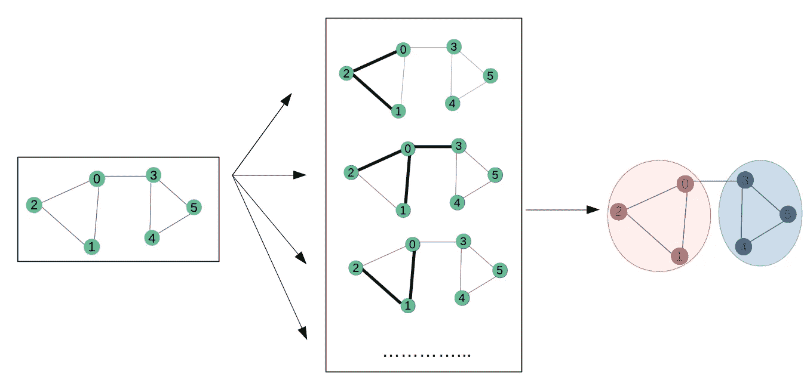

图解卷积网络(图片由作者提供)

神经网络在过去十年中取得了巨大的成功。然而，神经网络的早期变体只能使用常规或欧几里德数据来实现，而现实世界中的许多数据具有非欧几里德的底层图形结构。数据结构的不规则性导致了最近图形神经网络的发展。在过去的几年中，图形神经网络的不同变体正在被开发，图形卷积网络(GCN)是其中之一。GCNs 也被认为是基本图形神经网络的变体之一。

在本文中，我们将深入探讨由托马斯·基普夫和马克斯·韦林开发的图卷积网络。我也将给出一些关于使用[网络 X](https://networkx.github.io/documentation/networkx-2.3/index.html) 构建我们的第一张图的非常基本的例子。通过这篇文章的结尾，我希望我们能对图卷积网络内部的机制有更深入的了解。

*如果你不熟悉图形神经网络的基本概念，我推荐你在这里阅读我之前的文章***。**

# ****图中卷积神经网络****

*如果你熟悉卷积神经网络中的[卷积层，那么 GCNs 中的‘卷积’基本上也是同样的操作。它指的是将输入神经元乘以一组通常称为*滤波器*或*内核的权重。*过滤器在整个图像中充当滑动窗口，使 CNN 能够从相邻细胞中学习特征。在同一层内，相同的滤波器将被用于整个图像，这被称为**权重共享**。例如，使用 CNN 对猫与非猫的图像进行分类，将在同一层中使用相同的过滤器来检测猫的鼻子和耳朵。](https://machinelearningmastery.com/convolutional-layers-for-deep-learning-neural-networks/)*

*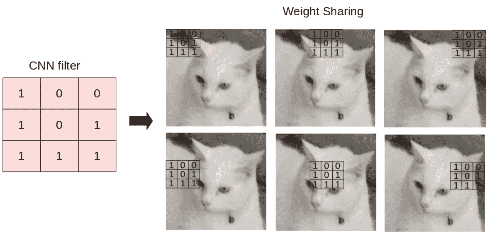*

*相同的权重(或核心，或 CNN 中的过滤器)应用于整个图像(作者的图像)*

*gcn 执行类似的操作，其中模型通过检查相邻节点来学习特征。CNN 和 GNNs 之间的主要区别在于，CNN 是专门构建来对规则(欧几里德)结构化数据进行操作的，而 GNNs 是 CNN 的一般化版本，其中节点连接的数量是变化的，并且节点是无序的(在非欧几里德结构化数据上是不规则的)。*

**

*2D 卷积神经网络(左)和图卷积网络(右)的图解，通过[来源](https://arxiv.org/pdf/1901.00596.pdf)*

*GCNs 本身可以分为两种主要算法，**空间图卷积网络**和**谱图卷积网络**。在本文中，我们将关注 F [ast 近似基于谱的图卷积网络](https://arxiv.org/pdf/1609.02907.pdf)。*

*在深入研究 GCNs 内部发生的计算之前，让我们先简要回顾一下神经网络中前向传播的概念。如果你熟悉的话，可以跳过下面的部分。*

# *神经网络正向传播简要概述*

*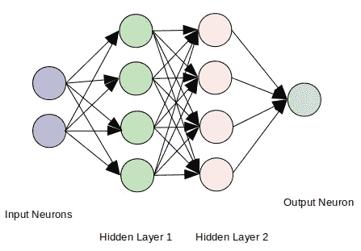*

*全连接神经网络的图示(图片由作者提供)*

*在神经网络中，为了将特征表示传播到下一层(正向传递)，我们执行下面的等式:*

*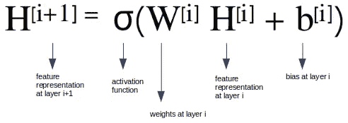*

*等式 1 —神经网络中的正向传递*

*这基本上相当于**线性回归**中的 **y = mx+b** ，其中:*

***m** 相当于**重量***

***x** 是**输入特性***

***b** 是**偏向***

*上述正向传递方程与线性回归的区别在于，神经网络应用**非线性** [**激活函数**](/activation-functions-neural-networks-1cbd9f8d91d6) 来表示潜在维度中的非线性特征。*

*回头看上面的等式，对于第一个隐藏层(i = 0)，我们可以简单地将等式重写为如下:*

*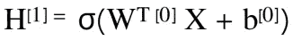*

*等式 2 —第一层神经网络中的正向传递*

*其中第 0 层的**特征表示**基本上是**输入特征(X)** 。*

**这个等式在图卷积网络中有什么不同？**

# *快速近似谱图卷积网络*

*频谱 GCN 背后的最初想法受到信号/波传播的启发。我们可以把频谱 GCN 中的信息传播看作是沿着节点的信号传播。谱 gcn 利用图拉普拉斯矩阵的特征分解来实现这种信息传播方法。简而言之，特征分解帮助我们理解图的结构，从而对图的节点进行分类。这有点类似于主成分分析(PCA)和线性判别分析(LDA)的基本概念，其中我们使用特征分解来降低维度并执行聚类。如果你从未听说过特征分解和拉普拉斯矩阵，不要担心！在这个快速近似方法中，我们不打算显式地使用它们。*

*在这种方法中，除了节点特征(或所谓的输入特征)之外，我们将在前向传播方程中考虑**邻接矩阵(A)** 。 **A** 是表示正向传播方程中节点之间的边或连接的矩阵。在前向传递方程中插入 **A** 使得模型能够学习基于节点连通性的特征表示。为了简单起见，偏置 **b** 被省略。由此产生的 GCN 可以被视为以消息传递网络形式的谱图卷积的一阶近似，其中信息沿着图中的相邻节点传播。*

*通过添加邻接矩阵作为附加元素，前向传递方程将是:*

*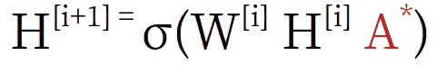*

*等式 3—图形卷积网络中的前向传递*

*等待..你说 A，什么是 ***A**** *？**

***A*** 是 **A** 的规格化版本。为了更好地理解为什么我们需要规范化 **A** 以及在 GCNs 中向前传递时会发生什么，让我们做一个实验。*

# *构建图形卷积网络*

## *初始化图形 G*

*让我们首先使用 [NetworkX](https://networkx.github.io/documentation/networkx-2.3/index.html) 构建一个简单的无向图( **G** )。图 **G** 将由 6 个节点组成，并且每个节点的特征将对应于特定的节点号。例如，节点 1 的节点特征为 1，节点 2 的节点特征为 2，依此类推。为了简化，在这个实验中我们不打算指定边缘特征。*

***输出:***

*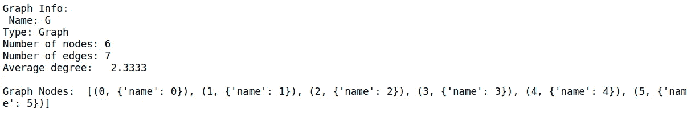**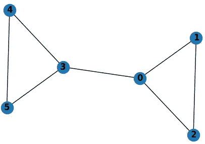*

*图形 G 可视化*

*由于我们只有 1 个图，这个数据配置是一个 [**单模**](https://medium.com/analytics-vidhya/getting-the-intuition-of-graph-neural-networks-a30a2c34280d) 表示的例子。我们将构建一个学习结点要素表示的 GCN。*

## *将邻接矩阵 **(A)插入前向传递方程***

*下一步是从图 **G** 中获得邻接矩阵 **(A)** 和节点特征矩阵 **(X)** 。*

***输出:***

*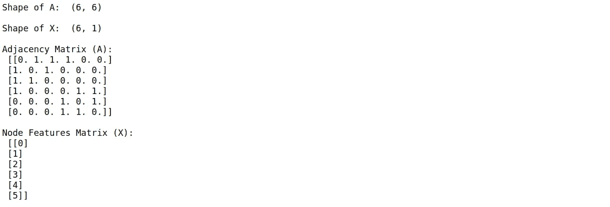*

*现在，让我们研究如何通过将**和**插入正向传递方程来增加模型更丰富的特征表示。我们要对 **A** 和**x**进行点积运算，在本文中我们把这个点积运算的结果称为 *AX* 。*

***输出:***

*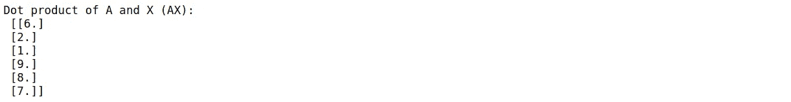*

*从结果可以明显看出， *AX* 代表**相邻节点特征**的总和。例如， *AX* 的第一行对应于连接到节点 0 的节点特征的总和，节点 0 是节点 1、2 和 3。这让我们了解了 GCNs 中的传播机制以及节点连接性如何影响 GCNs 所看到的隐藏特征表示。*

> *邻接矩阵和节点特征矩阵的点积表示相邻节点特征的总和。*

*但是，如果我们想得更多，我们会意识到，虽然 *AX* 总结了，**相邻节点的特征，但它没有考虑节点本身的特征**。*

**糟糕，检测到问题！怎么解决？**

## ***插入自循环并规格化一个***

*为了解决这个问题，我们现在向 **A 的每个节点添加[自循环](https://en.wikipedia.org/wiki/Loop_(graph_theory))。**添加自循环基本上是一种将节点连接到自身的机制。也就是说，邻接矩阵 **A** 的所有对角元素现在都将变成 1，因为每个节点都与自身相连。我们把 **A** 加上自循环叫做 **A_hat** 重新计算 *AX* ，现在就是 **A_hat** 和 **X** 的点积:*

***输出:***

*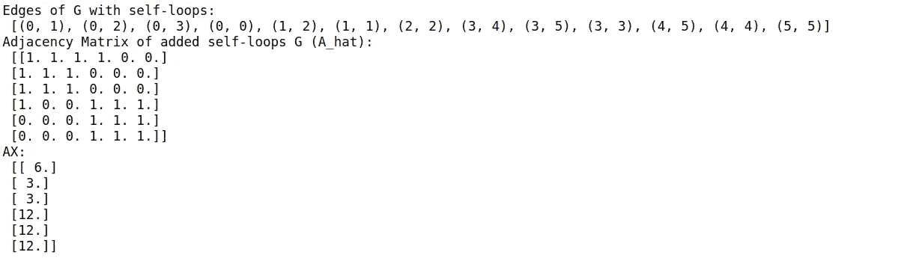*

**太好了！一个问题解决了！**

*现在，你可能会意识到另一个问题。 *AX* 的元素是**未规格化**。类似于任何神经网络操作的数据预处理，我们需要归一化特征以防止数值不稳定性和消失/爆炸梯度，从而使模型收敛。在 GCNs 中，我们通过**计算** [**度矩阵**](https://en.wikipedia.org/wiki/Degree_matrix) **(D)并执行 D 的** [**逆**](https://mathworld.wolfram.com/MatrixInverse.html) **与** *AX* 的点积运算来规范化我们的数据*

*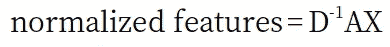*

*在本文中我们称之为 *DAX* 。在图形术语中，术语“度”是指一个节点所连接的边的数量。*

***输出:***

*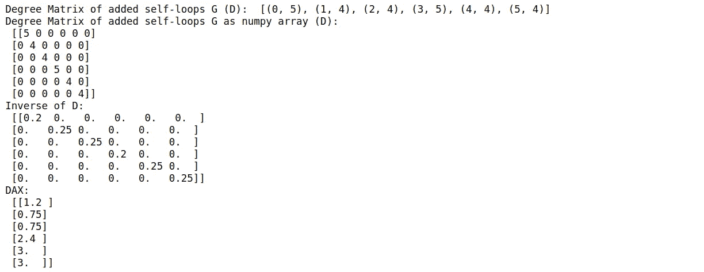*

*如果我们比较 *DAX* 和 *AX* ，我们会注意到:*

*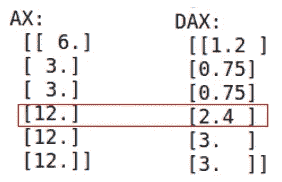*

*我们可以看到规范化对 DAX 的影响，其中对应于节点 3 的元素与节点 4 和 5 相比具有较低的值。但是，如果节点 3 与节点 4 和 5 具有相同的初始值，为什么在规范化后会有不同的值呢？*

*让我们回头看看我们的图表。节点 3 有 **3 条入射边**，而节点 4 和 5 只有 **2 条入射边**。**节点 3 比节点 4 和 5 具有更高的度**的事实导致**节点 3 的特征在 *DAX*** 中的权重更低。换句话说，节点的度越低，节点属于某个组或簇的能力就越强。*

*在[论文](https://arxiv.org/pdf/1609.02907.pdf)中，Kipf 和 Welling 指出，进行对称归一化将使动力学更有趣，因此，归一化方程修改为:*

**

*让我们使用新的对称归一化方程来计算归一化值:*

***输出:***

*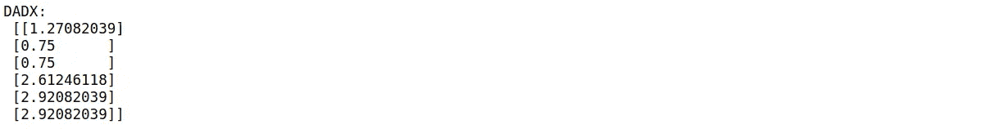*

*回头看看上一节中的等式 3，我们会意识到我们现在有了什么是 **A*** 的答案！文中将 **A*** 称为*重正化诡计*。*

*完成了特性处理之后，是时候完成我们的 GCN 了。*

## *添加权重和激活函数*

*我们将使用 [ReLu](https://machinelearningmastery.com/rectified-linear-activation-function-for-deep-learning-neural-networks/) 作为激活函数来构建一个 2 层 GCN。为了初始化权重，我们将使用随机种子，这样我们就可以复制结果。请记住，权重初始化不能为 0。在这个实验中，我们将为隐藏层设置 4 个神经元。因为我们将绘制二维特征表示，所以将有 2 个输出神经元。*

*为了更简单，我们将使用 numpy 重写*重正化技巧*方程，只是为了更简单。*

***输出:***

*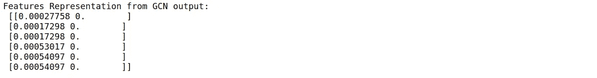*

*搞定了。我们刚刚建立了我们的第一个前馈 GCN 模型！*

## *绘制要素制图表达*

*GCN 的“魔力”在于它[可以学习特征表现，即使没有训练](https://arxiv.org/pdf/1810.11908.pdf)。让我们在通过 2 层 GCN 后可视化要素制图表达。*

***输出:***

*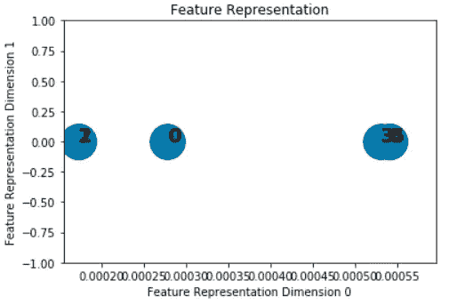*

*来自前馈 GCN 的特征表示*

*从上面的图中，可以清楚地看到有 2 个主要组，其中左边的组由节点 0、1、2 组成，右边的组由节点 3、4、5 组成。我们可以推断出 **GCNs 已经可以学习特征表示，即使没有训练或者** [**反向传播**](https://en.wikipedia.org/wiki/Backpropagation) 。*

# *关键要点*

*   *图卷积网络中的术语“卷积”在*权重共享方面类似于卷积神经网络。*主要区别在于数据结构，其中 gcn 是 CNN 的一般化版本，可以处理底层非规则结构的数据。*
*   *在 GCNs 的前向传递方程中插入邻接矩阵( **A** ，使得模型能够学习相邻节点的特征。这种机制可以看作是沿着图中的节点传递消息的操作。*
*   **重正化技巧*由 [Thomas Kipf 和 Max Welling (2017)](https://arxiv.org/pdf/1609.02907.pdf) 用于归一化快速近似基于谱图卷积网络中的特征。*
*   *gcn 甚至可以在训练之前学习特征表示。*

**感谢阅读！如果您想了解如何使用 CORA 数据集在节点分类任务上训练 GCN，可以阅读本系列的下一篇文章***。***

***有什么意见、反馈或想讨论的吗？请给我留言。你可以在* [*LinkedIn*](https://www.linkedin.com/in/inneke-mayachita-34023877/) *上联系我。***

***可以在*[*GitHub*](https://github.com/imayachita/Explore_GCN/blob/master/Building_GCN.ipynb)*上获取完整代码。***

# **参考**

**[1] T. Kipf 和 M. Welling，[利用图卷积网络的半监督分类](https://arxiv.org/pdf/1609.02907.pdf) (2017)。arXiv 预印本 arXiv:1609.02907。ICLR 2017**

**[2] T .基普夫，[https://tkipf.github.io/graph-convolutional-networks/](https://tkipf.github.io/graph-convolutional-networks/)**

**[3]吴，等。艾尔。，[图神经网络综合研究](https://arxiv.org/pdf/1901.00596.pdf) (2019)。**

**[4] T. S. Jepsen，[https://towardsdatascience . com/how-do-deep-learning-on-graphs-with-graph-convolutionary-networks-7d 2250723780](/how-to-do-deep-learning-on-graphs-with-graph-convolutional-networks-7d2250723780)**