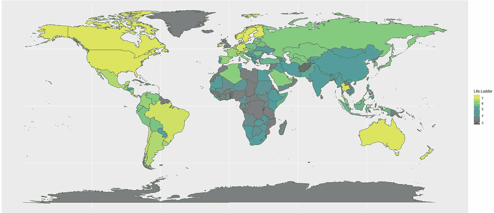

# 用数据理解幸福动力学(上)

> 原文：<https://towardsdatascience.com/understanding-happiness-dynamics-with-data-part-1-ab58984a715a?source=collection_archive---------14----------------------->

## 国家一级的描述性分析

在这些特殊时期，封锁给我们许多人留下了很多思考的时间。想想过去和未来。想想我们的生活方式和我们的成就。但最重要的是，想想我们对这个世界的贡献。当我在寻找灵感和能量时，我决定抓住幸福这个问题，并对其动力学的复杂本质有更深的理解。

什么能让人真正快乐？

我们都有自己对幸福及其关键决定因素的看法。有些人会选择**财富**，因为享受舒适喜欢高生活条件是必不可少的。有些人会拒绝这种唯物主义观点，并认为**社会关系**(家庭、朋友等。)和价值观才是最重要的。其他人会捍卫这一观点，即作为在遵守某些规则的同时受益于一系列权利的公民，真正决定我们生活条件并因此决定我们幸福的是**政府及其政策**。

**这些都是直观的想法。但是现有的数据告诉我们什么呢？**

从这个角度来看，我分析了《世界幸福报告》的数据，这是一项具有里程碑意义的全球幸福状况调查。更具体地说，它一方面包含基于盖洛普世界民意调查(GWP)收集的答案的幸福得分，另一方面包含经济生产、社会支持、预期寿命、自由、无腐败和慷慨等指标。

在两篇系列文章中，我将与您分享我的主要发现。第一篇文章旨在通过数据解释性分析，对各国的幸福和相关指标的演变给出一个总体概述。另外两个关注这些指标对幸福的因果影响。

**结构:**

1.  **关于数据**
2.  **幸福概述**
3.  **幸福&财富**
4.  **幸福&社会环境**
5.  **幸福&公共政策**

# 1.关于数据

首先，让我们从定义将要使用的关键指标开始。来自《世界幸福报告》的数据特别有趣，因为它结合了基本的经济指标和更主观的社会指标。

**经济指标**

*   *人均 GDP*:根据*购买力平价*调整为 2011 年不变国际美元，来自*世界发展指标(WDI)* ，2018。
*   *出生时健康预期寿命*:来自*世界卫生组织(世卫组织)* *全球健康观察站*数据仓库。

**幸福指标**

这些指标主要来自 GWP 的民意调查。它使用随机选择的、具有全国代表性的样本，持续调查 160 多个国家的居民。通常，在面对面或通过电话进行的采访中，会向每个国家的 1，000 名个人提出一系列问题。更多信息，可以看这篇[文章](https://www.gallup.com/178667/gallup-world-poll-work.aspx)。

研究幸福的主要挑战是，首先，如何衡量幸福。事实上，对幸福感的评估从对生活的总体判断(生活评价)到感受(日常情感)。在这种情况下，我们将使用 3 项指标:

*   坎特里尔生活阶梯量表(Cantril Scale)即生活阶梯量表(Life Ladder ):它要求受访者用 0 到 10 分的“阶梯”量表给自己的生活打分，其中 0 分表示最糟糕的生活。
*   积极情绪:这是来自 GWP 的前一天快乐、欢笑和享受的平均情绪指数。情感问题的一般形式是:*“你在昨天的大部分时间里有没有体验过以下感觉？”*
*   负面情绪:它代表前一天焦虑、悲伤和愤怒情绪的平均值。

**社会指标**

在社会支持方面，我们将分析两个指标:

*   *社会支持*:它代表了对 *GWP* 问题*“如果你遇到了麻烦，你有亲戚或朋友可以在你需要的时候帮助你吗？”的二元回答(0 或 1)的全国平均值*
*   *慷慨度*:它是对 *GWP* 对问题*“你在过去的一个月里有没有给慈善机构捐过款？”的全国平均回答进行回归后的余数*上*人均 GDP*。

最后，为了掌握人们对政治的看法对其幸福感的影响，我们将使用以下指标:

*   *做出生活选择的自由*:它代表了对 GWP 问题的二进制回答的全国平均水平*“你对自己选择如何生活的自由感到满意还是不满意？”*
*   *对腐败的看法*:它代表了两个 *GWP* 问题的二元答案的平均值:*“腐败是否在政府中普遍存在？”*和*腐败在企业中是否普遍存在？*”
*   *对国家政府的信心*，用类似的方法构建。

下面是对数据的快速描述:

*   年份包括:2005 年至 2019 年
*   国家数目:166 个
*   区域数量:10

# 2.幸福概述

**总体幸福感很大程度上取决于经济猜想，正如人们所料。事实上，代表人们对自己生活评价的*人生阶梯*在金融危机前的 2006 年处于最低点。**

图 1——人生阶梯的演变

*正面影响*和*负面影响也是如此。这些指标给前一个指标带来了有趣的细微差别:它们分别指的是前一天快乐、欢笑、快乐或担忧、悲伤和愤怒的平均情绪。因此，与 *Life Lader 相反，*有一些短期的衡量幸福的方法。*

在这种背景下，如下图所示，这些变量也处于金融危机后的最低点。然而，对*负面影响*的影响肯定比对*正面影响的影响大。*

图 2——积极和消极影响的演变

**就地域差异而言，没有什么好惊讶的。平均而言，富裕国家更幸福。最重要的是，下图显示了世界各地存在的巨大不平等。**

图 3——按地区划分的人生阶梯演变

图 4-2019 年按生活阶梯着色的地图

即使在同一地区，国家之间也存在很大差异，尤其是在*南亚*、*中东*以及*非洲和撒哈拉以南非洲*，如下图所示。相反，北美国家和欧洲国家的幸福水平非常相似。

图 5-2019 年各地区的生活阶梯差异

# 3.幸福与财富

几十年来，更多的财富是否会带来更多的幸福这个问题吸引了经济学家、行为科学家和普通大众的注意力。毫无疑问，人们的幸福和财富有很强的相关性。而且，数据并不与这一总体趋势相矛盾。其实如图所示，*人均 GDP*越高，幸福水平越高。

图 6-作为人均 GDP 函数的生活阶梯(2019 年)

然而，这条规则也有许多例外:人均 GDP 相似的国家的幸福水平会有很大差异。例如，*挪威*和*科威特*拥有相似的*人均 GDP*但是他们的幸福水平却有显著差异(1.3 分！).

即使在同一个地区，不同国家的幸福水平也有很大差异，尽管他们的人均 GDP 很接近。例如，*芬兰*和*比利时*的人均 GDP 相似，但他们的幸福水平相差 1 分！

图 7-西欧人均 GDP 函数中的生活阶梯(2019 年)

这些观察是否证明了“金钱买不到幸福”这句老话？实际上，他们指出了两个公认的观点:

1.  总的来说，财富确实重要，但存在边际效用递减模式。这意味着一个人越富有，他财富的增加就越不会增加他的幸福。
2.  用财富作为幸福的指标是有问题的。一方面，它可以用来表示人们在工作中取得成功和提高生活水平的意愿。因此，人们的财富多少反映了人们对目前生活的满意程度和对未来的希望。但是，另一方面，它不包括对人们的生活满意度有决定性贡献的其他变量，如家庭、工作和健康。

# 4.幸福和社会环境

当我们思考幸福的成分是什么时，几乎不可能排除社会因素。事实上，作为社会动物，我们需要爱、意义、来自我们与家人和朋友的亲密关系的支持，以及来自我们更广阔网络的归属感。

那么，社会关系是通向幸福的最佳途径吗？

我们来看一下数据。更具体地说，我们将关注以下变量:

*   社会支持:它衡量健康的社交生活能在多大程度上带来安全感。事实上，社交网络通常是人们建议的来源，当他们知道他们的家人或朋友可以在他们需要帮助时，会给他们带来安慰。
*   慷慨:它反映了一种归属感，这种归属感通常来自于给予他人和接受他人的行为。

下表包含每个区域的**平均值。在*社会支持*方面，*北美*和*西欧*国家数值最高，而*南亚*国家最低。从*慷慨度*、*北美*、*东南亚*国家最高，而*撒哈拉以南*国家最低。不出所料，当*生活阶梯*和*正面影响*高而*负面影响*低时，这些变量高。**

表 1 —每个地区的平均值

为了比较幸福和这些“社会”变量之间关联的强度，让我们来比较它们的相关性。下面是两个地区的相关矩阵，一个是高幸福水平的地区，*西欧，*，另一个是低幸福水平的地区，*南亚。*

图 8 —相关矩阵(左边是西欧，右边是南亚)

正如你所看到的，在西欧的*人生阶梯*、*积极情感、*和*消极情感*与*社会支持*和*慷慨*高度相关，而在南亚的*则没有。我们能从中推断出什么？是因为国家的文化，政治制度，还是其他变量？需要进一步的研究来阐明这个问题。*

> **关于哈佛成人发展研究的简短说明**
> 
> 1938 年，一组哈佛研究人员通过定期采访和体检跟踪一组十几岁男孩的发育情况，调查了快乐的问题。他们的目标是了解他们的健康和幸福随着时间的演变。它成为同类研究中最长、最著名的纵向研究之一。**80 多年后，研究得出结论**社会关系是人们幸福和健康的最重要因素之一。正如这项研究的现任负责人罗伯特·沃尔丁格在著名的 TED 视频中简单总结的那样:“那些保持温暖关系的人活得更久更快乐，而孤独者往往死得更早”。有关这项研究的更多信息，您可以阅读这篇文章。****

# **5.幸福与公共政策**

**毫无疑问，政府对人们的福祉有影响，因为它们实施的公共政策定义了重要的幸福因素，如获得教育、就业、医疗保健等。**

**事实上，人民的幸福与政府出台的政策之间的关系是一个微妙的问题，这在**两个层面上**:**

1.  ****政府在多大程度上有权干预以改变市场经济的社会效应？自由派倾向于主张慷慨的失业保护和福利，而保守派则捍卫政府最小干预以确保市场效率的理念。****
2.  ****如何衡量政策影响？**是否应该只关注国民经济增长、人均产量等客观指标？或者，我们是否应该退一步，反过来问，是什么样的公共政策让公民认为他们的生活更幸福？**

> **历史上，一些国家把幸福放在他们理想的中心。**
> 
> **例如，美国独立宣言将追求幸福列为三种自然不可剥夺的权利之一，与生命和自由并列。它还明确指出这是任何政府的最终目标。**
> 
> **我们认为这些真理是不言而喻的:人人生而平等，造物主赋予他们某些不可剥夺的权利，其中包括生命权、自由权和追求幸福的权利
> 美国宪法，1787 年**
> 
> **南亚国家不丹政府更进一步，将常规经济指标放在一边，主要关注**国民幸福总值(GNH)** ，这是一个旨在衡量人口集体幸福和福祉的指数。与 GDP 相反，它的价值观包括与自然和谐相处和传统价值观。要了解更多信息，您可以阅读这篇[文章](https://en.wikipedia.org/wiki/Gross_National_Happiness)，并观看这段简短的[视频](https://upload.wikimedia.org/wikipedia/commons/c/c4/What_is_Gross_National_Happiness.ogv)。**

**在这里，我分析了人们对政府的看法对他们幸福感的影响。考虑了以下几个方面**

*   **通过对政府的信任，人们对政府及其政策的信心。**
*   **通过*对腐败的认知，人们对该国腐败程度的认知。***
*   **人们在做出人生选择时的自由感，正如*所表明的做出人生选择的自由。***
*   **医疗保健系统的效率大体上反映在出生时的健康预期寿命上。**

**下表包含每个地区的**平均值。与其他国家(如北美国家)相比，*中欧和东欧国家*对国家政府*的信任度*和*做出生活选择的自由度*最低，对腐败的感知度*最高。*****

****

**表 2—每个地区的平均值**

**为了比较幸福与这些“政策”相关变量之间关联的**强度，我们来比较一下它们的相关性。下面是两个地区的相关矩阵，一个是快乐程度高的地区，*北美，*，另一个是快乐程度低的地区，*中欧。*****

********

**图 9—相关矩阵(左侧为北美，右侧为中欧)**

**需要注意 3 个因素:**

*   **首先，对于*北美*的国家来说，*生活阶梯*与*健康的预期寿命*，*做出生活选择的自由*和*，对国家政府的信任度*，与*对腐败的看法高度负相关。*中欧国家的情况并非如此*。***
*   **接下来，在*北美*国家，这些变量与*正面*和*负面影响*的相关性不如与*人生阶梯的相关性显著。*这表明这些“政策”相关变量会对人们对生活的总体判断产生更大的影响，而不是他们的日常影响。**
*   **最后，在*中欧*国家，做出生活选择的*自由*和*积极*和*消极影响*之间的相关性非常高。相反，这表明这一变量对人们的日常情感会产生更重要的影响，而不是他们对生活的总体判断。**

**下面的相关矩阵表明，发达国家和其他国家之间的这些差异适用于世界其他地区:**

****

**图 9 —中欧和东欧、北美、撒哈拉以南非洲和西欧的相关矩阵**

**同样，有 3 个要素需要注意:**

*   ***生命阶梯*和*出生时健康预期寿命*之间的相关性在*北美*非常高，在*西欧*国家不显著。这可能是因为西欧国家通常为其公民提供可靠的医疗保险。**
*   **在*北美*国家，生活自由与*生活阶梯*的相关性明显高于其他国家。**
*   ***对国家政府的信心*和*生活阶梯*在*北美*和*西欧*有很高的正相关性，在这些地方，民主作为政治体制往往更为普遍。同样，*对腐败的看法*和*人生阶梯*在北美和西欧有很强的负相关性**

**我们能从中推断出什么？很难从这些观察中得出任何结论，因为变量的分布在不同的地区有很大的不同。然而，上述相关性揭示了重要的事实，并为理解世界各地的幸福动态提供了有趣的见解。**

# **结论**

**不出所料，幸福的动力是多方面的，因国家和时间的不同而不同。然而，这种复杂性不应阻止决策者考虑这些因素。相反，他们应该使用幸福指数来确定要实施的正确政策，同时也要衡量政策的绩效。他们可以依靠经济学、心理学、调查分析和健康领域专家的帮助，来定义如何有效地使用幸福感的测量方法**

**在这篇文章中，我简单地进行了数据解释性分析，以获得对幸福动态的深入了解。接下来，我将重点讨论幸福和其他因素之间的因果关系。**