# 用机器学习理解幸福动力学(下)

> 原文：<https://towardsdatascience.com/understanding-happiness-dynamics-with-machine-learning-part-2-4df36e52486?source=collection_archive---------21----------------------->

## 对幸福驱动因素的深入分析

幸福是我们都渴望的，然而它的关键因素仍然不清楚。

有些人会认为**财富**是最重要的条件，因为它决定一个人的生活条件。然而，有些人会正确地指出，富人并不总是快乐的。相反，一个人的**社会关系**(家人、朋友等。)对他的幸福也有同样的贡献。最后，有些人会争辩说，政府实施的**政策**才是真正决定一个人幸福的因素，因为它们间接决定了我们的生活条件和社会交往。

这些都是关于幸福的一般和直观的想法，我们可以通过自己的经验很容易理解。**然而，我认为数据驱动的方法可以让我们更深入地了解快乐的驱动因素。**通过应用最先进的*机器学习*技术，将有可能定义最重要的因素，并定量衡量它们对一个人幸福的贡献。

在这种背景下，我分析了《世界幸福报告》的数据，这是一项具有里程碑意义的全球幸福状况调查。一方面，它包含了基于盖洛普世界民意调查(GWP)收集的答案的幸福分数，另一方面，它包含了经济生产、社会支持、预期寿命、自由、廉洁和慷慨等指标。

本文是一系列文章中的第二篇，在这篇文章中，我分享了我对该主题进行的深入研究的主要发现。在我之前的[文章](/understanding-happiness-dynamics-with-data-part-1-ab58984a715a)中，我从纯描述性的角度分析了幸福。因此，我讨论了幸福与三个基本要素之间的复杂关系:财富、社会关系和公共政策。这种数据探索性分析揭开了世界各地区之间长期存在的差异的面纱。

然而，它纯粹是描述性的。它没有告诉我们最关键的问题:**什么真正带来幸福，到什么程度，为什么？**本文旨在通过关注幸福和其他变量之间的因果关系，使用统计工具和*机器学习*来回答这些问题。

从这个角度来看，我依赖于两种方法:一种是经济学领域常用的“传统”方法，另一种是基于最先进的*机器学习*解释工具的新方法。

事不宜迟，让我们深入幸福的微观和宏观计量经济学吧！

**结构:**

1.  **关于数据**
2.  **“古典”方法**
3.  **机器学习方法**
4.  **限制**

# 1.关于数据

这里快速回顾一下世界幸福报告数据集的变量。关于数据的更多信息，可以参考我之前的文章[这里](/understanding-happiness-dynamics-with-data-part-1-ab58984a715a)。

**经济指标:**

*   ***:****按 2011 年不变国际美元购买力平价(PPP)计算的人均 GDP。*
*   ****出生时健康预期寿命*** 。*

***幸福指标:***

*幸福指数主要来自 G *allup World Poll (GWP)，*该公司使用随机选择的、具有全国代表性的样本，持续调查不同国家的居民。这些指标如下:*

*   ****坎特里尔量表*** ，或 ***人生阶梯*** :它由要求受访者用 0 到 10 的“阶梯”量表给自己的生活打分组成，其中 0 表示可能最坏的生活。*
*   **:它是前一天快乐、欢笑和享受的平均影响指标。**
*   *****负面影响*** :它代表前一天对担心、悲伤和愤怒的影响测量的平均值。**

****社会指标:****

**社会指标也来自 GWP 的调查。它们包括:**

*   ******论人均 GDP。******
*   *******做出人生选择的自由*** *:* 它代表了对问题“*你对自己选择如何生活的自由感到满意还是不满意？”*****
*   ******对腐败的看法**:它代表了两个问题的二元答案的全国平均值:*“腐败是否在整个政府中普遍存在？”*和“*企业内部的腐败现象是否普遍？*****

# ****2.“经典”方法****

## ****2.1.变量的选择****

****我必须解决的第一个问题是:为幸福建模保留什么变量？**换句话说，在解释幸福时，哪些变量真正重要？******

****为此，我进行了一次*主成分分析* *(PCA)。*该方法通过构建数量较少的代表性变量，从数据中提取最重要的信息，这些变量共同解释了原始数据集中的大部分可变性。****

****称为 P **主分量**的新变量是特征空间中的方向，原始数据沿着该方向高度可变。因此，通过分析它们的组成，可以确定为研究保留的变量。****

****关于 *PCA* 的更多信息，可以阅读这篇[文章](https://en.wikipedia.org/wiki/Principal_component_analysis)。****

****下图显示了每个主成分解释的差异百分比。前两个解释了大部分的差异。****

****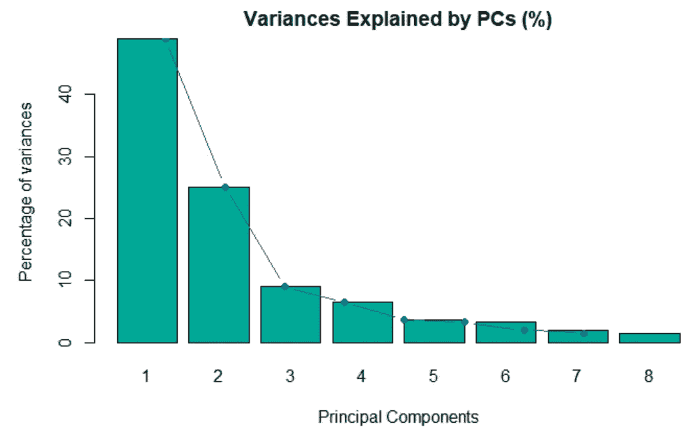****

*****图 1 —由主成分解释的差异*****

****下图分析了主要成分的构成及其与原始变量的相关性。****

********

*****图 2——变量对主成分的贡献*****

****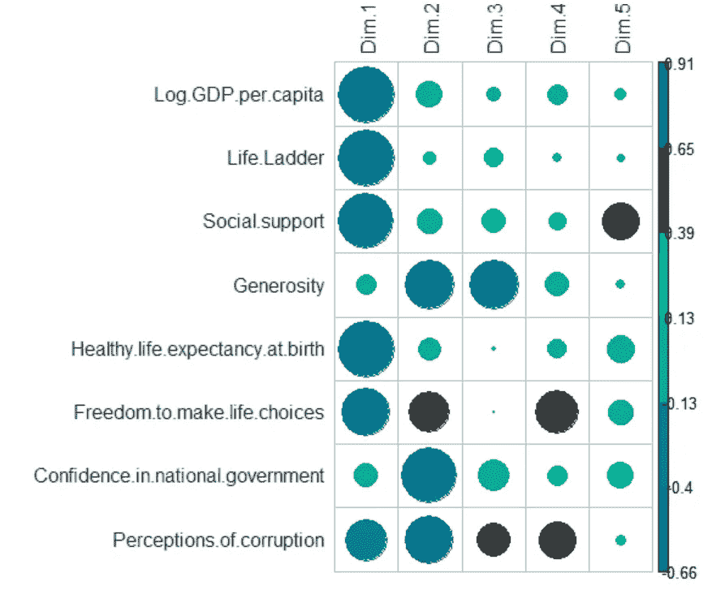****

*****图 3 —变量和主成分的相关矩阵*****

****这些图表强烈地表明，有 6 个关键变量需要保留在模型中:*人均国内生产总值、社会支持、出生时的健康预期寿命、做出生活选择的自由、慷慨程度和对腐败的看法。综合来看，这六个变量解释了各国之间国家年度平均阶梯得分的大部分差异。*****

****此外，可以看到每个变量对*双标图*中两个第一主成分的影响有多强烈。该图还通过代表向量之间的角度显示了变量之间的相关性:角度越小，变量之间的正相关程度越高。****

****因此，*生命阶梯*、*人均 GDP*、*出生时健康预期寿命、*和*社会支持度*解释了第一主成分的大部分，并且相互之间强相关。****

****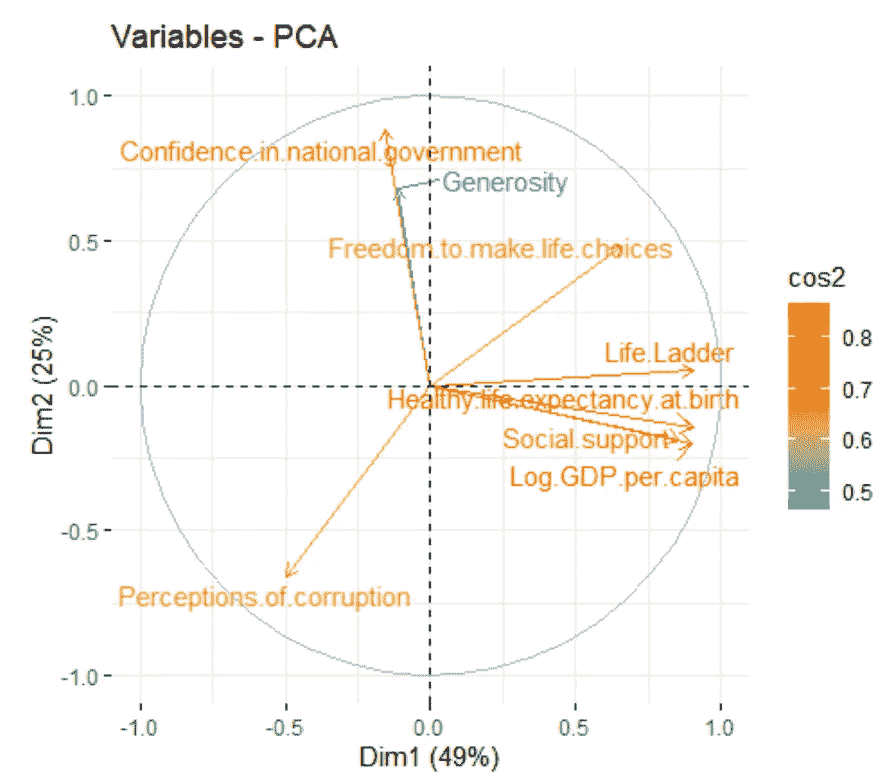****

*****图 4 — PCA 双标图*****

## ****2.2.幸福建模****

****相关性有助于快速了解数据。但是，当涉及到识别两个或多个变量之间的相关性是否代表因果关系时，事情就变得棘手了。****

> ****我们举一个著名的例子。2012 年，梅瑟利发表了一篇论文，指出一个国家的巧克力消费水平与其人口的认知功能高度相关。这是否意味着吃更多的巧克力会让你变得更苗条？可惜，很可能不是！
> 关于因果关系的更多信息，你可以阅读这篇[文章](https://medium.com/swlh/how-can-machine-learning-algorithms-include-better-causality-e869ca60e54d)或者观看下面的视频。****

****然而，建立因果关系在决策中至关重要。例如，平均而言，出生时健康预期寿命高的国家往往更幸福。这是否意味着确保良好的医疗体系会增加人们的幸福感？视情况而定，因为健康的人仍然可以糟糕地评价他们的生活。****

****因此，要回答这类问题，就必须使用统计工具，比如回归分析。经济学家经常使用回归分析。它们使他们不仅能够量化一个变量和其他变量之间的关系，而且能够通过统计测试量化其相关性关系。****

## ****方法学****

****在进行回归分析时，一方面，控制在不同国家间保持不变但随时间变化的变量是很重要的。例如，经济危机，如 2008 年的次贷危机，对全球人民的幸福产生了影响。****

****另一方面，必须控制非时变的未观察到的个体特征，例如乡村天气。这些控制使我们能够真正捕捉到解释变量和幸福之间的因果关系。****

****为此，我依赖于众所周知的技术**固定效果。**更具体地说，我根据回归中包含的固定效果考虑了 **3 设置**。****

1.  ****年份效应****
2.  ****年份和区域影响****
3.  ****年份和国家效应****

****这种方法类似于*世界幸福报告中的方法，*除了我通过最小-最大标准化重新调整了变量。这解释了结果的差异。****

## ****结果****

****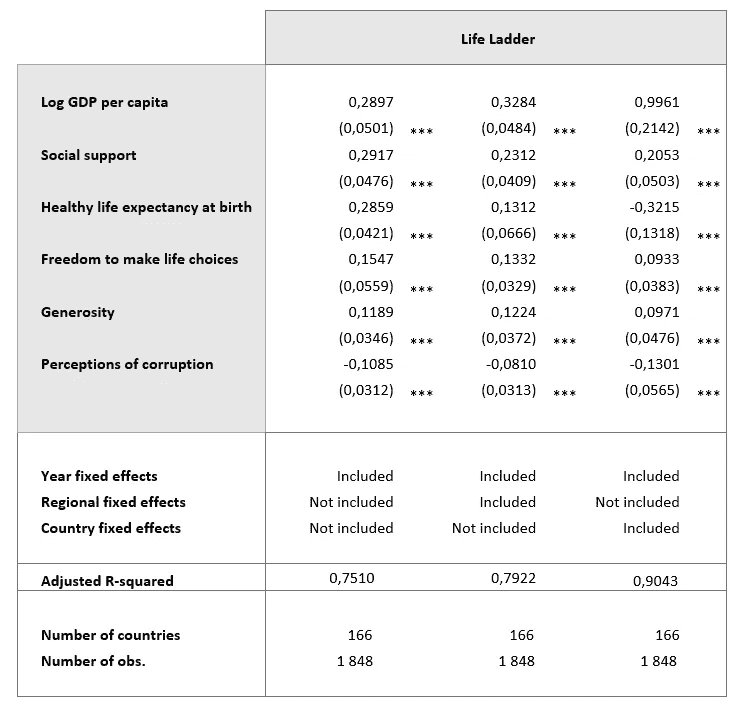****

****不出所料，在这三种情况下，所有变量都很重要。更准确地说:****

*   *****对数人均国内生产总值*始终是最重要的因素，其系数值从 0.29 到 0.99 不等。****
*   *****社会支持*在第一个情景中排在第一位，在另外两个情景中排在第二位，系数值在 0.21 到 0.29 之间。****
*   *****出生时的健康预期寿命*仅在考虑第一种情况下的方差时与 0 有显著差异。在第三种情况下，它的符号甚至是负数。这表明第二种情况的结果是最可靠的。****
*   *****慷慨*和*对腐败的感知*相对不那么重要，它们的方差很高。****

# ****3.机器学习方法****

****在过去的十年里，*机器学习*领域取得了重大成功。它已被应用于许多领域，并被证明是非常有效的，往往优于通常的统计方法。****

****然而，研究首先集中于开发在预测或分类的准确性方面最有效的算法。只是在最近几年才转向需要建立**因果干扰。**如今，它是数据科学家社区热情的源泉。****

****在这种背景下，我决定应用在*机器学习*中使用的最先进的解释技术来更好地理解快乐的驱动因素。****

## ****方法学****

****为此，我按 **4 步进行:******

******a .国民平均幸福感的建模:**我在数据集上测试了不同的*机器学习*算法，并微调了它们的超参数。
**b .变量相对重要性的比较:**我用最佳模型计算了每个变量的相对重要性。
**c .变量对幸福感的边际影响分析:**通过分析解释变量对幸福感的部分依赖性，更进一步。 **d .按地区进行的幸福动态分析:**通过仔细查看地区层面来细化分析。****

****解释变量包括 6 个关键指标(*人均国内生产总值、社会支持、出生时健康预期寿命、做出生活选择的自由、慷慨程度和对腐败的看法)*作为以及年份和地区固定效应。如前所述，这些变量通过最大-最小标准化进行重新调整。****

****我使用了以下 Python 库: *scikit-learn* 和 *skater* 。****

## ****结果****

******a .国民平均幸福感的建模******

****我应用最常用的*机器学习*算法，根据解释变量预测*人生阶梯*。为了比较它们在预测方面的表现，我进行了 5 重交叉验证，并比较了平均值*均方根误差(RMSE)* 。****

****下图所示的结果表明，基于树的方法表现出更好的结果。更特别的是，*额外的树*算法呈现出最低的 *RMSE* 。****

****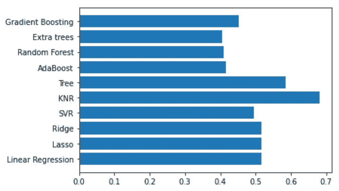****

*****图 5—使用不同机器学习算法的 5 重交叉验证的平均 RSME*****

******b .变量相对重要性的比较******

*****Extra-Trees* 是一种众所周知的算法，它训练多个随机决策树，并通过平均它们的结果来组合它们。该图简要说明了该算法的基本原理和步骤。****

****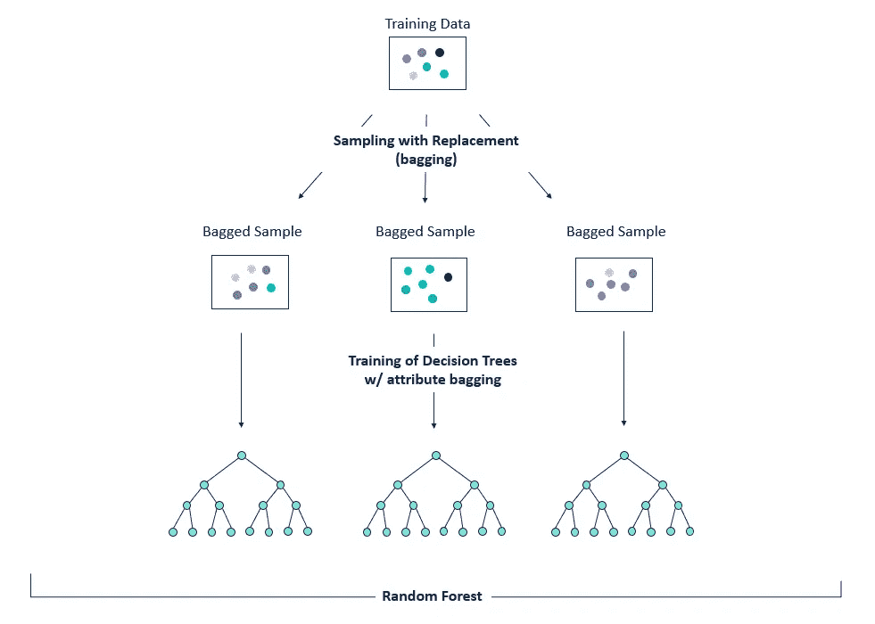****

*****图 6 —随机树林，* [*来源*](https://community.alteryx.com/t5/Alteryx-Designer-Knowledge-Base/Seeing-the-Forest-for-the-Trees-An-Introduction-to-Random-Forest/ta-p/158062)****

****关于随机树森林的更多信息在 *sckit-learn* 文档中提供，[此处](https://scikit-learn.org/stable/modules/ensemble.html#forest)。****

*****额外的树*模型*，*作为一个基于树的模型，通过**特性提供了对其结果的解释。**这些被计算为特征存在的每个节点的杂质的**减少，通过到达该节点的概率进行加权。******

****下图显示了模型给出的变量的特征重要性。*对数人均国内生产总值*、*社会支持*和*出生时健康预期寿命*似乎是*寿命阶梯*的最具决定性的因素。其他模型就不是这样了，即*随机森林、AdaBoost* 和*梯度提升。这些算法将出生时的健康预期寿命放在人均国内生产总值和社会支持的前面。*****

****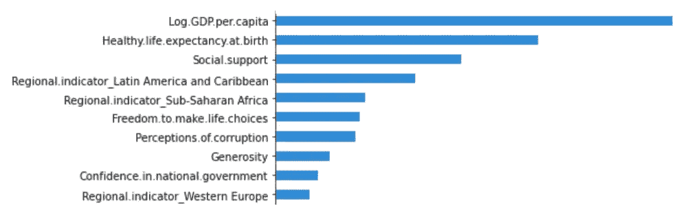****

****图 7——由*额外树*模型给出的特征重要性****

******c .分析变量对幸福的边际影响******

****还可以通过绘制部分相关性来可视化这 3 个变量对模型预测的边际影响。下图显示了略微上升的趋势。这意味着*对数人均 GDP*、*社会支持*和*出生时健康预期寿命*中一个变量的增加，而模型中的其他变量保持不变，会导致幸福感的增加。****

********

****图 8-三个最重要变量的部分相关性****

****通过可视化两个变量对模型预测的**边际影响，可以进一步进行分析。下面的 3D 图与我们的预期一致:一个人的财富和社会支持越高，他就越幸福！******

****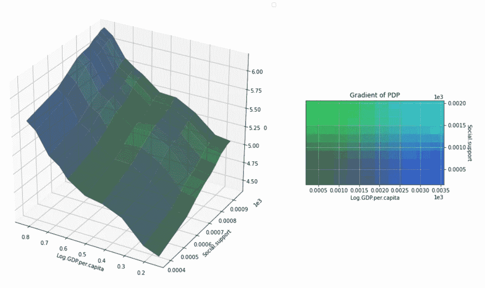****

****图 9-对数人均国内生产总值和社会支持的部分相关性****

****总的来说，到目前为止进行的分析不仅证实了我们通过操纵数据所看到的洞察力，而且使我们能够量化它们。**金钱和健康以及我们所爱的人的社会支持是幸福的支柱。**它们是促使人们积极评价自己生活的因素。****

****然而，这些观察是在世界范围内进行的。我们仍然需要从一个**国家的角度**探索幸福的动力，以获得新的发现。****

## ****d.按地区分析幸福度**动态******

****如果按地理区域考虑国家一级，这种分析就变得更加有趣。特别是，发达国家、新兴国家和发展中国家之间存在着巨大的差距。这些国家对事物的评价不同。我们来看看吧！****

******北美******

****北美国家的结果最令人惊讶，与其他国家截然不同:对数人均 GDP 落后于其他因素。它的重要性仅仅代表了做出生活选择的自由的一半。出生时的健康预期寿命、社会支持、和*对腐败的看法*排在之后，在幸福的模型预测中具有相对相似的重要性。****

****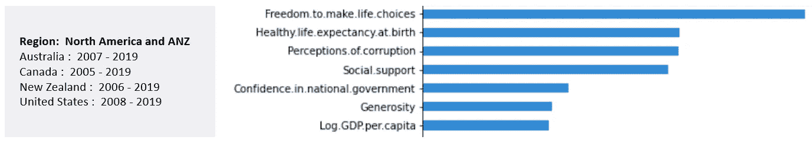****

****图 10 —北美和 ANZ 国家模型给出的特征重要性****

*****对数人均国内生产总值、社会支持*和*出生时健康预期寿命*的偏相关图显示出趋于平缓的增长趋势。这表明，在某一点之后，他们价值的增加并不会导致幸福的显著增加。****

****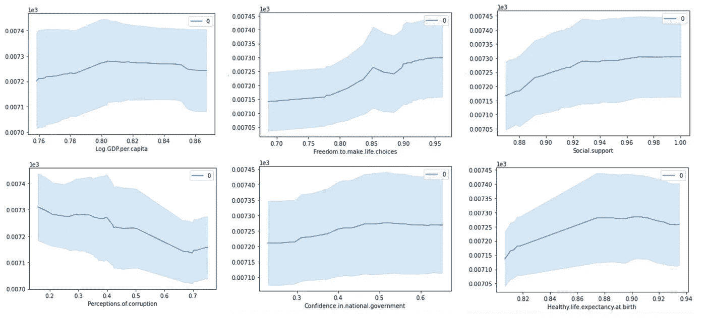****

****图 11 —部分依赖****

****对于西欧国家来说，对数人均国内生产总值和对腐败的看法在决定人们的幸福感方面扮演着相似的角色。同样，做出生活选择的自由排在第三位，紧接在社会支持之前。相反，*出生时健康预期寿命*落后于其他变量。****

****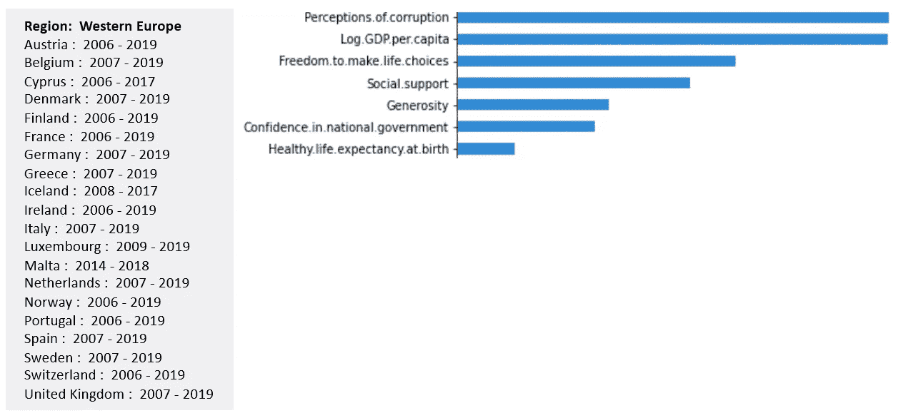****

****图 12 —西欧国家模型给出的特征重要性****

****至于北美国家， *Log 人均国内生产总值*的部分依赖图显示出越来越趋于平缓的趋势，这表明在某个点之后，财富的增加不会导致幸福的显著增加。****

****对于新兴和发展中国家来说，*对数人均 GDP*始终是最重要的因素。接下来的变量取决于地区，通常是*社会支持*或*出生时的健康预期寿命。在南亚国家，社会支持几乎和人均 GDP 一样重要。*****

****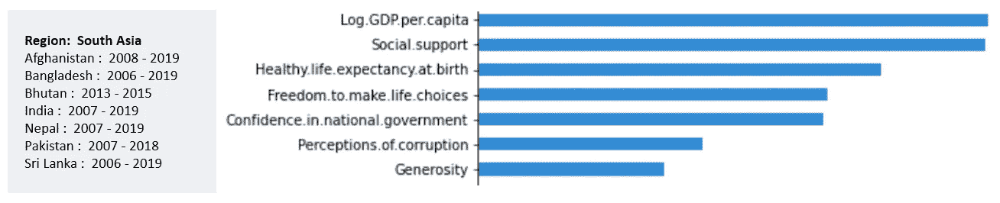****

****图 13 —南亚国家模型给出的特征重要性****

****更令人惊讶的是对对数人均国内生产总值的部分依赖呈钟形。这意味着，在财富达到一定水平后，一个人财富的增加会导致他幸福度的下降！****

****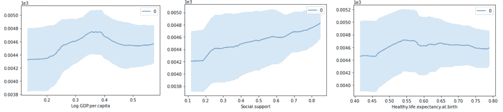****

****图 14——三个最重要变量的部分相关性****

*****社会支持*也是中欧和东欧、撒哈拉以南非洲、独立国家联合体国家的第二个最重要的变量，但相对比例并不总是相同，如下图所示。****

****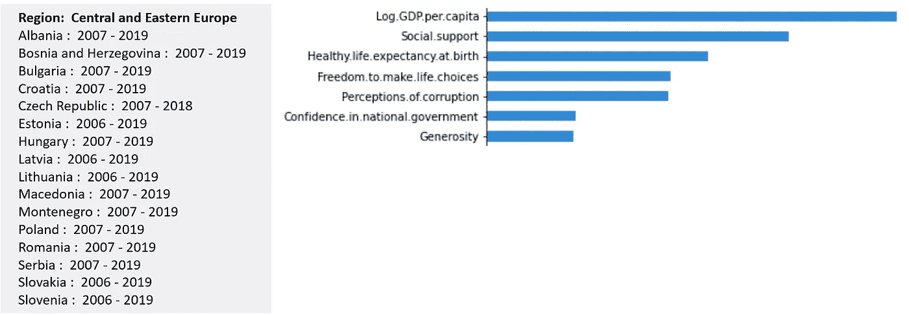****

****图 15 —中欧和东欧国家模型给出的特征重要性****

****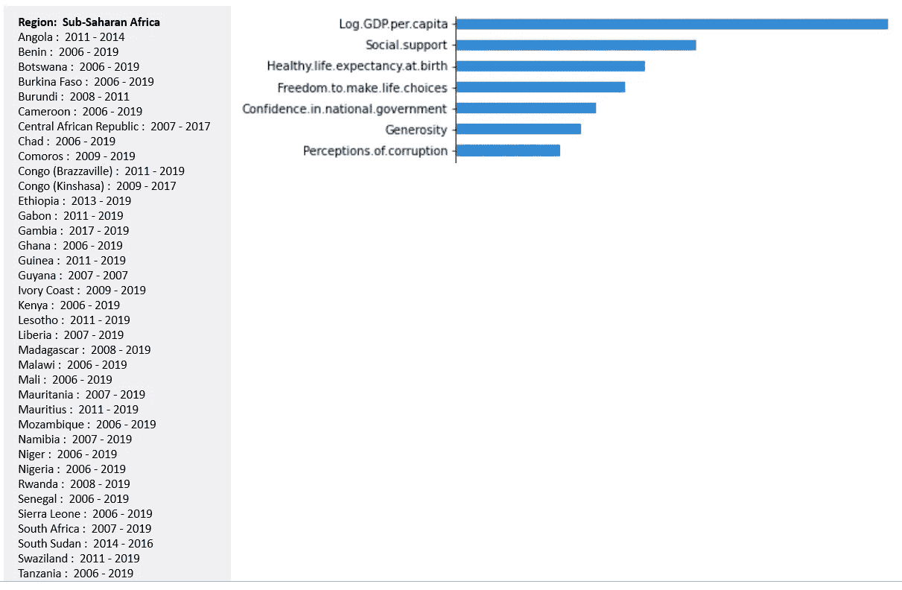****

****图 16——撒哈拉以南非洲国家模型给出的特征重要性****

****相反，拉丁美洲和加勒比海、中东和北非东部、东亚和东南亚的国家更“重视”出生时健康的预期寿命，而不是社会支持，如下图所示。****

****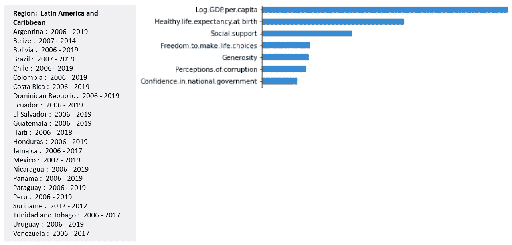****

****图 17—模型对拉丁美洲和加勒比海国家的重要性****

****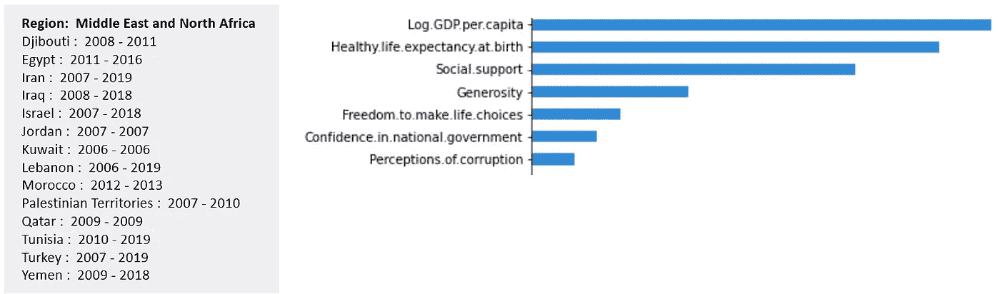****

****图 18 —中东和北非国家模型给出的特征重要性****

****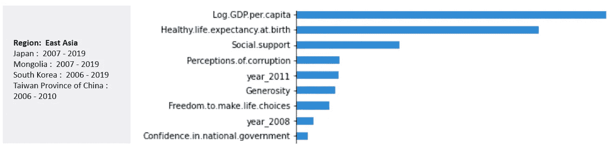****

****图 19 —东亚国家模型给出的特征重要性****

****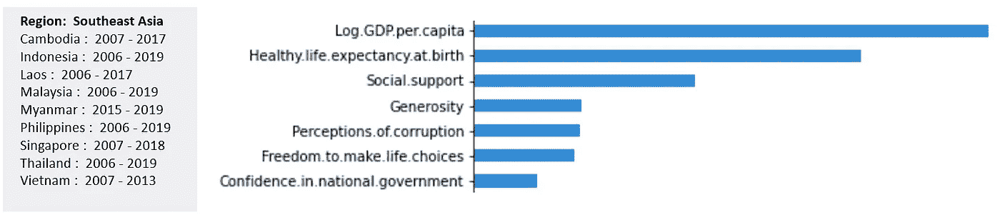****

****图 20 —东南亚国家模型给出的特征重要性****

****如何解释国家之间的这些差异？****

****有些人可能会说这完全是关于国家的文化和价值观，但实际上这是一个需要更深入研究的棘手问题。尽管如此，所进行的分析已经使我们知道一个国家的人民最重视什么，以及应该采取什么政策来改善他们的生活条件。****

# ****限制****

****最后，我想指出上述方法的 3 个主要局限性:****

*   ******省略变量:**虽然直观上与给定的题目相关，但用来解释快乐的变量可能还不够。它们的相关性可能实际上反映了分析中没有包括的一些其他“未观察到的”因素。****
*   ******反向因果关系:**还存在双向因果关系的风险。这意味着幸福会引起一个或多个解释变量的变化。例如，人们快乐是因为他们健康，还是他们快乐的情绪让他们感觉健康？人们快乐是因为他们富有，还是快乐的感觉让他们在职业生活中更有活力和雄心？****
*   ******测量错误:**许多被分析的变量都是主观的，更多地代表了人们的感知而非现实。例如，来自一个有着悠久民主政治传统的国家的人们可能会更强烈地感受到腐败，而腐败比其他国家更弱、更不普遍。此外，选择*人均 GDP*和*出生时健康预期寿命*分别代表人们的财富和健康。****