# 了解 HDBSCAN 和基于密度的聚类

> 原文：<https://towardsdatascience.com/understanding-hdbscan-and-density-based-clustering-121dbee1320e?source=collection_archive---------2----------------------->


## 自上而下全面介绍 HDBSCAN 聚类算法的内部工作原理以及基于密度的聚类的关键概念

HDBSCAN 是由 [Campello、Moulavi 和 Sander](http://link.springer.com/chapter/10.1007%2F978-3-642-37456-2_14) [8]开发的一种聚类算法。它代表“*带噪声的应用的基于层次密度的空间聚类”*

在这篇博文中，我将尝试以自上而下的方式介绍一些关键概念，以帮助理解 HDBSCAN 的工作方式和原因。这是为了补充现有的文档，如 sklearn 的“【HDBSCAN 如何工作”[1]，以及麦金尼斯和希利的其他作品和演示文稿[2]，[3]。

## 除了一些噪音，没有(很少)假设


让我们从最上面开始。在我们描述我们的聚类算法之前，我们应该问，*“我们要聚类什么类型的数据？”*

我们希望对我们的数据有尽可能少的假设。也许我们唯一可以安全做出的假设是:

*   我们的数据中有噪音
*   在我们的数据中有我们希望发现的聚类

## 聚类数据集

为了激发我们的讨论，我们从[1]和[3]中使用的[数据集](https://github.com/lmcinnes/hdbscan/blob/master/notebooks/clusterable_data.npy)开始。

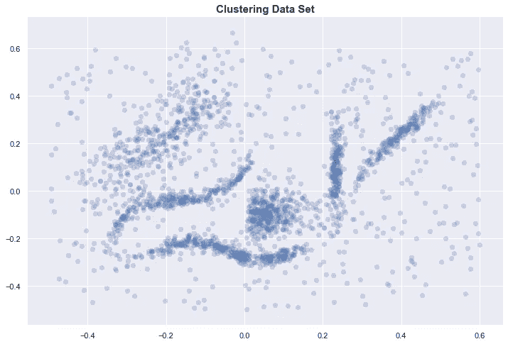

只有二维，我们可以绘制数据，并在我们的数据集中识别 6 个“自然”集群。我们希望通过一些聚类算法来自动识别这些。

## k 均值与 HDBSCAN

知道了预期的聚类数，我们运行经典的 K-means 算法，并将结果标签与使用 HDBSCAN 得到的标签进行比较。

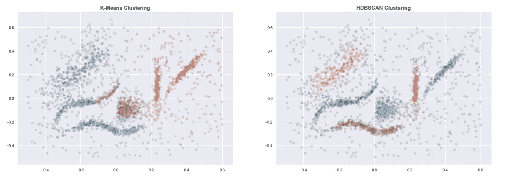

即使提供了正确数量的聚类，K-means 也明显无法将数据分组到有用的聚类中。另一方面，HDBSCAN 为我们提供了预期的聚类。

## K-means 为什么会失败？

简而言之， **K-means 表现不佳，因为不满足对聚类形状的基本假设**；这是一个参数算法，由 *K 个簇形心、*高斯球的中心来参数化。当聚类满足以下条件时，K-means 表现最佳:

*   “圆形”或球形
*   大小相等
*   同等密集
*   球体中心密度最大
*   未被噪音/异常值污染

让我们从 ESLR [4]借用一个简单的例子来说明 K-means 如何对簇的形状敏感。下面是来自相同数据的两个聚类。在左边，数据在聚类前被标准化。没有标准化，我们会得到一个“错误的”聚类。

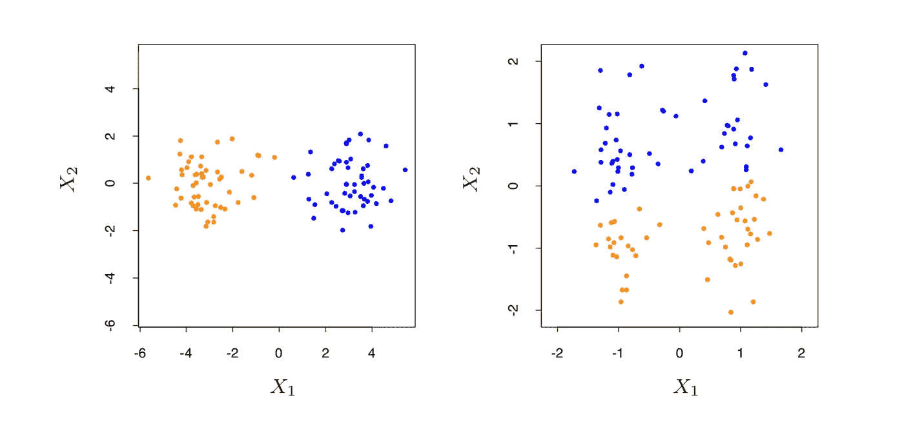

图 14.5 摘自《ESLR》第十四章[4]。标准化数据的聚类(左)与原始数据的聚类(右)。

## 我们的数据有什么特点？

我们回到我们的原始数据集，通过简单地描述它，很明显为什么 K-means 有困难。该数据集具有:

*   任意形状的簇
*   不同大小的集群
*   不同密度的集群
*   一些噪音和一些异常值

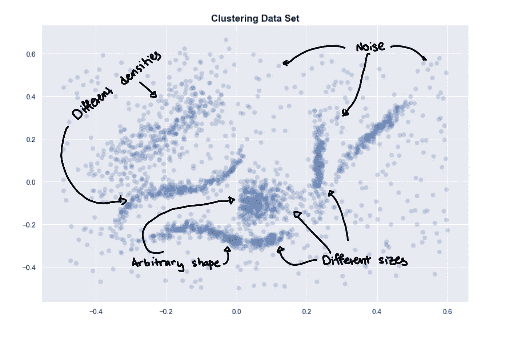

## 需要稳健的数据探索

虽然每个要点都可以从真实世界的数据集中合理地得到，但每个要点对于参数算法(如 K-means)来说都是有问题的。在信任算法的输出之前，我们可能需要检查算法的假设是否成立。但是，当对数据知之甚少时，检查这些假设可能是困难的。这是不幸的，因为聚类算法的主要用途之一是数据探索，我们仍在理解数据的过程中

因此，将用于数据探索的聚类算法需要尽可能少的假设，以便我们获得的初始洞察是“有用的”；更少的假设使其更加稳健，适用于更广泛的真实世界数据。

# 稠密区和多元模式


现在，我们知道了我们要处理的是什么类型的数据，让我们来探讨一下 HDBSCAN 的核心思想，以及它在数据具有以下特征时如何表现出色:

*   任意形状的簇
*   不同大小和密度的集群
*   噪音

HDBSCAN 使用基于密度的方法，该方法很少对聚类进行隐含假设。它是一种非参数方法，寻找由基础分布的多元模式形成的聚类层次。它不是寻找具有特定形状的簇，而是寻找比周围空间更密集的数据区域。你可以使用的心理图像是试图将岛屿从海洋中分离出来，或者将山脉从山谷中分离出来。

## 什么是集群？

我们如何定义“集群”？我们直觉认为的集群的特征可能很难定义，并且通常是特定于上下文的。(概述见克里斯蒂安·亨宁的演讲[5])

如果我们回到原始数据集，我们识别簇的原因是我们看到被稀疏和嘈杂空间包围的 6 个密集区域。

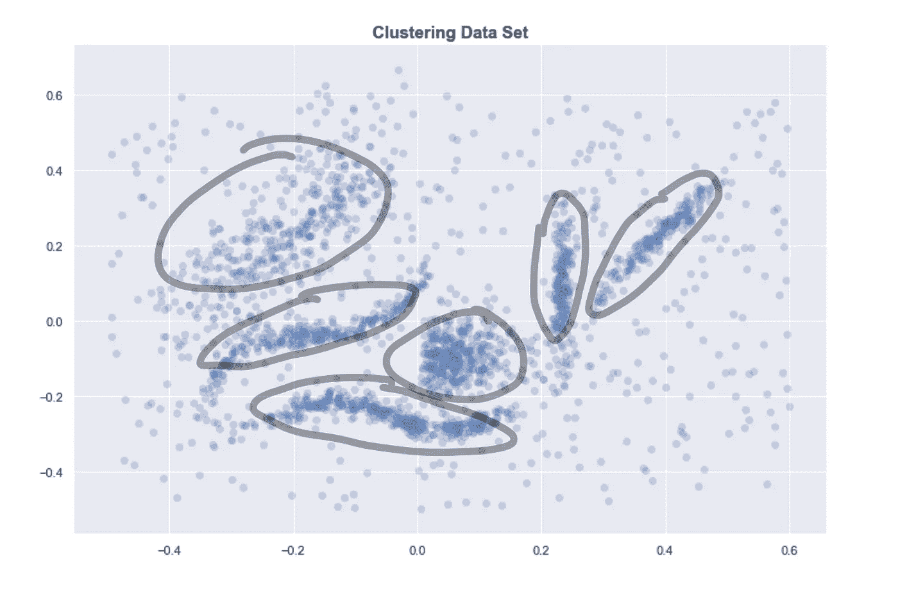

被包围的区域密度很高

一种通常与我们对集群的直观概念一致的定义集群的方式是:*由稀疏区域分隔的高密度区域。*

请看一维模拟数据的曲线图。我们可以看到 3 个集群。

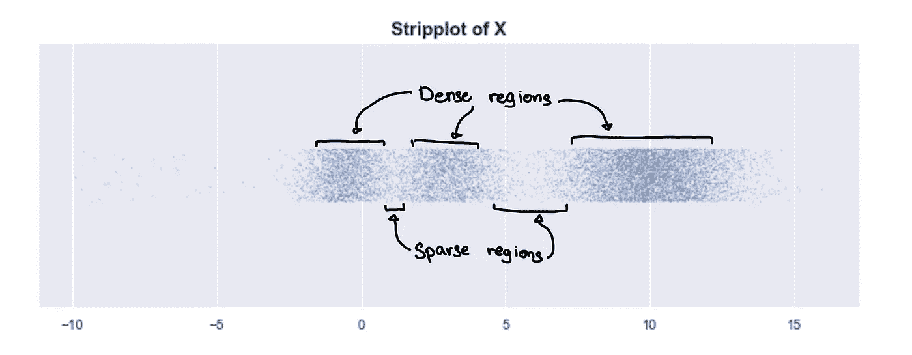

## 看看下面的分布

*X* 是来自混合正态分布的模拟数据，我们可以画出 X 的精确概率分布

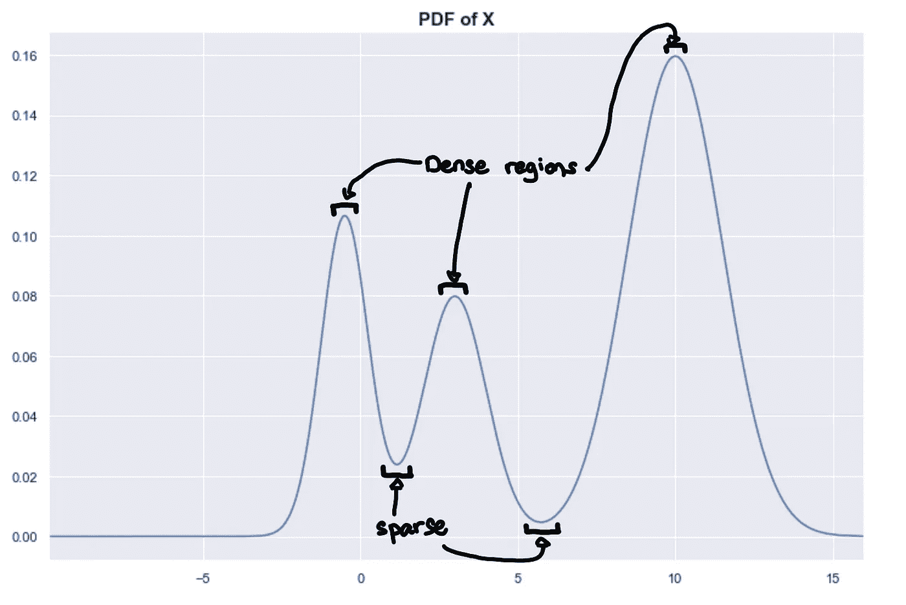

峰值=密集区域。波谷=稀疏区域

波峰对应于最密集的区域，波谷对应于稀疏的区域。这给了我们另一种解决问题的方法，假设我们知道潜在的分布，*簇是被不可能的区域分开的高度可能的区域。*想象更高维的概率分布形成了*山脉和山谷的景观，*其中*山脉是你的集群*。

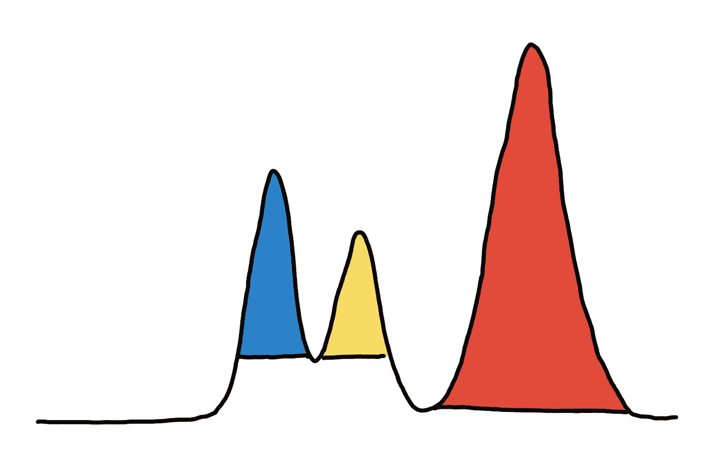

给三座山峰/山脉/集群着色

对于不太熟悉的人来说，这两种说法实际上是一样的:

*   *由稀疏区域分隔的高密度区域*
*   *被不太可能的区域分开的高度可能的区域*

一种是通过概率分布来描述数据，另一种是通过分布中的随机样本。

PDF 图和上面的带状图是等效的。PDF，*概率密度函数，*解释为位于某点周围小区域内的概率，从 *X* 看样本时，也可以解释为该点周围的期望密度。

给定基础分布，我们预计在随机样本中，更有可能的区域往往会有更多的点(更密集)。同样，给定一个随机样本，你可以根据经验密度推断出一个区域的概率。

**随机样本中更密集的区域对应于基础分布中更可能的区域。**

事实上，如果我们观察 X 的随机样本的直方图，我们会发现它看起来与 X 的真实分布完全一样。直方图有时被称为*经验概率分布，*有了足够的数据，我们希望直方图收敛到真实的基本分布。

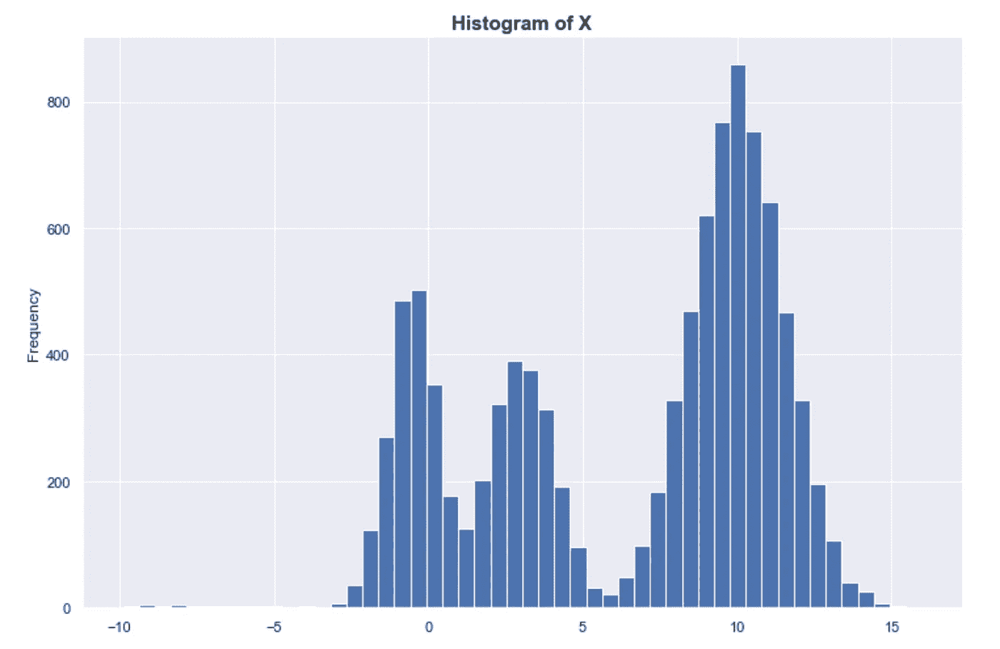

还是那句话，密度=概率。密度越大=可能性越大。

## 但是……什么是集群？

可悲的是，即使有了我们对集群的定义，也很难知道某个东西是否是一个单独的集群。看看下面的例子，我们把 X 的一个模式向右移动了。虽然我们还有 3 个峰值，但是我们有 3 个集群吗？在某些情况下，我们可以考虑 3 个集群。“直觉上”我们说只有两个集群。我们如何决定？

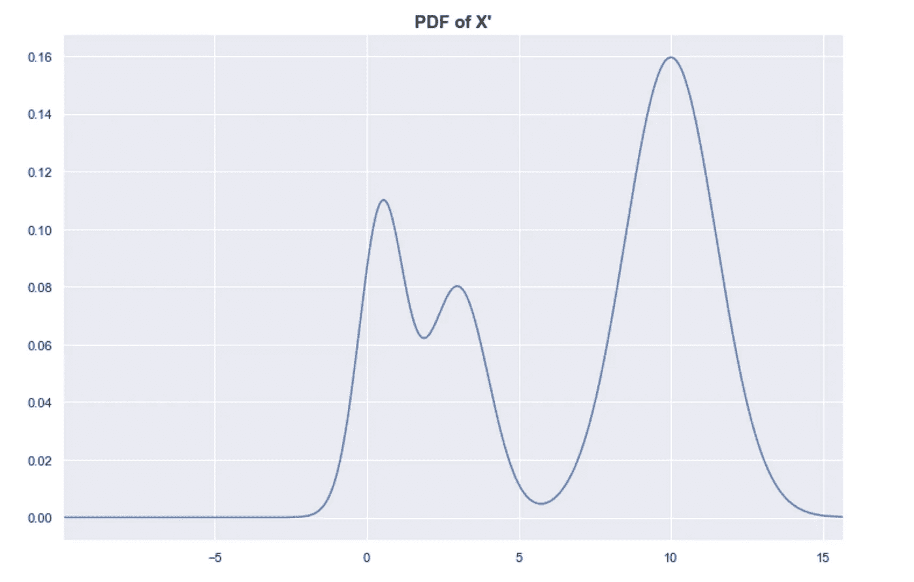

通过观察*X’，*的带状图，我们可以更加确定只有两个星团。

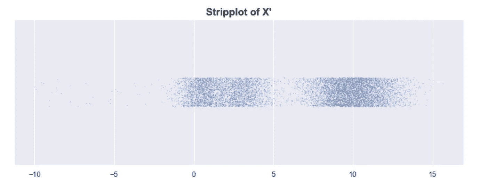

*X* 有 3 个簇，*X’*有 2 个簇。集群的数量在什么时候会发生变化？

定义它的一种方法是为底层分布的 PDF 设置一些全局阈值。所得水平集的连通分量就是你的聚类[3]。这就是 DBSCAN 算法所做的，在多个层次上做将导致 DeBaCl [7]。

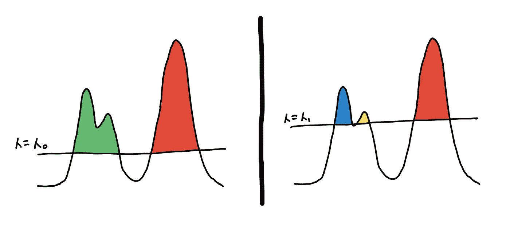

基于两个不同水平集的两个不同聚类

这可能因为它的简单而吸引人，但是不要被愚弄了！我们最终得到一个额外的超参数，*阈值𝜆，*，我们可能需要对其进行微调。此外，这对于具有不同密度的集群来说不太适用。

为了帮助我们选择，我们给我们的聚类选择涂上颜色，如下图所示。我们应该只考虑*蓝色*和*黄色、*或*绿色吗？*

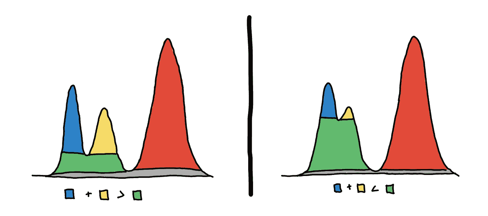

左侧有 3 个集群，右侧有 2 个集群

要选择，我们看哪一个更“坚持”。我们看到他们在一起多还是分开多？我们可以用彩色区域的面积来量化。

在左侧，我们看到蓝色区域*和黄色区域*和黄色区域*的面积之和大于绿色区域*和绿色区域*的面积之和*。*这意味着两个峰值更加突出，因此我们决定它们是两个独立的集群。*

在右边，我们看到绿色的面积要大得多。这意味着它们只是“凸起”而不是峰值。所以我们说它们只是一个集群。

在文献[2]中，这些区域的面积是*持续时间、*的度量，这种方法称为`eom`或*质量过剩*。更正式的说法是*，我们在所选聚类不重叠的约束下，最大化聚类的持久性总和。*

## 构建层次结构

通过在 *𝜆* 的不同值处得到多个水平集，我们得到一个层次结构。对于多维设置，想象星团是海洋中间的岛屿。随着你降低海平面，岛屿将开始“生长”,最终岛屿将开始彼此连接。

为了能够捕捉和表示集群(岛)之间的这些关系，我们将其表示为*一个层次树*。这种表示推广到更高的维度，是一种自然的抽象，更容易表示为我们可以遍历和操作的数据结构。

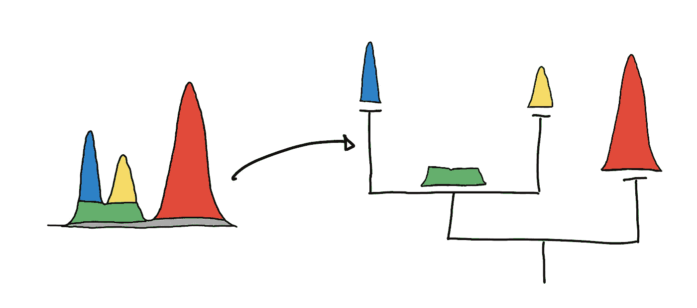

将集群层次结构可视化为树

按照惯例，树是自上而下绘制的，其中根(所有东西都是一个集群的节点)在顶部，树向下生长。

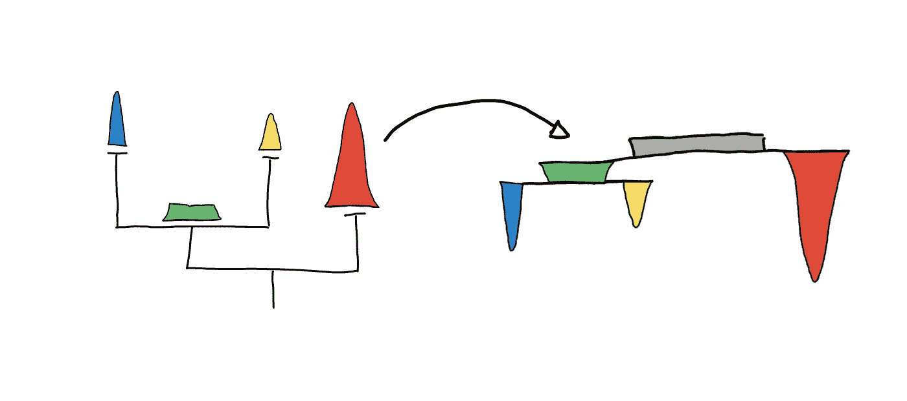

自上而下可视化树

如果您正在使用 HDBSCAN 库，您可能会使用`clusterer.condensed_tree_.plot()` API。下面显示的结果与上面显示的结果相同。圈出的节点对应于所选择的簇，分别是*黄色、蓝色*和*红色*区域。

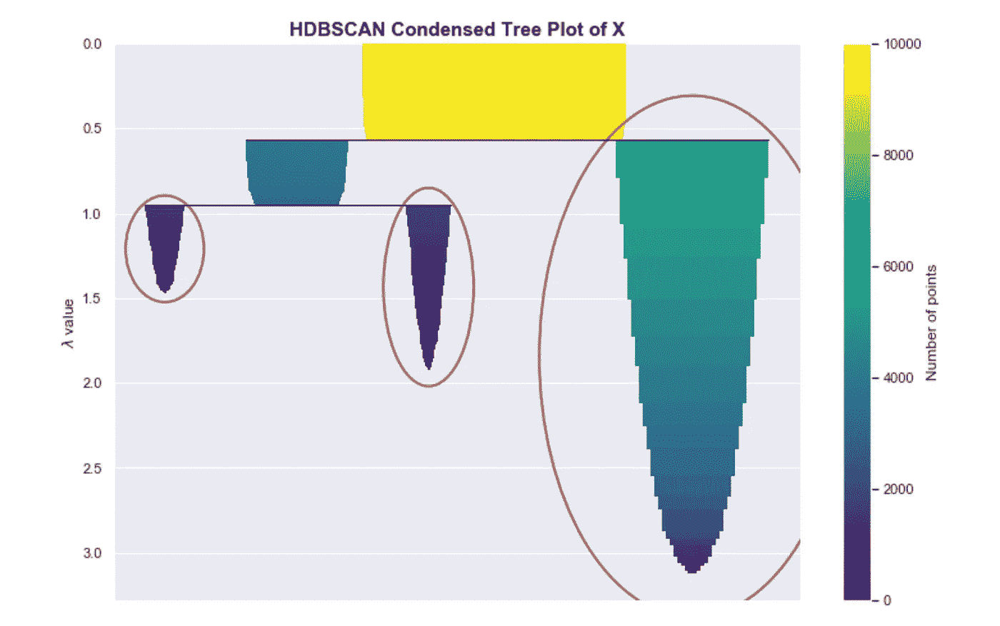

来自 HDBSCAN 的压缩树图

使用 HDBSCAN 时，这个特定的图可能有助于评估集群的质量，并有助于微调超参数，我们将在*“参数选择”*部分讨论。

# 局部近似密度


在上一节中，我们访问了底层发行版的真实 PDF。然而，**对于真实世界的数据，基本分布几乎总是未知的。**

因此，我们必须使用经验密度来估计 PDF。我们已经讨论了一种方法，使用直方图。然而，这只对一维数据有用，并且随着维数的增加，计算变得困难。

我们需要其他方法来得到经验概率密度函数。这里有两种方法:

*   计算𝜀-radius 内特定点的邻居数量
*   寻找到第 K 个最近邻居的距离(这是 HDBSCAN 使用的)

## 计算𝜀-radius 境内的邻居

对于每个点，我们围绕该点画一个𝜀-radius 超球，并计算其中的点数。这是我们对空间中该点密度的局部近似。

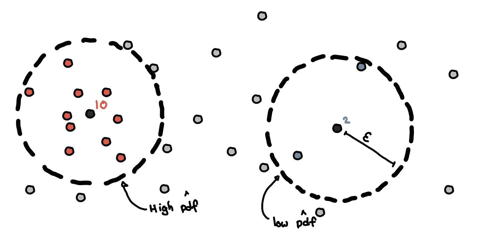

使用邻居计数估计概率密度函数

我们对每个点都这样做，并将估计的 PDF 与 PDF 的真实值进行比较(我们现在才这样做，因为我们模拟了数据，它的分布是我们定义的)。

对于我们的一维模拟数据，邻居计数与 PDF 的真实值高度相关。邻居的数量越多，估计的 PDF 就越高。

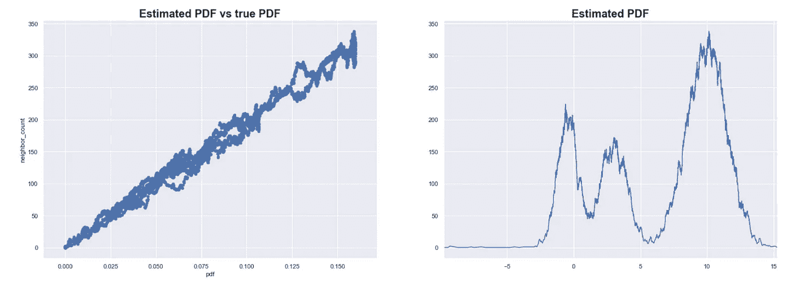

使用邻居计数 eps = 0.1 估计 X 的 PDF

我们看到，这种方法可以很好地估计模拟数据 x 的 PDF。请注意，这可能对数据规模和样本大小很敏感。您可能需要迭代𝜀的几个值才能获得好的结果。

## 到第 K 个最近邻居的距离

在这个例子中，我们得到了前面方法的补充。我们不是设置𝜀然后计算邻居，而是确定我们想要的邻居数量，并找到包含这 k 个邻居的𝜀的最小值。

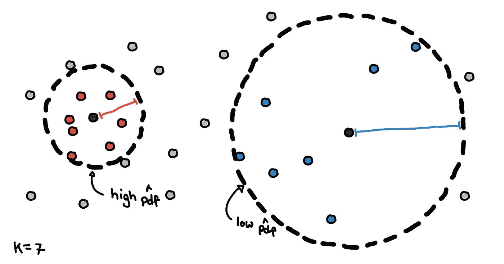

K = 7 时的核心距离

结果就是我们在 HDBSCAN 中所说的*核心距离*。核心距离较小的点位于密度较大的区域，因此 PDF 的估计值较高。具有更大核心距离的点位于更稀疏的区域，因为我们必须行进更大的距离来包含足够多的邻居。

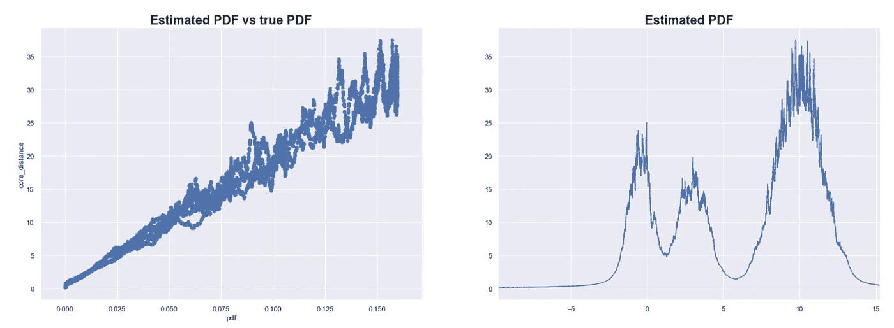

使用核心距离估算 X 的 PDF，其中 K = 100

我们尝试在模拟数据 x 上估计 PDF。在上面的图中，我们使用`1/core_distance`作为 PDF 的估计值。正如所料，估计值与真实的 PDF 高度相关。

虽然以前的方法对数据的规模和数据集的大小都很敏感，但这种方法主要对数据集的大小敏感。如果您均等地缩放每个维度，那么所有核心距离将成比例地增加。

这里的关键要点是:

*   核心距离=密度估计值
*   (回想一下)密度=概率
*   **核心距离 PDF 的一些估计值**

所以当我们提到一个点的*核心距离*时，你可以想到隐含地提到 *PDF。*基于核距离过滤点类似于从底层分布获得水平集。

每当我们有`core_distance ≤ 𝜀`，就有一个隐含的`pdf(x) ≥ 𝜆`在发生。𝜀和𝜆之间总是有一个映射，为了简单起见，我们将只使用符号𝜆来表示核心距离和 PDF。

## 找到水平集并给区域着色

回想一下，在前面的例子中，我们从 PDF 中得到一个水平集，得到的区域就是我们的聚类。这很容易，因为一个区域被表示为某种形状。但是当我们处理点的时候，我们怎么知道不同的区域是什么呢？

左边是一个小数据集，右边是相应的 PDF。

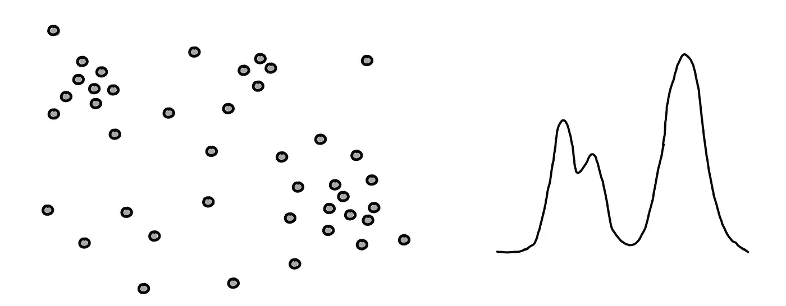

PDF 不“准确”

第一步是找到某个𝜆的水平集。我们用`core_distance ≤ 𝜆`过滤区域`pdf(x) ≥ 𝜆`或者过滤点。

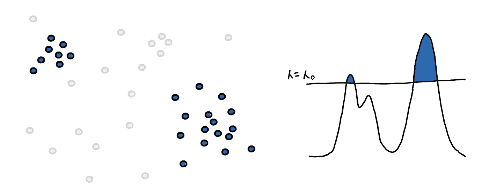

现在我们需要找到不同的区域。这是通过将“附近”的点相互连接来实现的。“附近”是由𝜆定义的当前密度水平决定的，如果两个点的欧几里德距离小于𝜆.，我们说这两个点足够近

我们围绕每个点画一个半径为𝜆的球体。

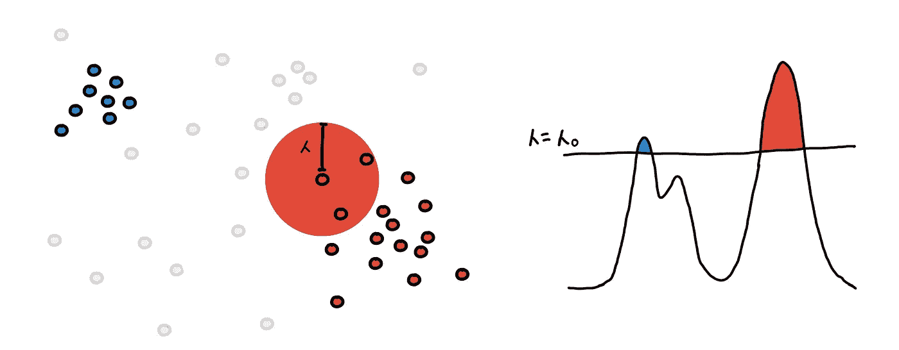

我们将该点连接到其𝜆-球内的所有点。如果两个点相连，则它们属于同一区域，并且应该具有相同的颜色。

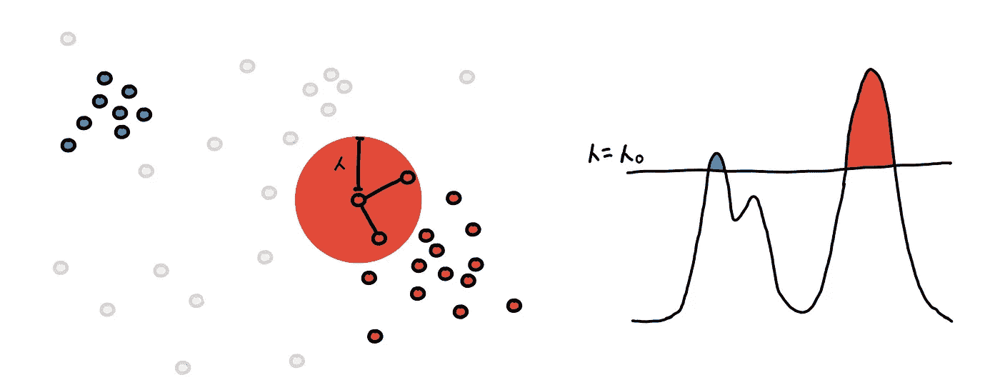

对每个点都这样做，我们剩下的是几个相连的部分。这些是我们的集群。

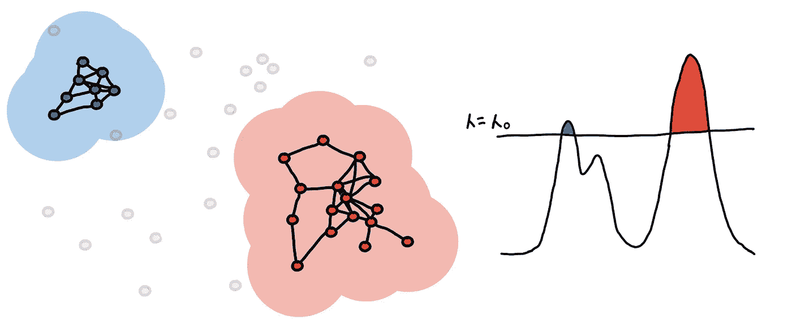

这是你在某个水平集上得到的聚类。我们继续“降低海平面”,并跟踪新的星团出现，一些星团增长，最终一些合并在一起。

## 降低海平面

这里有四个可视化，我们在 4 个不同的水平集显示 4 个集群。我们跟踪不同的集群，以便能够构建我们之前讨论过的层次树。

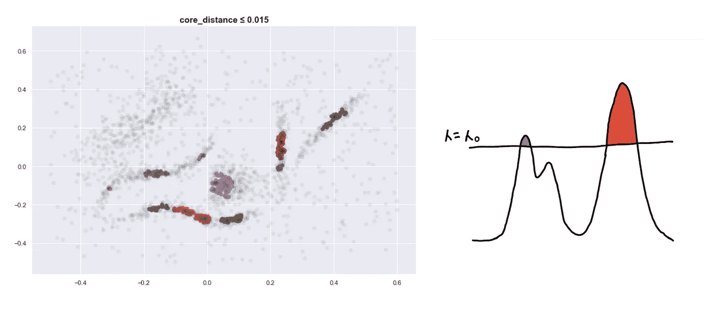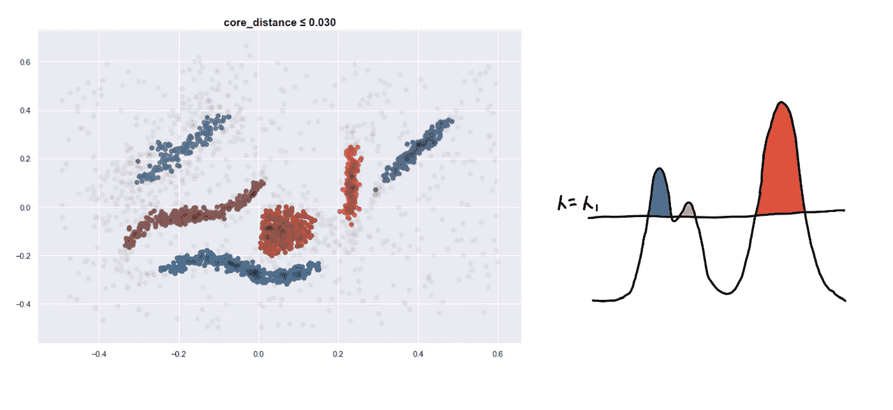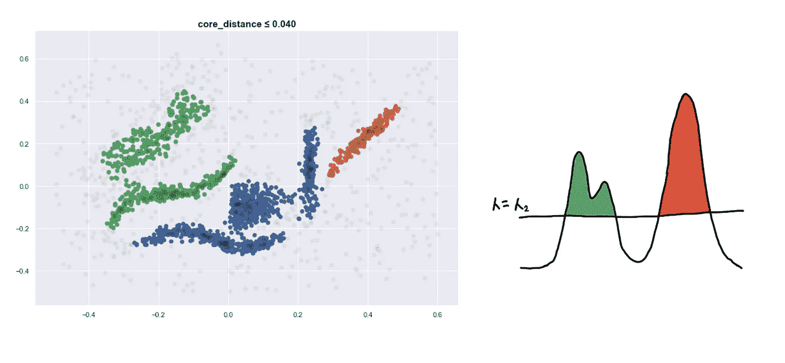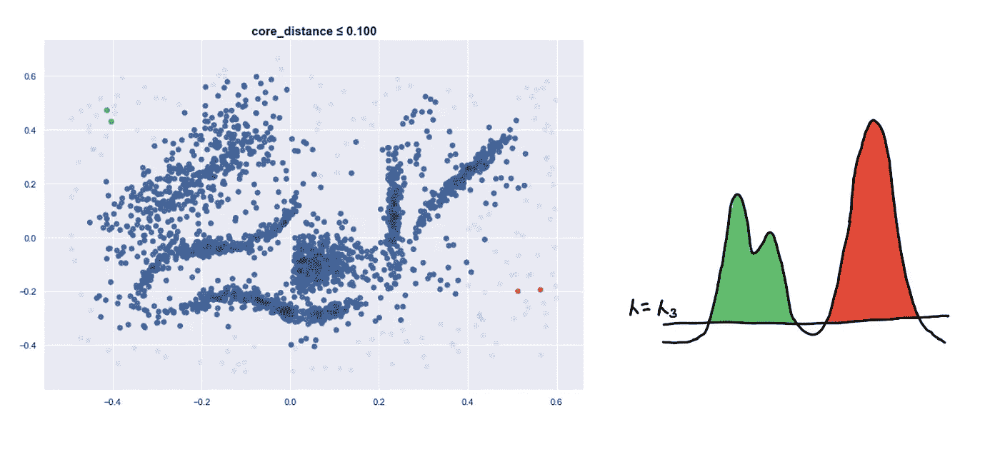

## 定义新的距离度量

我想强调的是，点可以在𝜆-球内，但它们仍然不会连接。它们必须首先包含在水平集内，因此对于要考虑的点来说， *𝜆* 应该大于其核心距离。

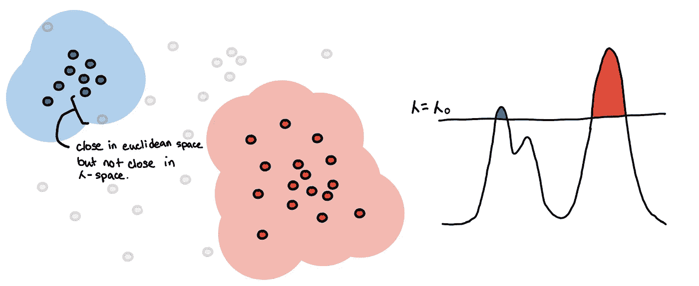

两点最终连接的 *𝜆* 的值可以解释为某个新的距离。对于要连接的两点，它们必须是:

*   在足够密集的区域
*   彼此足够接近

对于 *a* 和 *b* ，我们根据 *𝜆* 得到如下不等式:

1.  核心 _ 距离(a) ≤ *𝜆*
2.  核心 _ 距离(b) ≤ *𝜆*
3.  距离(a，b) ≤ *𝜆*

(1)和(2)是针对*“在足够密集的区域”*。③是为*【彼此足够接近】*

结合这些不等式，能够直接连接 a 和 b 所需的𝜆的最小值为

```
mutual_reachability_distance(a, b) *=* max(
    core_distance(a), 
    core_distance(b), 
    distance(a, b)
)
```

这在 HDBSCAN 文献中称为*相互可达性距离*。

## 投影到 *𝜆-space*

*注意:这个“λ空间”是一个在文献中找不到的术语。这只是为了这个博客。*

我们现在可以使用相互可达性距离作为新的度量，而不是使用欧几里德距离作为我们的度量。使用它作为度量相当于将点嵌入一些新的度量空间，我们将简单地称之为 *𝜆-space*.*

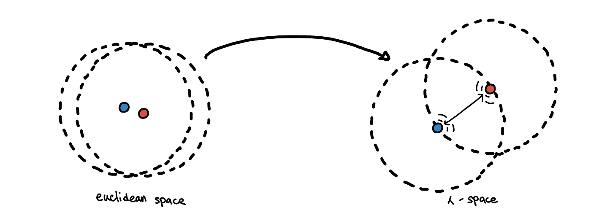

排斥效应。圆圈代表每个点的核心距离。

这具有在稀疏区域中分散接近点的效果。

由于随机样本的随机性，两个点可以在非常稀疏的区域中彼此接近。然而，我们期望稀疏区域中的点彼此相距很远。通过使用相互可达性距离，稀疏区域中的点如果过于靠近就会“排斥其他点”，而非常密集区域中的点则不受影响。

下面是使用*多维缩放*在𝜆-space 投影的点的图，以更具体地显示其效果。

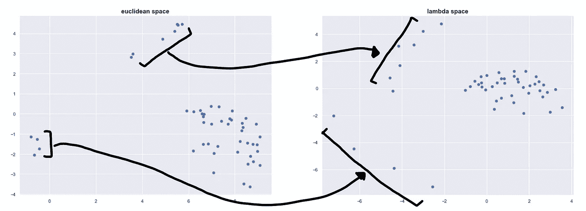

我们可以在左边和上面看到这种排斥效应。左边的四个点是最分散的，因为它们在一个非常稀疏的空间中。

## 使用𝜆-space 构建层次结构树

回想一下，为了构建层次结构树，我们有以下步骤:

1.  将 *𝜆* 设置为核心距离的最小值
2.  过滤水平集中的点
3.  连接最多相距 *𝜆* 单位的点
4.  创建新集群、扩展新集群和合并集群
5.  将 *𝜆* 设置为核心距离的下一个最小值，并转到步骤(2)

注意，在执行步骤(3)时，连接已经属于同一个连通分量的两个点是没有用的。真正重要的是集群之间的联系。将连接两个聚类的连接对应于来自两个不同聚类的具有最小相互可达性距离的点对。如果我们忽略这些“无用”的连接，只注意相关的连接，我们剩下的是一个有序的边列表，这些边总是合并两个簇(连接的组件)。

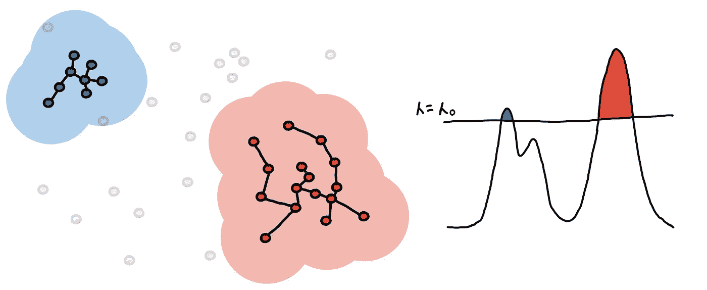

丢弃“无用”边的连接…这是最小生成树的形成吗？

这听起来可能很复杂，但如果我们将*相互可达性距离*视为我们的新指标 *:* ，这就可以简化

1.  将点嵌入𝜆-space，并将每个点视为一个独立的聚类
2.  找出两个不同聚类中两点之间的最短距离
3.  合并两个集群
4.  回到步骤(2 ),直到只有一个集群

如果这听起来很熟悉，这就是经典的凝聚聚类。这只是𝜆-space 的单一连锁集群！

在欧几里得空间中进行单链聚类可能对噪声敏感，因为噪声点可能会形成跨越岛的伪桥。通过在𝜆-space 中嵌入点,“排斥效应”使得聚类对噪声更加鲁棒。

单一链接集群相当于构建一棵最小生成树！因此，我们可以利用图论中所有有效的方法来构造 MST。

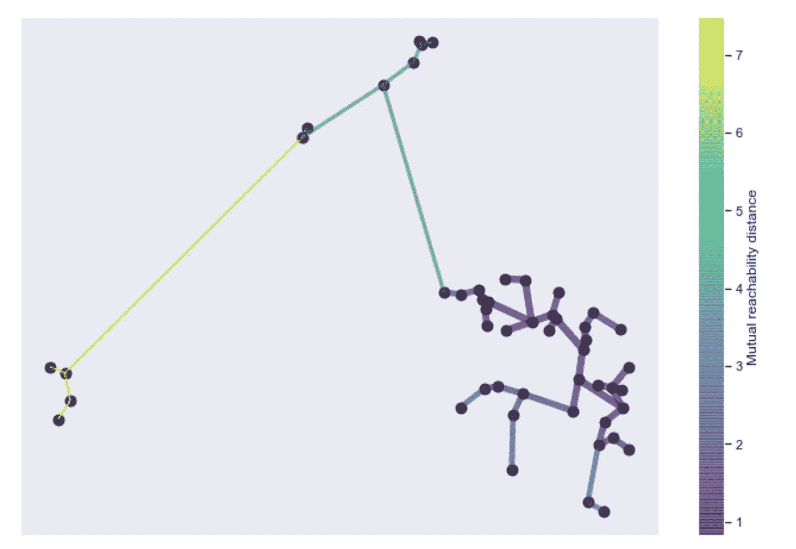

HDBSCAN 的最小生成树

# 参数选择和其他注意事项


现在，我们来了解一下关于 HDBSCAN、`min_samples`和`min_cluster_size`以及 HDBSCAN 的主要参数的说明。

## 最小样本数

回想一下我们的模拟数据 X，在这里我们试图估计真实的 PDF。

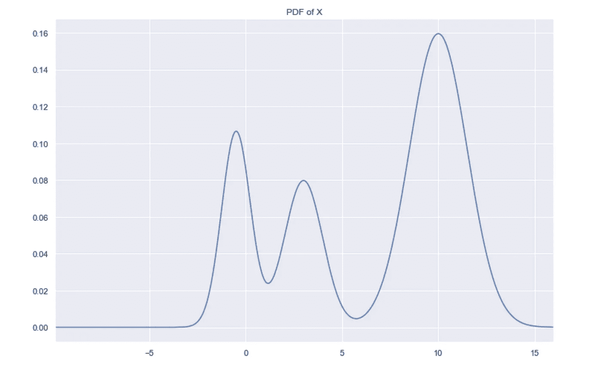

我们尝试使用核心距离来估计这一点，核心距离是到第 K 个最近邻居的距离。超参数 K 在 HDBSCAN API 中被称为`min_samples`。

这些只是来自模拟数据的经验观察。我们将上面的图与基于不同`min_samples`值的估计 PDF 进行比较。

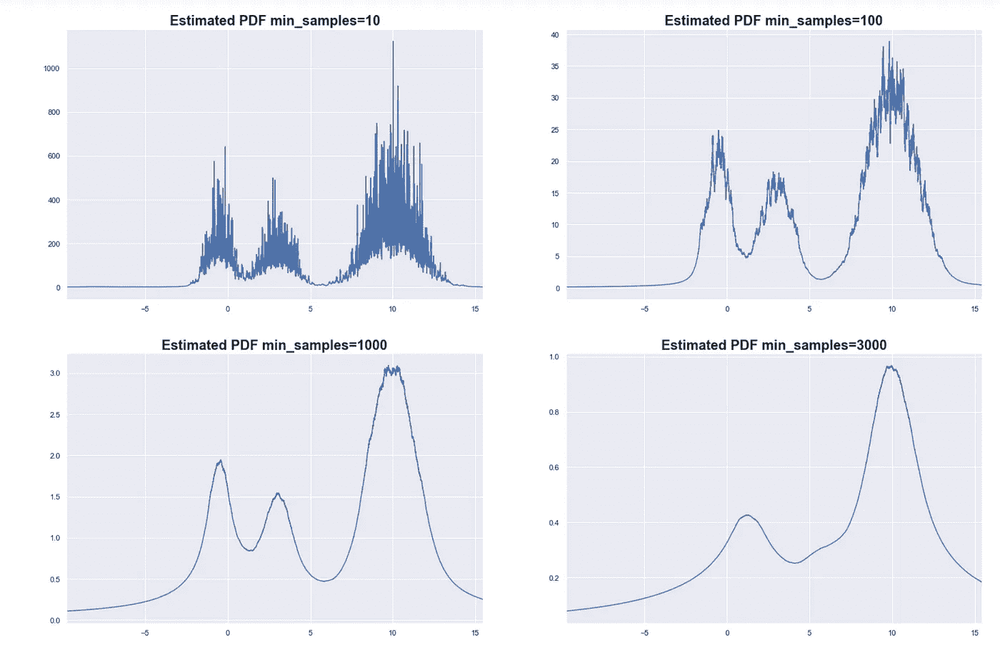

基于 10000 样本量的估计 PDF

正如你所看到的，设置`min_samples`太低会导致 PDF 非常嘈杂的估计，因为核心距离变得对密度的局部变化敏感。这可能导致虚假集群，或者一些大集群可能最终分裂成许多小集群。

设置`min_samples`过高会使 PDF 过于平滑。PDF 的更精细的细节丢失了，但是至少你能够捕捉到更大更全局的底层分布结构。在上面的例子中，两个小集群被“模糊”成一个集群。

确定`min_samples`的最佳值可能很困难，并且最终取决于数据。不要被我们这里使用的`min_samples`的高值所误导。我们使用 1-d 模拟数据，该数据在整个域和仅 3 个集群中具有平滑的密度变化。典型的真实世界数据是完全不同的特性，较小的`min_samples`值就足够了。

关于平滑效果的见解肯定适用于其他数据集。增加`min_samples`的值可以平滑估计的分布，从而使小峰变平，我们可以只关注更密集的区域。

> 对于`min_samples`所做的事情，最简单的直觉是提供一个你希望你的聚类有多保守的度量。您提供的`min_samples`值越大，聚类就越保守——更多的点将被声明为噪声，聚类将被限制在越来越密集的区域。[7]

请小心，这样做的一个可能的副作用是，它可能需要更长的运行时间，因为您必须为每个点找到更多的“最近邻居”，并且可能需要更多的内存。

## 最小聚类大小

请注意，我们试图估计的潜在 PDF 非常平滑，但因为我们试图用样本进行估计，所以我们预计估计值会有一些变化。

这导致一个“颠簸”的估计 PDF。让我们关注 PDF 的一小部分来说明这一点。

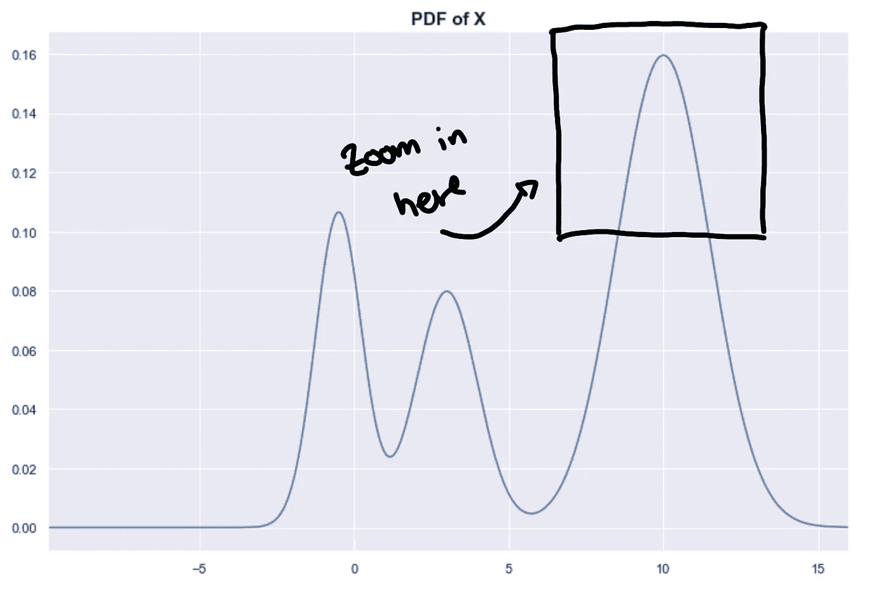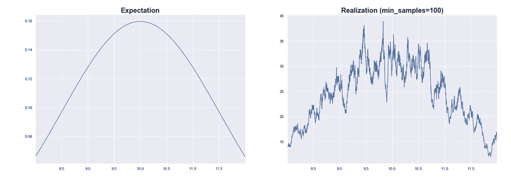

这种凹凸在层次树中有什么影响？这影响了集群的持久性度量。

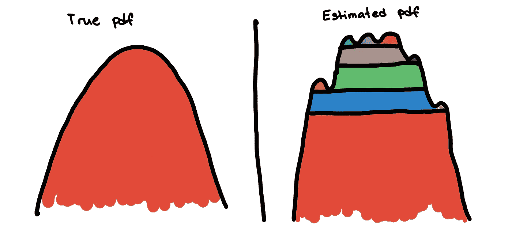

因为小突起被解释为迷你聚类，所以真实聚类的持久性度量被划分为小段。如果不移除凸起，通过*质量过剩*方法可能看不到主星团。它看到的不是一座光滑的大山，而是无数迷你山峰的集合。

为了解决这个问题，我们把这些小突起弄平。这是通过“修剪”层次树中不够大的集群来实现的。这样做的效果是*质量过剩*方法不再被小突起分散注意力，现在可以看到主星团。

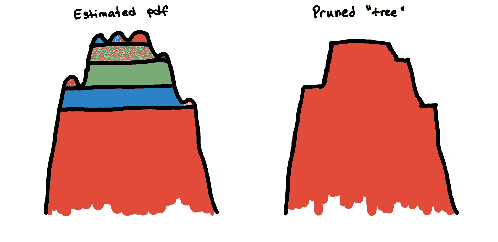

`min_cluster_size`规定了在被认为是峰之前“凸起”的最大尺寸。通过增加`min_cluster_size`的值，你在某种程度上平滑了估计的 PDF，使得分布的真正峰值变得突出。

因为我们可以访问 X 的真实 PDF，我们知道一个好的`min_samples`值，它将产生一个平滑的估计 PDF。如果估计不错，那么`min_cluster_size`就不那么重要了。

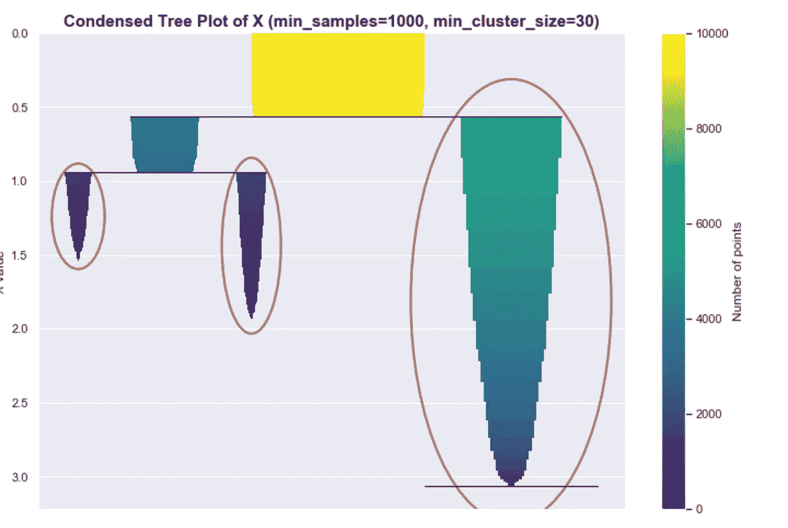

理想凝聚树

假设我们对`min_samples`使用了一个较小的值，并将其设置为 100。如果你看 PDF 图，它有 PDF 的一般形状，但有明显的差异。

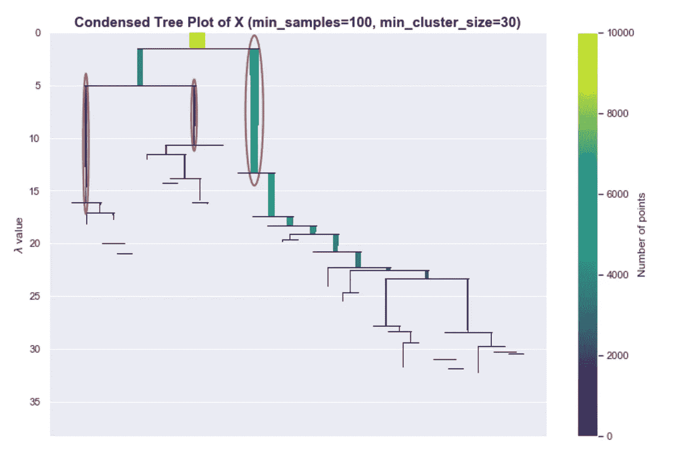

尽管我们知道应该只有 3 个峰值，但我们看到了许多小峰。

如果你看到一个更极端的版本，也许你甚至看不到条形的颜色了，那么这意味着层次结构树是复杂的。也许是因为估计的方差，也许这就是数据的结构。解决这个问题的一个方法是增加`min_cluster_size`，这有助于 hdb 简化树，专注于更大更全局的结构。

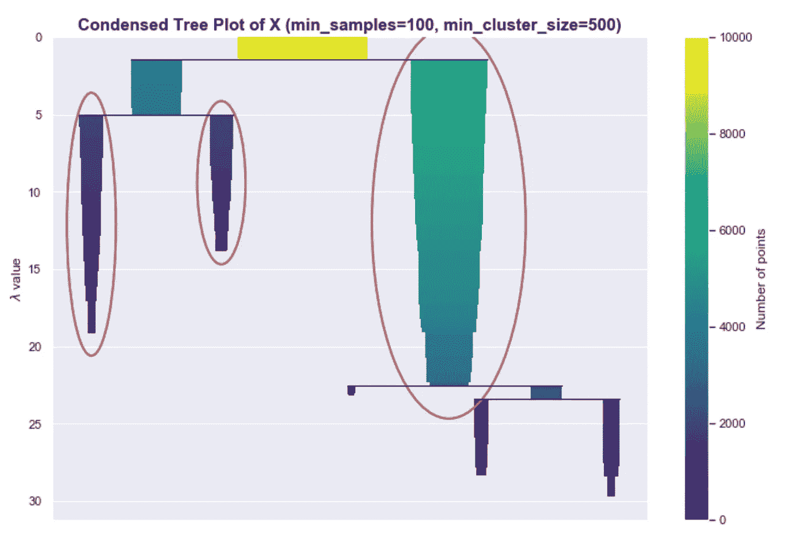

## 数据转换

尽管我们已经确定 HDBSCAN 可以找到任意形状的簇，但这并不意味着不需要任何数据转换。这真的取决于你的用例。

缩放某些特征可以增加或减少该特征的影响。此外，一些变换如*对数*和平方根*变换*可以完全改变底层分布的形状。

## 评估集群质量

另一个需要注意的观点是，在使用 HDSCAN 时，评估和总结集群的传统方法可能没有意义。当聚类为圆形时，一些度量标准(如*轮廓得分*)工作得最好。

对于 *sklearn 中的“月亮”数据集，K-means* 比 HDBSCAN 的结果具有更好的轮廓得分，即使我们看到 HDBSCAN 中的聚类更好。

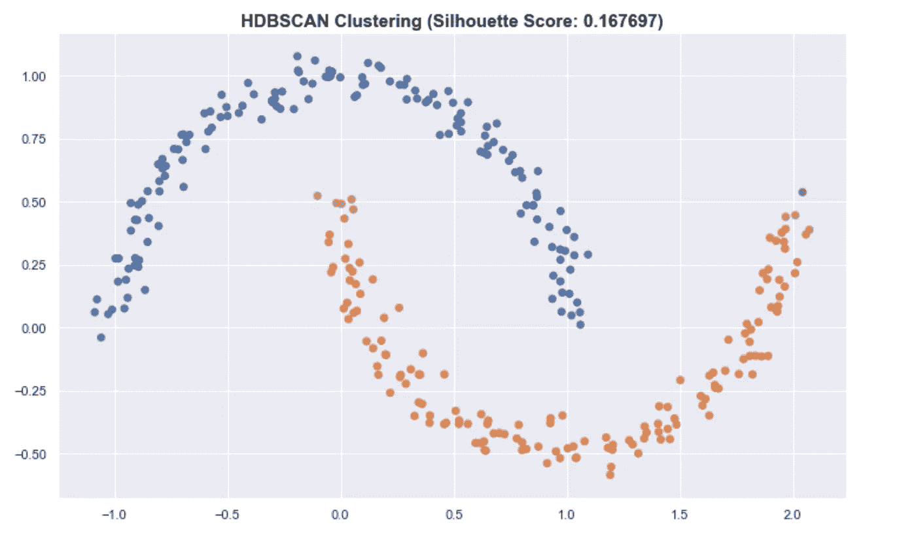

这也适用于通过获取聚类所有点的平均值来汇总聚类。这对于 K-means 非常有用，是一个很好的集群原型。但是对于 HDBSCAN 来说，可能会有问题，因为星团不是圆的。

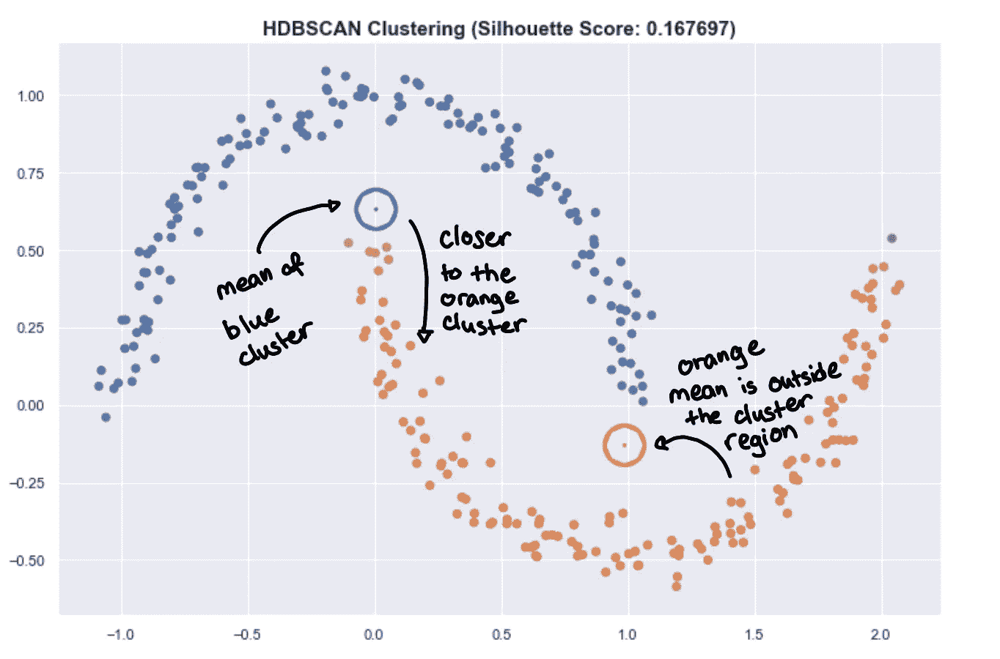

空心圆是星团的“质心”。

均值点可以远离实际集群！这可能会非常误导人，并导致错误的见解。您可能想要使用类似于 *medoid* 的东西，它是最接近所有其他点的集群的一部分。但是要小心，试图用空间中的一个点来概括一个复杂的形状可能会丢失太多的信息。

这完全取决于您喜欢哪种类型的集群以及您正在处理的底层数据。请参见 [Henning's talk [5]](https://www.youtube.com/watch?v=Mf6MqIS2ql4) 了解集群评估的概述。

# HDBSCAN 摘要


我们完了！我们已经讨论了 HDBSCAN 的核心思想！我们将简要介绍一些具体的实现细节。

HDBSCAN 的实施大致如下:

1.  计算每个点的核心距离
2.  使用`mutual_reachability(a, b)`作为每个 a、b 的距离度量
3.  构建一棵最小生成树
4.  修剪这棵树
5.  使用*过剩质量*选择集群

## 计算每个点的核心距离

这基本上是我们“估计潜在 pdf”的方式

## 使用相互可达性距离的最小生成树

相互可达距离是在什么层次的 *𝜆* 两个在一起的点将连接的总结。这就是我们使用的新度量标准。

构建最小生成树相当于𝜆-space 中的单链接聚类，这相当于遍历每个可能的水平集并跟踪聚类。

## 修剪生成的树

简而言之，因为我们得到的只是一个估计的 PDF，我们期望有一些差异。因此，即使底层分布非常平滑，估计的 PDF 也可能非常不平坦，因此导致非常复杂的层次树。

我们使用参数`min_cluster_size`来平滑估计分布的曲线，因此，将树简化为`condensed_tree_`

## 用“质量过剩”来选择星团

使用*浓缩树*，我们可以估计每个集群的持久性，然后计算出最佳集群，如前一节所述。

# 参考

[1][https://hdb scan . readthedocs . io/en/latest/how _ hdb scan _ works . html](https://hdbscan.readthedocs.io/en/latest/how_hdbscan_works.html)

[2]麦金尼斯，利兰和约翰希利。[加速分层密度聚类](https://arxiv.org/abs/1705.07321)。 *arXiv 预印本 arXiv:1705.07321* (2017)。

[3]约翰·希利。 [HDBSCAN，基于快速密度的聚类，方法和原因。](https://www.youtube.com/watch?v=dGsxd67IFiU) PyData 纽约。2018

[4]哈斯蒂、特雷弗、罗伯特·蒂布拉尼和杰罗姆·弗里德曼。*统计学习的要素:数据挖掘、推理和预测*。斯普林格科学&商业媒体，2009 年。

[5]克里斯蒂安·亨宁。[评估聚类质量](https://www.youtube.com/watch?v=Mf6MqIS2ql4)。PyData 纽约。2018.

[6]亚历山德罗·里纳尔多。 [DeBaCl:一种基于密度的聚类算法及其性质](http://www.stat.cmu.edu/topstat/topstat_old/resources/AleDebacl.pdf)。

[7][https://hdb scan . readthedocs . io/en/latest/parameter _ selection . html](https://hdbscan.readthedocs.io/en/latest/parameter_selection.html)

[8]坎佩洛、里卡多·JGB、达武德·穆拉维和约尔格·桑德。"基于层次密度估计的密度聚类."亚太知识发现和数据挖掘会议。施普林格，柏林，海德堡，2013。

*照片由*[*【Dan Otis】*](https://unsplash.com/@danotis?utm_source=unsplash&utm_medium=referral&utm_content=creditCopyText)*【on】*[*【不连续】*](https://unsplash.com/s/photos/forest?utm_source=unsplash&utm_medium=referral&utm_content=creditCopyText) *，* [【泰 51】【凯西荷纳】](https://unsplash.com/@mischievous_penguins?utm_source=unsplash&utm_medium=referral&utm_content=creditCopyText) *【对* [*【非致命】*](https://unsplash.com/s/photos/forest?utm_source=unsplash&utm_medium=referral&utm_content=creditCopyText) *，* [】](https://unsplash.com/@keisuke_h?utm_source=unsplash&utm_medium=referral&utm_content=creditCopyText)