# 了解 Oracle 中的层次结构

> 原文：<https://towardsdatascience.com/understanding-hierarchies-in-oracle-43f85561f3d9?source=collection_archive---------5----------------------->

## 这篇文章讲述了在 Oracle 数据库中处理分层数据。它通过示例给出了详细的描述，从概念上解释了层次查询，并构建了层次查询以满足业务需求。


由[Edvard Alexander lvaag](https://unsplash.com/@edvardr?utm_source=medium&utm_medium=referral)在 [Unsplash](https://unsplash.com?utm_source=medium&utm_medium=referral) 上拍摄的照片

# 树形结构

在现实生活中，有很多情况下，一组特定的数据依赖于另一组数据，而另一组数据又依赖于另一组数据，如此等等。因此，这种数据的逻辑结构形成了树形结构。关系数据库不以分层的方式存储数据。因此，通常很难在关系数据库中浏览这些数据。Oracle 提供了许多分层查询特性，使我们能够处理这样的数据。

# 从连接方式开始

Oracle 的“START WITH CONNECT BY”子句允许非常有效地遍历分层数据。为了理解它的工作原理，我们来看一个示例表，其中包含如下示例数据:

```
CREATE TABLE ENTITIES(PARENT_ENTITY VARCHAR2(20 BYTE),CHILD_ENTITY VARCHAR2(20 BYTE),VAL Number);
```

现在在其中插入一些示例值。

```
Insert into ENTITIES (PARENT_ENTITY, CHILD_ENTITY,VAL) Values (NULL,’a’,100);Insert into ENTITIES (PARENT_ENTITY, CHILD_ENTITY,VAL) Values (‘a’, ‘af’,50);Insert into ENTITIES (PARENT_ENTITY, CHILD_ENTITY,VAL) Values (‘a’, ‘ab’,50);Insert into ENTITIES (PARENT_ENTITY, CHILD_ENTITY,VAL) Values (‘a’, ‘ax’,50);Insert into ENTITIES (PARENT_ENTITY, CHILD_ENTITY,VAL) Values (‘ab’, ‘abc’,10);Insert into ENTITIES (PARENT_ENTITY, CHILD_ENTITY,VAL) Values (‘ab’, ‘abd’,10);Insert into ENTITIES (PARENT_ENTITY, CHILD_ENTITY,VAL) Values (‘ab’, ‘abe’,10);Insert into ENTITIES (PARENT_ENTITY, CHILD_ENTITY,VAL) Values (‘abe’, ‘abes’,1); Insert into ENTITIES (PARENT_ENTITY, CHILD_ENTITY,VAL) Values (‘abe’, ‘abet’,1); Insert into ENTITIES (PARENT_ENTITY, CHILD_ENTITY,VAL) Values (NULL,’b’,100);Insert into ENTITIES (PARENT_ENTITY, CHILD_ENTITY,VAL) Values (‘b’, ‘bg’,50);Insert into ENTITIES (PARENT_ENTITY, CHILD_ENTITY,VAL) Values (‘b’, ‘bh’,50);Insert into ENTITIES (PARENT_ENTITY, CHILD_ENTITY,VAL) Values (‘b’, ‘bi’,50);Insert into ENTITIES (PARENT_ENTITY, CHILD_ENTITY,VAL) Values (‘bi’, ‘biq’,10);Insert into ENTITIES (PARENT_ENTITY, CHILD_ENTITY,VAL) Values (‘bi’, ‘biv’,10);COMMIT;
```

数据层次结构如下所示:

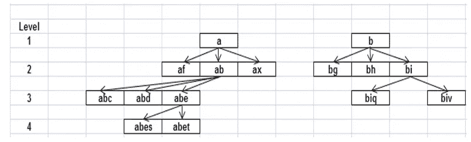

要遍历此类数据，Oracle 中的 SQL 查询可以写成:

```
SELECT parent_entity,child_entity
FROM entities
START WITH parent_entity is NULL CONNECT BY PRIOR child_entity= parent_entity
```

现在，让我们分析一下这个查询。

**开始于:**指定层次的根行，即从哪里开始“行走”。

**CONNECT BY:** 指定层次结构中父行和子行之间的关系。

**先验:**一元运算符，用于实现递归条件，即实际行走。

上述查询的结果如下:

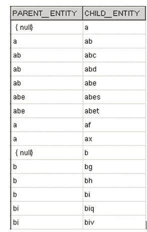

执行过程如下:

a.>开始条件决定了开始点。在我们的例子中，我们将开始条件指定为 parent_entity 为 NULL。因此，它将标记 parent_entity 为 NULL 的那些行。

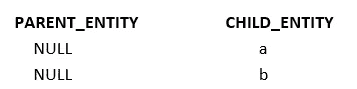

b.>条件 CONNECT BY PRIOR child _ entity = parent _ entity 将导致子实体值成为父实体，直到遍历整个分支。因此，在我们的例子中，值“a”将成为父值，它将搜索其子值。返回的第一行将是:

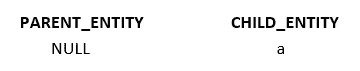

a 的孩子是 ab，af，ax。它现在将 ab 作为父节点并搜索其子节点。因此，到目前为止的结果集将是:

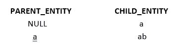

' ab '的孩子是 abc 和 abd 和 abe。它现在将搜索 abc 的子节点。因为

“abc”没有任何子级，它将在结果集中返回它，并将搜索 abd 的子级。它也没有任何子元素，所以它也将在结果集中返回这个。到目前为止的结果集是:

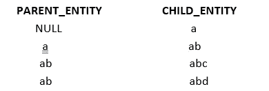

它现在会寻找“亚伯”的孩子。它有两个孩子:abes 和 abet。它现在将搜索 abes 的子节点，然后搜索 abet。abes 和 abet 都没有孩子。因此，结果集将如下所示:

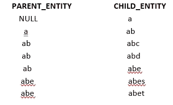

它现在将搜索 af 的孩子。它没有任何子元素，因此将在结果集中返回。同样，ax 将在结果集中返回。

这就完成了对步骤 a 中返回的第一行的遍历。现在将对步骤 1 中返回的第二行重复相同的过程。最终结果集将如下所示:

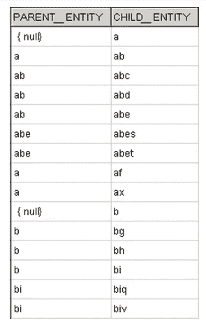

# 遍历方向

层次结构可以双向遍历:自顶向下或自底向上。CONNECT BY 子句中的条件和运算符“PRIOR”的位置决定了遍历的方向。

下面的查询以自上而下的方向遍历行。

```
**SELECT parent_entity,child_entity
FROM entities
START WITH parent_entity is NULL
CONNECT BY PRIOR child_entity= parent_entity**
```

如果我们将 PRIOR 放在条件的右侧，它将自下而上遍历行:

```
SELECT parent_entity,child_entity
FROM entities
START WITH parent_entity is NULL
CONNECT BY child_entity= PRIOR parent_entity
```

该查询的输出将是:

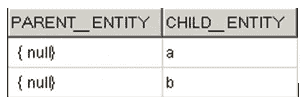

这将尝试在 START WITH 条件中找出返回行的父行。由于上述行没有父记录，因此这是返回的结果集。如果您将上述查询更改如下:

```
**SELECT parent_entity,child_entity
FROM entities
START WITH child_entity =’abet’
CONNECT BY child_entity= PRIOR parent_entity**
```

结果集将是

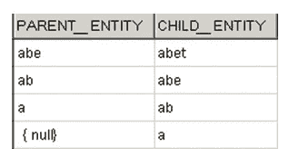

因此，它从 child_entity='abet '处开始自下而上地遍历数据

通过改变列 child_entity 和 parent_entity 的位置，同时保持在左侧之前，可以获得相同的结果。因此，以下查询也将产生上述结果集:

```
**SELECT parent_entity,child_entity
FROM entities
START WITH child_entity =’abet’
CONNECT BY PRIOR parent_entity = child_entity**
```

# 水平

LEVEL 是一个 Oracle 伪列，显示层次结构树中特定行的级别或等级。只有当查询中存在 CONNECT BY 子句时，才能使用它。如果我们执行下面的查询:

```
SELECT level, parent_entity,child_entity
FROM entities
START WITH parent_entity is NULL
CONNECT BY PRIOR child_entity= parent_entity
```

结果将如下所示:

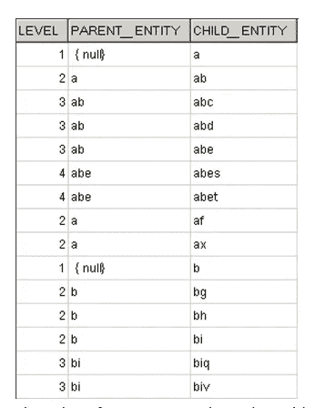

使用函数 LPAD 和级别，我们可以在结果集中返回一个树状结构，如下所示:

```
SELECT LPAD(child_entity,Length(child_entity) + LEVEL * 10–10,’-’) tree
FROM entities
START WITH parent_entity is NULL
CONNECT BY PRIOR child_entity= parent_entity
```

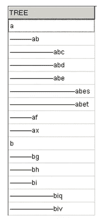

# 修剪树枝

可能存在部分检索分层树和修剪分支的业务需求。比方说，在我们的数据中，我们不需要以' ab '开头的分支和以下分支。

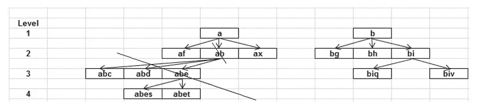

为此，我们将把查询修改为:

```
**SELECT parent_entity,child_entity
FROM entities
START WITH parent_entity is NULL 
CONNECT BY PRIOR child_entity = parent_entity and child_entity !=’ab’**
```

结果将如下所示:

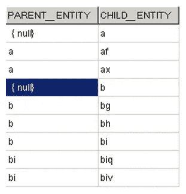

# NOCYCLE 和 CONNECT_BY_ISCYCLE

如果分层数据包含循环，即如果当前行有一个也是其祖先的子行，则可能会出现这种情况。例如，在实体表上执行下面的 Insert 语句:

```
**insert into entities values(‘abet’,’a’);**
```

它添加了一行，其中“abet”是“a”的父级。但是，‘a’也是‘abet’的祖先。这将导致一个循环。如果您执行以下查询:

它添加了一行，其中“abet”是“a”的父级。但是，‘a’也是‘abet’的祖先。这将导致一个循环。如果您执行以下查询:

```
**SELECT parent_entity,child_entity
FROM entities
START WITH parent_entity is NULL 
CONNECT BY PRIOR child_entity = parent_entity**
```

然后，会弹出以下错误:

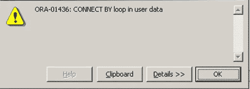

若要在数据中存在 CONNECT BY 循环的情况下从查询中返回行，请按如下方式使用 NOCYCLE 参数:

```
**SELECT parent_entity,child_entity
FROM entities
START WITH parent_entity is NULL 
CONNECT BY NOCYCLE PRIOR child_entity = parent_entity**
```

这不会返回错误。如果我们需要知道循环存在于哪一行，我们可以使用伪列 **CONNECT_BY_ISCYCLE** 。如果当前行有一个也是其祖先的子行，则返回 1。否则，它返回 0。因此，如果您运行以下查询:

```
**SELECT parent_entity,child_entity,CONNECT_BY_ISCYCLE isloop
FROM entities
START WITH parent_entity is NULL 
CONNECT BY NOCYCLE PRIOR child_entity = parent_entity**
```

输出将是:

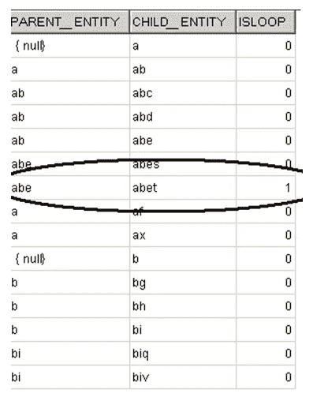

# 系统连接路径

如果要查看从根节点到当前节点的完整路径，可以按如下方式使用 SYS_CONNECT_BY_PATH:

```
**SELECT parent_entity,child_entity,SYS_CONNECT_BY_PATH(child_entity,’\’) PATH
FROM entities
START WITH parent_entity is NULL 
CONNECT BY PRIOR child_entity = parent_entity**
```

输出将是:

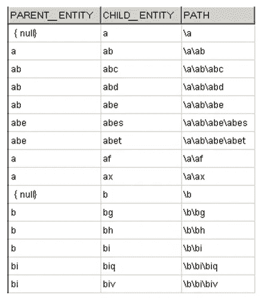

对于每一行，它显示了从顶层节点到当前节点的完整路径。

在从数据库中获取信息时，遍历层次结构通常会带来挑战。使用 Oracle 的内置功能可以解决这个问题。希望这篇文章对如何做到这一点有所启发。快乐阅读！