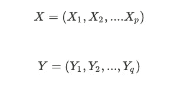
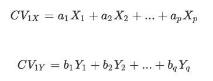
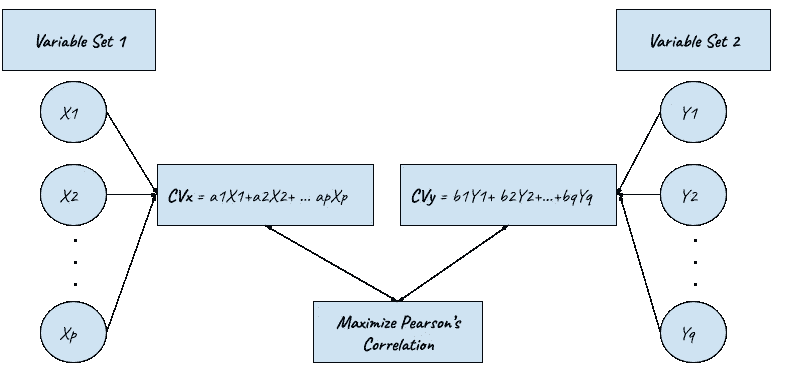
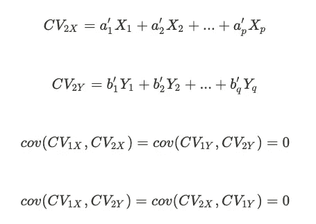
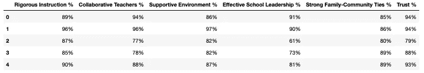
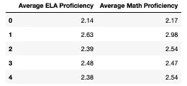
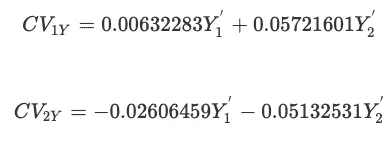

# 用典型相关分析理解学校如何工作

> 原文：<https://towardsdatascience.com/understanding-how-schools-work-with-canonical-correlation-analysis-4c9a88c6b913?source=collection_archive---------10----------------------->

## Python 典型相关分析简介


彼得·巴克斯在 [Unsplash](https://unsplash.com?utm_source=medium&utm_medium=referral) 上的照片

美国数据科学家把大部分时间花在分析数据中的关系和模式上。然而，我们的大多数探索工具都集中在一对一的关系上。但是，如果我们想有一个更概括的观点，并找到某些**变量组之间的共性和模式呢？**

这篇文章包括:

*   典型相关分析的介绍，让我们一次确定变量组之间的关联。
*   一个关于学校环境如何影响学生表现的 Python CCA 教程。

# 那么什么是 CCA 呢？

假设我们想知道学校的氛围如何影响学生的学业成就。一方面，在他们的学习环境中，我们有关于支持、信任和协作水平的变量。另一方面，我们有学生的学习成绩和考试成绩。

CCA 让我们从整体上探索这两组变量之间的关联，而不是在单个基础上考虑它们。粗略地说，我们为这些变量集合中的每一个集合提出了一个集合表示(一个潜在变量，称为*规范变量*),以最大化这些变量之间的相关性。

# 首先，为什么 CCA 有用？

在深入研究一堆方程之前，让我们看看为什么它值得努力。

借助 CCA，我们可以:

*   找出两组变量是否独立，或者，如果有一组变量，测量它们之间的关系。
*   通过评估每个变量对规范变量(即组件)的贡献来解释它们之间关系的本质，并找出两个集合之间的共同维度。
*   将关系总结成较少的统计数据。
*   进行降维，将某些变量组的存在考虑在内。

# 构造标准变量

给定两组变量:



我们将第一对规范变量构建为每组变量的线性组合:



其中权重(a1，… ap)，(b1，…，bq)以两个变量之间的相关性最大化的方式选择。



计算第一标准变量。

我们有一对协变量:

> 典型相关系数是典型变量 CVX 和 CVY 之间的相关性。

为了计算第二对协变量，我们通过添加另一个约束来执行相同的过程:每个新变量都应该与前一个变量正交且不相关。



计算第二对变量。

我们以类似的方式计算 min(p，q)对，并最终得到准备探索的 min(p，q)分量。(注意，每组中变量的数量不必相同。)

就像在 [PCA](/a-one-stop-shop-for-principal-component-analysis-5582fb7e0a9c) 中一样，我们将数据投射到最小(p，q)潜在维度上。然而，并不是所有的都是信息丰富和重要的。让我们看看下面例子中规范变量的构成和解释。

# 纽约市学校数据


我们将使用来自纽约学校[数据集](https://www.kaggle.com/passnyc/data-science-for-good#2016%20School%20Explorer.csv)的两个变量组:

## 第 1 组:环境指标

*   严格指导%
*   协作教师%
*   支持性环境%
*   有效的学校领导%
*   家庭-社区关系%
*   信任百分比

## 第 2 组:绩效指标

*   平均 ELA 熟练程度
*   平均数学水平

至于工具，我们将使用 [pyrcca](https://github.com/gallantlab/pyrcca) 实现。

我们从在单个数据帧中分离每个变量组开始:

```
import pandas as pd
import numpy as np
df = pd.read_csv('2016 School Explorer.csv')# choose relevant features
df = df[['Rigorous Instruction %',
      'Collaborative Teachers %',
     'Supportive Environment %',
       'Effective School Leadership %',
   'Strong Family-Community Ties %',
    'Trust %','Average ELA Proficiency',
       'Average Math Proficiency']]# drop missing values
df = df.dropna()# separate X and Y groupsX = df[['Rigorous Instruction %',
      'Collaborative Teachers %',
     'Supportive Environment %',
       'Effective School Leadership %',
   'Strong Family-Community Ties %',
    'Trust %'
      ]]Y = df[['Average ELA Proficiency',
       'Average Math Proficiency']]
```



X 组



Y 组

将 X 组转换成数字变量，并将数据标准化:

```
for col in X.columns:
    X[col] = X[col].str.strip('%')
    X[col] = X[col].astype('int')# Standardise the datafrom sklearn.preprocessing import StandardScaler
sc = StandardScaler(with_mean=True, with_std=True)
X_sc = sc.fit_transform(X)
Y_sc = sc.fit_transform(Y)
```

在相关的预处理之后，我们准备应用 CCA。请注意，我们将正则化参数设置为 0，因为正则化 CCA 超出了本文的范围(不过我们将在未来的文章中回到这个问题)。

```
import pyrcca
nComponents = 2 # min(p,q) components
cca = pyrcca.CCA(kernelcca = False, reg = 0., numCC = nComponents,)
# train on data
cca.train([X_sc, Y_sc])
print('Canonical Correlation Per Component Pair:',cca.cancorrs)
print('% Shared Variance:',cca.cancorrs**2)
```

## 数字背后的含义

**临床相关性**

```
>> Canonical Correlation Per Component Pair: [0.46059902 0.18447786]
>> % Shared Variance: [0.21215146 0.03403208]
```

对于我们的两对正则变量，我们的正则相关分别为 0.46 和 0.18。因此，学校氛围和学生表现的潜在表征**确实具有 0.46 的正相关**，并且共享 21%的方差。

> 平方典型相关通过变量集的潜在表示来表示共享方差，而**不是**从变量集本身推断的方差。

**规范权重**

为了获取分配给标准化变量(a1，…，ap)和(b1，…，bq)的权重，我们使用`cca.ws`:

```
cca.ws>> [array([[-0.00375779,  0.0078263 ],
           [ 0.00061439, -0.00357358],
           [-0.02054012, -0.0083491 ],
           [-0.01252477,  0.02976148],
           [ 0.00046503, -0.00905069],
           [ 0.01415084, -0.01264106]]), 
    array([[ 0.00632283,  0.05721601],
           [-0.02606459, -0.05132531]])]
```

例如，给定这些权重，集合 Y 的标准变量用以下公式计算:



分配给标准化变量的权重。

其中权重可以被解释为线性回归模型中的系数。我们应该考虑到，在解释单个变量对协变量的贡献时，不建议过分依赖权重。

原因如下:

*   不同样品的重量存在差异。
*   多重共线性对权重的影响很大(对于相同上下文的变量组来说，多重共线性很常见)。

更常见的做法是依赖**规范加载**。

**规范载荷**

规范载荷只不过是原始变量和那个集合的规范变量之间的相关性。例如，为了评估信任在学校环境表征中的贡献，我们计算变量集合 x 的变量信任和结果变量之间的相关性。

计算第一个变量中 Y 组的载荷:

```
print('Loading for Math Score:',np.corrcoef(cca.comps[0][:,0],Y_sc[:,0])[0,1])
print('Loading for ELA Score:',np.corrcoef(cca.comps[0][:,0],Y_sc[:,1])[0,1])>> Loading for Math Score: -0.4106778140971078
>> Loading for ELA Score: -0.4578120954218724
```

**规范协变量**

最后，我们可能希望直接访问协变量值，无论是为了可视化还是任何其他目的。

为此，我们需要:

```
# CVX 
cca.comps[0]
# First CV for X 
cca.comps[0][:,0]
# Second CV for X
cca.comps[0][:,1]
# CVY
cca.comps[1]
# First CV for Y
cca.comps[1][:,0]
# Second CV for Y 
cca.comps[1][:,1]
```

## 差不多就是这样！

希望您发现这很有帮助，并在您的 EDA 例程中更多地使用 CCA。

*-继续探索*


## 参考:

[1]比连科·n·加兰。，2016，pyr CCA:Python 中的正则化核典型相关分析及其在神经成像中的应用，[神经信息数学前沿](https://www.frontiersin.org/articles/10.3389/fninf.2016.00049/full)

[2] Dattalo，P.V .，2014 年，[使用正交旋转进行典型相关分析的演示，以便于解释](https://scholarscompass.vcu.edu/cgi/viewcontent.cgi?article=1001&context=socialwork_pubs)