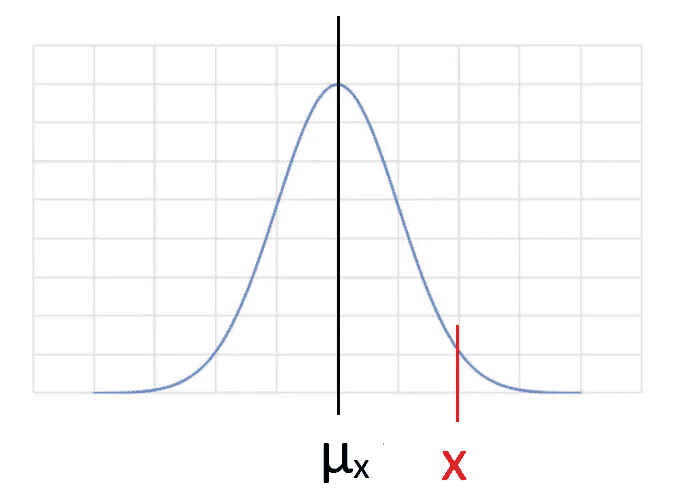
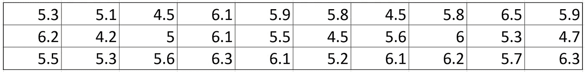
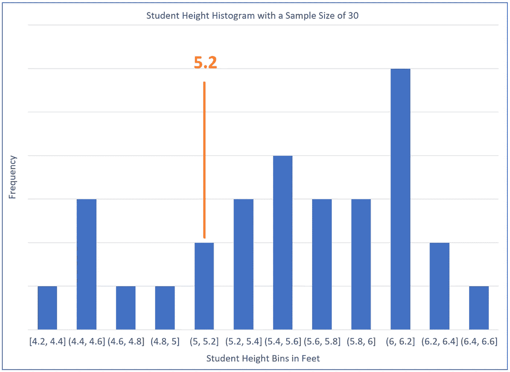
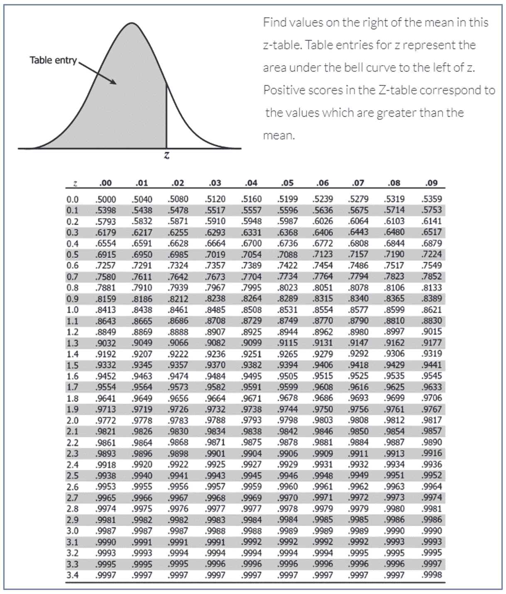
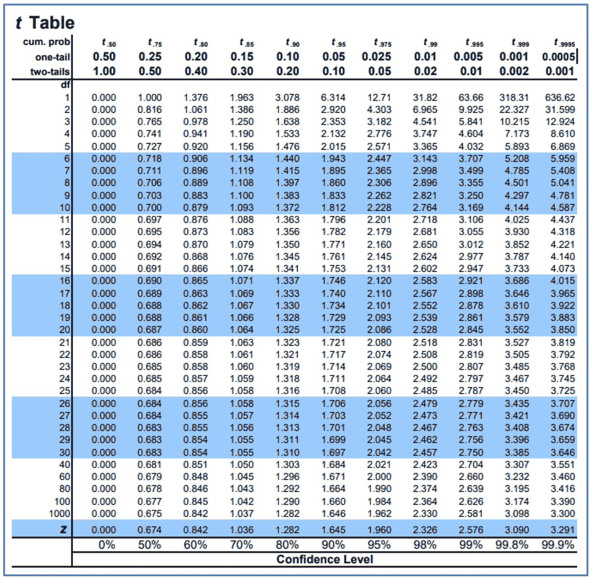

# 理解假设检验

> 原文：<https://towardsdatascience.com/understanding-hypothesis-testing-4919a21f4c82?source=collection_archive---------36----------------------->

## 从抽样分布到中心极限定理再到假设检验

来源: [Julius_silver](https://pixabay.com/users/julius_silver-4371822/) ，via [pixabay](https://pixabay.com/photos/polynesia-french-polynesia-tahiti-3021072/) (cc0)

在这篇博客中，我试图通过一系列的思考过程来理解假设检验。我先问一个问题:

单个样本的平均值如何揭示总体的真实平均值？ ”

这些思考过程包括:

1.任意指定一个值作为样本平均值的 **采样分布的平均值**，****

2.用总体的标准偏差表示抽样分布的标准误差，

3.使用从单个样本计算的**标准偏差来近似总体**的**标准偏差。**

我将向您介绍上面使用的所有术语和概念，并用一个示例来说明它们。最后，我将简单讨论一下我在假设检验的背景下学到了什么。尝试写这篇博客对我帮助很大，我希望它也能帮助你。

假设我们的第一个目标是计算出总体中某个参数的平均值。比如韦斯特伍德高中所有学生的平均身高。我们可能不想测量每个学生的身高，而是想随机选择一个样本，例如 30 个学生(样本大小为 30)，然后测量他们的身高并计算平均值。为了彻底起见，如果可能的话，我们可能想要重复随机抽样，比如说，20 次以上。请注意，这里允许再次随机选择一名学生。然后，我们可以绘制出我们计算的每个样本平均值的分布图，该图可能有点像图 1 所示。我们称这个图为“ ***抽样，样本的分布是指*** ”。

图 1:样本均值的抽样分布

在大多数情况下，我们会很偶然地得到一个样本，它的平均高度接近这个抽样分布在中心(= x)的平均值。在少数情况下，我们可能在这条曲线的尾部得到一个平均值(= x)。

L et 提个问题:“**如果我们从只取 30 个学生的一个样本开始，计算平均身高(假设是 x)，这个平均身高位于图 1 所示尾部位置的概率是多少？** 。此时，由于我们没有进行任何其他抽样，我们不知道图 1 中抽样分布(= x)的平均值。我们也不知道分布的 ***标准差*** (说是σx)，它代表分布有多宽(可以定义为从曲线中心到频率下降到某个固定值的位置的距离)。似乎我们知道的很少。但如果我们换一种方式问问题呢:“ ***如果我们任意给 x 赋一个确定的值，那么 x 位于图 1 所示尾部位置的概率是多少？*** ”。

让我们看看如何解决这个问题。通常我们用一个参数(说是 z)来描述 x 离 x 有多远，用σx 的单位数来表示，

其中 x 是我们收集的样本(样本大小为 30)的平均值(其值我们已经计算过了)，x 是我们任意赋值 的抽样分布 ***的平均值，σx 是我们希望能够以某种方式估计的分布的标准误差。***

有一个强大的等式(源于所谓的“ ***中心极限定理*** ”)将原始总体 的 ***标准差(= σ)与样本均值*** 的抽样分布的 ***标准差(σx)联系起来当我们一次只对原始总体的一小部分进行抽样(例如一次选取 30 名学生)并多次重复抽样(这样 a***

其中σ是我们原始总体(例如，Westwood 高中的全体学生)的标准差，n 是样本量(这里是 30)，σx 是我们要搞清楚的样本均值的抽样分布的标准差。

让我们更深入地看看这个等式。在一个极端的情况下，假设我们在抽样中只挑选了 1 名学生(样本量 n = 1)，那么平均身高将只是这名学生的身高，抽样分布将只是原始人口的一个试探性复制，因此在这种情况下，σx 将等于σ。在另一个极端的情况下，假设我们对学生群体中的所有*学生进行抽样，并计算平均值，那么每次我们都会得到相同的平均值，这就是总体的真实平均值。在这种情况下，分布变为单线，表明σx 接近零。*

*好的，但是我们仍然不知道σ的值是多少(而且 ***很可能我们永远也不会确切知道*** )，那么我们如何使用等式 2 来估计σx 呢？现在我们需要做一个信念的飞跃。我们仅有的数据是我们从人群中“随机”选择的 30 名学生的身高。现在我们假设我们使用随机过程收集的 30 个数据点最终会得到一个标准差(姑且称之为 S，仅使用这 30 个数据点计算得到)，即 ***近似于*** 整个总体的标准差(σ)。换句话说，由于这组 30 名学生的选择过程是随机的，这些学生身高的标准偏差将作为整个群体标准偏差的可接受估计。现在我们可以将上面的等式 1 改写为:*

**

*其中，我们将等式右侧的所有值(无论是我们从收集的样本中计算的值，如 x、S 和 n，还是 x 的 ***任意分配的*** 值)用于计算 z。*

*现在让我们来看一个真实的例子。我们在样本量 n = 30 的样本中收集的学生身高(以英尺为单位)列于下表 1 中，它们也绘制在图 2 的直方图中(我们稍后将讨论直方图中 5.2 英尺处的橙色线)。样本平均值(x)和标准偏差(S)可以分别计算为 5.56 英尺和 0.63 英尺。*

**

*表 1:样本大小为 30 的学生身高样本(英尺)*

**

*图 2:样本大小为 30 的学生身高样本的直方图*

*让我们回到我们提出的最后一个问题，稍微重新措辞一下，“如果我们将某个值指定为图 1 中采样分布的平均值(= x)，那么我们得到位于尾部位置(或更远离中心的位置，如图 1 所示)的 x 的概率是多少？”。让我们再换一种说法，如果 x 的值为 5.2 英尺(我们任意指定的值)，那么我们获得的样本看起来像我们收集的平均值为 5.56 英尺的样本(或者像任何其他具有更大平均值的潜在样本)的概率(机会)是多少？ 。*

*使用上面的等式 3，我们可以计算出 z 值为(5.56–5.2)/(0.63/sqrt(30))(= 3.15)，这意味着 5.56 英尺(= x)的样本平均值位于分布曲线的 0.114 英尺(= 0.63/sqrt(30))的*的 3.15 倍处远离该采样分布(x = 5.2 英尺)的平均值。**

**关于可能性部分呢？图 1 所示样本均值的抽样分布的本质是什么？ ***对于 30(或以上)的样本量，分布可以用正态(高斯)分布来表示。神奇的是，不管原始人口分布的形状如何，这都是真的。*** 正态分布的特征是众所周知的。例如，所有数据位于距中心正负 1 个标准偏差内的概率约为 68%，位于正负 2 和 3 个标准偏差内的概率分别约为 95%和 99.7%。概率的详细值可以在所谓的“Z 表”中找到，如表 2 所示。**

****

**表 2: Z 工作台(来自[http://www.z-table.com/](http://www.z-table.com/)**

**在我们的例子中，我们知道我们的 Z 值是 3.15，从 Z 表中我们可以找到相应的概率值 0.9992 (99.92%的几率)，这意味着有 99.92%的几率 Z 值小于 3.15 。换句话说，z 值为 3.15 或更大的 ***几率仅为 0.08%*** 。另一种说法是，假设 x 值为 5.2，那么我们的“p 值”为 0.0008。**

**让我们再看一下图 2。上面的陈述表明， ***如果我们确实有一个 5.2 英尺的抽样分布平均值(我们假设它非常接近总体的真实平均值)，那么我们收集这个平均值为 5.56 英尺的样本(样本大小为 30)的机会加上我们收集任何其他平均值大于 5.56 英尺的样本的机会只有 0.08%*** ，这是非常小的。也就是说，如果我们执行 1 万次采样，我们只会看到 8 次 5.56 英尺(或更大)的样本均值。所以，我们不太可能以我们收集的样本结束。换句话说，我们有 99.92%的信心不会以我们收集的样本结束。那么，我们任意选择的这个 5.2 英尺(= x)的抽样分布的平均值会不会有点偏差呢？大概如此。**

**我们注意到，我们任意选择的这个 5.2 英尺(= x)的采样分布的平均值可能是偏离的，并且，如果这个选择的 5.2 英尺的值是真实的，我们有 99.92%的信心，我们不会以我们收集的采样结束。是否拒绝这个 x 值取决于我们想要拥有的 ***置信度*** ，这由我们想要接受的所谓的 ***置信度*** 来定义。一个高标准是，如果数据提供了至少 99.87% (z > = 3)的概率，我们可以拒绝我们选择的 x。 ***如果我们接受 z = 3 的这个值(即 99.87%的置信水平)，我们可以拒绝 5.2 的 x，因为我们 99.92%的概率大于 99.87%的置信水平*** 。然而，如果我们决定选择一个更高的置信水平(比如 99.99%)，那么 x 的这个值(= 5.2)是不能被拒绝的，这意味着在 x 的任何假设被拒绝之前，我们希望非常、非常、非常有信心。现在让我们把这个放到所谓的 ***假设检验*** 的语境中。**

**S omebody 这样声明，“ ***西林高中学生群体平均身高不超过 5.2 英尺*** ”。我们选择勉强不满足上述语句要求的最小可能值，即= 5.2 英尺，并创建一个所谓的“*”为“H0: = 5.2 英尺”。如果我们的数据支持拒绝 H0，这表明任何低于 5.2 英尺也被拒绝。为了对抗零假设，我们创建另一个所谓的“ ***替代假设*** ”作为“ ***西林高中学生群体的平均身高大于 5.2 英尺。***”(《H1:>5.2 尺》)。在我们拒绝零假设之前，我们希望有 99.87% (z > = 3)的置信度。为了进行调查，我们收集了 30 名学生的样本并测量了他们的身高，结果如表 1 和图 2 所示。从前面几段的讨论中，我们可以得出这样的结论， ***仅基于这个样本*** ，我们就可以有把握地拒绝零假设，也就是说，我们至少有 99.87%的把握，西林高中学生群体(人口)的真实平均身高大于 5.2 英尺。***

**如果我们的样本量少于 30 个呢？我们可以按照与上面相同的步骤来计算 z 值，但这里我们只是将值称为“T 值”，并使用另一个名为 T 表(表 3)的表来找出概率。概率列在表的顶行，其对应的 t 值从第二列开始列出。第一列表示一个新参数，称为“自由度”(df)，等于样本大小减 1。例如，如果样本大小为 15，则 df 为 14。在这种情况下，样本均值的采样分布的形状作为自由度的函数而变化。从表 3 中可以看出，在这个所谓的“t 分布”中，自由度越小，尾部越重。**

****

**表 3: T 表(来自[https://www . sjsu . edu/faculty/gerst man/stat primer/T-table . pdf](https://www.sjsu.edu/faculty/gerstman/StatPrimer/t-table.pdf))**

**L et 再来重温一下本博客开头的第一个问题，**

**单个样本的平均值如何揭示总体的真实平均值？**

**似乎单个样本的均值和标准差可以为我们提供一定程度的信心，来判断我们是否可以安全地拒绝假设检验中总体真实均值的假设。**

**我希望你已经学到了一些有用的东西，或者找到了一些加强你自己信念的想法。请随意评论。**