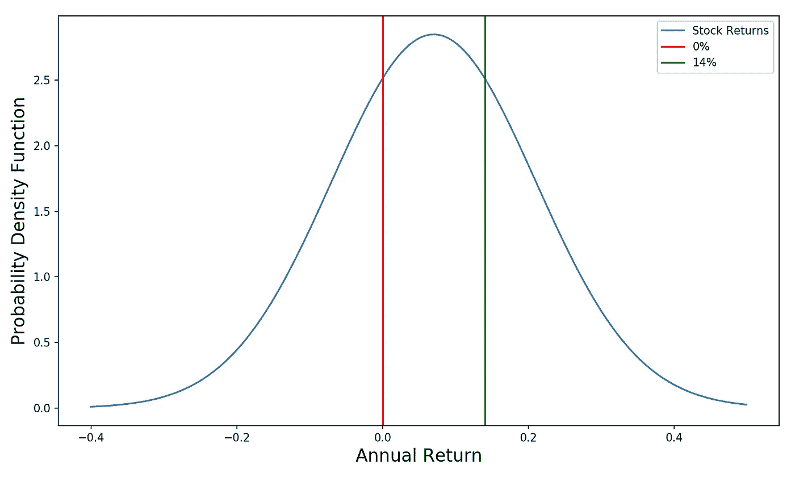

# 了解投资风险

> 原文：<https://towardsdatascience.com/understanding-investment-risk-3882c58e00e0?source=collection_archive---------18----------------------->

由 [Unsplash](https://unsplash.com?utm_source=medium&utm_medium=referral) 上的 [Shashank Sahay](https://unsplash.com/@shashanksahay?utm_source=medium&utm_medium=referral) 拍摄的照片

## 关于我们如何对投资风险建模以及这是否有意义的哲学探索

在金融中，风险和回报被认为是一枚硬币的两面——你不能缺一不可。回报相当简单。我们买一只股票，等一年，然后查看我们的经纪账户。它增值了，给了我们 10%的可观回报。不错！所以投资的回报，也就是我们赚的 10%，是我们可以直接观察到的。

风险呢？那就不那么明显了。对大多数人来说，投资的风险就是赔钱的可能性。但是事前，那真的很难估计。我们只能看到实际发生的事情。你的投资表现不佳(或表现更佳)的其他替代现实无法直接观察到。我们只看到导致我们获得 10%投资回报的一系列事件。相反，这意味着我们永远也不会知道为了赚取那 10%的利润，我们承担了多大的风险。

# 风险的驱动因素

投资风险有两个主要驱动因素:

1.  特定股票或债券的内在质量或缺乏质量。对一家公司的投资(这适用于股票和债券)是对该公司未来现金流的要求权。这篇文章让我们集中讨论股票。如果我们投资一家公司的股票，那么我们就是在赌这家公司会持续地赚越来越多的钱，让我们在这家公司的股份(购买一家公司的一些股份会让我们拥有这家公司很小一部分的所有权)变得越来越有价值。要做到这一点，该公司既需要继续经营，也需要扩大业务。像谷歌这样拥有强大品牌、资产负债表和商业模式的公司比像 WeWork 这样商业模式薄弱、管理糟糕的公司更有可能做到这一点。因此，如果基础业务的质量下降，那么在其他条件相同的情况下，这将增加投资的风险。
2.  **我们分析的不确定性，也就是出错的风险。当我们分析一家公司时，我们永远不能确定我们已经发现了一切，或者我们已经正确地分析和理解了一切。如果我们错误地将一个实际上脆弱的商业模式归类为强大，那么我们的投资业绩将受到影响。**

对一项投资进行评估既困难又耗时，更不用说数百甚至数千项投资的投资组合了。因此，在定量金融中，投资回报的标准差(通常被称为其波动性)通常被用作其风险的近似值。

***计算详情:*** *为了估计一项投资的风险(即波动性)，我们会收集几年的周收益数据(每次观察都是投资在指定周内的收益)并取其标准差。如果我们想按年计算，那么我们将把计算值乘以 52 的平方根。*

# 标准差作为风险的近似值

让我们首先思考为什么标准差可能被用作风险的近似值。在统计学中，我们对某事物估计的标准差越高，我们就越不确定它的真实价值。

看看下面的两条钟形曲线。它们有不同的标准差，在图上显示为不同的分布宽度。当分布很窄时，这意味着真实值位于一个很小的范围内——或者换句话说，我们非常确定值是多少。当分布很宽时，我们很不确定值是多少，必须考虑它可能等于任意数量的值的可能性。

钟形曲线比较

所以在统计学中，大的标准差等同于高的不确定性。但这真的有风险吗？让我们用一个例子来更深入地考察这一点。假设我们认为股票投资组合的预期年回报率为 7%，标准差为 14%。

这意味着，虽然我们预计股票回报通常为正，但也有很大的可能最终为负(根据我们的统计假设，有 30%的可能性是准确的)。因此，在其他条件不变的情况下，一项投资的标准差越高，其回报最终可能为负的可能性就越大。但是波动是对称的——虽然有 30%的机会经历负回报，但也有 30%的机会获得 14%或更高的回报:

波动对称地起作用

此外，不要忘记任何正态分布的随机变量都有两个关键属性——均值和标准差([关于正态分布的复习，请查看我之前的博客](/understanding-the-normal-distribution-with-python-e70bb855b027))。在这种情况下，平均值是我们投资的预期回报率(7%)。在金融领域，我们在计算投资风险时通常会忽略均值，而只关注标准差。如果我们退一步想想，这似乎违背了直觉。看看下面两个描述两种不同投资的风险和回报的直方图？哪个看起来风险更大？

投资 A 与 B

金融理论会告诉我们，投资 B 的风险更大，因为它的分布更广(标准差更高)。但它也有更高的回报，所以每年经历负回报的机会低于投资 A。所以就尽量不亏损而言，投资 B 其实是更安全(风险更小)的选择。**关键是，如果投资的预期回报足够高，即使是非常高的标准差(相对于其他投资)也不是什么大不了的事情**——尽管你最好再三检查你是如何估计预期回报的。因此，如果我们将风险视为赔钱的概率，那么相对于其标准差而言预期回报较低(且产生负回报的概率较高)的投资才是真正有风险的投资。**因此，看起来一项投资的预期回报从根本上与该项投资的风险息息相关。**

> 也就是说，在计算风险时，我们需要同时考虑均值和标准差。

那么，金融业是如何忽略一项投资的预期回报，只使用其标准差来估计风险的呢？

# 有效市场

这是因为模型假设市场通常是有效的。这意味着金融市场作为一个整体(所有投资者的总和)被认为在资产定价方面做得很好。

在其他条件相同的情况下，你为一项投资付出的价格决定了它的回报。如果你花 200 万美元买一家麦当劳餐厅，你可能会获得可观的回报(在很长一段时间内)。如果你能以 100 万美元买下同一家餐厅，你将获得更高的回报。如果你被骗了 400 万美元，你可能永远也赚不回你的初始投资。

因此，如果市场在吸收信息和评估风险方面做得很好，那么可以得出结论，它们在投资定价方面也做得很好。如果他们正确地为投资定价，那就意味着资本市场也正确地评估了预期回报。

现在让我们想想这意味着什么。在一个市场正确分配价格(和回报)的理想世界中，这些价格将如何设定？价格会根据投资者最关心的因素而变化。金融理论假设所有重要因素都是风险——投资风险越大，价格越低(相对于其产生的现金流而言),预期回报越高。**也就是说，假设风险和收益之间存在大致线性的关系:**

随着风险的增加，投资者被认为会要求更高的预期回报作为补偿

如果你仔细想想，这是一个非常简化的捷径。通过假设市场是有效的，我们不再需要担心如何计算预期回报——相反，我们依赖于一个基本信念，即投资的风险决定其价格，从而决定其回报。或者换句话说，预期收益被认为是波动率的一个明确定义的函数，而不是别的。如果我们假设波动性决定回报，那么在分析投资风险时，我们现在可以安全地忽略预期回报部分。

所以有效市场会告诉我们投资 B 是不可能的。要么我们计算的回报率太高，要么标准差太低。与投资 A(以及世界上的其他投资)相比，投资 B 的风险和收益特征“与现实脱节”(违背了功能)，因此是不可能的。毕竟，正如市场效率的信奉者喜欢说的那样，“没有免费的午餐”。

# 但是有意义吗？

有效市场的前提是强大的。相信市场效率基本上是相信群众的智慧。数以百万计的专业人士已经花了无数个小时研究这些数据——所以你认为你对一只股票可能有的任何洞察力实际上都不是洞察力，而是已经被纳入股票价格的信息。此外，只要存在意见的多样性，市场的单个成分所犯的错误就会多样化([类似于随机森林](/understanding-random-forest-58381e0602d2))，整体将产生平均正确的输出。

从高层次来看，这听起来确实有道理，但这里有一些反驳意见，或许可以解释为什么市场可能不总是最好的价格制定者:

1.  人群的疯狂也适用。当意见多样化时，错误也会多样化。但是，如果没有多样性，每个人或多或少都相信同样的事情，错误就会扩大。比特币这样的投资泡沫就是这样产生的。
2.  不是所有的投资都存在于一个有足够多的买家和卖家(或数据)来有效定价的市场中。比如，我会把初创公司股权市场描述为极度缺乏流动性、不透明和低效的(任何不幸在 2018 年或 2019 年获得 WeWork 股票报酬的人可能都不认为他们的执行价格是有效的)。就观点和意见而言，它也是一个极度缺乏多样性的国家。
3.  在繁荣时期，市场往往会逐渐上涨(伴随着波动性的逐渐下降)。因此，随着对上次崩盘的记忆逐渐消失，经济扩张成为我们样本中相对较大的一部分，我们的模型将开始低估风险。虽然你可能会说我们更关心相对风险(一项投资的波动性与另一项投资或整体市场的波动性相比如何)，但金融业确实使用绝对波动性和从绝对波动性得出的指标来进行风险预算(即计算出多少钱用于风险较高的投资，多少钱作为无风险现金)。因此，随着波动性下降(通过向股票等风险更高的投资增加资金)和下一次衰退的逼近，投资经理承担越来越多的风险是有危险的。
4.  市场崩盘发生得非常快，通常以周计，如果不是几天的话。崩盘的巨大负回报通常会导致波动性飙升，触发各地的风险警报。突然之间，各地的投资经理都认为他们的投资组合风险极大(因为投资的波动性和投资之间的相关性增加了如此之多)，并疯狂地尽快抛售高风险投资。
5.  相关性上升对投资组合总风险的影响可能是巨大的。那些在繁荣时期被证明分散投资于你的美国股票的泰国股票，在市场崩盘时，几乎肯定会和你所有的其他股票投资一起下跌。在危机中，相关性达到 1。

注意到我在第 3 和第 4 条中描述的行为有些奇怪吗？这是典型的高买低卖。回想起来，那不是非常理性或有利可图的行为。但这是恐惧和波动等于风险的信念的副产品。发生这种情况的另一个原因是，随着经理们争先恐后地向上修正他们的风险估计，他们保持他们的预期回报估计不变。这使得一般的风险投资看起来不那么有吸引力，因为它突然有了更高的波动性，但仍然有相同的预期回报。

实际上，有一种更明智的方式来处理事情，不需要我们打破波动性和风险之间的联系(并抛弃所有简化的好处)。波动性是一个动态值，随着投资价格的波动而不断变化。

我们应该像看待保险报价一样看待波动性，而不是将波动性视为对资产风险的公正而准确的估计。比如说，飓风保险的价格主要取决于两个因素——对灾难风险的感知(这影响到希望购买保险的人数，也就是需求)和愿意承保的公司数量(供应)。同样，在任何时间点，**投资的波动性是两个因素的函数——投资的感知风险和愿意承担风险的人数。**

飓风过后，每个人都意识到风暴的破坏力有多大，因此对保险的需求非常高。与此同时，在阳光明媚的时期以过低的保费签订了过多合同的保险公司正在遭受打击，因此保险供应非常低。如果你能够在这个时候介入提供保险，你可能会获得巨大的财务回报，因为你可以赚取极高的保费。

在金融领域也是如此。当一项投资的波动性发生变化时，这是因为投资的感知风险随着愿意承担该风险的投资者数量的变化而变化。在繁荣时期，强劲的增长和利润降低了股票等投资的风险，强劲的回报让越来越多的投资者愿意持有股票。所有这些的净效应是，只要好日子还在，波动性就会持续下降。但就像保险一样，如果没有人关心股票的风险，每个人都愿意持有股票，那就意味着股票价格异常高，而他们在中短期内的预期回报将异常低。当市场崩溃、公司利润锐减时，情况就会相反。现在，股票将被视为风险极高，同时有意愿持有股票的人急剧减少(由于恐惧、失业等原因)。)—使得预期股票收益畸高。

如果我们真的相信风险和回报之间存在联系，那么随着波动性下降，我们应该同时降低对预期回报的估计。这种预期回报的降低将抵消波动性的降低，并抵消购买更多股票的冲动(它甚至可能使我们想要减少我们的股票持有量)。当波动性飙升时，我们应该向上修正我们对预期回报的估计，这将消除我们低价卖出的冲动，甚至可能促使我们低价买入。

# 结论

投资风险是一个极其复杂的话题，也是一个经常争论的话题。在这篇文章中，我尽我所能给你一个 10，000 英尺的视角来看事物是如何工作的。我不同意投资风险理论的某些部分，但总的来说，它是一个非常有用的工具，涉及现代金融的许多方面。但是就像我们决定开始使用的任何其他工具一样，我们应该首先了解它的局限性。我希望这有所帮助。干杯！