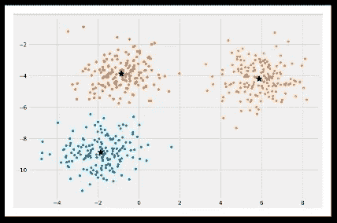

# 了解 K-Means、K-Means++和 K-Medoids 聚类算法

> 原文：<https://towardsdatascience.com/understanding-k-means-k-means-and-k-medoids-clustering-algorithms-ad9c9fbf47ca?source=collection_archive---------1----------------------->

## K-means、K-means++和 K-Medoids 聚类算法及其关系概述。本文还包括它的从头开始的实现和使用 sklearn 库。


卢卡斯·布拉塞克在 [Unsplash](https://unsplash.com?utm_source=medium&utm_medium=referral) 上的照片

聚类是一种无监督的机器学习技术，它将群体或数据点分成几个组或聚类，使得相同组中的数据点与相同组中的其他数据点更相似，而与其他组中的数据点不相似。

*   同一簇中的点彼此更接近。
*   不同簇中的点相距很远。


[来源](https://medium.com/@Experfy/k-means-clustering-in-text-data-669358b54081)，样本数据点，(图 1)

在上面的二维数据集样本中，可以看到数据集形成了 3 个相距很远的聚类，并且同一聚类中的点彼此靠近。

## 聚类的衡量标准是什么？

如果聚类具有最大的簇间距离和最小的簇内距离，则被认为是最佳的。

```
***Notes to avoid any confusion:*****Intracluster distance:** Distance between two point in the same cluster.
**Intercluster distance:** Distance between two points in the different clusters.
```


(图片由作者提供)、簇内和簇间距离(图片 2)

上图(图 2)描述了什么是簇间和簇内距离。

可以使用各种评估度量来测量形成的集群的有效性。

> **邓恩指数:**


上述函数的*分子*测量属于两个不同聚类的每两个点(x_i，x_j)之间的最大距离。这代表*星团内距离*。

上述函数的*分母*测量属于同一聚类的每两个点(y_i，y_j)之间的最大距离。这代表*集群间距离*。

具有邓恩指数最大值的聚类被认为是最好的。

> **剪影分析:**


这用于确定聚类之间的分离程度。对于每个样本。 **a_i** 表示同一个聚类中所有数据点的平均距离。 **b_i** 代表离最近聚类中所有数据点的平均距离。

SA 的系数可以取区间[-1，1]内的值。

*   SA = 0:样本非常接近相邻的聚类。
*   SA = 1:样本远离相邻聚类。
*   SA = -1:样本被分配到错误的聚类。

因此，我们希望系数尽可能大，并且接近 1。

有不同类型的聚类技术，我们将讨论其中的一种。

# k 均值聚类:

K-Means 算法是一种基于质心的聚类技术。该技术将数据集聚类成 k 个具有几乎相等数量的点的不同聚类。每个聚类是用一个质心点来表示的 k-means 聚类算法。

> **什么是质心点？**

形心点是代表其群集的点。形心点是集合中所有点的平均值，将在每一步中发生变化，计算方法如下:


```
For the above equation,
C_i: i'th Centroid
S_i: All points belonging to set_i with centroid as C_i
x_j: j'th point from the set
||S_i||: number of points in set_i
```

K-Means 算法的思想是找到 K 个质心点，并且数据集中的每个点将属于具有最小欧几里德距离的 K 个集合中的任一个。


图 3

根据上图(图 3)，点 x_i 到所有三个质心的距离为 d1、d2、d3，点 x_i 距离质心 _3 最近，距离为 d3，因此点 x_i 将属于质心 _3 的聚类，并且该过程将对数据集中的所有点继续进行。

## K 均值的成本函数:


K-Means 算法的思想是找到 K 个质心点(C1，C1，.。。C_k)通过最小化每个聚类上该点与其质心之间距离的平方和。

这个代价是 NP 难的，并且具有指数级的时间复杂度。所以我们使用劳埃德算法的近似思想。

## 劳埃德算法:

劳埃德算法是一种用于聚类点的近似迭代算法。该算法的步骤如下:

1.  初始化
2.  分配
3.  更新质心
4.  重复步骤 2 和 3，直到收敛。

> **K 均值算法的迭代实现:**

**步骤#1:初始化:**

初始 k 形心是从数据集中随机选取的(第 27-28 行)。

**步骤#2:分配:**

对于数据集中的每个点，找出该点和所有质心之间的欧几里德距离(第 33 行)。该点将被分配给质心最近的聚类。

**步骤#3:质心的更新:**

用新的平均值更新质心的值(第 39–40 行)。

**步骤#4:重复:**

除非达到收敛，否则重复步骤 2 和 3。如果实现了收敛，则中断循环(第 43 行)。收敛是指质心的先前值等于更新值的情况。

## 结果:

初始数据集的绘图(图 4)


数据集的图(图 4)

k=2 的聚类结果图(图 5)


k=2 时的聚类图(图 5)

k=3 的聚类结果图(图 6)



k=3 时的聚类图(图 6)

# K-Means++聚类:

在使用劳埃德 K 均值聚类算法寻找初始质心的情况下，我们使用了随机化。初始的 k 形心是从数据点中随机选取的。

这种选取 k-质心点的随机化导致了初始化敏感性的问题。这个问题倾向于影响最终形成的簇。最终形成的聚类取决于初始质心是如何选取的。

以下是一些聚类的结果，其中质心的初始化是不同的:


通过不同的初始化形成不同的最终聚类(图 7)

在上图(图 7)中，最终形成的簇是不同的，因为最终形成的簇依赖于质心的初始化。在上面图像的第一部分，可以观察到质心(黑色*)和星团没有正确形成。在上面图像的第二部分，可以观察到质心(黑色*)和星团的形成。

有两种方法可以避免初始化敏感性的问题:

1.  **重复 K-means:** 多次重复算法和质心初始化，选择簇内距离小、簇间距离大的聚类方法。
2.  **K-Means++:** K-Means++是一种智能质心初始化技术。

以上两种方法可以用来避免初始化敏感性的问题，但在这两种方法中，K-Means++是最好的方法。

> **K-Means ++是如何工作的？**

K-Means++是一种智能质心初始化技术，算法的其余部分与 K-Means 相同。质心初始化的步骤如下:

*   随机选取第一个质心点(C1)。
*   计算数据集中所有点与所选质心的距离。x_i 点到最远质心的距离可以通过下式计算


```
d_i: Distance of x_i point from the farthest centroid
m: number of centroids already picked
```

*   将点 x_i 作为新的质心，它具有与 d_i 成比例的最大概率。
*   重复上述两个步骤，直到你找到 k 形心。

> **使用 sklearn 实现 K-means++:**

上面我们已经从头开始讨论了 K-Means 的迭代方法，为了实现 K-Means++算法，我们将使用 sklearn 库。

**实施和结果演练:**

*   加载或创建数据集(第 8 行)
*   为数据集实现 k-means++算法(第 9 行)
*   绘制原始数据集以观察数据集(第 25–26 行)。


数据点图(图 8)

*   找到 k 形心点
*   绘制聚类结果(圆形)和 k 形心(红色*)(第 29-32 行)。


聚类结果图(图 9)

# K-Medoids 聚类:

K-Means 和 K-Means++聚类的一个问题是最终的质心是不可解释的，或者换句话说，质心不是实际的点，而是该聚类中存在的点的平均值。这是不像数据集中真实点的 3-质心坐标。


K-Medoids 聚类的思想是将最终的质心作为实际的数据点。这个结果使形心可以解释。

K-Medoids 聚类的算法被称为 Medoids 周围划分(PAM ),它与 Lloyd's 算法几乎相同，只是在更新步骤上略有变化。

PAM 算法要遵循的步骤:

*   **初始化:**与 K-Means++相同
*   **赋值:**同 K 均值赋值
*   **更新质心:**在 K 均值的情况下，我们正在计算聚类中所有点的均值。但是对于 PAM 算法，质心的更新是不同的。如果在一个群集中有 m 个点，则用该群集中的所有其他(m-1)个点交换先前的质心，并将该点最终确定为具有最小损失的新质心。最小损失通过以下成本函数计算:


*   **重复:**与 K 均值相同

# 如何挑选 K 的最佳值？

K 的最佳值可以使用*弯头法计算。K-Means、K-Means 和 K-Medoids 技术的成本函数是最小化簇间距离和最大化簇内距离。这可以通过最小化上面文章中讨论的损失函数来实现:*


为了确定正确的“K ”,在损失和 K 之间画一个图。


损耗与 K 的关系图(图 10)

对于上述曲线，可以观察到随着“k”值的增加，损耗减少。为了找到绘制 k-聚类的最佳 k 值，我们可以选择 k=3。

> 感谢您的阅读！