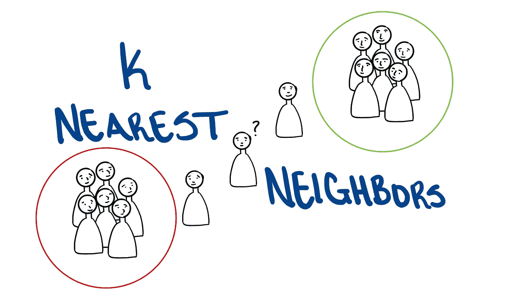
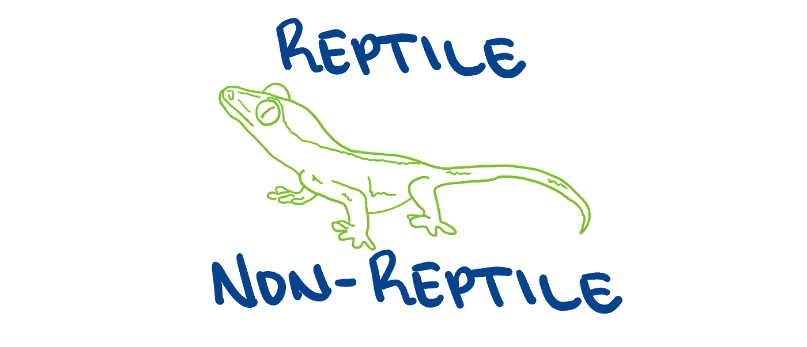
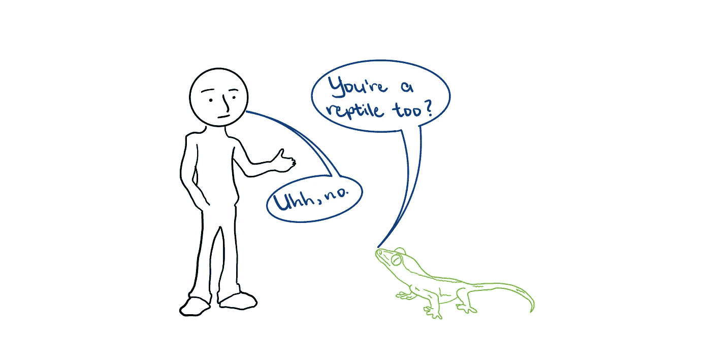
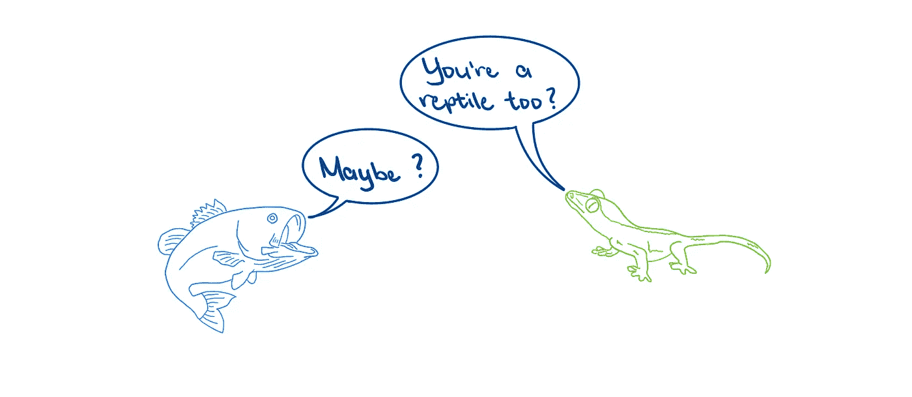
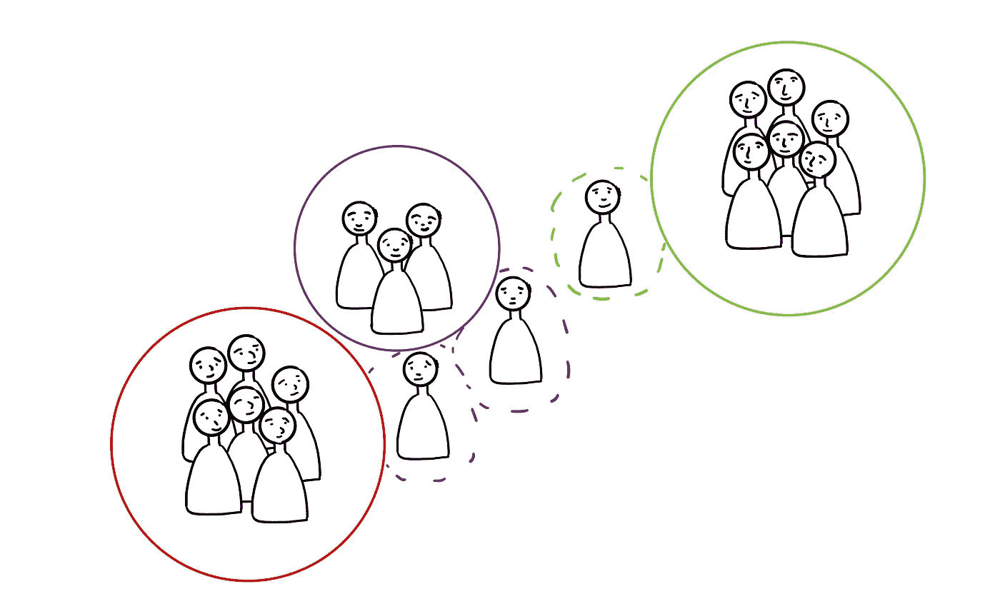

# 了解 K-最近邻

> 原文：<https://towardsdatascience.com/understanding-k-nearest-neighbors-b249969d5265?source=collection_archive---------28----------------------->

## kNN 的分解及其工作原理！

图片作者:特里斯特·约瑟夫

机器学习(ML)算法通常分为**监督的**或**非监督的**，这广义上指的是正在使用的数据集是否被标记。监督 ML 算法通过使用带标签的例子来预测未来的结果，将过去学到的知识应用到新数据中。本质上，对于这些类型的问题，正确的答案是已知的，并且基于预测的输出是否正确来判断估计模型的性能。

相比之下，无监督 ML 算法指的是当用于训练模型的信息既没有被分类也没有被标记时开发的算法。这些算法试图通过提取样本中的特征和模式来理解数据。

当给定的任务是分类或回归问题时，监督学习是有用的。分类问题指的是根据模型开发的特定标准将观察结果或输入数据分组到离散的“类”中。一个典型的例子是预测一张给定的图片是否显示一只猫。该模型将在包含猫图片和非猫图片的数据集上开发和训练，其中每个观察都被适当地标记。

图片作者:特里斯特·约瑟夫

虽然监督学习对于分类和回归问题都是合适的方法，但是这两者是非常不同的。回归问题是指接受一组输入数据并确定一个连续量作为输出的过程。也就是说，回归问题的目标是在给定一个输入向量的情况下预测一个特定的数字。而另一方面，分类问题预测与输入向量相关联的离散值(或标签)。

通常，分类算法基于相似性将观察结果分组在一起。例如，假设我们想将爬行动物和非爬行动物进行分组。人们可能会发现，有鳞、产卵、有毒的动物更可能是爬行动物，而不是非爬行动物。因此，如果将具有这些特征的新观察结果添加到数据集，相似性分析将发现该观察结果与爬行动物的关系比与非爬行动物的关系更密切，并且该观察结果将被归类为爬行动物。

图片作者:特里斯特·约瑟夫

要进行的一种常见的相似性分析是距离矩阵的分析。这表明，就它们的共同点而言，观测结果彼此之间相距有多远。观测值之间的距离越小，它们之间的相似性就越大，被组合在一起的可能性就越大。确定距离有多种方法，但一种相对简单的方法是 **Jaccard 指数**。

该指数也称为 Jaccard 相似系数，它比较两个组的成员，以查看哪些成员是相同的，哪些是不同的。相似性的度量范围从 0%到 100%，百分比越高表示相似性越大。回到爬行动物与非爬行动物的例子，假设相关特征是鳞片、有毒、产卵、有胡须和有血。如果我们把一条蝰蛇和一个人相比，他们可能只有 1/5 的共同点，相似度为 20%。因此，不应将它们归为一类。

图片作者:特里斯特·约瑟夫

这个例子是最简单的分类方法之一，它被称为**最近邻**。该算法的“学习部分”相当简单，因为该算法所要做的就是记住训练数据。然后，当一个新的观察值需要分类时，算法就会转到训练数据，看这个新的观察值与之前的哪个观察值最相似，然后预测它为那个组。

从表面上看，这种最近邻方法似乎很壮观，因为很可能彼此最相似的观测值应该被分组在一起。从上面的例子中我们看到，蝰蛇和人类没有太多的共同点，所以它们被归为爬行动物的可能性很小。但是回想一下，我们的任务是预测爬行动物和非爬行动物。鱼应该归入非爬行动物类，但也有有毒的鱼，有鳞，会产卵。基于相似性分析(以及前面给出的变量)，鱼将被归类为回复。

因此，最近邻方法的问题是它对噪声数据非常敏感，可能导致不正确的分类。

图片作者:特里斯特·约瑟夫

通常解决这一问题的办法是修改最近邻法； **k** **最近邻(kNN)** 。这里的想法是，我们不只是取最近的邻居，而是取一些最近的邻居(通常是奇数)，并让他们“投票”预测分类应该是什么。

那么现在问题来了，我们如何选择合适的 k 呢？嗯，有三件主要的事情需要考虑。第一，随着 k 变大，算法运行的时间越长，因为它必须进行更多的比较。当训练集包含更多观察值时，情况也是如此。第二，如果 k 太小，那么邻居可能没有办法“投票”选出一个获胜者。因此，k 必须足够大。最后一点是，如果 k 太大，就会有被班级规模所左右的风险。也就是说，假设在我们的集合中有许多种类的爬行动物，并且爬行动物的数量超过了非爬行动物。鉴于 k 非常大，一个新的观察结果可能会被归类为爬行动物。

因此，选择适当 k 的最可靠方法是**交叉验证**。这是一种用于评估模型拟合度的技术，通过在样本数据集的不同子集上训练几个模型，然后在训练集的互补子集上评估它们。

图片作者:特里斯特·约瑟夫

kNN 的优点是学习速度非常快，它不涉及太多的数学，并且非常容易解释过程或算法得出的结果。然而，缺点是它非常占用内存，并且由于进行了大量的比较，产生预测需要很长时间(随着数据集变大)。

**参考资料和其他有用的材料:**

[OCW . MIT . edu/courses/Sloan-school-of-management/15-097-prediction-machine-learning-and-statistics-spring-2012/讲稿/MIT15_097S12_lec06.pdf](https://ocw.mit.edu/courses/sloan-school-of-management/15-097-prediction-machine-learning-and-statistics-spring-2012/lecture-notes/MIT15_097S12_lec06.pdf)

OCW . MIT . edu/courses/electrical-engineering-and-computer-science/6-034-artificial-intelligence-fall-2010/tutorials/MIT 6 _ 034 F10 _ tutor 03 . pdf

[jmlr.org/papers/volume10/weinberger09a/weinberger09a.pdf](https://jmlr.org/papers/volume10/weinberger09a/weinberger09a.pdf)

[geeks forgeeks . org/find-the-JAC card-index-and-JAC card-distance-between-the-two-given-sets/](https://www.geeksforgeeks.org/find-the-jaccard-index-and-jaccard-distance-between-the-two-given-sets/)

[towards data science . com/machine-learning-basics-with-k-nearest-neighbors-algorithm-6a6e 71d 01761](/machine-learning-basics-with-the-k-nearest-neighbors-algorithm-6a6e71d01761)

[analyticsvidhya . com/blog/2018/03/简介-k-邻居-算法-聚类/](https://www.analyticsvidhya.com/blog/2018/03/introduction-k-neighbours-algorithm-clustering/)

[sci kit-learn . org/stable/modules/generated/sk learn . neighbors . kneighborsclassifier . html](https://scikit-learn.org/stable/modules/generated/sklearn.neighbors.KNeighborsClassifier.html)