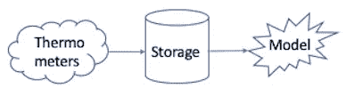
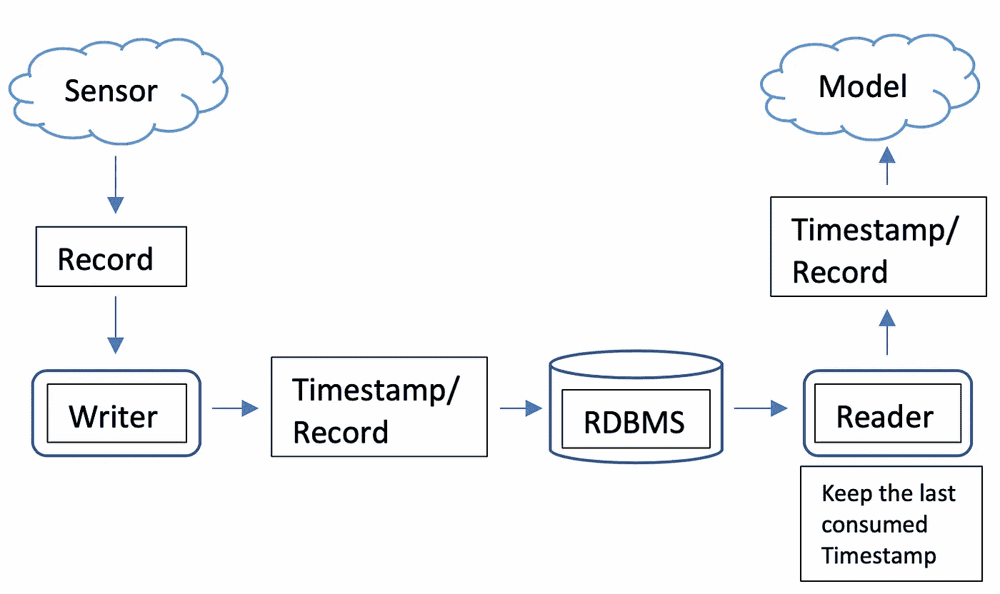
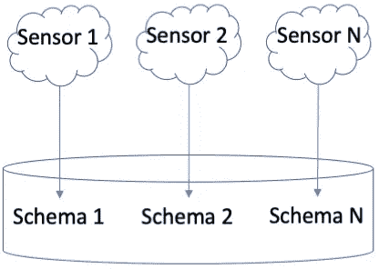
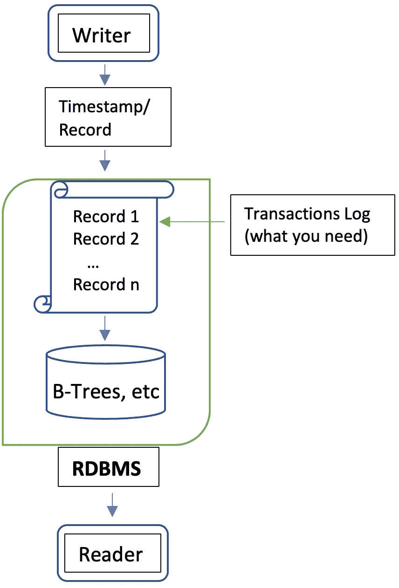
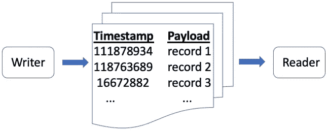
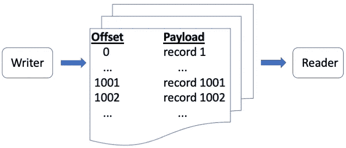
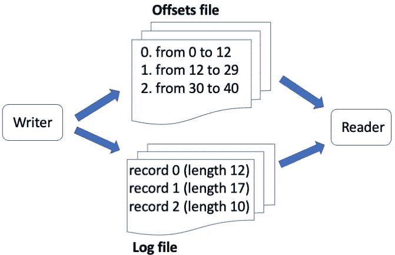
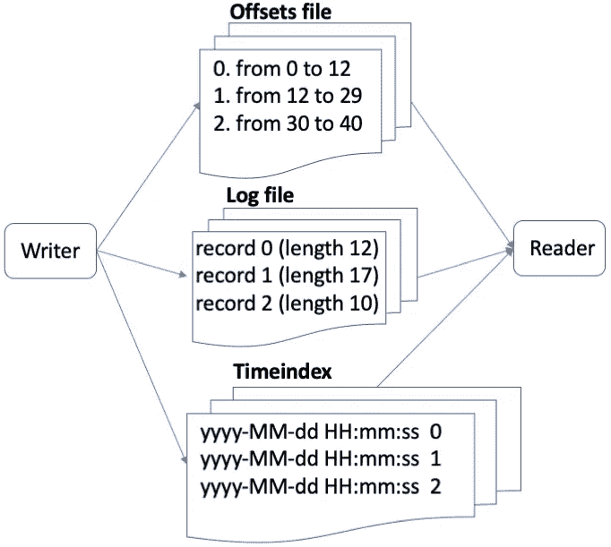
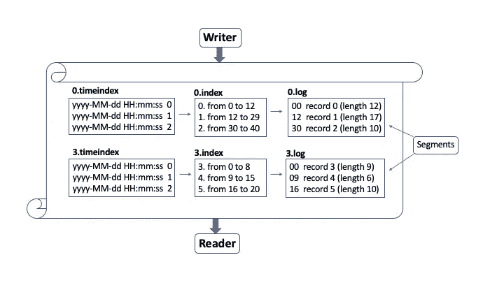

# 理解卡夫卡，就像是你设计的一样——第一部分

> 原文：<https://towardsdatascience.com/understanding-kafka-as-if-you-had-designed-it-part-1-3f9316cb8fd8?source=collection_archive---------15----------------------->

## 由内向外理解阿帕奇·卡夫卡

阿帕奇卡夫卡已经成为 IT 驱动的企业的支柱。从实时消息传递到长期存储，它在处理大数据的所有“3v”环境中几乎无处不在，即*容量、多样性*和*速度*。

作者图片

尽管它的 API 很容易理解和使用，但是它的内部结构并不简单。和往常一样，你不需要了解引擎就能成为一名优秀的飞行员，然而，更深入的研究可以区分优秀和优秀。

这是解释卡夫卡背后的构建模块的两部分系列的第一部分。这一部分将关注其主要动机，以及每个代理如何在内部存储和管理数据。第二部分将关注可伸缩性和持久性的元素。

我们将从两个非常好且雄心勃勃的朋友的角度来进行我们的探索。

## **创业驱动**

你的一个好朋友开始在市气象部门工作。和任何新加入者一样，他充满热情和动力去完成事情。

他有一个新的实时天气预报方法的想法，但意识到遍布城市的温度计数量远远不够。他去和他的上司谈了谈，他的上司告诉他——尽管他对这个问题并不了解——并不是缺少设备，而是不可能实时处理这么多数据。但他了解你，对你来说，技术上的不可能性只不过是一个机会。

要求很简单:每两秒钟从温度计接收一次数据，然后 *1)存储这些数据以供进一步研究*，然后 *2)将它们发送到他伟大的新模型*。

你的需求草图

## **第一次尝试**

一切都很清楚。您只需要一个单一的过程来接收测量值，存储它们，然后发送给模型。然而，由于您非常熟悉*单一责任*和*接口分离*等概念，您决定将系统解耦为两个部分: **1)** *一个从温度计接收测量值、附加时间戳并存储它们的过程*，以及 **2)** *一个每两秒钟查询一次数据库的过程，将消耗的最后一个时间戳作为偏移量传递，并将结果发送到您朋友的模型。你的问题太简单了，最难的是选择使用哪种开源 RDBMS。*

在选择了您喜欢的 RDBMS 之后，您通过创建两个类开始了这个项目，一个接收测量值并存储它们，另一个读取存储的测量值并将它们发送到模型。尽管两者都将从某个地方读取和写入，但是您决定从存储解决方案的角度来命名它们，因此接收度量值并将它们写入 RDBMS 的类被命名为 **Writer** ，而*读取度量值并将它们发送到模型的类被命名为 **Reader** 。*

您还创建了一个名为 *Measurement* 的类来保存您正在处理的数据。然而，由于您喜欢习惯性的，您决定遵循通常与 RDBMS 条目相关的命名，即**记录**。这样你也可以让你的设计更加通用。

没费多大力气，您的第一个解决方案就准备好了:一个将**记录**写入您的存储解决方案的**写入器**和一个从那里进行消费的**读取器**。

你的第一次尝试

## **庆典和天亮后**

一个星期后，你带着完全可操作的解决方案回来找你的朋友。你按下回车键，他的模型开始每两秒钟左右记录一次。他请你喝啤酒，他请客。在庆祝期间，他承认他的模型做得比预期的好，也许它能够每 1 秒钟处理一次传入的记录(他也认为*记录*是个好名字)。

这并没有让你感到惊讶，因为你已经习惯了需求的变化。但这次已经解决了。你所要做的就是将配置从 2 秒钟改为 1 秒钟，这样就完成了。

第二天早上，你只需将计时器从 2 秒钟改为 1 秒钟，它就能持续工作，他的模型也是如此。他花了一天时间对它进行更多的调整，到一天结束时，它变得疯狂，能够以流的方式每秒处理数百万条记录，即记录不再需要每隔 X 秒发送一次，而是从温度计接收到记录后立即发送。

为了满足这个新的请求，您考虑过用*合并写进程和读进程，这样写进程就可以存储记录并在*之后发送消息。但是您考虑到了在失败或过载的情况下应用重试和反压会有多麻烦。*然后，您考虑在两个进程*之间创建某种并行通信，这样写者可以存储记录并通过单独的队列将其发送给读者，这样读者就不需要为了获得基于时间戳的记录而查询 RDBMS。但这意味着您的解决方案会更加复杂。*所以你只是从阅读器进程*中移除了计时器。通过这种方式，它查询 RDBMS，获得最新插入的记录，并将它们作为一个批处理发送出去。由于您选择的存储解决方案的吞吐量相当不错，因此它是可行的。

## **碰壁**

几天后，你的朋友打电话给你。这个解决方案——以及他的名声——迅速走红，让人们如此感兴趣，以至于他们现在正在订购一种新型温度计，这种温度计能够采集更多的数据。你非常高兴你的解决方案为你朋友的梦想提供了动力，以至于你没有立即注意到这个问题。相反，你得到了一个新温度计的样品，并让它发送一些测试数据，只是为了看看你的解决方案，第一次，失败了。

经过一些调试后，您找到了问题的根源: ***新温度计使用的模式与*** 不同。你感到一阵颤抖。如果每个温度计都有不同的模式会怎样？如果是这样的话，从可维护性的角度来看，您的解决方案将注定失败。你应该为每一种新的温度计添加一个新的表格吗？你打电话给你的朋友，他证实了这一点。他还问是不是主要问题，你否认了。这不是问题，只是一个机会。

问题:每个新传感器都需要新的模式

## **更深的潜水**

你发现自己处于以下情况:

1.您有两个进程，写进程和读进程，它们从给定的存储解决方案中存储和检索数据

2.您的存储解决方案需要预先知道模式，以便在编写时应用该模式

3.您不需要任何特殊的处理来写入记录，只需要按原样存储它们

4.您不需要任何特殊的查询或过滤功能，只需要能够按照记录到达的顺序检索每条记录

5.您只需要在检索记录时，即在读取记录时，知道模式

在对当前事态进行了大量思考之后，您记得曾经考虑过实现某种队列，以便将记录从作者直接传递给读者。如果该队列以某种方式通过一个字段(时间戳)持久化并可搜索，您将接近满意的解决方案，因为您可以 **1)** *保留您已经拥有的流程*， **2)** *将记录存储为二进制对象，这样它们的模式在写入时就无关紧要了*， **3)** *检索在给定时间戳*之后存储的所有记录， **4)** *在分派之前应用模式*

这听起来很有希望，但从某种意义上来说，你是在提出一种新的存储解决方案，这也应该带来可伸缩性、弹性、容错等方面的需求。那将是很大的工作量，你的朋友也会同意。

## **政治家**

第二天早上，你邀请你的朋友去喝啤酒(这次你请客)。在信息中，你提到一个革命性的想法打动了你，你必须分享它。

目前的情况

“你知道，在数据库领域，关于如何将模式应用于记录有两种想法:在写入期间和在读取期间。我称它们为 ***写模式*** *和* ***读模式*** *。前者使执行查询更快，因为您可以利用格式和数据类型，但它也有点束缚了您。每次你需要改变它的时候，整个系统都会遭到破坏。另一方面，后者让您可以根据自己的意愿灵活地更改数据，这对于我们正在进行的创新至关重要。查询变得有点困难，但是我们不需要任何特殊的过滤，只需要时间戳。你知道，我们可以继续像现在这样做，但我们在这里不是为了小壮举，是吗？所以，想想这个。现在，我们接收记录并将其发送到 RDBMS，RDBMS 将其写入事务日志，然后写入最终存储。只有在那之后，我们才能访问数据。如果我们需要对记录进行一些额外的过滤，那是没问题的，但是我们不需要。我们唯一需要的是在记录被保存到日志后立即获取它们，就像跟踪它一样。我们绝对可以应用一个名为* ***的花哨想法，更改数据捕获*** *并直接从那个日志中检索数据，但如果我们实现自己的日志，我们可以根据自己的需要优化它，我们可以同时在您的模型和我的解决方案上取得两个突破”。*

你的朋友被迷住了，不仅被这个想法迷住了，还被他不知道的术语迷住了。他喝了一小口，问了一个重要的问题:我们需要什么？。你的回答很及时:*就像生活中所有美好的事物一样，时间和金钱*。你的自信迫使你的朋友承认，由于你们的共同努力，他得到了提升，现在他也有了研究预算。头奖！

## **棘手的问题**

随着你朋友的一声“开始”,现在是时候把事情做完了。

您将开发一个类似日志的存储，它接收记录、附加时间戳并保存它们。在阅读器端，最常见的用例是*跟踪*日志，这可以通过利用**页面缓存**和避免磁盘寻道来有效地完成。因此，在某种意义上，您需要一个**键值存储**，其中时间戳将是写入和读取的关键。

你有什么想法

乍一看，这很简单，但是更新和删除呢？酸担保？时间戳的粒度应该是多少，秒、毫秒、纳秒？如果您需要检索一个特定的记录或从该记录重新开始呢？由于它的复杂性，开始感觉有点令人生畏，但是你知道方法:*分而治之*。

## **首先要做的事情**

经过一番思考，您意识到即使记录与时间戳相关联，这也不是用作键的最佳数据类型。出于您的目的，时间戳代表到达的顺序，但是如果您只是在记录到达时为每个记录分配一个单调递增的标识符，那么您会获得完全相同的效果。

因为您正在向日志中添加记录，所以该标识符可以是一个长值，包含从日志开始的**偏移量**，其偏移量为**0**。长值比时间戳更容易引用。现在，您的编写器和读取器将只保留对最近处理的偏移量的引用。写入方将增加 1，并将其分配给每个新记录，读取方也将增加 1，以检索下一个记录。

更好的方法

考虑到这个更好的可访问性设计，是时候决定如何实际存储记录了。无论如何，它们都必须存储在磁盘上。如果您能保证每当需要重新处理时，整个记录集都会重新处理，那么您可以将所有记录存储在同一个文件中。*但是如果需要从一个特定的偏移量*开始呢？如果所有的消息都存储在同一个文件中，您就必须从头开始扫描，直到达到那个偏移量，这种效率很低，与突破性进展不太相容。

## **分得更多**

你知道*随机存取文件*以及它们支持从特定偏移量读取和写入的能力。既然您已经在使用偏移量的概念来标识您的记录，那么您想到了一个聪明的主意:如果您创建两个文件，一个用于您的记录，**，另一个用于偏移量**，会怎么样？

如果你这样做，那么你的*偏移文件*将只包含关于记录偏移的信息以及它们在*记录文件*中的开始和结束位置。这个偏移文件可能保存在内存中，或者如果没有，可以很快加载。现在，您的编写器只需追加到这两个文件中，如果有人需要从特定的偏移量检索记录，您的阅读器可以读取*偏移量文件*(如果在页面缓存中还没有找到记录)，在*记录文件*中找到开始和结束位置，然后砰！

你也认为*偏移文件*已经是一个足够有特色的名字，但是*记录文件*听起来没有那么好。经过一番思考，您意识到您的*记录文件*实际上是您试图实现的*日志*。清清楚楚！

**Writer:** 1)写入日志，2)索引偏移量；**阅读器:** 1)查找偏移量，2)读取记录

当激励的气息袭来时，你决定走得更远，也允许时间的恢复。您所要做的就是遵循与 offsets 文件相同的推理，也就是说，如果您添加另一个包含记录到达时间的时间戳和 offsets 文件中与该记录相关联的偏移量的文件，您也可以以非常高效的方式从特定时间戳检索记录。这个文件将作为记录到达时间的索引，所以您认为 **timeindex** 是一个好名字。

您现在有了一个解决方案，可以将偏移量附加到记录上，并在记录到达时将它们保存到一个名为**log**file 的持久存储中，并在几乎相同的时间使用它们。您也可以从**偏移文件**中以非常有效的方式获得任意偏移的记录。最后，您甚至可以通过使用 **timeindex** 文件获得基于到达时间的记录。

解决了插入和查询

但是*更新*和*删除*呢？

## **艰难的决定**

这次你似乎碰到了一堵墙。如果您想提供更新功能，您还需要以下内容:

1.一种改变记录文件的有效机制

2.偏移文件的更新

从最后一个开始，改变偏移文件并不是什么大不了的事情。更改记录文件也是可行的，但是，您最终会遇到两个问题之一:更新所有其他记录的开始和结束位置，或者浪费空间。这两种方式都与你所追求的突破不相容。

然后你意识到一些事情，一些人后来会称之为一些有趣的*流表二元性*理论的一部分。你正在开发的发明不需要更新，因为对一个事件的****更新只是另一个事件*** *。从这个角度来看，更新只是在日志尾部添加一个新事件，这是你的发明已经支持的。答对了。现在您可以说您有一个**只附加日志，记录按到达日期**排序。你已经能感觉到炒作了！**

## ***最后一次除法***

*兴奋占据了主导，但是删除怎么办？*

*有一个只附加的系统是好的，因为更新只是新的事件，但是删除是必须的，否则磁盘会和你的梦想一起死去。*

*如果你通过允许修改日志来支持删除，你在更新中发现的同样的问题将会出现，而且你将不能再称它为*仅追加*，缺少一个吸引人的词来进一步宣传。*

*你回家后无法入睡，只是想着这个难题。最终你的大脑会关闭一段时间，这段时间足够你梦到大毒蛇了。你兴奋地醒来。就像蛇一点一点地吃掉自己一样，你的发明应该一点一点地吃掉自己的木头。只缺两样东西:*棋子和午餐时间*。*

## ***征服***

*在感谢伟大的修普诺斯，睡眠之神之后，你回到你的电脑前。你需要你的日志碎片，*这意味着它应该成为许多*。你需要决定这些部分可以有多大，什么时候它们必须消失。关于后两者，到最后，你意识到它更多的取决于系统被使用的上下文，而不是你的意愿，所以你决定把控制权交还给用户。*

*您的新方法将创建多个日志文件，而不是一个，每个日志文件都包含自己的索引文件。用户将指定每个日志文件应该有多大，以及每个记录必须保留多长时间。*

*但是如何给这些文件添加名字呢？或许有些随机性？不，不太适合突破。但是由于 **1)** *名字需要唯一*， **2)** *每个偏移量都是唯一的*，并且 **3)** *每个文件都将负责一个偏移量范围*，那么用两部分来命名这些文件怎么样，*其中第一个偏移量的编号以及它所扮演的角色*？*

*例如，假设用户希望每个文件有三个偏移量，而你有五个记录，你会有 **0.index** 、 **0.log** 和 **0.timeindex** 从*偏移量 0* 开始并包含前三个记录，以及 **3.index** 、 **3.log** 和 **3.timeindex** 从*偏移量 3* 开始在第六条记录到达之前，从 **3** 开始的序列将处于活动状态，因为它还可以保存一条记录。但是当这个新记录到达时，将开始一个新的序列， **6.index** 、 **6.log** 和 **6.timeindex** ，从偏移量 6 开始并准备好接收接下来的三个记录。*

*在停下来思考这一切有多棒之后，你也会意识到将这些文件命名为序列并不是最好的选择，因为术语*序列*与整个事物(整个大毒蛇)联系更紧密。相反，这些文件是序列的**段**。漂亮！*

**

*美丽简单(作者图片)*

*现在你有了这些碎片，是时候决定*何时*和*如何*吃掉它们了。*当*很容易。您已经从用户那里收到了每条记录的预期持续时间，并且知道它是何时插入的。**时间索引**来救援)。只要计算一下，找出每次应该删除哪些记录。*

*另一方面，删除实际上不是删除，而是分配给每个记录的一种标签。当读者要求数据时，您只需保留这些标签并跳过与之相关的偏移量。下面是大毒蛇的真正贡献:*从时间角度来看，属于同一片段的记录很可能是在彼此更接近的情况下生成的*。*因此，一旦属于一个段的最后一条记录被标记为删除，整个段就可以被删除，这导致了极其高效的删除和零空间浪费！**

*大毒蛇，自古埃及以来推动创新。*

## ***收获荣誉的时候到了***

*你已经取得了巨大的成就。您部署了您的新解决方案，它像魔法一样有效。你要打电话给你的朋友，但他先打给你。你甚至没有给他说话的时间，就马上开始拍摄:*

*伙计，这就是我们所拥有的*

**1。* *我们可以接收包含任何格式的记录并无缝存储它们**

**2。* *我们可以几乎实时地按到达顺序消费这些记录**

**3。* *我们可以非常有效地找到任何特定偏移或时间的记录**

**4。* *我们可以以一种最佳的方式删除记录**

*是的，我们可以！*

*你朋友的反应在意料之中。他向您表示祝贺，并说他已经注意到了进展，因为他的模型正在接受测量的狂轰滥炸，没有停止。他还说他打电话给你是想告诉你一些更好的消息。他的模型和你的解决方案做得非常好，现在整个州的气象部门都感兴趣了，其他州的一些城市也开始联系。他们热衷于投资任何需要的基础设施。*

*虽然你对自己的解决方案很兴奋，但还是让你大吃一惊。从设计的角度来看，您的解决方案很棒，但是它的可扩展性足以支持需求的巨大增长吗？如果您为每个新城市都准备了基础设施，那么如何支持多个城市呢？如何支持多个读者和作者？您如何保证耐用性，也就是说，如果磁盘出现故障怎么办？如何在编写器和读取器全速运行时执行备份？*

*你和你的朋友分享这些担忧，但是在这一点上没有回头路。他信任你，你的绰号是挑战。但是你累了，在回到那些疯狂的时间之前，你需要一个短暂的休假。这将帮助您考虑如何解决这些可伸缩性问题。你的朋友同意了。*

*你买了一张去阿尔卑斯山的票，因为当你从高处俯瞰时，你可以更好地思考。你承诺自己会带着改变世界的解决方案回来。*

## *进一步阅读*

*卡夫卡文献:[https://kafka.apache.org/documentation/#uses](https://kafka.apache.org/documentation/#uses)*

*卡夫卡 vs 其他 db:[https://dzone . com/articles/is-Apache-Kafka-a-database-the-2020-update](https://dzone.com/articles/is-apache-kafka-a-database-the-2020-update)*

*页面缓存:[https://en.wikipedia.org/wiki/Page_cache](https://en.wikipedia.org/wiki/Page_cache)*

*此外，如果你喜欢这种解释，并且对 Spark 感兴趣，你可能会喜欢查看[https://towardsdatascience . com/understand-Spark-as-if-you-has-designed-it-c 9c 13 db 6 AC 4b](/understand-spark-as-if-you-had-designed-it-c9c13db6ac4b)*