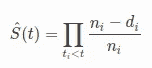

# 了解卡普兰-迈耶估计量(生存分析)

> 原文：<https://towardsdatascience.com/understanding-kaplan-meier-estimator-68258e26a3e4?source=collection_archive---------29----------------------->

## [**里面的艾**](https://medium.com/towards-data-science/inside-ai/home)

## 一种生存分析技术的介绍。

照片由[马库斯·斯皮斯克](https://unsplash.com/@markusspiske?utm_source=medium&utm_medium=referral)在 [Unsplash](https://unsplash.com?utm_source=medium&utm_medium=referral) 拍摄

# 什么是生存分析？

它是一组用于数据分析的统计操作，感兴趣的结果变量是事件发生前的 ***时间*** 。这些事件可能是死亡、疾病发病率、客户流失、恢复等。

> 它被用来估计特定人群的寿命。

它也被称为 ***【到事件的时间】*** 分析，因为目标是估计个人或一组个人经历感兴趣的事件的时间。当时间是一个重要因素时，生存分析用于比较组。其他测试，如简单的线性回归，可以比较组，但这些方法没有时间因素。它集中在两个重要的信息部分，**第一个** , *参与者在研究期间是否遭受利益事件*；**第二个**、*每个被随访者的随访时间*。

生存分析由以下部分组成:

1.  **生存数据**
2.  **生存功能**
3.  **分析方法**

# 卡普兰-迈耶估计量到底是什么？

Kaplan-Meier 分析测量从某个日期到死亡、失败或其他重大事件的存活时间。也称为乘积限估计量，是一种非参数统计量，用于从寿命数据中估计生存函数。

例如，它可用于计算:

*   失业后人们会失业多久？
*   接受生育治疗的夫妇需要多久才能怀孕？
*   机器零件的无故障时间。
*   治疗后存活时间。(在医学实践中)

Kaplan Meier 估计值的图表是一系列递减的水平步长，在给定足够大的样本量的情况下，它接近该总体的真实生存函数。卡普兰-迈耶估计经常被使用，因为它的假设易于使用。

# 通过示例了解

例如，我们将调查世界各地政治领袖的一生。在这种情况下，政治领袖是由控制统治政权的个人在任时间来定义的。出生事件是个人任期的开始，死亡事件是个人的退休。

审查可能发生，如果他们是，

1.  在汇编数据集时仍在办公室(2008 年)
2.  在位时死亡(包括暗杀)。

考虑以下数据(前 20 个观察值，来自 1808 个观察值)，

为了估计生存函数，我们首先将使用卡普兰-迈耶估计，定义为:

其中‘d’是时间‘t’时死亡事件的数量，而‘n’是时间‘t’之前处于死亡风险中的受试者的数量。

生存函数

上图显示了政治领导人使用 Kaplar-Meier 估计值的生存函数。y 轴代表领导者在“t”年后仍然存在的概率，其中“t”年在 x 轴上。我们看到很少有领导人在位超过 20 年。

此外，我们还可以将数据分为不同的政权，如下图所示。

全球制度

令人难以置信的是，这些非民主政权还能存在多久！我们也可以通过下面的国与国的比较来理解，

# 重要！

在进行卡普兰-迈耶分析时，为了避免常见错误，可以记住以下几点:

1.  为了对这些生存概率做出推断，我们需要对数秩检验。
2.  将变量分成两类，以便将值分类为低或高。中值分界点通常用于区分高低分组，以避免像对数秩检验只比较组间存活率这样的问题。
3.  卡普兰迈耶是一个单变量的方法。这意味着 Kaplan Meier 的结果很容易有偏差，夸大了预后的重要性，或者完全错过了信号。
4.  人们应该研究新的预后因素的附加值，量化新的标志物改善预测的程度。

# 结论

Kaplan-Meier 估计因其简单和易于使用而被广泛使用。但是在实施时应该小心，因为它可能会导致错误的结果，错误的假设。

# 参考

1.  [https://lifelines.readthedocs.io/en/latest/Quickstart.html](https://lifelines.readthedocs.io/en/latest/Quickstart.html)
2.  https://www.ncbi.nlm.nih.gov/pmc/articles/PMC3932959/
3.  【https://www.ncbi.nlm.nih.gov/pmc/articles/PMC3059453/ 
4.  完整的 Python 分析，

 [## pr 2 tik 1/ml-型号

### 机器学习和深度学习项目。为 pr2tik1/ml-models 开发贡献一份力量

github.com](https://github.com/pr2tik1/ml-models/blob/master/survival-analysis/kaplan-meier.ipynb) 

# 其他职位:

 [## 开发者趋势

### 根据调查数据分析开发人员和编程趋势。

pr2tik1.medium.com](https://pr2tik1.medium.com/what-happens-to-programmers-in-2020-d04a6bd7452f)  [## 探索神经网络(第一部分)

### 理解深度学习的概念以及使用 Python 和它的神经网络的实现…

medium.com](https://medium.com/towards-artificial-intelligence/neural-networks-from-scratch-a-brief-introduction-for-beginners-d3776599aaac)  [## 如何创建令人敬畏的 Github 个人资料-自述文件！

### 探索展示你作为开发者或开源贡献者的“GitHub 简历”的新方法。每一个开源…

towardsdatascience.com](/explore-new-github-readme-feature-7d5cc21bf02f)