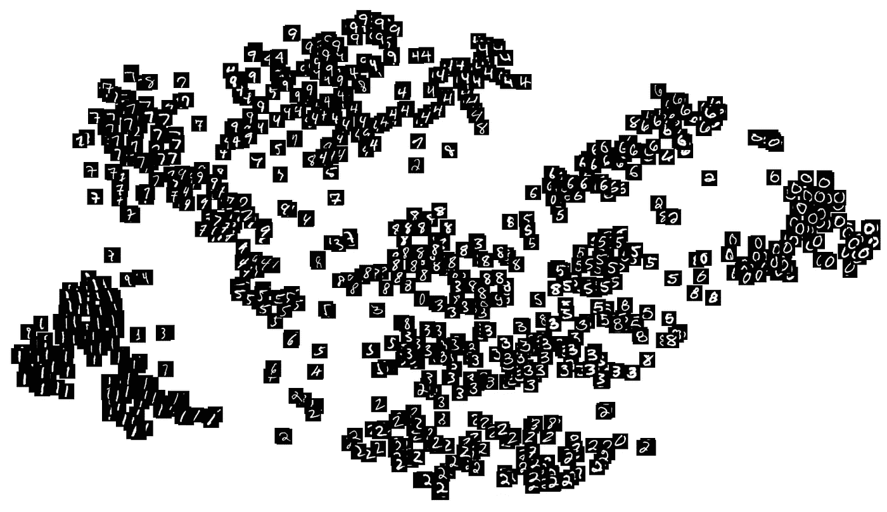
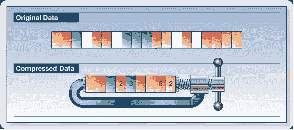
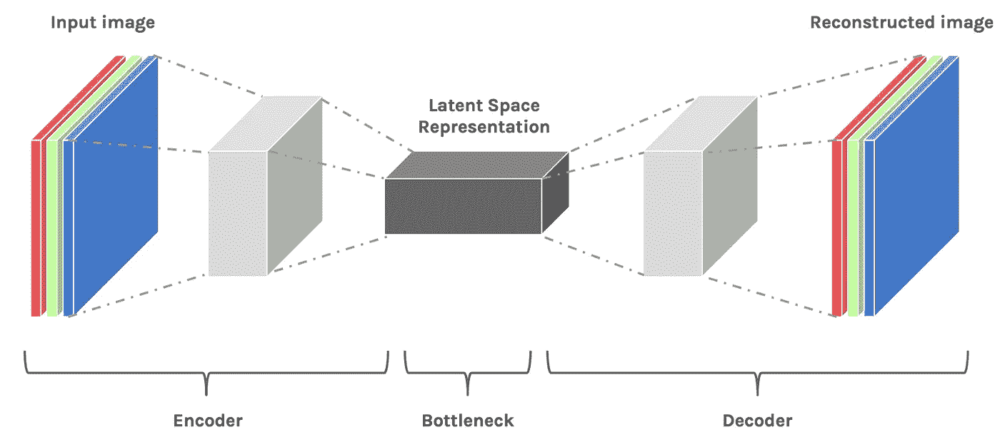
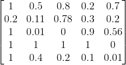
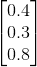
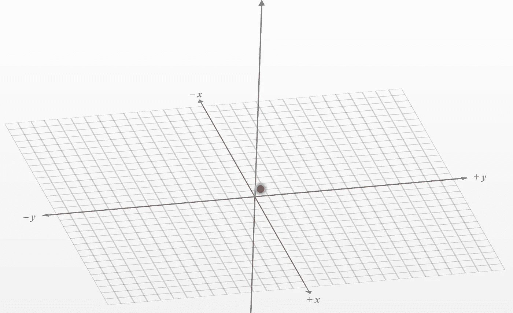
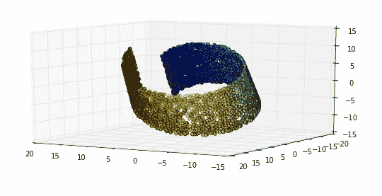
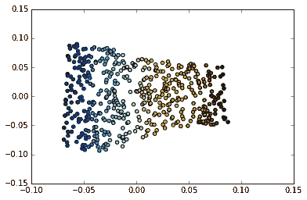
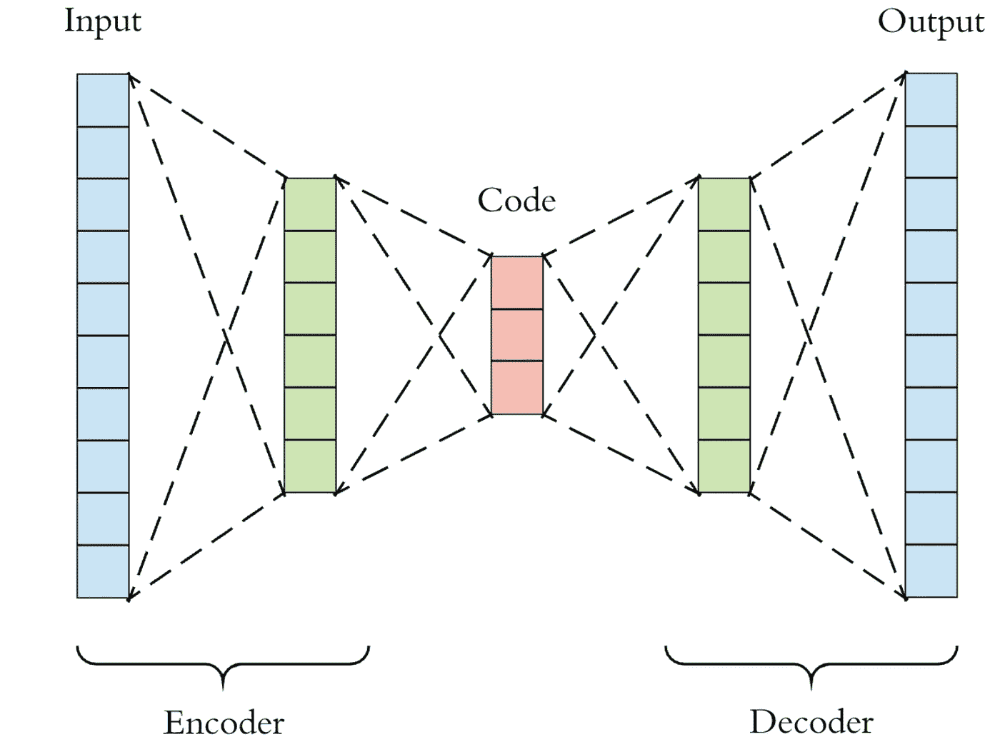
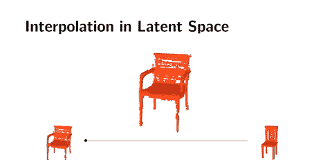

# 理解机器学习中的潜在空间

> 原文：<https://towardsdatascience.com/understanding-latent-space-in-machine-learning-de5a7c687d8d?source=collection_archive---------0----------------------->

## 学习深度学习的一个基本的，但经常是“隐藏的”概念

来源:Hackernoon，[https://hacker noon . com/latent-space-visualization-deep-learning-bits-2-bd09a 46920 df](https://hackernoon.com/latent-space-visualization-deep-learning-bits-2-bd09a46920df)

# 什么是潜在空间？

> 如果我必须用一句话来描述潜在空间，它仅仅意味着压缩数据的表示。

想象一个大型的手写数字(0–9)数据集，如上图所示。与其他不同数字的图像(即 3 对 7)相比，相同数字的手写图像(即 3 的图像)彼此最相似。但是我们能训练一个算法来识别这些相似之处吗？*如何？*

如果你训练一个模型*对数字*进行分类，那么*也*训练这个模型学习图像之间的“结构相似性”。事实上，这就是模型首先能够对数字进行分类的方式——通过学习每个数字的特征。

如果看起来这个过程对你是“隐藏的”,那是因为它确实是。潜伏，顾名思义，就是“隐藏”的意思

“潜在空间”的概念是*重要的*，因为它的效用是“深度学习”的核心——*学习数据的特征并简化数据表示，以找到模式。*

好奇吗？让我们一点一点地打破潜在空间:

***我们为什么要用 ML 压缩数据？***

**数据压缩**定义为使用比原始表示更少的比特对信息进行编码的过程。这就像取一个 19D 的数据点(需要 19 个值来定义唯一的点)并将所有信息压缩到一个 9D 的数据点中。

压缩的图解。来源:浮士德 2013

通常情况下，数据在机器学习中被压缩，以*学习关于数据点的重要信息*。我举个例子解释一下。

假设我们想要训练一个模型来使用完全卷积神经网络(FCN)对图像进行分类。(即输出给定图像的数字位数)。当模型“学习”时，它只是学习每一层(边缘、角度等)的*特征*。)并将特征的组合归因于特定的输出。

但是每次模型通过数据点学习时，图像的*维度*在最终增加之前首先*减少*。(参见下面的编码器和瓶颈)。当维数减少时，我们认为这是一种有损压缩。

卷积神经网络的描述。来源:来源:Hackernoon 潜在空间可视化。

因为要求模型然后*重建*压缩数据(见解码器)，它必须学会存储*所有相关信息*并忽略噪声。这就是压缩的价值——它允许我们去掉任何无关的信息，只关注最重要的特征。

**这种“压缩状态”是我们数据的潜在空间表示。**

***我说的空间是什么意思？***

你可能想知道为什么我们称它为潜在空间。毕竟，乍一看，压缩数据可能不会引起任何形式的“空间”

但这里有个相似之处。

在这个相当简单的例子中，假设我们的原始数据集是尺寸为 5 x 5 x 1 的图像。我们将我们的潜在空间维度设置为 3×1，这意味着我们的压缩数据点是一个三维向量。

示例 5x5x1 数据

“潜在空间”中的压缩 3x1 数据示例

现在，每个压缩数据点仅由 3 个数字唯一定义。这意味着我们可以在 3D 平面上绘制这些数据(一个数字是 x，另一个是 y，另一个是 z)。

在 3D 空间中绘制的点(0.4，0.3，0.8)

这就是我们所说的“空间”。

> 每当我们在潜在空间中绘制点或思考点时，我们可以将它们想象为空间中的坐标，在该坐标中，*【相似】*的**点在图上靠得更近。**

一个自然出现的问题是，我们如何想象 4D 点或 n 维点的空间，或者甚至是非向量的空间(因为潜在空间表示不需要是 2 维或 3 维向量，并且经常不是，因为太多的信息将丢失)。

不满意的答案是，*我们不能*。我们是三维生物，无法理解 n 维空间(比如 n > 3)。然而，有一些工具，比如 t-SNE，可以将我们更高维度的潜在空间表征转化为我们能够可视化的表征(2D 或 3D)。(参见下面的**可视化潜在空间**部分。)

但是你可能想知道，什么是*“相似”图像，为什么减少我们数据的维度会使相似的图像在空间上“更接近”？*

****我说的相似是什么意思？****

*如果我们看三张图片，两张椅子和一张桌子，我们会很容易地说这两张椅子图片最相似，而桌子与这两张椅子图片最不同。*

******

*两把椅子和一张桌子。*

*但是是什么让这两张椅子的图像“更相似呢？”椅子具有*可区分的特征*(即靠背、无抽屉、腿间连接)。我们的模型可以通过学习边缘、角度等模式来“理解”这些。*

*如前所述，这些特征被打包在数据的潜在空间表示中。*

*因此，随着维度的减少，对每个图像(即椅子颜色)不同的“无关”信息从我们的潜在空间表示中“移除”，因为只有每个图像的最重要的*特征存储在潜在空间表示中。**

*结果，当我们降低维度时，两把椅子的表现变得不那么明显，而更相似。如果我们在太空中想象它们，它们会离得更近。*

**请注意，我在整篇文章中提到的“接近度”是一个模糊的术语，*不是*一个确定的欧几里德距离，因为空间距离有多种定义。*

# *为什么潜在空间很重要？*

*潜在空间的概念绝对是耐人寻味。但是*怎么用*呢？我们什么时候使用它？而且最重要的是，*为什么是*？*

*我们会发现，潜在空间“隐藏”在许多我们最喜欢的图像处理网络、生成模型等中。*

*虽然潜在空间对大多数人来说是隐藏的，但是在某些任务中，了解潜在空间不仅是有益的，而且是必要的。*

## *表征学习*

*数据的潜在空间表示包含了表示原始数据点所需的所有重要信息。*

*该表示法*必须*表示原始数据的**特征**。*

*换句话说，模型*学习*数据特征并简化其表示，使其更容易分析。*

*这是一个名为**表示学习的概念的核心，**定义为一套技术，允许系统从*原始数据中发现*特征检测*或*分类*所需的*表示*。**

*在这个用例中，我们的**潜在空间表示**用于将更复杂形式的原始数据(即图像、视频)转换为“更便于处理”和分析的更简单表示。*

*下面列出的是表征学习的具体例子。*

## *多支管*

*潜在空间是表征学习的子领域**流形学习**中的一个基本概念。*

***数据科学中的流形**可以理解为在某些方面“相似”的数据组或子集。*

**这些相似性，通常在高维空间中不易察觉或模糊不清，一旦我们的数据在潜在空间中被表示出来，就可以被发现。**

*以下面的“瑞士卷”为例。*

***

瑞士卷的 3D 表示与相同数据的 2D 表示。来自[https://datascience.stackexchange.com/a/5698](https://datascience.stackexchange.com/a/5698)的例子* 

*在 3D 中，我们知道存在*组类似的数据点，但是用更高维度的数据来描绘这样的组要困难得多。**

> *通过将我们的数据维度减少到 2D，在这种情况下可以认为是一种“潜在空间”表示，我们能够更容易地区分我们数据集中的流形(相似数据的组)。*

*要了解更多关于流形和流形学习的知识，我推荐以下文章:*

* [## 数据科学中的流形——概述

### 流形是在更高维度中表示数据的基本工具。但是什么是流形，它们是如何…

towardsdatascience.com](/manifolds-in-data-science-a-brief-overview-2e9dde9437e5)  [## 2.2.流形学习-sci kit-学习 0.22.1 文档

### 寻找最基本的必需品简单的最基本的必需品忘记你的忧虑和冲突我是说最基本的…

scikit-learn.org](https://scikit-learn.org/stable/modules/manifold.html) 

## 自动编码器和生成模型

一种常见类型的深度学习模型操纵潜在空间中数据的“接近度”，这种模型是**自动编码器—** 一种充当身份函数的神经网络。换句话说，自动编码器学习输出任何输入的内容。

自动编码器的一般结构

现在，如果你是这个领域的新手，你可能会想，为什么我们需要这样的模型？如果它输出的都是它自己，那似乎就没什么用了…

虽然这个推理是有效的，但是我们并不太关心模型*输出什么*。我们更关心模型*在这个过程中学到了什么*。

当我们强迫一个模型成为一个身份函数时，我们是在强迫它将所有数据的相关特征存储在一个压缩的表示中，这样在那个压缩的形式中就有足够的信息，使得模型能够“准确地”重建它。*听起来熟悉吗？应该是，因为这个压缩的表象是我们的潜在空间表象(上图中的红色块)。*

我们已经看到了如何在潜在空间中更容易地发现模式，因为相似的数据点往往会聚集在一起，但是我们还没有看到如何从这个潜在空间的中对点*进行采样，以似乎生成“新”数据。*

通过潜在空间插值生成图像。来源:*随机噪声向量的潜在空间上的双线性插值。*图 20

在上面的例子中，我们可以通过*对潜在空间*进行插值来生成不同的面部结构，并使用我们的模型解码器将潜在空间表示重建为与我们的原始输入具有相同维度的 2D 图像。

***我说的在潜空间上插值是什么意思？***

假设我已经将前一部分的椅子图像压缩成以下 2D 向量，[0.4，0.5]和[0.45，0.45]。假设桌子被压缩到[0.6，0.75]。如果我要对潜在空间进行插值，我将在潜在空间中的“椅子”聚类和“桌子”聚类之间的*采样点。*

我们可以将这些采样的 2D 向量输入模型的解码器，瞧！我们得到的“新”图像看起来像是介于椅子和桌子之间的变体。*new 在引号中，因为这些生成的图像在技术上并不独立于原始数据样本。

下面是潜在空间中两种椅子之间的线性插值示例。

潜在空间插值。来源:Hackernoon 潜在空间可视化。

图像生成仍然是一个活跃的研究领域，潜在空间是一个必须理解的基本概念。有关生成模型的更多用例，以及使用 GAN(生成对抗网络，另一种使用潜在空间表示的生成模型)的潜在空间插值的实践示例，请参见以下文章。

 [## 生成性对抗网络(GANs)的 18 个令人印象深刻的应用

### 生成式对抗网络(GAN)是一种用于生成式建模的神经网络架构。生成…

machinelearningmastery.com](https://machinelearningmastery.com/impressive-applications-of-generative-adversarial-networks/)  [## 生成人脸时如何挖掘 GAN 潜在空间

### 如何利用插值和矢量运算探索 GAN 潜在空间？生成性对抗网络，或…

machinelearningmastery.com](https://machinelearningmastery.com/how-to-interpolate-and-perform-vector-arithmetic-with-faces-using-a-generative-adversarial-network/) 

# 可视化潜在空间

关于潜在空间可视化的更多内容，我推荐 Hackernoon 的文章，它提供了一个使用 t-SNE 算法可视化 2D 空间中数字图像之间相似性的实践示例。

 [## 潜在空间可视化—深度学习比特#2

### 特色:插值，t-SNE 投影(有 gif 和例子！)

hackernoon.com](https://hackernoon.com/latent-space-visualization-deep-learning-bits-2-bd09a46920df) 

# 关键要点

*   **潜在空间**是压缩数据的简单表示，其中相似的数据点在空间上更加靠近。
*   潜在空间对于学习数据特征和寻找用于分析的更简单的数据表示是有用的。
*   我们可以通过分析潜在空间中的数据来了解数据点之间的模式或结构相似性，无论是通过流形、聚类等。
*   我们可以在潜在空间中插入数据，并使用我们模型的解码器来“生成”数据样本。
*   我们可以使用 t-SNE 和 LLE 等算法来可视化潜在空间，这些算法将我们的潜在空间表示转化为 2D 或 3D。

在学习“潜在空间”的时候，我被这个“隐藏”却又重要的概念迷住了。我希望这篇文章揭开了潜在空间表示的神秘面纱，并提供了我作为新手所渴望的对深度学习的“更深入的理解”。*